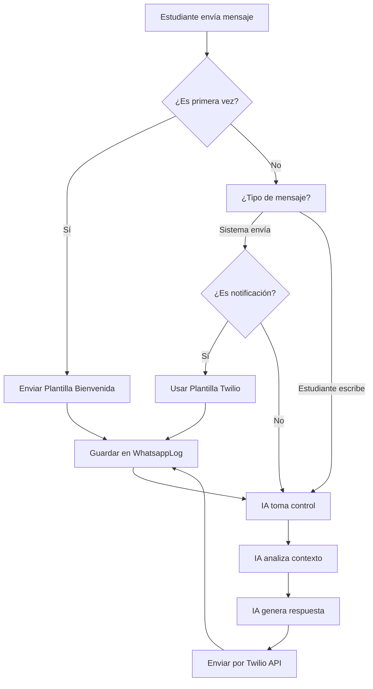

# 🤖 ARQUITECTURA: PLANTILLAS + AGENTE IA

## 📋 VISIÓN GENERAL

```
┌─────────────────────────────────────────────────────────────┐
│                    ESTUDIANTE (WhatsApp)                     │
└────────────┬────────────────────────────────────┬───────────┘
             │                                    │
             │ Primera interacción                │ Conversación continua
             ▼                                    ▼
┌────────────────────────┐            ┌─────────────────────────┐
│  PLANTILLAS TWILIO     │            │   AGENTE IA (OpenAI)    │
│  (Content Templates)   │            │   GPT-4o-mini           │
├────────────────────────┤            ├─────────────────────────┤
│ ✅ Bienvenida formal   │            │ 💬 Responde preguntas   │
│ 📚 Nuevo curso         │            │ 📊 Consulta progreso    │
│ 🎥 Video introducción  │            │ 💡 Da consejos          │
│ ⏰ Recordatorio        │            │ 🎯 Ayuda personalizada  │
│ 📢 Notificación        │            │ 🔄 Contexto histórico   │
└────────────────────────┘            └─────────────────────────┘
```

## 🎯 CASOS DE USO

### 1️⃣ PLANTILLAS TWILIO (Mensajes Formales)

**Cuándo usar:**
- Primera interacción con estudiante nuevo
- Anuncios importantes (nueva clase, evento)
- Notificaciones programadas del sistema
- Mensajes que requieren aprobación legal/formal
- Contenido multimedia (videos, imágenes)

**Ejemplos:**

```
📝 BIENVENIDA
────────────────
¡Hola {{1}}! 👋 Bienvenido a Eki

Soy tu asistente educativo inteligente. 
Puedes preguntarme sobre:

📚 Tu progreso en cursos
📝 Tareas pendientes
💡 Ayuda con temas
⏰ Fechas importantes

¿En qué puedo ayudarte hoy?
```

```
🎥 NUEVA CLASE
────────────────
📚 Nueva Clase Disponible, {{1}}

Tema: {{2}}
Duración: {{3}}

[VIDEO INTRODUCTORIO]

👉 Escríbeme "ver clase" para empezar
```

```
⏰ RECORDATORIO
────────────────
⏰ Recordatorio, {{1}}

Tienes pendiente: {{2}}
Vence: {{3}}

💬 Responde aquí si necesitas ayuda
```

### 2️⃣ AGENTE IA (Conversaciones Reales)

**Cuándo usar:**
- Respuestas a preguntas del estudiante
- Consultas de progreso dinámico
- Ayuda personalizada
- Conversación natural
- Contexto del historial

**Ejemplos de flujos:**

```
👤 Estudiante: "Hola"
🤖 IA: ¡Hola Juan! 👋 ¿Cómo estás? Vi que llevas un 75% 
      en el curso de Python. ¿En qué puedo ayudarte hoy?

👤 Estudiante: "¿Cuál es mi progreso?"
🤖 IA: ¡Claro! 📊 Aquí está tu progreso:
      
      ✅ Python Básico: 75% completado
      📝 3 tareas pendientes
      🎯 Próximo tema: Funciones (vence en 2 días)
      
      ¡Vas muy bien! ¿Quieres repasar algo específico?

👤 Estudiante: "Tengo dudas sobre listas"
🤖 IA: ¡Perfecto! 💡 Las listas en Python son colecciones
      ordenadas. Por ejemplo:
      
      frutas = ["manzana", "pera"]
      frutas.append("uva")
      
      ¿Qué parte específica te genera dudas?

👤 Estudiante: "No entiendo append"
🤖 IA: ¡Ah! append() agrega un elemento al final de la lista.
      
      Antes: ["manzana", "pera"]
      Después: ["manzana", "pera", "uva"]
      
      Prueba esto: Crea una lista de tus películas favoritas
      y usa append() para agregar una nueva. ¿Lo intentas?
```

## 🔄 FLUJO COMPLETO



## 💾 ESTRUCTURA DE BASE DE DATOS

### WhatsappLog (Registro único de todo)
```python
WhatsappLog:
- telefono: str
- mensaje: str
- mensaje_id: str
- estado: INCOMING / SENT / TEMPLATE
- tipo_origen: "user" / "system_template" / "ai_response"
- metadata: JSON {
    "template_sid": "HXxxx",  # Si es plantilla
    "template_vars": {...},    # Variables usadas
    "ai_model": "gpt-4o-mini", # Si es respuesta IA
    "intent": "consulta_progreso" # Intención detectada
  }
- fecha: datetime
```

### Plantilla (Solo para templates formales)
```python
Plantilla:
- nombre_interno: str
- tipo_contenido: texto/imagen/video/archivo
- proveedor: "twilio"
- twilio_template_sid: str (HXxxx)
- twilio_variables: JSON {"1": "nombre", "2": "curso"}
- url_media: str (opcional)
- activa: bool
- uso: "bienvenida" / "notificacion" / "recordatorio"
```

## 🛠️ IMPLEMENTACIÓN

### 1. Webhook Mejorado (views.py)

```python
def whatsapp_webhook(request):
    """
    Maneja mensajes entrantes.
    Lógica: IA siempre responde, plantillas solo cuando sistema lo decide
    """
    
    if request.method == 'GET':
        return verify_whatsapp_token(request)
    
    # POST - Mensaje entrante
    data = json.loads(request.body)
    phone = extract_phone(data)
    text = extract_message(data)
    msg_id = extract_msg_id(data)
    
    # 1. Guardar mensaje entrante
    WhatsappLog.objects.create(
        telefono=phone,
        mensaje=text,
        mensaje_id=msg_id,
        estado='INCOMING',
        tipo_origen='user'
    )
    
    # 2. ¿Es primera vez? → Enviar plantilla bienvenida
    if not WhatsappLog.objects.filter(
        telefono=phone, 
        tipo_origen='ai_response'
    ).exists():
        enviar_plantilla_bienvenida(phone)
        # Pero aún así, IA responde después
    
    # 3. IA genera respuesta contextual
    respuesta_ia = generar_respuesta_ia(text, phone)
    
    # 4. Enviar respuesta
    enviar_mensaje_twilio(phone, respuesta_ia)
    
    return JsonResponse({'status': 'success'})
```

### 2. Sistema de IA Mejorado (ai_assistant.py)

```python
class EkiAIAssistant:
    
    def generar_respuesta(self, mensaje, telefono):
        """Genera respuesta contextual"""
        
        # 1. Obtener contexto del estudiante
        contexto = self.get_student_context(telefono)
        
        # 2. Obtener historial de conversación
        historial = self.get_conversation_history(telefono, limit=10)
        
        # 3. Construir prompt completo
        messages = [
            {"role": "system", "content": self.system_prompt},
            {"role": "system", "content": f"Contexto estudiante:\n{contexto}"}
        ]
        messages.extend(historial)
        messages.append({"role": "user", "content": mensaje})
        
        # 4. Llamar a OpenAI
        response = self.client.chat.completions.create(
            model=self.model,
            messages=messages,
            temperature=0.7,
            max_tokens=300  # Respuestas cortas para WhatsApp
        )
        
        return response.choices[0].message.content
    
    def get_student_context(self, telefono):
        """Construye contexto del estudiante"""
        try:
            estudiante = Estudiante.objects.get(telefono=telefono)
            
            # Progreso
            total = EnvioLog.objects.filter(estudiante=estudiante).count()
            completados = EnvioLog.objects.filter(
                estudiante=estudiante, 
                estado='ENVIADO'
            ).count()
            progreso = int(completados / total * 100) if total > 0 else 0
            
            # Pendientes
            pendientes = EnvioLog.objects.filter(
                estudiante=estudiante,
                estado='PENDIENTE'
            ).order_by('fecha_envio')[:3]
            
            contexto = f"""
Estudiante: {estudiante.nombre}
Progreso general: {progreso}%
Tareas completadas: {completados}/{total}
Etiquetas: {', '.join([e.nombre for e in estudiante.etiquetas.all()])}

Próximas tareas:
{chr(10).join([f"- {p.campana.nombre}" for p in pendientes])}
"""
            return contexto
            
        except Estudiante.DoesNotExist:
            return "Estudiante nuevo sin registro en sistema"
```

### 3. Función para Plantillas (services.py)

```python
def enviar_plantilla_twilio(telefono, plantilla_nombre, variables=None):
    """
    Envía plantilla de Twilio Content Template.
    
    Args:
        telefono: número destino
        plantilla_nombre: nombre interno en BD
        variables: dict con valores {"1": "Juan", "2": "Python"}
    """
    from twilio.rest import Client
    
    # 1. Buscar plantilla
    plantilla = Plantilla.objects.get(
        nombre_interno=plantilla_nombre,
        activa=True
    )
    
    if not plantilla.twilio_template_sid:
        raise ValueError(f"Plantilla {plantilla_nombre} no tiene SID de Twilio")
    
    # 2. Preparar variables (merge con defaults)
    content_vars = plantilla.twilio_variables.copy()
    if variables:
        content_vars.update(variables)
    
    # 3. Enviar con Twilio
    client = Client(
        os.environ.get('TWILIO_ACCOUNT_SID'),
        os.environ.get('TWILIO_AUTH_TOKEN')
    )
    
    message = client.messages.create(
        content_sid=plantilla.twilio_template_sid,
        content_variables=content_vars,
        from_=os.environ.get('TWILIO_WHATSAPP_NUMBER'),
        to=f"whatsapp:+{telefono}"
    )
    
    # 4. Registrar en log
    WhatsappLog.objects.create(
        telefono=telefono,
        mensaje=f"Plantilla: {plantilla.nombre_interno}",
        mensaje_id=message.sid,
        estado='SENT',
        tipo_origen='system_template',
        metadata={
            'template_sid': plantilla.twilio_template_sid,
            'template_vars': content_vars
        }
    )
    
    return message.sid
```

## 📊 VENTAJAS DE ESTA ARQUITECTURA

### ✅ Plantillas Twilio
- ✨ Mensajes profesionales pre-aprobados
- 🎥 Soporte multimedia (videos, imágenes)
- 📱 Botones interactivos
- ⚡ Entrega garantizada
- 📈 Mejor tasa de apertura
- 🔒 Cumplimiento legal/GDPR

### ✅ Agente IA
- 💬 Conversación natural e inteligente
- 🧠 Aprende del contexto
- 🎯 Respuestas personalizadas por estudiante
- 📚 Acceso a datos en tiempo real
- 🔄 Historial conversacional
- ⚡ Respuestas instantáneas (2-3 segundos)

## 💰 COSTOS ESTIMADOS

### Twilio
- **Content Templates**: $0.005 - $0.01 por mensaje
- **Uso mensual**: ~500 plantillas = $2.50 - $5.00

### OpenAI GPT-4o-mini
- **Entrada**: $0.15 por 1M tokens
- **Salida**: $0.60 por 1M tokens
- **Promedio**: 500 tokens por conversación
- **Mensajes**: 1000/mes = ~$0.50

**Total mensual**: ~$3 - $6 USD (muy económico!)

## 🚀 PRÓXIMOS PASOS

1. ✅ **Sistema base funcional** (ya está)
2. 🔨 **Mejorar webhook** con lógica plantilla + IA
3. 📝 **Crear plantillas en Twilio Console**
4. 🧪 **Probar flujo completo**
5. 📊 **Dashboard de métricas** (IA vs Templates)
6. 🎯 **Optimizar prompts** según feedback

## 📞 EJEMPLO REAL

```
🕐 10:00 AM - Sistema envía plantilla
────────────────────────────────────
[Twilio Content Template]
📚 Nueva clase disponible, Juan

Tema: Python - Funciones
Duración: 45 minutos

[VIDEO PREVIEW]

👉 Responde aquí para empezar
────────────────────────────────────

🕐 10:05 AM - Juan responde
────────────────────────────────────
👤 Juan: "Empezar"
────────────────────────────────────

🕐 10:05 AM - IA responde
────────────────────────────────────
🤖 Eki: ¡Perfecto Juan! 🎯 Vamos a 
        empezar con funciones en Python.
        
        Una función es un bloque de código
        reutilizable. Empezamos con la más
        simple:
        
        def saludar():
            print("Hola")
        
        ¿Entiendes la estructura?
────────────────────────────────────

🕐 10:06 AM - Juan pregunta
────────────────────────────────────
👤 Juan: "Para qué sirve def?"
────────────────────────────────────

🕐 10:06 AM - IA explica
────────────────────────────────────
🤖 Eki: ¡Buena pregunta! 💡 
        
        "def" es la palabra clave que le
        dice a Python "aquí empieza una 
        función".
        
        Piensa en "def" como "definir".
        Es como darle un nombre a una 
        receta de cocina que podrás usar
        muchas veces.
        
        ¿Quieres intentar crear tu propia
        función?
────────────────────────────────────
```

## 🎓 CONCLUSIÓN

Esta arquitectura combina lo mejor de ambos mundos:

- **Plantillas** para comunicación formal y profesional
- **IA** para interacción humana y personalizada

El resultado: experiencia educativa superior! 🚀
