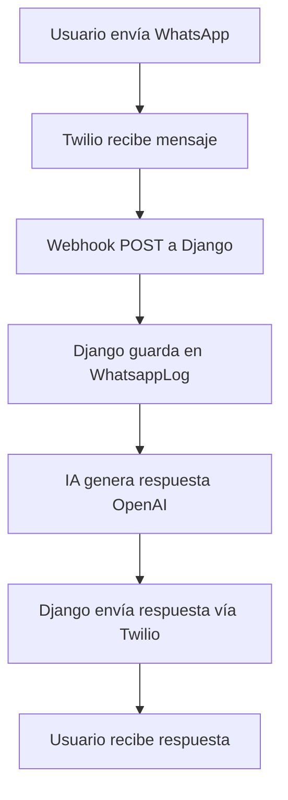

# 🚀 Guía de Configuración: Twilio + OpenAI
**Fecha:** 22 de diciembre de 2025

---

## 📋 **PASO 1: Configurar Twilio WhatsApp**

### 1.1 Verificar Credenciales

Las credenciales ya están en tu `.env`:
```bash
TWILIO_ACCOUNT_SID=ACdfe1762471d825240c7ac5833cf36bf9
TWILIO_AUTH_TOKEN=ea8551ad08613fe27ac626f081d4ac64
TWILIO_WHATSAPP_NUMBER=whatsapp:+14155238886
TWILIO_TEMPLATE_SID=HXb4df6277ff3ad9a5b6c68993fed6ced8
```

### 1.2 Activar Sandbox de Twilio

**Para hacer pruebas, necesitas activar el sandbox:**

1. Ve a tu WhatsApp
2. Envía un mensaje a: **+1 (415) 523-8886**
3. Escribe: `join <tu-sandbox-code>`
4. Espera confirmación de Twilio

**¿Dónde encuentro mi sandbox code?**
- Ve a: https://console.twilio.com/us1/develop/sms/try-it-out/whatsapp-learn
- Ahí verás el mensaje exacto que debes enviar

### 1.3 Probar Envío

Ejecuta el script de prueba:

```bash
python test_twilio_real.py
```

Este script te permite:
- ✅ Enviar mensajes de texto
- ✅ Enviar imágenes
- ✅ Usar templates aprobados
- ✅ Verificar estado del envío

---

## 🤖 **PASO 2: Configurar OpenAI (IA Conversacional)**

### 2.1 Obtener API Key

1. Ve a: https://platform.openai.com/api-keys
2. Haz clic en **"Create new secret key"**
3. Copia la key (empieza con `sk-proj-...`)

### 2.2 Agregar al `.env`

Edita tu archivo `.env` y agrega:

```bash
OPENAI_API_KEY=sk-proj-TU_API_KEY_AQUI
```

⚠️ **IMPORTANTE:** La API key tiene costo. Recomendaciones:
- Configura un límite de gastos en OpenAI ($5-10/mes es suficiente)
- Usa `gpt-4o-mini` (modelo económico, ya configurado)
- Monitorea uso: https://platform.openai.com/usage

### 2.3 Probar IA Localmente

Sin necesidad de WhatsApp, prueba la IA:

```bash
python test_ia_conversacion.py
```

Opciones disponibles:
1. **Modo Interactivo**: Chatea con Eki en la terminal
2. **Prueba Automática**: Envía 4 mensajes predefinidos
3. **Ver Historial**: Muestra conversaciones previas

---

## 🔗 **PASO 3: Configurar Webhook (para recibir mensajes)**

### 3.1 Exponer tu servidor con ngrok

**Opción A: ngrok (recomendado)**

1. Descarga ngrok: https://ngrok.com/download
2. Extrae el exe en la carpeta del proyecto
3. Ejecuta:

```bash
ngrok http 8000
```

4. Copia la URL que te da (ej: `https://abc123.ngrok.io`)

**Opción B: Usar el ngrok.exe que ya tienes**

Ya tienes `ngrok.exe` en tu carpeta. Solo ejecuta:

```bash
.\ngrok.exe http 8000
```

### 3.2 Configurar Webhook en Twilio

1. Ve a: https://console.twilio.com/us1/develop/sms/settings/whatsapp-sandbox
2. En **"When a message comes in"**, pon:
   ```
   https://TU-URL-NGROK.ngrok.io/webhook/whatsapp/
   ```
3. Método: **POST**
4. Guarda

### 3.3 Probar Webhook

1. Asegúrate de que tu servidor Django esté corriendo:
   ```bash
   python manage.py runserver
   ```

2. Asegúrate de que ngrok esté corriendo en otra terminal

3. Envía un mensaje de WhatsApp al número de Twilio: **+1 (415) 523-8886**

4. ¡La IA debe responder!

---

## 📊 **PASO 4: Verificar que Todo Funciona**

### 4.1 Checklist de Funcionamiento

- [ ] **Twilio Sandbox Activado**
  - Envié `join <code>` y recibí confirmación
  
- [ ] **Script de prueba funciona**
  - `python test_twilio_real.py` envía mensaje correctamente
  
- [ ] **OpenAI configurado**
  - API Key en `.env`
  - `python test_ia_conversacion.py` funciona
  
- [ ] **Webhook configurado**
  - ngrok corriendo
  - URL configurada en Twilio
  - Servidor Django corriendo
  
- [ ] **Conversación funciona**
  - Envío mensaje → Recibo respuesta con IA

### 4.2 Ver Logs en el Admin

Ve al dashboard y revisa:
- **WhatsApp Logs**: http://localhost:8000/admin/core/whatsapplog/
- **Conversaciones**: http://localhost:8000/admin/conversaciones/

---

## 🐛 **Solución de Problemas**

### Error: "No configuration was provided"
- ✅ Revisa que la API key de OpenAI esté en `.env`
- ✅ Reinicia el servidor Django después de agregar la key

### Error: "Sandbox not activated"
- ✅ Envía `join <code>` al número de Twilio
- ✅ Espera confirmación antes de probar

### No recibo respuestas
- ✅ Verifica que ngrok esté corriendo
- ✅ Verifica que la URL del webhook en Twilio sea correcta
- ✅ Revisa logs del servidor Django (aparecen en la terminal)

### IA responde muy lento
- ✅ Es normal, OpenAI puede tardar 2-5 segundos
- ✅ Si quieres más rápido, cambia a `gpt-3.5-turbo` en `ai_assistant.py`

### "Insufficient quota" de OpenAI
- ✅ Necesitas agregar créditos en: https://platform.openai.com/account/billing
- ✅ Mínimo $5 USD

---

## 🎯 **Flujo Completo de Prueba**



### Comandos en orden:

**Terminal 1 (Django):**
```bash
python manage.py runserver
```

**Terminal 2 (ngrok):**
```bash
.\ngrok.exe http 8000
```

**WhatsApp:**
1. Enviar: `join <sandbox-code>` → +1 (415) 523-8886
2. Esperar confirmación
3. Enviar: "Hola, ¿cómo estás?"
4. Recibir respuesta con IA 🤖

---

## 📈 **Próximos Pasos**

Una vez que esto funcione:

1. **Crear campaña de prueba**
   - Admin → Campañas → Nueva campaña
   - Selecciona destinatarios
   - Ejecutar

2. **Monitorear conversaciones**
   - Admin → Conversaciones
   - Ver chat en tiempo real

3. **Personalizar IA**
   - Edita `core/ai_assistant.py`
   - Cambia `system_prompt` para ajustar personalidad

4. **Producción**
   - Compra número de Twilio (no sandbox)
   - Configura número en `.env`
   - Deploy con render.com o similar

---

## 🆘 **Soporte**

- **Twilio Console**: https://console.twilio.com
- **OpenAI Platform**: https://platform.openai.com
- **Logs Django**: En la terminal donde corre `runserver`
- **Logs Twilio**: Console → Monitor → Logs

---

¡Listo para probar! 🚀
