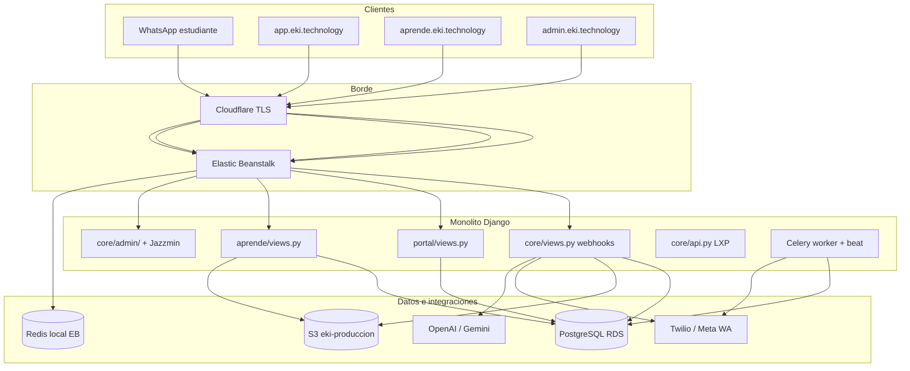
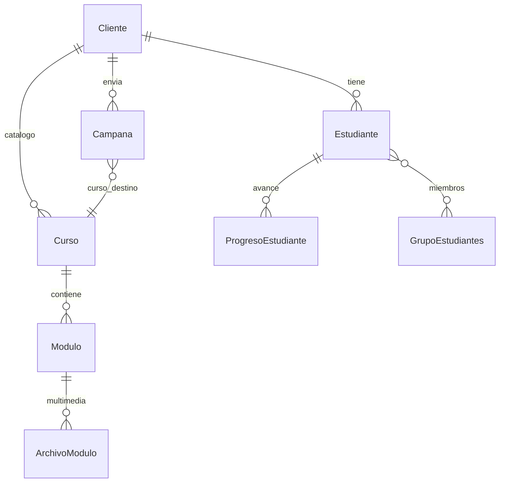

# Auditoría de arquitectura — eki MVP (monolito Django)

Documento de referencia para entender **cómo funciona el código hoy**, su arquitectura, deuda técnica y mejoras recomendadas.  
Última revisión: junio 2026 · rama local `fresh-push-3` (cambios pendientes de deploy).

---

## 1. Resumen ejecutivo

eki es un **monolito Django** desplegado en **AWS Elastic Beanstalk** que orquesta:

| Superficie | URL (prod) | Usuario |
|------------|------------|---------|
| Admin operaciones | `admin.eki.technology` | Staff eki |
| Portal B2B | `app.eki.technology` | Coordinadores de clientes |
| Aula web | `aprende.eki.technology` | Estudiantes y profesores |
| WhatsApp | Webhooks Twilio/Meta | Estudiantes (canal principal) |

**Canal principal del producto:** WhatsApp educativo (Twilio). El estudiante avanza con *listo*; la campaña define el curso (`curso_destino`). El portal y el aula web son capas complementarias sobre los mismos modelos (`core`).

**Estado del monolito:** funcional y desplegable para piloto/producción, con deuda concentrada en pocos archivos gigantes (`core/views.py` ~6.3k líneas) y una migración arquitectónica a `learning/` apenas iniciada.

---

## 2. Diagrama de arquitectura



---

## 3. Estructura de aplicaciones Django

| App | Rol | Modelos propios | Notas |
|-----|-----|-----------------|-------|
| **core** | Orquestador central | `models.py` (~3.3k líneas), `models_extras.py`, certificados, gamificación | Webhooks, campañas, drip, certificados, RAG, tareas Celery |
| **portal** | Portal B2B clientes | `PortalUsuario`, `PortalFeedback` | Métricas, GEI, Nat, campañas, PQRS, exports |
| **aprende** | Aula web | `TareaCurso`, `EntregaTarea` | Reutiliza `Curso`/`Modulo`/`ArchivoModulo` de core |
| **formulario** | GEI (encuestas) | FichaGEI, ResultadoGEI, flujos | WhatsApp GEI + calculadora |
| **learning** | Bounded context (scaffold) | Proxies a tablas `core` | Migración gradual; regla unidireccional |
| **agents_edu** | Admin agrupado IA edu | Proxy `DocumentoRAG` | Solo organización admin |
| **agents_commercial** | Bot Nati / comercial | Proxies B2B, RAG comercial | Sandbox Twilio → comercial |
| **analytics** | Métricas / exports | Proxies `EventoIA`, métricas | Lógica parcial en `core/domains/` |
| **integrations** | Fachada URLs API LXP | Ninguno | Redirige a `core.api` |

**Regla de dependencias deseada:** `aprende`, `portal`, `learning` → `core` → Django/DB. Evitar imports circulares desde `core` hacia apps de presentación.

---

## 4. Enrutamiento y subdominios

Archivo raíz: `mvp_project/urls.py`

```
/health, /healthz          → health check EB
/admin/                    → Django admin (Jazzmin)
/portal/                   → portal.urls
/aprende/                  → aprende.urls
/webhook/...               → core.urls.webhook_urls
/admin/dashboard/, drip... → core.urls.admin_urls (vistas custom)
/api/...                   → integrations.urls → core.api
/verificar-certificado/    → certificados públicos
```

**Redirección por host** (`root_redirect`):

| Host | Destino |
|------|---------|
| `app.eki.technology` | `/portal/login/` |
| `admin.eki.technology` | `/admin/` |
| `aprende.eki.technology`, `aula.eki.technology` | `/aprende/` |
| Otros | `/admin/` |

Config producción: `EKI_ALLOWED_HOSTS`, `CSRF_TRUSTED_ORIGINS`, `EKI_BEHIND_CLOUDFLARE` en EB.

---

## 5. Flujo WhatsApp (corazón del producto)

### 5.1 Entrada

| Archivo | Función |
|---------|---------|
| `core/views.py` | `whatsapp_webhook` — dispatcher principal (~6.3k líneas total en archivo) |
| `core/views_webhooks.py` | Re-export del webhook |
| `core/urls/webhook_urls.py` | Rutas `/webhook/whatsapp/`, bot comercial |

**Routing POST Twilio:**

1. Si destino = sandbox comercial (`14155238886`) → `_procesar_bot_comercial_twilio_webhook` (Nati)
2. Si destino = número comercial configurado → comercial
3. Else → `_procesar_twilio_webhook` (flujo educativo)

Opcional: `WEBHOOK_CELERY_ASYNC=true` encola `procesar_twilio_webhook_async` en Celery.

### 5.2 Pipeline educativo (simplificado)

```
Mensaje Twilio
  → Normalizar teléfono, log WhatsappLog
  → Máquina de estados (estado_chat / estado_onboarding)
      ESPERANDO_HABEAS_DATA → CEDULA → CONFIRMANDO_DATOS → ACTIVO
  → Prioridad global: corregir datos, menú (B2B: listo)
  → Estados especiales: selección curso, tutor IA, examen, PQRS, campaña única
  → intent_detector.detect_intent
  → response_templates.get_response_for_intent
  → module_steps / selector_curso / certificado_service
  → enviar_whatsapp_twilio / whatsapp_service
```

### 5.3 Archivos clave del flujo

| Archivo | Responsabilidad |
|---------|-----------------|
| `core/intent_detector.py` | Palabras clave → intent (`listo`, `progreso`, dígitos 1-3) |
| `core/response_templates.py` | ~1.8k líneas: plantillas por intent, `[MULTI_MSG]`, media |
| `core/flujo_whatsapp_b2b.py` | B2B: sin menú 1-2-3; campaña + *listo* |
| `core/selector_curso.py` | Catálogo cliente, `curso_destino` campaña, inscripción |
| `core/module_steps.py` | Entrega por pasos dentro del módulo |
| `core/drip_schedule.py` | Calendario drip, módulos habilitados |
| `core/security_handler.py` | Habeas, registro, soporte inicial |
| `core/pqrs_agent.py` | Agente PQRS |
| `core/correccion_datos.py` | Autocorrección nombre/municipio/cédula |
| `core/services.py` | Ejecución de campañas masivas |
| `core/whatsapp_service.py` | Envío Twilio (templates, media) |

### 5.4 B2B vs sandbox

| Aspecto | B2B (`estudiante.cliente`) | Sandbox (sin cliente) |
|---------|---------------------------|-------------------------|
| Menú 1-2-3 | Deprecado → `listo` | Activo en saludo |
| Curso | Campaña `curso_destino` + catálogo org | Lista numerada de cursos |
| Drip | Por cliente (`ConfiguracionDripCliente`) | Genérico |
| Portal | Métricas por organización | N/A |

### 5.5 Campañas

- **Modelos:** `Campana`, `EnvioLog`, `Linea`, `CampanaUnica`, `CampanaB2B`
- **Admin:** `core/admin/campanas.py`
- **Ejecución:** `core/services.py` + Celery `enviar_campanas_programadas` (cada 5 min)
- **Portal:** listado/detalle en `portal/views.py`

---

## 6. Portal B2B (`app.eki.technology`)

### Autenticación

- Usuario Django **no staff** + modelo `PortalUsuario` (rol: admin, profesor, viewer…)
- Sesión: `portal_usuario_id`
- Middleware `SuscripcionMiddleware` bloquea si suscripción vencida

### Módulos (gating por producto)

`portal/capabilities.py` — productos por cliente: `cursos`, `gei`, `nat`, `empleabilidad`.

### Rutas principales (`portal/urls.py`)

- Dashboard, métricas ejecutivas, gamificación, empleabilidad
- GEI: listados, export, editor de formularios (`portal/gei_service.py`)
- Nat comercial: documentos RAG (`portal/nat_service.py`)
- Campañas, conversaciones, timeline estudiante
- Estudiantes, cursos, flujo visual (`curso_flujo_service.py`)
- Certificados, PQRS, perfil organización, branding

**Archivo pesado:** `portal/views.py` (~1.1k líneas) — candidato a split por dominio.

---

## 7. Aula web (`aprende.eki.technology`)

Separada del portal B2B; comparte modelos de `core`.

### Autenticación

| Rol | Mecanismo |
|-----|-----------|
| Estudiante | Cédula + teléfono (mismo WA); sesión `aprende_estudiante_id` |
| Profesor | Login portal (`PortalUsuario` rol `profesor`/`admin`) |

### Servicios

| Archivo | Función |
|---------|---------|
| `aprende/catalogo_service.py` | Catálogo Platzi, inscripción |
| `aprende/acceso_modulos.py` | Visibilidad módulos (misma lógica drip que WA) |
| `aprende/lesson_service.py` | CRUD lecciones + `ArchivoModulo` |
| `aprende/tarea_service.py` | Tareas Moodle-style, calificación 1-5 |
| `aprende/biblioteca_service.py` | Biblioteca multimedia liberada |

### Rutas (`aprende/urls.py`)

```
/aprende/                           inicio
/aprende/estudiante/login/          login estudiante
/aprende/estudiante/                mis cursos
/aprende/estudiante/biblioteca/     multimedia WA reunida
/aprende/estudiante/curso/<id>/     módulos + tareas
/aprende/profesor/                  cursos de la org
/aprende/profesor/curso/<id>/modulo/nuevo/  subir contenido
/admin/aula-web/                    hub admin (views_admin.py)
```

**Contenido del profesor** = mismos `Modulo` + `ArchivoModulo` que WhatsApp (S3). No hay duplicación de almacén.

---

## 8. Modelos de datos

### Capas

```
core/models.py          Cliente, Estudiante, Curso, Modulo, PasoModulo,
                        Campana, ProgresoEstudiante, drip, RAG, empleabilidad…
core/models_extras.py   GrupoEstudiantes, ArchivoModulo, PQRS, EnvioProgramado
core/models_certificados.py
core/gamificacion.py    PerfilGamificacion, Badge, puntos (aún en core)
aprende/models.py       TareaCurso, EntregaTarea
portal/models.py        PortalUsuario
formulario/models.py    GEI
learning/models.py      Proxies (migración futura)
```

### Entidades centrales del negocio



**Migraciones:** 110+ en `core/migrations/`. `learning/` aún no posee tablas propias.

---

## 9. Admin Django

### Package `core/admin/` (split desde monolito `admin.py`)

| Módulo | Contenido |
|--------|-----------|
| `clientes.py` | Organizaciones B2B |
| `estudiantes.py` | Estudiantes, acciones masivas (~1.6k líneas) |
| `campanas.py` | Campañas, logs |
| `cursos.py` | Cursos, módulos, pasos (~1.2k líneas) |
| `grupos.py` | Grupos de estudiantes |
| `certificados.py` | Plantillas y envío |
| `gamificacion.py` | Badges, puntos |
| `commercial.py` | RAG Nati, productos |

**UI:** Jazzmin (`mvp_project/settings.py` → `JAZZMIN_SETTINGS`). Hub custom: `templates/admin/index.html`.

**Vistas admin no-modelo:** `core/urls/admin_urls.py` — dashboard, drip estudiantes, gamificación manual, cobertura, knowledge studio, envío certificados, aula-web.

---

## 10. Drip, certificados, gamificación

| Dominio | Ubicación principal |
|---------|---------------------|
| **Drip calendario** | `core/drip_schedule.py`, modelos `HabilitacionModulo*` |
| **Drip admin UI** | `core/views_drip_estudiantes.py` |
| **Reenganche drip** | Celery `reenganche_drip_content_diario` |
| **Pasos módulo** | `core/module_steps.py` (~705 líneas) |
| **Certificados** | `core/certificado_service.py`, `core/models_certificados.py` |
| **Verificación pública** | `/verificar-certificado/<codigo>/` |
| **Gamificación** | `core/gamificacion.py`, signals, admin ajuste manual |

---

## 11. Integraciones externas

| Servicio | Uso | Config |
|----------|-----|--------|
| **Twilio** | WhatsApp edu + comercial, templates Content API | `TWILIO_*` env |
| **Meta Cloud API** | Webhook alternativo JSON | `WHATSAPP_TOKEN`, etc. |
| **AWS S3** | Media módulos, certificados, tareas aula | `USE_S3`, bucket `eki-produccion` |
| **PostgreSQL RDS** | BD producción | `DATABASE_URL` |
| **Redis** | Broker Celery en EB (localhost) | `.ebextensions/03_redis.config` |
| **OpenAI / Gemini** | Tutor, PQRS, Nati, RAG | API keys en env |
| **Cloudflare** | TLS, subdominios | `EKI_BEHIND_CLOUDFLARE` |
| **SendGrid / Gmail** | Email certificados, soporte | env |

**API LXP** (`core/api.py` ~994 líneas): endpoints para Angular/LXP; estudiante por teléfono.

---

## 12. Tareas asíncronas (Celery)

`mvp_project/celery.py` + `core/tasks.py`

| Tarea | Frecuencia | Función |
|-------|------------|---------|
| `enviar_campanas_programadas` | Beat 5 min | Campañas con `fecha_programada` |
| `reenganche_drip_content_diario` | Beat diario | Recordatorios drip |
| `procesar_twilio_webhook_async` | On demand | Webhook sin bloquear Gunicorn |
| `ejecutar_campana_async` | On demand | Envío masivo |
| `actualizar_gamificacion_async` | On demand | Puntos/badges |

**Procfile:** web (Gunicorn gthread 2×6) + worker + beat.

---

## 13. Despliegue

| Componente | Detalle |
|------------|---------|
| Plataforma | AWS Elastic Beanstalk `eki-prod-final` |
| Settings prod | `mvp_project/settings_production.py` |
| Migraciones | `.platform/hooks/predeploy/02_migrate.sh` |
| Estáticos | WhiteNoise manifest |
| Health | `/health/` |
| Scripts | `scripts/eb_deploy_main.ps1`, `docs/CHECKLIST_PRE_DEPLOY.md` |

**Dominios prod:** `admin`, `app`, `aprende` en `eki.technology`.

---

## 14. Testing

~65 archivos de test, concentrados en `core/tests_*.py`.

| Área | Cobertura |
|------|-----------|
| WhatsApp B2B, listo/continuar | Buena (`tests_flujo_whatsapp_b2b`, `tests_listo_continuar_trigger`) |
| Module steps, drip | Buena (`tests_module_steps`, `tests_drip_matriz`) |
| Certificados | Buena |
| Portal, GEI, Nat | Media |
| Aprende (aula) | Media (`aprende/tests.py`) |
| Admin package split | Básica (`tests_admin_package`) |

### Huecos importantes

- `core/views.py` — sin tests unitarios directos (solo integración indirecta)
- Validación firma Twilio webhook — no implementada ni testeada
- Celery beat — poco testeado aislado
- `integrations/`, `agents_*`, `learning/` — sin tests
- E2E portal + aula + WA en un solo flujo — parcial

**Comando mínimo pre-deploy** (ver `docs/CHECKLIST_PRE_DEPLOY.md`):

```bash
python manage.py check
python manage.py test core.tests_flujo_whatsapp_b2b aprende.tests core.tests_admin_package
```

---

## 15. Deuda técnica — archivos críticos

| Archivo | Líneas | Riesgo |
|---------|--------|--------|
| `core/views.py` | ~6.335 | God object: webhooks + dashboards + IA + estado |
| `core/models.py` | ~3.355 | Modelos monolíticos |
| `core/response_templates.py` | ~1.806 | Lógica de negocio mezclada con copy |
| `portal/views.py` | ~1.129 | Muchas responsabilidades |
| `core/api.py` | ~994 | API LXP + integración junta |
| `core/certificado_service.py` | ~856 | PDF + S3 + WA |
| `core/module_steps.py` | ~705 | Motor de pasos complejo |
| `core/admin/estudiantes.py` | ~1.600 | Admin muy cargado |

### Deuda estructural

1. **`learning/`** — scaffold; tablas siguen en `core`
2. **`integrations/`** — solo URLs, sin capa de dominio
3. **`agents_*` / `analytics`** — proxies admin, no bounded contexts reales
4. **`core/domains/`** — iniciado (`analytics`, `learning/checkpoints`) pero incompleto
5. **Split admin** — hecho; **split views** — pendiente (Fase A paso 2)
6. **SQLite local** — se desincroniza fácil si RDS no alcanza; no es entorno fiel

---

## 16. Seguridad — hallazgos

| Hallazgo | Severidad | Ubicación |
|----------|-----------|-----------|
| API `/api/estudiante/<telefono>/` sin auth | Alta | `core/api.py` |
| `INTEGRACION_API_KEY` vacío → API abierta | Alta | `core/api.py` |
| Sin validación firma Twilio en webhook | Media-Alta | `core/views.py` |
| Aula estudiante: solo cédula+tel (sin OTP) | Media (aceptable piloto) | `aprende/views.py` |
| `ALLOWED_HOSTS=['*']` si env no seteado en prod | Media | `settings_production.py` |
| S3 `public-read` + URLs sin firma | Media (requerido por WA) | settings |
| `SECRET_KEY` fallback inseguro en dev | Baja (dev) | `settings.py` |
| `@csrf_exempt` en webhooks | Esperado | webhooks |

Documento relacionado: `PLAN_SEGURIDAD_TWILIO.md` (si existe en repo).

---

## 17. Mejoras recomendadas (monolito sano)

Prioridad para mantener un monolito **bueno** sin microservicios prematuros.

### P0 — Estabilidad y seguridad (1-2 semanas)

1. **Validar firma Twilio** en `whatsapp_webhook`
2. **Proteger API LXP**: API key obligatoria en prod; rate limit por IP
3. **Terminar deploy pendiente**: B2B menú, biblioteca, drip aula, admin split
4. **Documentar entorno local**: script `migrate` + datos demo o túnel RDS

### P1 — Mantenibilidad (Fase A refactor)

1. **Split `core/views.py`** en package `core/views/`:
   - `webhook_twilio.py`
   - `webhook_comercial.py`
   - `health.py`
   - re-export en `__init__.py`
2. **Extraer servicios** de `response_templates.py` → `core/whatsapp_responses/` por intent
3. **Split `portal/views.py`** por módulo (gei, campanas, metricas)
4. **Congelar regla**: nueva lógica en `services/`, views solo orquestan

### P2 — Arquitectura de dominio (2-3 meses)

1. **Completar `learning/`**: mover gamificación, exámenes, progreso
2. **Unificar drip** — una sola API (`drip_schedule`) usada por WA, portal y aula (ya avanzado en aula)
3. **Eventos internos** — ampliar `EventoIA` / signals para desacoplar certificados y gamificación
4. **Contratos claros B2B** — `flujo_whatsapp_b2b.py` como única puerta de menú/lista

### P3 — Operaciones

1. **Observabilidad**: métricas webhook latency, errores 500, cola Celery
2. **Tests de humo post-deploy** automatizados (health + login portal + saludo WA mock)
3. **Staging EB** o entorno preview antes de prod
4. **Redis gestionado** (ElastiCache) si Celery crece

---

## 18. Mapa mental: “¿Dónde toco X?”

| Quiero cambiar… | Archivo(s) |
|-----------------|------------|
| Respuesta WA a “listo” | `response_templates.py` → `continuar_leccion`; `module_steps.py` |
| Menú / B2B sin números | `flujo_whatsapp_b2b.py`, `views.py` (prioridad global) |
| Campaña masiva | `core/services.py`, `admin/campanas.py`, `tasks.py` |
| Qué módulo ve el estudiante | `drip_schedule.py`, admin drip estudiantes |
| Certificado PDF | `certificado_service.py`, `admin/certificados.py` |
| Portal métricas | `portal/views.py`, `portal/metricas_ejecutivas.py` |
| Aula estudiante | `aprende/views.py`, `acceso_modulos.py` |
| Profesor sube PDF | `aprende/lesson_service.py` → `ArchivoModulo` |
| Grupos para campaña | `admin/grupos.py`, `models_extras.py` |
| Bot Nati comercial | `views.py` comercial, `contexto_agro.py`, `agents_commercial/` |

---

## 19. Cambios locales pendientes de deploy (jun 2026)

Sin commit en prod todavía:

- `core/flujo_whatsapp_b2b.py` — menú WA B2B
- `aprende/biblioteca_service.py` — biblioteca multimedia
- `aprende/acceso_modulos.py` — drip en aula
- `core/admin/` package — split admin
- Atajo Grupos en hub admin + Jazzmin
- Tests asociados

**Prod actual** (~commit `aa42c7fb`): aula + tareas + catálogo; sin biblioteca ni menú B2B ni drip aula completo.

---

## 20. Conclusión

eki es un **monolito maduro para su etapa**: un solo deploy sirve WhatsApp, portal, aula y admin; la BD y los modelos están bien centralizados en `core`. La debilidad no es “ser monolito”, sino **concentración en `core/views.py` y plantillas gigantes**, más **APIs abiertas** y **entorno local frágil**.

La estrategia ganadora: **refactor incremental por capas** (views → services → domains), mantener B2B y drip como reglas explícitas en módulos pequeños, y **no duplicar** contenido entre WA y aula (ya comparten `Modulo`/`ArchivoModulo`).

---

*Generado como auditoría interna. Para checklist de deploy ver `docs/CHECKLIST_PRE_DEPLOY.md`.*
