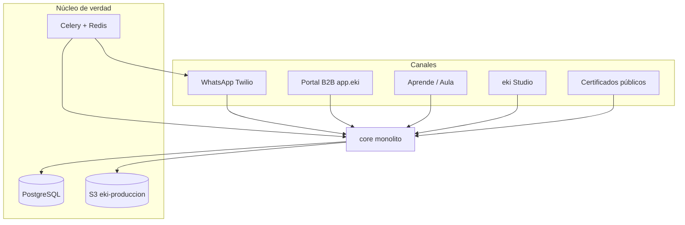
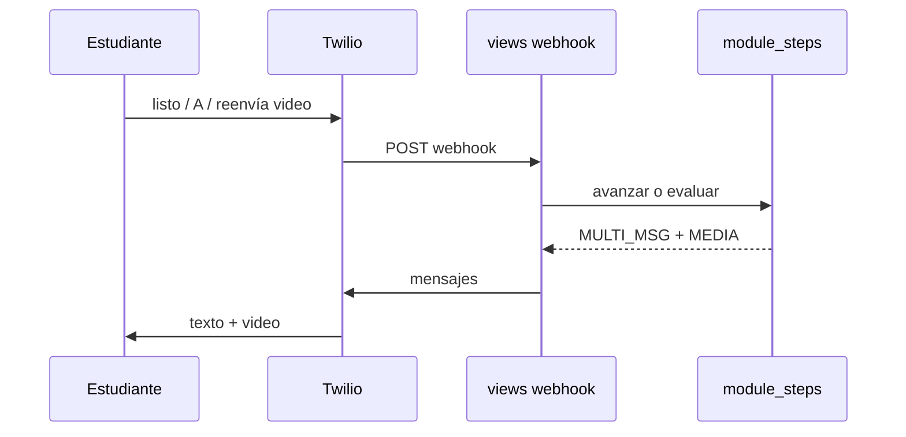
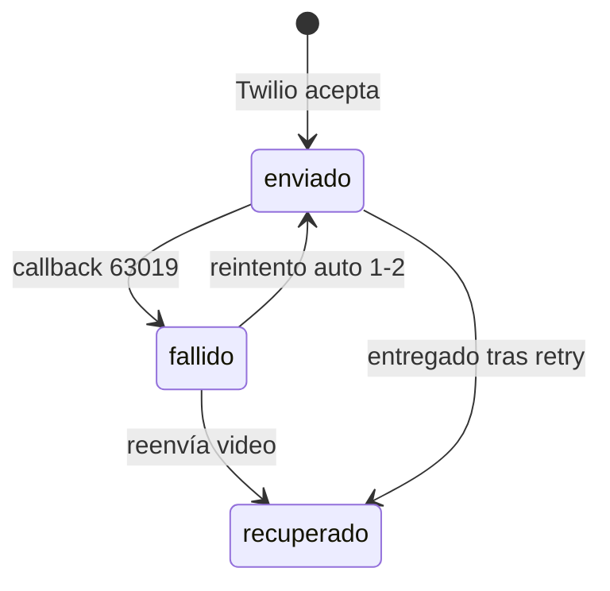
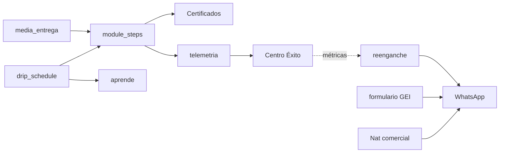

# eki — Entender el producto a detalle

Documento hermano de `docs/GUIA_PLATAFORMA_EKI.md`.  
Aquí no se opera el día a día: se **entiende** el producto.

**Para cada módulo** respondemos:

1. ¿Por qué existe?
2. ¿Qué pasa si falla?
3. ¿Cómo lo probaría?
4. ¿Cómo lo refactorizaría?
5. ¿Cómo lo explicaría en una entrevista técnica o ante un inversionista?

**Última actualización:** 22 julio 2026  
**Audiencia:** producto, ingeniería, founders, due diligence.

---

## 0. Mapa mental del producto

**Idea fundadora:** el estudiante aprende donde ya vive (WhatsApp + 3G). El coordinador ve riesgo y evidencia. El financiador verifica el diploma. Todo lee el **mismo** curso en BD/S3.

---

## 1. WhatsApp pedagógico (`module_steps` + webhook)

### ¿Por qué existe?
Porque el LMS web no llega a finca. WhatsApp es el único canal con adopción real. *listo* convierte el chat en un **ritmo pedagógico** (sección → comprensión → siguiente), no en un dumping de PDFs.

### ¿Qué pasa si falla?
- Webhook cae → nadie avanza; Celery async mitiga timeouts.
- *listo* salta eval A–D → el certificado pierde legitimidad ante quien paga (por eso el gate P0).
- Media 63019 → productor se frustra y abandona (mitigado con reintento + *reenvía video*).
- Multi-curso mal enrutado → respuesta va al curso equivocado.

### ¿Cómo lo probaría?
- Unit: `core/tests_module_steps.py`, `core/tests_cursos_p0.py`.
- Manual: onboarding → listo → A–D (intentar *listo* y ver bloqueo) → drip → reenvía video.
- Smoke post-deploy: un número real en ventana de 24 h.

### ¿Cómo lo refactorizaría?
- Extraer del monolito `views.py` un **pipeline de intenciones** ordenado (habeas → GEI → eval → media → curso → menú → Nat).
- Dejar `module_steps` como motor puro (sin I/O Twilio).
- Tests de orden de handlers en cada feature nueva.

### Pitch (inversor / entrevista)
> “Formación profesional que funciona donde solo hay WhatsApp y 3G. Cada *listo* es una confirmación de comprensión; las evaluaciones A–D no se pueden saltar — el diploma tiene peso.”

---

## 2. Drip (calendario / whitelist / días)

### ¿Por qué existe?
Cohortes B2B necesitan ritmo académico: no todo el contenido el día 1. El drip alinea calendario del programa con WhatsApp y con el aula.

### ¿Qué pasa si falla?
- Fechas mal puestas → bloqueo masivo o fuga de contenido.
- Whitelist mal cargada → mitad del grupo sin módulo.
- Portal aún **no** edita drip (solo admin) → dependencia de eki ops.

### ¿Cómo lo probaría?
- `drip_schedule` + tests de matriz; checklist §20 de la guía.
- Caso: completar M1 → mensaje de espera → pasar fecha → listo entrega M2.

### ¿Cómo lo refactorizaría?
- UI portal self-serve (abrir semana / whitelist) reutilizando `drip_matriz_service`.
- Una sola API de “¿puede ver este módulo?” compartida WA + aula (ya cerca en `acceso_modulos`).

### Pitch
> “El programa no es un binge de videos: es un calendario de formación que el WhatsApp respeta.”

---

## 3. Media entrega (Twilio + S3 + 3G)

### ¿Por qué existe?
El video **es** la promesa del módulo. En Colombia el fallo de media es normal (63019), no excepcional. Sin recuperación, el certificado miente: “completó” sin haber visto el material.

### ¿Qué pasa si falla?
- Sync: Twilio rechaza create → fallback texto (pierde adjunto).
- Async undelivered → reintento 1–2×; si agota, estado `fallido`.
- Video 80 MB / MOV → tasa de fallo alta en campo.
- Links S3 en el cuerpo: política **prohibida** (mala UX + riesgo).

### ¿Cómo lo probaría?
- `core/tests_twilio_media.py`, `core/tests_media_portal_ops.py`.
- Simular callback undelivered 63019 y assert de `enviar_whatsapp_twilio` con media.
- Campo: pedir *reenvía video* y verificar que el progreso no cambia.

### ¿Cómo lo refactorizaría?
- `MediaDeliveryService` único (twilio_media + media_entrega + paquetes).
- Status callback → cola Celery (no bloquear webhook).
- Validación 3G más visible en Studio/admin (aún soft).

### Pitch
> “Si el video no llega por 3G, el sistema lo reintenta solo; si hace falta, el productor pide *reenvía video* sin perder el avance ni llamar a operaciones.”

---

## 4. Certificados

### ¿Por qué existe?
El B2B y el financiador necesitan **evidencia verificable**, no un sticker de WhatsApp. QR → página eki → PDF + hash.

### ¿Qué pasa si falla?
- Solo PNG / CTA “Abrir PDF” vacío → pierde credibilidad (mitigado julio 2026).
- Ventana WA cerrada → no llega diploma (plantilla HSM o ACK previo).
- Organización mal impresa (contacto vs nombre) → branding débil.
- QR Netlify viejos → no self-heal.

### ¿Cómo lo probaría?
- `tests_certificado_*`, `smoke_certificado_envio`.
- Verify público + descarga `application/pdf`.
- Portal CSV + link verificar.

### ¿Cómo lo refactorizaría?
- Unificar pipeline PNG→PDF; anular/revocar en portal.
- Firma criptográfica del PDF (siguiente nivel due diligence).

### Pitch
> “Diploma verificable en segundos desde el celular: organización, integridad SHA-256 y PDF descargable — listo para el financiador.”

---

## 5. Portal B2B + Centro de Éxito

### ¿Por qué existe?
Sin portal, eki es una caja negra de chats. El coordinador necesita: quién está en riesgo, dónde se cayó, qué hacer hoy — y cada vez más **self-serve** (reset password, ver suscripción).

### ¿Qué pasa si falla?
- Tenancy leak entre orgs → incidente serio (tests de tenancy).
- Suscripción vencida bloquea todo → middleware + página vencida.
- Heurística de riesgo falsa → contactar de más o de menos.
- Reset sin email en User → no puede auto-servirse.

### ¿Cómo lo probaría?
- `portal/tests_retencion.py`, login/recuperar, `/portal/suscripcion/`.
- Export CSV certificados solo de su org.

### ¿Cómo lo refactorizaría?
- Invites + seats self-serve; drip editable en portal.
- Separar DTOs de retención de las vistas HTML.
- Billing real (hoy: status + WhatsApp renovar).

### Pitch
> “Centro de Éxito: retención operativa. El coordinador ve el semáforo y el sistema ya manda el WhatsApp de reenganche a los inactivos.”

---

## 6. Reenganche (Celery)

### ¿Por qué existe?
El drip abre el módulo; el estudiante no siempre vuelve. Sin nudge outbound, la formación muere en silencio. Hay dos palancas: **drip desbloqueado** (08:00) e **inactividad** (09:00).

### ¿Qué pasa si falla?
- Beat caído → nadie recibe recordatorios.
- Fuera de ventana 24 h sin HSM → Twilio rechaza.
- Sin cooldown → spam y bloqueos.
- Detector con related_name incorrecto → 0 enviados (ya corregido: `progresos`).

### ¿Cómo lo probaría?
- `tests_cursos_p0` reenganche; logs `[REENGANCHE_INACTIVIDAD]`.
- Verificar Beat en EB worker.

### ¿Cómo lo refactorizaría?
- Un módulo `outreach` con reglas por etapa (empezó y no volvió / trabado en eval / drip listo).
- Historial visible en portal por estudiante.

### Pitch
> “El curso vuelve a tocar la puerta cuando el módulo se abre o cuando el productor lleva días sin escribir.”

---

## 7. GEI (fichas de finca)

### ¿Por qué existe?
Programas clima/trazabilidad necesitan datos de finca. El Excel en campo no funciona; una encuesta conversacional por WhatsApp sí.

### ¿Qué pasa si falla?
- Sesión GEI trabada bloquea el curso (mitigado: escape / cerrar sesiones previas).
- Fórmula de balance desactualizada → reporte incorrecto a financiador.
- Tenancy: fichas sin `cliente` → fuga o vacío en portal.

### ¿Cómo lo probaría?
- `formulario/tests.py`, `scripts/smoke_gei_curso_sesion.py`.
- Export Excel portal filtrado por org.

### ¿Cómo lo refactorizaría?
- Mantener `calculadora` pura; agent solo diálogo.
- Prioridad de routing documentada vs curso/Nat.

### Pitch
> “Inventario GEI por WhatsApp, sin Excel en la finca: ficha + balance + export para el programa.”

---

## 8. Nat (comercial)

### ¿Por qué existe?
La misma habitación WhatsApp sirve para **vender y asesorar**. Nat es la línea comercial (catálogo, RAG, foto de cultivo, clima Open-Meteo), no el tutor del curso.

### ¿Qué pasa si falla?
- Número `To` mal mapeado → responde por el cliente equivocado.
- RAG débil → precios inventados.
- Visión sin anamnesis → diagnóstico cerrado peligroso (hoy: hipótesis).
- Mezcla con menú de curso si el routing falla.

### ¿Cómo lo probaría?
- `tests_nat_*`, `smoke_nat_producto_flujo.py`.
- Foto → hipótesis + packshot de producto mencionado.

### ¿Cómo lo refactorizaría?
- Completar migración a `agents_commercial/`.
- Guardrails de precio: solo catálogo.

### Pitch
> “Asesor agrícola comercial 24/7: foto del cultivo, clima verificado y catálogo con imagen — en el WhatsApp que el productor ya usa.”

---

## 9. Aprende (aula) + Studio

### ¿Por qué existe?
WhatsApp es entrega activa; el aula es **estudio pasivo** (reconsulta, tareas, ranking). Studio es adquisición/pago (Wompi) hacia Aprende.

### ¿Qué pasa si falla?
- Drip distinto WA vs aula → confusión (“en el chat sí, en web no”).
- OTP frío abandonado: el acceso correcto es escribir *aula* en WhatsApp.
- Host/CSRF mal configurado → 400 en studio.

### ¿Cómo lo probaría?
- `aprende/tests.py`, handoff *aula*, ranking con grupo.

### ¿Cómo lo refactorizaría?
- Clarificar auth B2B (*aula*) vs B2C (cuenta Studio) en código y docs.
- Un solo “content presenter” compartido.

### Pitch
> “La misma lección en WhatsApp y en el aula web: el productor estudia cuando tiene señal; el docente califica tareas.”

---

## 10. Infra (EB, S3, Twilio, Redis)

### ¿Por qué existe?
Un solo entorno prod con muchas superficies por subdominio. S3 público (o firmado bien) es requisito de Twilio media. Celery es el reloj del producto (campañas, reenganche).

### ¿Qué pasa si falla?
- Redis down → cola parada; campañas y reenganche muertos.
- `EKI_ALLOWED_HOSTS` incompleto → 400.
- Secrets en repo → incidente.
- Deploy “rojo” por health-check PowerShell ≠ EB Green real.

### ¿Cómo lo probaría?
- `/health/` 200, runbooks EB, precheck scripts.
- Host isolation tests.

### ¿Cómo lo refactorizaría?
- Matriz de env documentada; un solo nombre para status callback.
- Observabilidad (Sentry/Datadog) como proceso, no ad hoc.

### Pitch
> “Operamos un monolito consciente: un deploy, muchas puertas (WhatsApp, portal, aula, certificados), con Celery como sistema nervioso.”

---

## 11. Cómo explicar eki en 60 segundos (inversor)

> eki forma a personas en territorio por **WhatsApp**, con microlecciones, evaluaciones que no se saltan y certificados verificables.  
> El **portal** da al coordinador un Centro de Éxito: ve quién abandona y el sistema **reengancha solo**.  
> Si el video falla en 3G, se **recupera** sin perder avance.  
> Encima, módulos opcionales: **GEI** (datos de finca) y **Nat** (ventas agrícolas).  
> Misma fuente de contenido en chat, aula y reportes — pensado para programas B2B que pagan por evidencia, no por vanity metrics.

---

## 12. Cómo explicar eki en entrevista técnica (3 minutos)

1. **Problema:** LMS web no adopta en rural; WhatsApp sí; media y retención son el riesgo operativo.  
2. **Arquitectura:** monolito Django, host isolation, Twilio webhook → `module_steps` / formularios / Nat; S3; Celery beat.  
3. **Invariantes de producto:** eval A–D no saltables; media retry ≠ avance; tenancy por `cliente`; certificado = PNG(WA)+PDF(verify)+hash.  
4. **Deuda consciente:** `views.py` monolítico → pipeline de intenciones; portal aún no self-serve drip/seats.  
5. **Pruebas:** suites por dominio + smokes WA reales post-deploy.

---

## 13. Dependencias entre módulos (qué no romper)

| Si tocas… | Cuidado con… |
|-----------|----------------|
| Orden del webhook | GEI abierto, eval abierta, foto Nat, menú multi-curso |
| Envío media | Marcador `[MEDIA:]`, no links S3 en body |
| Completar curso | Signal certificado + elegibilidad nota |
| Cliente.portal_productos | Menús portal y tenancy |

---

## 14. Lecturas siguientes

| Documento | Uso |
|-----------|-----|
| `docs/GUIA_PLATAFORMA_EKI.md` | Operar y configurar |
| `docs/AUDITORIA_ARQUITECTURA_EKI.md` | Deuda y seguridad |
| `docs/NAT_GUIA_COMPLETA.md` | Nat en profundidad |
| `docs/INSTRUCTIVO_EKI_RECOLECCION_GEI.md` | GEI operativo |
| `docs/RUNBOOK_EB_MAIN.md` | Deploy |

---

*Este documento debe actualizarse cuando cambie un invariante de producto (ej. eval saltables, política de media, self-serve drip).*
