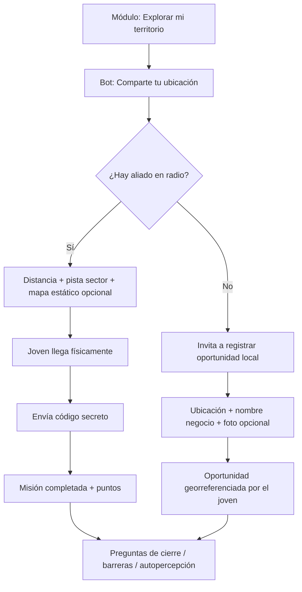

# Empleabilidad geolocalizada: WhatsApp, portal y métricas del programa

Documento de diseño conceptual (sin cambios de código). Resume qué existe hoy en eki, qué se puede hacer por WhatsApp tipo “Pokémon Go”, cómo llevarlo al portal y cómo medir las métricas del programa.

---

## Tabla de contenidos

1. [Contexto y objetivo](#1-contexto-y-objetivo)
2. [Lo que ya existe en el código](#2-lo-que-ya-existe-en-el-código)
3. [Flujo actual de empleabilidad por WhatsApp](#3-flujo-actual-de-empleabilidad-por-whatsapp)
4. [¿Se puede mostrar un mapa por chat?](#4-se-puede-mostrar-un-mapa-por-chat)
5. [Diseño del curso por WhatsApp (experiencia completa)](#5-diseño-del-curso-por-whatsapp-experiencia-completa)
6. [Dos tipos de descubrimiento](#6-dos-tipos-de-descubrimiento)
7. [Cómo llevarlo al portal](#7-cómo-llevarlo-al-portal)
8. [Métricas del programa](#8-métricas-del-programa)
9. [Arquitectura recomendada](#9-arquitectura-recomendada)
10. [Fases de implementación sugeridas](#10-fases-de-implementación-sugeridas)
11. [Respuestas directas a las dudas](#11-respuestas-directas-a-las-dudas)
12. [Referencias técnicas en el repositorio](#12-referencias-técnicas-en-el-repositorio)
13. [Próximos pasos (diseño, no código)](#13-próximos-pasos-diseño-no-código)

---

## 1. Contexto y objetivo

### Qué se quiere lograr

- Un **curso por WhatsApp** (lo que ya manejan) donde los jóvenes **exploren aliados de empleabilidad** en el territorio.
- Una experiencia **tipo Pokémon Go**: ir físicamente, descubrir oportunidades cercanas, validar con un código en sitio.
- **Visualización y reporte** en la **versión portal** para la organización.
- Medición de indicadores del programa, entre ellos:
  - Tasa de retención (% de jóvenes activos)
  - Barreras principales por joven (tipología)
  - ¿Qué dificultades has tenido para encontrar empleo?
  - ¿Cuáles crees que serían las principales barreras o dificultades para emprender?
  - % de jóvenes que validan un prototipo, servicio o idea de generación de ingresos con actores reales
  - **Número de negocios u oportunidades georreferenciadas por los jóvenes**
  - **% de jóvenes que identifican las oportunidades del ecosistema** (métrica prioritaria):
    - *I can identify opportunities for work, business, or income generation in my local community.*
    - *I can develop an idea for a product, service, job path, or business based on a local need.*

### Conclusión general

**Ya tienen montada buena parte del motor.** Lo que falta es principalmente:

- Diseño de experiencia pedagógica (cuándo y cómo se activa el radar).
- Capa de visualización y métricas en el portal.
- Flujo para que los **jóvenes georreferencien oportunidades propias** (no solo visiten aliados precargados).
- Instrumentos de medición (encuestas pre/post, tipología de barreras).

---

## 2. Lo que ya existe en el código

### Resumen de piezas existentes

| Pieza | Estado | Dónde vive |
|-------|--------|------------|
| Aliados con lat/lng, código secreto, cupos, prioridad, vigencia | ✅ Implementado | Modelo `AliadoEmpleabilidad` |
| Misiones por proximidad (descubierta → completada) | ✅ Implementado | Modelo `MisionEmpleabilidad` |
| Recibir ubicación del joven en Twilio | ✅ Implementado | Webhook: campos `Latitude` / `Longitude` |
| Lógica de radio, distancia Haversine, límite diario | ✅ Implementado | `_procesar_ubicacion_empleabilidad` |
| Validación del código en puerta | ✅ Implementado | Estado `esperando_codigo_empleabilidad` |
| API para listar oportunidades cercanas | ✅ Implementado | `GET /api/empleabilidad/oportunidades/` |
| API para reclamar y completar misión | ✅ Implementado | `POST /api/empleabilidad/claim/`, `POST /api/empleabilidad/completar/` |
| Configuración por cliente (radio, misiones/día, puntos, ventanas de fechas) | ✅ Implementado | Campos en modelo `Cliente` |
| Mapa en portal (Leaflet + OpenStreetMap) | ✅ Implementado | `/portal/cobertura/` |
| Preguntas abiertas finales de curso (hasta 3) | ✅ Implementado | `PreguntaAbiertaFinalCurso`, `RespuestaAbiertaFinal` |
| Campañas WhatsApp con captura Sí/No | ✅ Implementado | `campana_respuestas.py` |
| Gamificación (puntos, badges) al validar código | ✅ Implementado | Integrado en flujo de código secreto |
| Notificación email a admin al match empleabilidad | ✅ Implementado | Task async al validar código |
| Módulo portal de empleabilidad / exploración | ❌ No existe aún | — |
| Oportunidades georreferenciadas **por el joven** | ❌ No modelado | — |
| Encuesta pre/post ecosistema (Likert) | ❌ No dedicada | Podría usar campañas o módulos |
| Tipología automática de barreras | ❌ No existe | Respuestas son texto libre hoy |

### Modelo `AliadoEmpleabilidad`

Empresas aliadas para gamificación geolocalizada:

- `nombre_empresa`
- `cliente` (opcional; filtra por organización)
- `latitud`, `longitud`
- `cupos_disponibles`
- `prioridad` (1–5)
- `vigencia_desde`, `vigencia_hasta`
- `vacantes_activas`
- `codigo_secreto` (validación en puerta)
- `indicacion_sector` (pista textual: “costado oriental del parque principal”)

### Modelo `MisionEmpleabilidad`

Misiones de exploración/validación:

**Estados (`estado`):**

- `descubierta`
- `reclamada`
- `completada`
- `cancelada`

**Embudo (`estado_flujo`):**

- `descubierto`
- `interesado`
- `postulado`
- `entrevista`
- `vinculado`
- `descartado`

**Datos geográficos y de trazabilidad:**

- `latitud`, `longitud` (ubicación del joven al descubrir)
- `distancia_metros`
- `codigo_validado`
- `puntos_otorgados`
- `puntaje_prioridad`
- `canal_origen` (default: `whatsapp`)
- `metadata` (JSON, ej. `fuente: whatsapp_location`)
- Fechas: `fecha_descubierta`, `fecha_reclamada`, `fecha_completada`, etc.

### Configuración por cliente (`Cliente`)

Flags y parámetros relevantes:

- `habilitar_gamificacion_proximidad` + ventana `fecha_inicio_*` / `fecha_fin_*`
- `empleabilidad_exploracion_activa`
- `empleabilidad_radio_metros` (default: 800 m)
- `empleabilidad_max_misiones_dia` (default: 3)
- `empleabilidad_cooldown_horas` (default: 24 h entre validaciones)
- `empleabilidad_puntos_validacion` (default: 30 puntos)
- `habilitar_pregunta_abierta_final` + ventana de fechas

---

## 3. Flujo actual de empleabilidad por WhatsApp

### Secuencia paso a paso

1. El joven **comparte su ubicación** en WhatsApp (adjunto → Ubicación).
2. Twilio envía al webhook `Latitude` y `Longitude`.
3. El sistema ejecuta `_procesar_ubicacion_empleabilidad(estudiante, lat, lng)`:
   - Verifica que la organización tenga el radar activo (ventana de fechas / flag).
   - Busca aliados activos del cliente (o globales).
   - Calcula distancia con fórmula Haversine.
   - Respeta límite de misiones por día.
   - Si está fuera del radio: mensaje con distancia al aliado más cercano.
   - Si está dentro del radio: crea `MisionEmpleabilidad` en estado `descubierta`.
   - Guarda contexto temporal: `aliado_empleabilidad_objetivo_id`, `mision_empleabilidad_id`.
   - Cambia estado a `esperando_codigo_empleabilidad`.
4. El bot responde según distancia:
   - **≤ 100 m:** “¡Estás a X metros! Acércate y envía el código secreto.”
   - **> 100 m pero dentro del radio:** “Acércate al sector [indicación] y vuelve a enviar ubicación.”
5. El joven llega y envía el **código secreto** como texto.
6. Si coincide:
   - Misión → `completada`, `codigo_validado=True`
   - Puntos de gamificación
   - Badge especial si existe
   - Email al admin de la organización
   - Mensaje de logro al joven
7. Si no coincide: mensaje de error, sigue en `esperando_codigo_empleabilidad`.

### Activación del radar en el curso

Función `_activar_radar_empleabilidad_si_aplica(estudiante)`:

- Se activa si el cliente tiene proximidad habilitada y hay aliados con vacantes activas.
- Marca en `contexto_temporal`: `radar_empleabilidad_activo = True`.

### APIs REST (para web o app futura)

| Endpoint | Método | Uso |
|----------|--------|-----|
| `/api/empleabilidad/oportunidades/` | GET | Lista aliados en radio (`telefono`, `latitud`, `longitud`) |
| `/api/empleabilidad/claim/` | POST | Reclama misión sin pasar por WhatsApp |
| `/api/empleabilidad/completar/` | POST | Completa con código (`telefono`, `mision_id`, `codigo`) |

---

## 4. ¿Se puede mostrar un mapa por chat?

### Lo que NO se puede

- **Mapa interactivo embebido** dentro de la conversación de WhatsApp (Google Maps, radar animado, zoom, etc.).
- Una experiencia idéntica a Pokémon Go **solo dentro del chat**.

### Lo que SÍ se puede

| Opción | Descripción | Fricción | Recomendación |
|--------|-------------|----------|---------------|
| **Ubicación nativa WhatsApp** | Joven comparte pin de GPS | Muy baja | ✅ Principal — ya implementado |
| **Texto + distancia + pista sector** | “Estás a 340 m, sector oriental del parque” | Muy baja | ✅ Ya implementado |
| **Imagen estática de mapa** | URL Google Static Maps / Mapbox con pin | Baja | Opcional en mensaje |
| **Link a mini-web** | `portal.../explorar?tel=...` con mapa Leaflet | Media | ✅ Para experiencia rica |
| **Enviar ubicación de vuelta** | Bot manda pin (limitado en Twilio) | Variable | Secundario |

### Recomendación práctica

- **WhatsApp** = acción en territorio (ir, compartir ubicación, código).
- **Link web opcional** = radar visual para quien quiera ver el mapa.
- **No depender** del mapa interactivo dentro del chat.

### Ejemplo de mensaje con mapa estático (conceptual)

```
📍 Hay una oportunidad cerca de ti.

🏢 Empresa Aliada — 340 m
👉 Acércate al costado oriental del parque principal.

[Mensaje con imagen: mapa estático con pin]

Cuando llegues, envía el código que verás en la entrada.
```

---

## 5. Diseño del curso por WhatsApp (experiencia completa)

### Diagrama de flujo



### Momentos pedagógicos sugeridos

| Momento del curso | Acción WhatsApp | Objetivo de aprendizaje |
|-------------------|-----------------|-------------------------|
| **Módulo inicial** | Encuesta pre: “¿Identificas oportunidades en tu comunidad?” (1–5) | Línea base autopercepción |
| **Módulo exploración** | “Comparte tu ubicación para activar el radar” | Conducta: salir al territorio |
| **Durante exploración** | Pistas de distancia + sector | Orientación espacial |
| **En sitio** | Código secreto | Validación con actor real |
| **Sin aliados cercanos** | “Registra un negocio u oportunidad que veas” | Mapeo participativo |
| **Cierre del curso** | Preguntas abiertas de barreras | Diagnóstico cualitativo |
| **Post-curso** | Encuesta post: mismas preguntas de ecosistema | Medir cambio |

### Textos sugeridos del bot (borrador)

**Activación del radar:**

```
🗺️ *Exploración de empleabilidad*

Hoy vas a salir a conocer oportunidades reales cerca de ti.

1️⃣ Sal a la calle con tu celular
2️⃣ Toca 📎 → *Ubicación* → *Enviar ubicación actual*
3️⃣ Te diré si hay un aliado cerca

¿Listo? Comparte tu ubicación cuando estés en movimiento.
```

**Fuera de radio:**

```
📍 Aún no hay aliados dentro de tu radio de exploración.

Distancia al más cercano: *520 m*
Radio activo: *800 m*

Sigue caminando y vuelve a enviarme tu ubicación.

O escribe *registrar* si ves un negocio u oportunidad que quieras mapear.
```

**Registro de oportunidad del joven (flujo futuro):**

```
📌 *Registrar oportunidad local*

Cuéntame:
1. Nombre del negocio o lugar
2. Qué oportunidad ves (empleo, servicio, venta…)
3. Comparte la ubicación 📎

Ejemplo: "Panadería La Esperanza — buscan ayudante de ventas"
```

**Cierre — barreras empleo:**

```
Para cerrar tu proceso, cuéntame:

*¿Qué dificultades has tenido para encontrar empleo?*

Puedes responder con texto o audio 🎤
```

**Cierre — barreras emprendimiento:**

```
*¿Cuáles crees que serían las principales barreras o dificultades para emprender tu propio negocio?*

Responde con tus palabras.
```

---

## 6. Dos tipos de descubrimiento

La métrica *“Número de negocios u oportunidades georreferenciadas por los jóvenes”* implica distinguir dos fuentes:

| Tipo | Quién carga el punto | Cómo se valida | Estado en código |
|------|----------------------|----------------|------------------|
| **Aliado oficial** | Organización / admin | Código secreto en puerta | ✅ `AliadoEmpleabilidad` + `MisionEmpleabilidad` |
| **Oportunidad del joven** | El propio joven | Moderación facilitador o criterios automáticos | ❌ Por diseñar |

### Aliado oficial (ya existe)

- Precargado en admin.
- Coordenadas fijas.
- Validación física con código.
- Cuenta como misión completada.

### Oportunidad del joven (por implementar)

Datos mínimos sugeridos:

- `estudiante_id`
- `latitud`, `longitud`
- `nombre_negocio` o descripción
- `tipo_oportunidad` (empleo / negocio / servicio / otro)
- `foto` (opcional, vía media WhatsApp)
- `estado` (pendiente / aprobada / rechazada)
- `fecha_registro`
- `municipio` (derivado o manual)

**Regla de conteo para la métrica:**

- 1 registro aprobado = 1 oportunidad georreferenciada.
- Evitar duplicados por proximidad (< 50 m mismo nombre).

---

## 7. Cómo llevarlo al portal

### Situación actual del portal

El portal ya tiene:

- Dashboard general (`/portal/dashboard/`)
- Métricas (`/portal/metricas/`)
- Cobertura geográfica con mapa Leaflet (`/portal/cobertura/`)
- Estudiantes, cursos, campañas, gamificación

**No tiene** un módulo dedicado a empleabilidad / exploración territorial.

### Propuesta: módulo `/portal/empleabilidad/`

Podría vivir como sección propia o dentro de Métricas detalladas.

#### Panel superior — KPIs

| Tarjeta | Cálculo |
|---------|---------|
| Jóvenes activos (30 días) | Con mensaje o avance reciente / total inscritos |
| Tasa de retención | % activos |
| Misiones completadas | `MisionEmpleabilidad` estado `completada` |
| Oportunidades georreferenciadas | Suma aliados visitados + oportunidades del joven |
| % identificación ecosistema | Ver sección métrica 7 |
| Barreras más frecuentes | Tipología agregada de respuestas |

#### Mapa central (reutilizar Leaflet de cobertura)

Capas:

| Color / capa | Significado |
|--------------|-------------|
| 🟣 Morado | Aliados activos (`AliadoEmpleabilidad`) |
| 🟢 Verde | Misiones completadas (pin en lat/lng del joven) |
| 🔵 Azul | Oportunidades reportadas por jóvenes (futuro) |
| ⚪ Gris | Aliados inactivos o fuera de vigencia |

Filtros:

- Curso
- Grupo
- Rango de fechas
- Municipio / departamento
- Estado de misión / embudo

#### Tablas y detalle

**Por joven:**

- Nombre, teléfono, municipio
- # misiones descubiertas / completadas
- # oportunidades registradas
- Última actividad
- Embudo: descubierto → interesado → postulado → entrevista → vinculado

**Por aliado:**

- Nombre empresa
- # visitas validadas
- Cupos restantes
- Distancia promedio de acercamiento

**Respuestas abiertas:**

- Lista de respuestas de barreras pendientes de calificar
- Tipología asignada (manual o IA)
- Export Excel

#### APIs y datos

Casi todo sale de tablas existentes:

- `MisionEmpleabilidad`
- `AliadoEmpleabilidad`
- `Estudiante`
- `WhatsappLog`
- `ProgresoEstudiante`
- `RespuestaAbiertaFinal`
- `PerfilGamificacion` (puntos)

Endpoint existente para alimentar mapa móvil:

```
GET /api/empleabilidad/oportunidades/?telefono=...&latitud=...&longitud=...
```

Vista web móvil sugerida:

```
/portal/explorar/?tel=...   (o token firmado por sesión)
```

---

## 8. Métricas del programa

### 8.1 Tasa de retención (% jóvenes activos)

**Definición operativa:**

```
Retención = (Jóvenes con ≥1 interacción en últimos 30 días / Total jóvenes inscritos) × 100
```

**Interacción** = cualquiera de:

- Mensaje entrante en `WhatsappLog`
- Avance de módulo (`ProgresoEstudiante.fecha_ultimo_avance`)
- Misión de empleabilidad creada o completada

**Fuentes de datos:**

- `WhatsappLog` (tipo `INCOMING`)
- `ProgresoEstudiante.fecha_ultimo_avance`
- `Estudiante.activo`
- `MisionEmpleabilidad.fecha_descubierta` / `fecha_completada`

**En portal:**

- Tarjeta con % y tendencia semanal
- Lista de inactivos > 30 días para campaña de reenganche (ya existe drip de reenganche)

**Variantes útiles:**

| Ventana | Uso |
|---------|-----|
| 7 días | Actividad caliente |
| 14 días | Retención corta |
| 30 días | Retención estándar reporte |
| 60 días | Persistencia programa largo |

---

### 8.2 Barreras principales por joven (tipología)

**Pregunta:** clasificar las dificultades en categorías por joven.

**Estado actual:** `RespuestaAbiertaFinal` guarda **texto libre** sin tipología.

**Opciones de medición:**

#### Opción A — Rápida (preguntas abiertas + IA)

1. Configurar `PreguntaAbiertaFinalCurso` con las preguntas de barreras.
2. Al recibir respuesta, clasificar con IA en categorías:
   - Formación / capacitación
   - Capital / financiamiento
   - Red de contactos
   - Discriminación / edad / género
   - Información / orientación
   - Infraestructura / transporte
   - Salud / cuidado
   - Otro
3. Mostrar en portal: gráfico de barras por tipología y tabla por joven.

#### Opción B — Estructurada (campaña WhatsApp)

1. Campaña con lista de opciones (Twilio quick replies / list picker).
2. Joven elige una o varias barreras.
3. Guardar en modelo de respuesta estructurada.

*Nota:* campañas actuales solo capturan Sí/No (`campana_respuestas.py`). Habría que extender para opciones múltiples.

#### Opción C — Híbrida (recomendada)

1. Pregunta abierta en WhatsApp (texto o audio).
2. IA sugiere tipología.
3. Facilitadora confirma o corrige en portal al calificar.

**Preguntas exactas sugeridas:**

1. *¿Qué dificultades has tenido para encontrar empleo?*
2. *¿Cuáles crees que serían las principales barreras o dificultades para que puedas emprender tu propio negocio?*

---

### 8.3 ¿Qué dificultades has tenido para encontrar empleo?

- Instrumento: `PreguntaAbiertaFinalCurso` (orden 1) o campaña dedicada.
- Canal: WhatsApp texto o audio (ya soportan transcripción de audio).
- Salida portal: respuesta literal + tipología + export.

---

### 8.4 ¿Barreras para emprender tu propio negocio?

- Instrumento: `PreguntaAbiertaFinalCurso` (orden 2) o segunda campaña.
- Misma infraestructura que 8.3.
- Permite comparar barreras empleo vs emprendimiento por joven.

---

### 8.5 % jóvenes que validan prototipo con actores reales

**Definición:** jóvenes que demostraron su idea/servicio/prototipo a una persona o negocio real del entorno.

**Proxies conductuales con lo existente:**

| Proxy | Condición | Fortaleza |
|-------|-----------|-----------|
| Código validado en aliado | `MisionEmpleabilidad.codigo_validado=True` | Evidencia fuerte de visita física |
| Embudo avanzado | `estado_flujo` en `postulado`, `entrevista`, `vinculado` | Proceso de empleabilidad real |
| Pregunta explícita Sí/No | Campaña: “¿Validaste tu idea con alguien real?” | Alineación directa con indicador |

**Si “prototipo” ≠ “visitar aliado”:**

Agregar pregunta dedicada al cierre:

```
¿Validaste tu idea de negocio o servicio con al menos una persona real
(cliente, vecino, empleador)? Responde *sí* o *no*.
```

**Cálculo:**

```
% validación = (Jóvenes con validación confirmada / Total jóvenes que llegaron al módulo de validación) × 100
```

---

### 8.6 Número de negocios u oportunidades georreferenciadas por los jóvenes

**Definición literal:** conteo de puntos en el mapa registrados por participantes.

**Hoy en código:**

- Solo cuentan misiones contra `AliadoEmpleabilidad` precargados.
- Cada misión guarda lat/lng del joven al descubrir.

**Para cumplir la métrica del financiador:**

Necesitan el flujo **“oportunidad del joven”** (sección 6).

**Métricas derivadas:**

| Indicador | Fórmula |
|-----------|---------|
| Total programa | Suma de oportunidades aprobadas |
| Por joven | Count por `estudiante_id` |
| Promedio | Total / jóvenes que registraron ≥1 |
| Por municipio | Agrupación geográfica |

**Visualización portal:**

- Mapa con pins azules
- Tabla ranking: jóvenes que más mapearon
- Export CSV: estudiante, lat, lng, nombre, fecha, tipo

---

### 8.7 % jóvenes que identifican oportunidades del ecosistema ⭐ (prioritaria)

**Competencias a medir:**

1. *I can identify opportunities for work, business, or income generation in my local community.*
2. *I can develop an idea for a product, service, job path, or business based on a local need.*

Estas son competencias de **autopercepción + conocimiento + conducta**. Recomendación: medir en **tres capas**.

#### Capa 1 — Autopercepción (pre/post)

Encuesta Likert 1–5 por WhatsApp al inicio y al cierre:

```
Del 1 al 5, ¿qué tan de acuerdo estás?

A) Puedo identificar oportunidades de trabajo, negocio o ingresos en mi comunidad.
B) Puedo desarrollar una idea de producto, servicio o negocio basada en una necesidad local.

Responde: A=4, B=5  (ejemplo)
```

**Indicador:**

```
% autopercepción positiva = Jóvenes con promedio ≥4 en post-test / Total con post-test
```

**Mejora:**

```
Δ = Promedio post - Promedio pre (por ítem y global)
```

#### Capa 2 — Conocimiento demostrado

Pregunta abierta final calificada:

```
Nombra al menos 3 oportunidades reales en tu barrio o municipio
(empleo, negocio o servicio) y explica por qué lo son.
```

**Rúbrica de calificación (0–100):**

| Criterio | Puntos |
|----------|--------|
| Menciona ≥3 oportunidades concretas | 40 |
| Diversidad (empleo + negocio/servicio) | 20 |
| Vincula con necesidad local | 20 |
| Especificidad (nombres, lugares, sectores) | 20 |

**Indicador:**

```
% conocimiento = Jóvenes con calificación ≥70 / Total evaluados
```

#### Capa 3 — Conducta en territorio

| Señal | Peso |
|-------|------|
| ≥1 misión completada con código | Fuerte |
| ≥2 oportunidades auto-registradas | Fuerte |
| ≥3 misiones descubiertas (aunque no todas completadas) | Media |

#### Indicador compuesto sugerido (para reporte al financiador)

```
Joven "identifica ecosistema" si cumple TODO:
  (1) Post-test autopercepción ≥ 4/5 en al menos un ítem
  Y
  (2) Al menos una de:
      - Calificación ≥70 en pregunta abierta de oportunidades
      - ≥1 misión completada con código validado
      - ≥2 oportunidades georreferenciadas aprobadas
```

```
% ecosistema = Jóvenes que cumplen criterio compuesto / Total inscritos (o total que completaron módulo exploración)
```

Esto conecta la métrica “blanda” (encuesta) con evidencia conductual (territorio).

---

## 9. Arquitectura recomendada

```
┌─────────────────────────────────────────────────────────────────┐
│                        WHATSAPP (acción)                        │
│  Compartir ubicación │ Código secreto │ Preguntas │ Registrar   │
└────────────────────────────┬────────────────────────────────────┘
                             │
                             ▼
┌─────────────────────────────────────────────────────────────────┐
│                     BACKEND (ya existe en gran parte)           │
│  Webhook Twilio → _procesar_ubicacion_empleabilidad             │
│  MisionEmpleabilidad │ AliadoEmpleabilidad │ RespuestaAbierta   │
│  APIs: /api/empleabilidad/oportunidades|claim|completar         │
│  [Futuro] OportunidadJoven                                      │
└────────────────────────────┬────────────────────────────────────┘
                             │
                             ▼
┌─────────────────────────────────────────────────────────────────┐
│                    PORTAL (visualización — por construir)       │
│  /portal/empleabilidad/ — KPIs + mapa Leaflet + tablas          │
│  /portal/explorar/ — vista móvil radar (opcional)               │
│  Export Excel / CSV para financiador                            │
└─────────────────────────────────────────────────────────────────┘
```

### Fuentes de datos por métrica

| Métrica | Tablas / fuentes |
|---------|------------------|
| Retención | `WhatsappLog`, `ProgresoEstudiante`, `Estudiante` |
| Barreras tipología | `RespuestaAbiertaFinal` (+ clasificación) |
| Validación prototipo | `MisionEmpleabilidad`, campaña Sí/No |
| Oportunidades georef. | `MisionEmpleabilidad` + `OportunidadJoven` (futuro) |
| Ecosistema | Encuesta pre/post + `RespuestaAbiertaFinal` + misiones |

---

## 10. Fases de implementación sugeridas

### Fase 1 — Solo WhatsApp + admin (mínimo viable)

**Alcance:**

- Activar aliados en admin por municipio
- Configurar ventana de fechas por cliente
- Módulo de curso “Exploración territorial”
- Preguntas abiertas finales de barreras (2–3)
- Métricas vía Django admin + export manual

**Esfuerzo:** bajo (configuración, no desarrollo)

**Métricas cubiertas:**

- Misiones completadas (parcialmente oportunidades georef.)
- Barreras (texto libre)
- Retención (manual desde admin)

---

### Fase 2 — Portal empleabilidad

**Alcance:**

- Nueva vista `/portal/empleabilidad/`
- Mapa con aliados + misiones
- KPIs: retención, misiones, embudo
- Tabla por joven y por aliado
- Reutilizar Leaflet de `/portal/cobertura/`

**Esfuerzo:** medio

**Métricas cubiertas:**

- Retención automatizada
- Oportunidades georef. (solo aliados visitados)
- Embudo empleabilidad

---

### Fase 3 — Oportunidades del joven

**Alcance:**

- Flujo WhatsApp `registrar` oportunidad
- Nuevo modelo `OportunidadJoven`
- Moderación en portal
- Capa azul en mapa
- Contador por joven

**Esfuerzo:** medio-alto

**Métricas cubiertas:**

- Número de negocios u oportunidades georreferenciadas por jóvenes (completa)

---

### Fase 4 — Pre/post ecosistema + tipología barreras

**Alcance:**

- Encuesta Likert inicio y cierre (campaña o módulo)
- Clasificación IA de barreras
- Indicador compuesto ecosistema en dashboard
- Export reporte financiador

**Esfuerzo:** medio

**Métricas cubiertas:**

- % identificación ecosistema (completa)
- Barreras por tipología
- Δ pre/post

---

## 11. Respuestas directas a las dudas

| Pregunta | Respuesta |
|----------|-----------|
| ¿Podemos traer una API de maps por chat? | No interactiva dentro del chat. Sí: ubicación nativa, imagen estática, link a web con mapa. |
| ¿Pokémon Go por WhatsApp? | Sí: compartir ubicación + distancia + ir al sitio + código. El “radar” visual va mejor en link al portal. |
| ¿Cómo lo traemos al portal? | Nuevo módulo empleabilidad reutilizando Leaflet, APIs y tablas existentes. No es proyecto desde cero. |
| ¿La métrica de oportunidades georreferenciadas? | Hoy solo aliados precargados. Falta flujo para que el joven registre oportunidades propias. |
| ¿La métrica más importante (ecosistema)? | Combinar encuesta pre/post + pregunta abierta calificada + evidencia conductual en territorio. |
| ¿Barreras por tipología? | Hoy texto libre. Agregar clasificación IA o campaña estructurada. |
| ¿Validación con actores reales? | Proxy: código validado en aliado. Ideal: pregunta explícita + embudo `estado_flujo`. |

---

## 12. Referencias técnicas en el repositorio

### Modelos

| Archivo | Contenido |
|---------|-----------|
| `core/models.py` | `AliadoEmpleabilidad`, `MisionEmpleabilidad`, `PreguntaAbiertaFinalCurso`, `RespuestaAbiertaFinal`, flags en `Cliente` |

### Lógica WhatsApp

| Archivo | Función / flujo |
|---------|-----------------|
| `core/views.py` | `_procesar_ubicacion_empleabilidad`, `_activar_radar_empleabilidad_si_aplica`, webhook Twilio (Latitude/Longitude), validación código |
| `core/response_templates.py` | `_generar_completado_final` (preguntas abiertas al cerrar curso) |
| `core/campana_respuestas.py` | Captura Sí/No de campañas |

### APIs

| Archivo | Endpoints |
|---------|-----------|
| `core/api.py` | `api_empleabilidad_oportunidades`, `api_empleabilidad_claim`, `api_empleabilidad_completar` |
| `core/urls/api_urls.py` | Rutas API empleabilidad |

### Portal

| Archivo | Contenido |
|---------|-----------|
| `portal/views.py` | Dashboard, métricas, cobertura |
| `portal/cobertura_geo.py` | Resumen geográfico participantes |
| `portal/templates/portal/cobertura.html` | Mapa Leaflet (patrón a reutilizar) |
| `portal/urls.py` | Rutas portal |

### Tests

| Archivo | Casos |
|---------|-------|
| `core/tests.py` | `test_geogamificacion_respuesta_cercana`, `test_proximidad_bloqueada_por_cliente_fuera_de_ventana`, preguntas abiertas finales |

### Admin

| Archivo | Contenido |
|---------|-----------|
| `core/admin.py` | `AliadoEmpleabilidadAdmin`, `MisionEmpleabilidadAdmin`, configuración cliente empleabilidad |

---

## 13. Próximos pasos (diseño, no código)

### A definir en taller con el equipo

1. **Curso concreto:** ¿en qué módulo se activa el radar? ¿Cuántas misiones exige el programa?
2. **Aliados por territorio:** ¿cuántos por municipio? ¿quién carga códigos en puerta?
3. **Preguntas de cierre:** texto exacto de las 3 preguntas abiertas finales.
4. **Encuesta ecosistema:** ítems Likert exactos (español) alineados al financiador.
5. **Criterio compuesto:** umbral final para “identifica ecosistema” en reportes.
6. **Oportunidades del joven:** ¿requieren aprobación de facilitador o auto-publicación?
7. **Portal:** ¿módulo independiente o pestaña dentro de Métricas?

### Entregables de diseño sugeridos

- [ ] Guion de mensajes WhatsApp (activación, radar, registro, cierre)
- [ ] Matriz métrica → fuente de datos → visualización portal
- [ ] Mockup de pantalla `/portal/empleabilidad/`
- [ ] Rúbrica de calificación pregunta abierta ecosistema
- [ ] Plantilla export reporte financiador (Excel/PDF)

---

## Anexo A — Parámetros configurables por organización

| Parámetro | Default | Efecto |
|-----------|---------|--------|
| `empleabilidad_radio_metros` | 800 | Distancia máxima para detectar aliado |
| `empleabilidad_max_misiones_dia` | 3 | Límite diario exploración |
| `empleabilidad_cooldown_horas` | 24 | Tiempo entre validaciones exitosas |
| `empleabilidad_puntos_validacion` | 30 | Puntos al validar código |
| Ventana `gamificacion_proximidad` | — | Fechas inicio/fin del radar |
| `empleabilidad_exploracion_activa` | false | Flag alternativo de activación |

---

## Anexo B — Estados del joven relevantes

| Estado onboarding | Significado |
|-------------------|-------------|
| `esperando_codigo_empleabilidad` | Descubrió aliado, debe enviar código en puerta |
| `esperando_respuesta_pregunta_abierta_final` | Respondiendo pregunta de cierre |
| `curso_finalizado` | Tras validar empleabilidad o cerrar flujo |

---

## Anexo C — Ejemplo de reporte mensual financiador

| Indicador | Meta | Resultado | Fuente |
|-----------|------|-----------|--------|
| Jóvenes inscritos | 100 | 98 | `Estudiante` |
| Retención 30 días | ≥70% | 68% | `WhatsappLog` + progreso |
| Oportunidades georreferenciadas | ≥150 | 142 | Misiones + oportunidades joven |
| % validación actores reales | ≥40% | 38% | Códigos validados |
| % identificación ecosistema | ≥60% | 55% | Indicador compuesto |
| Barrera #1 (tipología) | — | Falta de capital (32%) | Respuestas abiertas |

---

*Documento generado como referencia de diseño. No implica cambios en el código hasta que el equipo apruebe las fases.*
