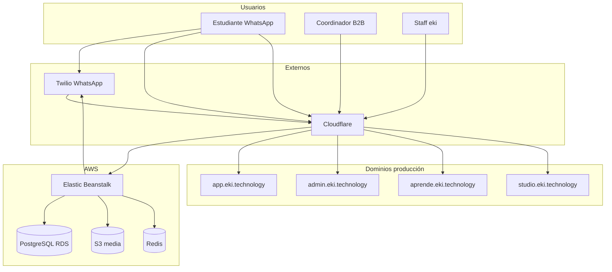

# Guía completa de la plataforma eki

Documento de referencia para el equipo de producto, operaciones, contenido y desarrollo. Explica **qué hace eki**, **cómo se conectan las piezas**, **cómo operar cada superficie** y **cómo configurar cursos** para WhatsApp y aula virtual.

**Última actualización:** 20 julio 2026 (Centro de Éxito + telemetría en portal; deploy `main-20260720-172516`)  
**Entorno producción:** AWS Elastic Beanstalk `eki-prod-final`  
**Repositorio:** monolito Django (`mvp_project/`)  
**Lectura CTO:** el producto en prod ya no es solo “LMS + WhatsApp”; es un monolito operativo con portal B2B de coordinación (**Centro de Éxito** en retención), aula/Studio, gamificación, GEI y Nat comercial (clima Open-Meteo en §24). La sección **25** cubre seguridad frente a inyecciones.

**Documentos relacionados:**

| Documento | Para qué sirve |
|-----------|----------------|
| `docs/AUDITORIA_ARQUITECTURA_EKI.md` | Deuda técnica, archivos críticos, seguridad P0–P3 |
| `docs/CHECKLIST_PRE_DEPLOY.md` | Comandos y smoke tests antes de cada deploy |
| `docs/EKI_STUDIO.md` | Catálogo, inscripción y DNS de eki Studio |
| `docs/INSTRUCTIVO_EKI_RECOLECCION_GEI.md` | Recolección de datos GEI por WhatsApp, fichas y export |
| `docs/INFRAESTRUCTURA_EKI_PARA_CLOUDFLARE.md` | DNS, EB, variables `EKI_ALLOWED_HOSTS` |

---

## Tabla de contenidos

1. [Visión y propuesta de valor](#1-visión-y-propuesta-de-valor)
2. [Arquitectura general](#2-arquitectura-general)
3. [Superficies del producto](#3-superficies-del-producto)
4. [Modelo de datos del negocio](#4-modelo-de-datos-del-negocio)
5. [Contenido didáctico: curso, módulo, sección, paso](#5-contenido-didáctico-curso-módulo-sección-paso)
6. [Flujo WhatsApp del estudiante](#6-flujo-whatsapp-del-estudiante)
7. [Drip: liberación temporal de contenido](#7-drip-liberación-temporal-de-contenido)
8. [Campañas y comunicación masiva](#8-campañas-y-comunicación-masiva)
9. [Aula virtual (aprende)](#9-aula-virtual-aprende)
10. [Portal B2B (app)](#10-portal-b2b-app)
    - [10.5 ¿Qué es GEI? ¿Qué es Nat?](#105-qué-es-gei-qué-es-nat)
11. [Admin operaciones](#11-admin-operaciones)
12. [Gamificación](#12-gamificación)
13. [Certificados y verificación](#13-certificados-y-verificación)
14. [Empleabilidad y formularios externos](#14-empleabilidad-y-formularios-externos)
15. [Retención y Centro de Éxito del Programa](#15-retención-y-centro-de-éxito-del-programa)
16. [Integraciones (Twilio, S3, IA)](#16-integraciones-twilio-s3-ia)
17. [Tareas en segundo plano (Celery)](#17-tareas-en-segundo-plano-celery)
18. [Infraestructura y despliegue](#18-infraestructura-y-despliegue)
19. [Guía operativa: publicar un curso de punta a punta](#19-guía-operativa-publicar-un-curso-de-punta-a-punta)
20. [Guía operativa: probar antes de producción](#20-guía-operativa-probar-antes-de-producción)
21. [Resolución de problemas frecuentes](#21-resolución-de-problemas-frecuentes)
22. [Glosario](#22-glosario)
23. [Historial de capacidades (julio 2026)](#23-historial-de-capacidades-julio-2026)
24. [CTO — Clima Open-Meteo para Nat](#24-cto--clima-open-meteo-para-nat)
25. [CTO — Seguridad frente a inyección de datos](#25-cto--seguridad-frente-a-inyección-de-datos)

---

## Estado del producto al 20 julio 2026 (resumen ejecutivo)

Lo que un coordinador o un inversor debe entender **hoy**, sin leer todo el documento:

| Superficie | Qué está vivo en producción |
|------------|-----------------------------|
| **WhatsApp** | Canal pedagógico principal: onboarding, *listo*, drip, evaluaciones, certificados, PQRS, campañas B2B sin menú 1-2-3. |
| **Portal** (`app.eki.technology`) | Coordinación B2B: **Inicio** operativo, métricas, gamificación, branding, modo claro/oscuro (morado ~80 %, verde/azul ~10 %), **Guía EKI**. **Centro de Éxito** (`/portal/retencion/`): score 🟢🟡🔴, predicción de terminar, mapa abandono (módulo + paso/media), embudo vivo, curva, cohortes, WhatsApp Health, vs promedio eki, recomendaciones y **consultor de retención** (agente aparte de Nat). Telemetría `EstudianteEventoAprendizaje` (migr. 0122). Productos opcionales: GEI, Nat, empleabilidad. |
| **Aula** (`aprende.eki.technology`) | Estudio, tareas, biblioteca, perfil, ranking por grupo con **podio SVG** (sin emoji). Docente: cursos, ranking, asistencia Excel. |
| **Studio** (`studio.eki.technology`) | Catálogo, inscripción, checkout **Wompi** (pago → inscripción en Aprende). |
| **Admin** (`admin.eki.technology`) | Consola maestra de contenido, clientes, campañas, drip, certificados. |
| **Infra** | EB `eki-prod-final`, RDS, S3, Celery+Redis, Cloudflare. Deploy manual con `scripts/eb_deploy_main.ps1` (no auto-deploy por push). **No** subir de plataforma EB sin decisión explícita (hubo regresión en un upgrade previo). |

**Identidad visual vigente:** portal = Plus Jakarta Sans + morado `#9A6CAC` / profundo `#5F3A6E`; aula = tipografía serif académica + teal institucional en tokens; Studio = identidad propia (cálida). Favicons distintos: portal (personas eki), aula (cuaderno).

**Qué no es eki todavía:** app móvil nativa, LMS con SCORM completo, ni un SOC/pentest continuo documentado como proceso (ver §25). Nat ya consulta clima vía Open-Meteo (§24). El Centro de Éxito **sí** está en prod (heurística v1 + telemetría); aún no ejecuta automatizaciones Twilio ni predicción ML.

---

## 1. Visión y propuesta de valor

### 1.1 Qué es eki

eki es una **plataforma de formación profesional** diseñada para programas B2B en Colombia y Latinoamérica: cooperativas, cámaras de comercio, fondos de empleo, ONG y empresas que capacitan a poblaciones en territorio rural o urbano con **bajo ancho de banda** y **alto uso de WhatsApp**.

El diferenciador no es “otro LMS web”, sino un **motor conversacional** que:

- Entrega microlecciones por WhatsApp con multimedia optimizada.
- Controla el avance con la palabra **listo** (sin depender de apps móviles).
- Aplica **drip** (liberación programada) para cohortes y calendarios académicos.
- Ofrece **portal** a coordinadores (métricas + **Centro de Éxito**: quién abandona, por qué, qué hacer hoy), **aula virtual** para estudio y **eki Studio** para catálogo e inscripción.
- Emite **certificados** verificables y conecta con **empleabilidad** cuando el cliente lo contrata.
- Recolecta **datos de finca (GEI)** y asiste **ventas agrícolas (Nat)** cuando el cliente contrata esos módulos en el portal.

### 1.2 Usuarios del sistema

| Actor | Rol | Canal principal |
|-------|-----|-----------------|
| **Estudiante** | Persona en formación | WhatsApp + aula + Studio |
| **Coordinador B2B** | Responsable del programa en la organización | Portal `app.eki.technology` |
| **Docente / facilitador** | Crea o revisa contenido | Admin eki + aula profesor |
| **Operaciones eki** | Staff interno | Admin `admin.eki.technology` |
| **Sistema** | Campañas, certificados, drip | Celery + webhooks |

### 1.3 Principio de diseño: un solo contenido, varios canales

Todo el material didáctico vive en **PostgreSQL** y **S3**. WhatsApp, el aula y las métricas del portal leen **los mismos modelos** (`Curso`, `Modulo`, `PasoModulo`, `ArchivoModulo`). No hay “copia paralela” del curso para web: si subes un video en admin, ese video puede llegar por WhatsApp y verse en el aula (si el módulo está liberado para ese estudiante).

```
Admin configura
    Curso
      └── Módulo
            ├── Sección (bloque por cada "listo" en WA)
            │     └── Paso / microcontenido (texto + media)
            ├── ArchivoModulo (PDF, video, imagen, audio)
            └── Campos legacy: contenido, video_url, archivo_pdf

                    ↓ misma fuente de verdad ↓

    WhatsApp          Aula virtual        eki Studio         Portal
 (entrega activa)   (consulta pasiva)  (catálogo/inscrip.) (métricas + Centro de Éxito)
```

---

## 2. Arquitectura general

### 2.1 Stack tecnológico

| Capa | Tecnología |
|------|------------|
| Backend | Python 3.11, Django 4.x |
| Base de datos | PostgreSQL (RDS en prod; SQLite en local sin VPN) |
| Archivos | AWS S3 bucket `eki-produccion` |
| Cola async | Celery + Redis (en la misma instancia EB) |
| Hosting | AWS Elastic Beanstalk |
| CDN / TLS | Cloudflare |
| Mensajería | Twilio WhatsApp API (+ Meta Cloud API opcional) |
| IA | OpenAI / Google Gemini (tutor educativo, PQRS, Nat comercial, formulario GEI) |
| Admin UI | Django Admin + Jazzmin |

### 2.2 Aplicaciones Django

| App | Responsabilidad |
|-----|-----------------|
| **core** | Modelos centrales, webhooks WhatsApp, drip, campañas, certificados, RAG |
| **portal** | Portal B2B para clientes |
| **aprende** | Aula virtual: estudio, tareas, ranking, biblioteca |
| **studio** | Catálogo e inscripción (eki Studio); creadores (roadmap) |
| **formulario** | GEI: inventario de gases de efecto invernadero (fichas y formularios WhatsApp) |
| **integrations** | Fachada URL `/api/` hacia LXP |
| **learning** | Scaffold de migración futura (proxies) |
| **agents_edu / agents_commercial** | Agrupación admin de bots IA |

**Regla de dependencia:** `aprende` y `portal` importan de `core`, no al revés.

### 2.3 Diagrama de arquitectura



### 2.4 Enrutamiento HTTP principal

Archivo: `mvp_project/urls.py`

| Ruta | Destino |
|------|---------|
| `/health/` | Health check para EB |
| `/admin/` | Django Admin (Jazzmin) |
| `/portal/` | App portal B2B |
| `/aprende/` | Aula virtual (estudio) |
| `/studio/` | eki Studio (catálogo e inscripción) |
| `/webhook/whatsapp/` | Webhook Twilio educativo |
| `/api/` | API LXP (integrations) |
| `/verificar-certificado/<codigo>/` | Verificación pública PDF |

**Redirección por subdominio** (`root_redirect`):

| Host | Redirige a |
|------|------------|
| `app.eki.technology` | `/portal/login/` |
| `admin.eki.technology` | `/admin/` |
| `aprende.eki.technology` o `aula.eki.technology` | `/aprende/` |
| `studio.eki.technology` | `/studio/` |

---

## 3. Superficies del producto

### 3.1 Admin operaciones (`admin.eki.technology`)

**Quién:** equipo eki con usuario Django `is_staff=True`.

**Para qué:**

- Crear organizaciones (`Cliente`) y sus cursos.
- Configurar módulos, microcontenidos, multimedia, drip.
- Gestionar estudiantes, grupos, campañas masivas.
- Enviar certificados, auditar conversaciones, ajustar gamificación.
- Hub del aula: `/admin/aula-web/`.

Es la **consola maestra**. Casi todo lo que el estudiante experimenta se configura aquí.

### 3.2 Portal B2B (`app.eki.technology`)

**Quién:** usuarios con `PortalUsuario` vinculado a un `Cliente` (no son staff Django).

**Roles típicos:** `admin`, `profesor`, `viewer`.

**Para qué:**

- Ver el estado del programa en **Inicio** (`/portal/dashboard/`): narrativa de coordinador, tarjetas de atención (sin avance, inactivos, PQRS, certificados), comparativa mes vs mes anterior, actividad reciente.
- Analítica: métricas detalladas, reportes Excel, gamificación.
- **Centro de Éxito** (`/portal/retencion/`): riesgo, predicción, mapa de abandono, embudo, curva, cohortes, WhatsApp Health y consultor de retención — ver [§15](#15-retención-y-centro-de-éxito-del-programa).
- Exportar datos, revisar campañas, empleabilidad.
- Configurar branding (logo, subtítulo del programa).
- Guía EKI: ayuda contextual por pantalla (no chatbot).
- Algunos clientes gestionan PQRS, GEI o Nat según `portal_productos`.

El portal **no reemplaza** al admin eki: es la cara visible del cliente sobre sus propios datos.

### 3.3 Aula virtual (`aprende.eki.technology`)

**Quién:**

- **Estudiante:** cédula + teléfono WhatsApp (sin contraseña nueva).
- **Docente:** usuario del portal con rol profesor o admin de la organización.

**Para qué (solo estudio):**

- Consultar material ya liberado por drip/avance.
- Entregar y revisar **tareas** del curso.
- Ver **ranking** competitivo del grupo en cada curso.
- Biblioteca multimedia agrupada por curso y módulo.
- Perfil: datos, foto, puntos o promedio según gamificación.

**Qué no hace el aula:**

- No muestra catálogo ni inscripción pública → eso es **eki Studio** (`studio.eki.technology`).
- No sustituye el flujo *listo* de WhatsApp; es repaso y entrega formal.

**Navegación estudiante:** Mis cursos | Tareas | Biblioteca | Mi perfil. Enlace discreto a Studio para descubrir cursos nuevos.

La sesión de estudiante (`aprende_estudiante_id`) es la misma si entra por Studio o por Aula.

### 3.4 eki Studio (`studio.eki.technology`)

**Quién:**

- **Estudiante:** mismo login cédula + teléfono que en el aula.
- **Creador / instructor:** página informativa hoy; onboarding self-service en roadmap.

**Para qué:**

- Vitrina de cursos con `visible_en_studio=True`.
- Inscripción self-service → crea `ProgresoEstudiante`.
- Tras inscribirse, el estudiante estudia en `/aprende/` (mismos módulos, drip y tareas).

**Diseño:** identidad propia de marketplace (no reutiliza el look del aula ni del portal). Producto separado del aula académica.

**Pagos (julio 2026):** cursos con precio pueden pagarse con **Wompi** (widget + webhook). Pago aprobado → inscripción / `ProgresoEstudiante` en Aprende. Variables EB: `WOMPI_PUBLIC_KEY`, `WOMPI_PRIVATE_KEY`, `WOMPI_INTEGRITY_SECRET`.

**Operación:** en Admin → Cursos → marcar **Publicado en eki Studio** (`visible_en_studio`). Ver `docs/EKI_STUDIO.md` para DNS y variables EB.

**Rutas (`studio/urls.py`):**

| Ruta | Descripción |
|------|-------------|
| `/studio/` | Landing Studio |
| `/studio/cursos/` | Catálogo de cursos publicados |
| `/studio/estudiante/login/` | Login estudiante (misma sesión que aula) |
| `/studio/inscribir/<id>/` | POST inscripción → `ProgresoEstudiante` |
| `/studio/creador/` | Página creadores (roadmap onboarding) |

Servicio catálogo: `studio/catalogo_service.py` (filtra `visible_en_studio=True`, mismo cliente o cursos generales).

### 3.5 WhatsApp (canal principal)

**Quién:** cualquier estudiante registrado con teléfono válido.

**Para qué:**

- Onboarding, lecciones, evaluaciones, certificados, PQRS, campañas.
- 100 % del journey pedagógico activo.

**Número de prueba interno:** `573026480629` (celular `3026480629`).

---

## 4. Modelo de datos del negocio

### 4.1 Cliente (organización B2B)

Modelo: `core.Cliente`

Representa la empresa u organización contratante. Campos relevantes:

- `nombre`, contacto, email, teléfono.
- `activo`, fechas de suscripción.
- `modo_gamificacion`: puntos, calificación 1–5 o desactivada.
- `drip_modulos_solo_estudiantes_listados`: si True, solo estudiantes en lista blanca ven módulos fuera de calendario general.
- `portal_productos`: qué módulos del portal están contratados (`cursos`, `gei`, `empleabilidad`, etc.).
- Branding: `logo_url`, `portal_subtitulo`.

Un estudiante (`Estudiante.cliente`) hereda configuración de drip y gamificación de su organización.

### 4.2 Estudiante

Modelo: `core.Estudiante`

Identidad única por **cédula** y **teléfono WhatsApp** (normalizado con prefijo `57`).

Campos demográficos: nombre, municipio, departamento, género, edad, ubicación detalle.

**Máquina de estados** (`estado_chat`):

| Estado | Significado |
|--------|-------------|
| `ESPERANDO_HABEAS_DATA` | Debe aceptar tratamiento de datos |
| `ESPERANDO_CEDULA` | Validación documento |
| `CONFIRMANDO_DATOS` | Revisa nombre/ubicación |
| `ESPERANDO_CORRECCION_DATOS` | Flujo de corrección activo |
| `ESPERANDO_SELECCION_CURSO` | Elige curso (solo no-B2B o casos especiales) |
| `ESPERANDO_RESPUESTA_MODULO` | Interactúa con lección actual |
| `ACTIVO` | Onboarding completo, curso en marcha |
| `curso_finalizado` | Terminó; interacción limitada |

**Perfil aula:** campo `foto_perfil` (imagen en S3), editable desde `/aprende/estudiante/perfil/`.

### 4.3 Curso

Modelo: `core.Curso`

- Pertenece a un `Cliente` (o `cliente=None` para curso “general” eki).
- `activo`, `orden`, `nombre`, `descripcion`, `emoji` (solo admin; no se muestra en aula académica).
- `visible_en_studio`: aparece en catálogo eki Studio e permite inscripción web.
- `visible_en_aula`: legado interno; el catálogo público ya no vive en `/aprende/`.
- Configuración drip a nivel curso: días entre módulos, etc.
- Relación: `curso.modulos` ordenados por `numero`.

### 4.4 Progreso del estudiante

Modelo: `core.ProgresoEstudiante`

Un registro por par `(estudiante, curso)`:

- `modulo_actual`: en qué módulo está.
- `completado`: curso terminado.
- `paso_actual_modulo`: índice del siguiente microcontenido (si el módulo usa pasos).
- `fecha_ultimo_avance`: usada por drip de días entre módulos.
- `esperando_respuesta_evaluacion_paso`: bloqueado en evaluación de un paso.

Sin `ProgresoEstudiante`, el estudiante no está “inscrito” en el curso.

### 4.5 Campaña

Modelo: `core.Campana`

Mensaje masivo o de bienvenida hacia un segmento de estudiantes:

- `curso_destino`: curso que se asigna al responder (clave en B2B).
- `fecha_programada`, estado, plantilla Twilio.
- Logs en `EnvioLog`.

En flujo B2B moderno, la campaña **define el curso** sin menú 1-2-3.

### 4.6 Grupos de estudiantes

Modelo: `core.models_extras.GrupoEstudiantes`

Agrupa estudiantes para campañas, drip por lista, o reportes. Admin: `/admin/core/grupoestudiantes/` (atajo en índice admin).

---

## 5. Contenido didáctico: curso, módulo, sección, paso

Esta sección es **crítica** para entender qué ve el estudiante en WhatsApp y en el aula.

### 5.1 Módulo (`core.Modulo`)

Unidad didáctica numerada dentro del curso:

- `numero`: entero ≥ 0 (0 = bienvenida/intro).
- `titulo`, `descripcion`.
- `contenido`: texto largo del módulo completo (modo “clásico” sin microcontenidos).
- `video_url` / `video_archivo`: video principal del módulo.
- `archivo_pdf_url` o PDF subido: documento de apoyo.
- `habilitado_desde`: fecha drip del módulo.
- `facilitador_checkpoint`: si requiere intervención humana antes de avanzar.
- `modo_entrega`: cómo se entrega por WhatsApp (contenido único vs pasos).

**Regla práctica:** si configuras **secciones y pasos**, el campo `contenido` del módulo pasa a ser opcional (intro en aula). Si no hay pasos, WhatsApp envía `contenido` + archivos multimedia del módulo.

### 5.2 Sección (`core.SeccionModulo`)

Bloque organizativo dentro del módulo:

- `orden`: 1, 2, 3…
- `titulo`: referencia interna (en aula se muestra al estudiante).
- `activa`: permite despublicar sin borrar.

**En WhatsApp:** cada vez que el estudiante escribe **listo** y el módulo usa microcontenidos, se entrega **una sección completa** (todos sus pasos hasta la siguiente evaluación).

### 5.3 Paso / microcontenido (`core.PasoModulo`)

Granularidad mínima de entrega:

| Campo | Uso |
|-------|-----|
| `orden` | Secuencia dentro de la sección |
| `tipo` | `contenido`, `evaluacion_opciones`, `evaluacion_abierta`, `reto`, `entrega` |
| `contenido` | Texto que lee el estudiante |
| `media_url` | URL pública o S3 del adjunto |
| `eval_opcion_a/b/c/d` | Opciones de evaluación |
| `respuesta_correcta` | Letra A–D |
| `feedback_correcto/incorrecto` | Retroalimentación |
| `requiere_listo_para_avanzar` | Si necesita otro listo tras este paso |

**Subida de archivo en admin:** el formulario `media_file_upload` guarda en S3 y rellena `media_url` automáticamente (`core/admin/cursos.py`).

### 5.4 Archivo multimedia del módulo (`core.models_extras.ArchivoModulo`)

Adjuntos adicionales al nivel módulo (no dentro de un paso):

| Tipo | Uso típico |
|------|------------|
| `video` | Clip explicativo |
| `imagen` / `infografia` | Material visual |
| `pdf` | Guía descargable por WA; en aula solo visor |
| `audio` | Nota de voz / podcast corto |

Prioridad de URL para Twilio: `url_externa` validada o `archivo` en S3 con presigned URL (`get_url_para_envio()`).

### 5.5 Ejemplo pedagógico completo

**Curso:** “Buenas prácticas agrícolas” — 3 módulos.

**Módulo 1 — Introducción**

- Sección 1 “Contexto”
  - Paso 1 (contenido): texto de bienvenida + imagen en `media_url`.
  - Paso 2 (contenido): video YouTube en `media_url`.
- Sección 2 “Evaluación inicial”
  - Paso 3 (evaluación opciones): pregunta + opciones A–D.

El estudiante en WhatsApp:

1. Recibe sección 1 completa (pasos 1 y 2) tras primer **listo**.
2. Escribe **listo** otra vez → recibe paso 3 (evaluación).
3. Responde `A` → feedback y avance.

En el **aula** (si módulo 1 está liberado):

- Ve “Contexto” con textos y visores embebidos (sin descarga).
- Ve la evaluación como texto de referencia (la interacción evaluativa sigue siendo por WA).

---

## 6. Flujo WhatsApp del estudiante

### 6.1 Entrada técnica del mensaje

1. Twilio POST a `/webhook/whatsapp/`.
2. `core/views.py` → `_procesar_twilio_webhook`.
3. Se normaliza teléfono, se busca o crea `Estudiante`, se registra `WhatsappLog`.
4. Según `estado_chat`, se procesa o se deriva a detección de intent.

Archivos: `core/views.py`, `core/intent_detector.py`, `core/response_templates.py`.

### 6.2 Onboarding detallado

```
Mensaje entrante (hola)
    → ESPERANDO_HABEAS_DATA: política de datos + botón/aceptar
    → ESPERANDO_CEDULA: pide documento
    → CONFIRMANDO_DATOS: muestra resumen nombre/ubicación
    → ACTIVO: asignación de curso (campaña B2B o selección)
```

**Corrección de datos:** palabra clave `corregir datos` en cualquier momento → `core/correccion_datos.py`.

### 6.3 Palabra clave listo

`listo` es el **gatillo pedagógico** principal:

- Avanza microcontenidos dentro del módulo.
- Completa módulo y pasa al siguiente (si drip lo permite).
- En B2B reemplaza al menú numérico 1-2-3.

Implementación: intent `continuar_leccion` en `response_templates.py` + `module_steps.py`.

### 6.4 Módulo CON microcontenidos

`core/module_steps.py`:

1. Lee `progreso.paso_actual_modulo` (índice 1-based).
2. Agrupa pasos de la **siguiente sección** (`entregar_bloque_secciones_desde_paso`).
3. Construye mensajes con `[MULTI_MSG]` y `[MEDIA:url]` para Twilio.
4. Si el último paso es evaluación, cambia estado a espera de respuesta.

### 6.5 Módulo SIN microcontenidos

Se envía:

- Texto `modulo.contenido`.
- Primer archivo multimedia de `ArchivoModulo` + extras en mensajes siguientes.
- Video del módulo si está configurado.

### 6.6 Evaluaciones y gamificación

- **Opciones A–D:** se comparan con `respuesta_correcta`; feedback inmediato.
- **Pregunta abierta / reto:** puede disparar revisión o puntos manuales.
- Puntos o notas según `Cliente.modo_gamificacion` (`core/gamificacion_modo.py`).

### 6.7 Flujo B2B (sin menú 1-2-3)

`core/flujo_whatsapp_b2b.py`:

- Detecta `estudiante.cliente` activo.
- Si hay campaña con `curso_destino`, inscribe y avanza linealmente.
- Intercepta intents de menú legacy y redirige a mensajes de *listo*.
- Integrado en saludo global y `selector_curso.py`.

**Antes:** estudiante elegía curso con `1`, `2`, `3`.  
**Ahora (B2B):** el curso lo define la campaña; el estudiante solo avanza.

### 6.8 Otros intents frecuentes

| Palabra / intent | Acción |
|------------------|--------|
| `progreso` | Resumen de avance |
| `certificado` | Estado / envío certificado |
| `ayuda` | Menú de soporte |
| `pqrs` | Agente PQRS |
| Dígitos 1-3 | Solo sandbox / no-B2B legacy |

---

## 7. Drip: liberación temporal de contenido

### 7.1 Qué problema resuelve

En programas con cohortes, el coordinador no quiere que un estudiante consuma todo el curso en un día. El **drip** limita qué módulos están “abiertos” según:

- Calendario (fechas).
- Días de espera tras completar el módulo anterior.
- Listas explícitas de estudiantes habilitados.

### 7.2 Mecanismos

| Mecanismo | Modelo / campo | Comportamiento |
|-----------|----------------|----------------|
| Días entre módulos | `ConfiguracionDripCliente`, curso | Tras completar Mₙ, esperar N días para Mₙ₊₁ |
| Fecha por módulo | `Modulo.habilitado_desde` | No visible hasta esa fecha/hora |
| Override por cliente | `HabilitacionModuloDripCliente` | Fecha distinta por organización |
| Lista por estudiante | `HabilitacionModuloEstudiante` | Solo ciertos estudiantes ven el módulo |
| Flag global lista | `Cliente.drip_modulos_solo_estudiantes_listados` | Restringe a listados |

Código central: `core/drip_schedule.py`.

Funciones clave:

- `modulo_disponible_por_calendario(estudiante, modulo)` → True/False.
- `drip_bloquea_siguiente_modulo(progreso, modulo_completado)` → True si aún no puede abrir el siguiente.
- `max_modulo_alcanzado(progreso)` → mayor número de módulo alcanzado.

### 7.3 Mensaje al estudiante cuando drip bloquea

Si escribe `listo` demasiado pronto, recibe texto del estilo “tu siguiente módulo se desbloquea el [fecha]” (ver `mensaje_bloqueo_avance_siguiente_modulo`).

### 7.4 Drip en el aula virtual

`aprende/acceso_modulos.py` replica la lógica:

1. `modulo_disponible_por_calendario` — calendario y lista blanca.
2. `modulo.numero > max_modulo_alcanzado` — no mostrar futuros (sin lista explícita).
3. `_oculto_por_drip_entre_modulos` — si completó el anterior y drip bloquea, ocultar el siguiente.

**Consecuencia:** el estudiante en aula ve **exactamente** el mismo subconjunto de módulos que podría recibir por WhatsApp.

### 7.5 UI admin de drip

- Vista custom: drip por estudiante (`core/views_drip_estudiantes.py`).
- Inlines en módulo y cliente en Django admin.

### 7.6 Reenganche automático

Celery `reenganche_drip_content_diario` envía recordatorios a estudiantes con módulos recién liberados.

---

## 8. Campañas y comunicación masiva

### 8.1 Tipos

- **Campaña estándar** (`Campana`): mensaje + opcional `curso_destino`.
- **Campaña única** (`CampanaUnica`): flujos especiales one-shot.
- **Campaña B2B** (`CampanaB2B`): variantes corporativas.

### 8.2 Ciclo de vida

1. Operador crea campaña en admin, define segmento (grupo, filtros).
2. Programa `fecha_programada` o envía manual.
3. Celery `enviar_campanas_programadas` (cada 5 min) procesa pendientes.
4. `core/services.py` ejecuta envío vía Twilio; guarda `EnvioLog`.

### 8.3 Portal

Coordinadores ven campañas y métricas de envío en `portal/views.py` (si producto contratado).

### 8.4 Relación campaña → curso → aula

Cuando una campaña asigna `curso_destino`:

1. Se crea `ProgresoEstudiante`.
2. El estudiante empieza módulo 1 por WhatsApp.
3. Si el curso tiene `visible_en_studio=True`, el estudiante puede inscribirse en Studio y estudiar en `/aprende/`.
4. Si solo tiene progreso por campaña (B2B típico), entra directo al aula con **Mis cursos** sin pasar por Studio.

---

## 9. Aula virtual (aprende)

Dominio: `aprende.eki.technology`. App Django: `aprende/`. Complemento de WhatsApp; el catálogo e inscripción viven en **eki Studio** (sección 3.4).

### 9.1 URLs completas

**Estudiante**

| Ruta | Descripción |
|------|-------------|
| `/aprende/` | Landing: acceso estudiante vs docente |
| `/aprende/estudiante/login/` | Login cédula + teléfono |
| `/aprende/estudiante/` | **Mis cursos** (sin catálogo) |
| `/aprende/estudiante/curso/<id>/` | Pestaña **Módulos** del curso |
| `/aprende/estudiante/curso/<id>/tareas/` | Pestaña **Tareas** del curso |
| `/aprende/estudiante/curso/<id>/ranking/` | Pestaña **Ranking** del curso |
| `/aprende/estudiante/modulo/<id>/` | Contenido didáctico del módulo |
| `/aprende/estudiante/tarea/<id>/` | Formulario de entrega de una tarea |
| `/aprende/estudiante/tareas/` | Hub central de todas las tareas pendientes |
| `/aprende/estudiante/biblioteca/` | Multimedia liberada (por curso → módulo) |
| `/aprende/estudiante/perfil/` | Datos, foto, puntos o promedio |

**Docente**

| Ruta | Descripción |
|------|-------------|
| `/aprende/profesor/login/` | Login con usuario portal |
| `/aprende/profesor/` | Cursos de la organización |
| `/aprende/profesor/curso/<id>/` | Gestión de módulos y tareas |
| `/aprende/profesor/modulo/<id>/` | Editar lección simplificada |

**Operaciones eki**

| Ruta | Descripción |
|------|-------------|
| `/admin/aula-web/` | Hub operaciones aula |

### 9.2 Autenticación estudiante

1. POST cédula (limpia) + teléfono.
2. `normalizar_telefono` + `variantes_telefono` comparan con `Estudiante.telefono`.
3. Sesión: `request.session['aprende_estudiante_id']` (clave `APRENDE_EST_SESSION_KEY` en settings).
4. Middleware `aprende/middleware.py` expone `request.aprende_estudiante`.

**No hay contraseña:** la posesión del WhatsApp es el segundo factor. La misma sesión sirve si el estudiante se autenticó en Studio.

### 9.3 Diseño visual (julio 2026)

- Tipografía académica (serif + sans del base actual de Aprende).
- Estilo sobrio de aula; ranking con **iconos SVG** (trofeo/medalla), no emoji.
- Plantilla base: `aprende/templates/aprende/base.html`.
- Pestañas por curso: partial `aprende/templates/aprende/partials/estudiante_curso_tabs.html`.
- Favicon: cuaderno eki (`static/favicons/aprende*.png`).

### 9.4 Vista de módulo — qué se renderiza

Orden en pantalla (`estudiante_modulo.html`):

1. Aviso: material de consulta en línea, sin descarga.
2. Video principal del módulo (visor embebido).
3. Texto introductorio (`modulo.contenido`) **solo si no hay microcontenidos** (evita duplicar el mismo texto).
4. **Por cada sección:** título + pasos con texto y multimedia.
5. Evaluaciones tipo WhatsApp: opciones sin repetir enunciado largo en web.
6. PDF del módulo (iframe, toolbar oculto).
7. Archivos `ArchivoModulo` (visores embebidos).

**No incluye:** formulario genérico de “documentos del estudiante” en módulo ni en perfil (las entregas formales van por **Tareas**).

Servicios:

- `aprende/contenido_modulo_service.py` — estructura secciones/pasos.
- `aprende/acceso_modulos.py` — drip y visibilidad (misma lógica que WhatsApp).
- `aprende/media_aula.py` — clasifica URL (YouTube, mp4, pdf…).
- `aprende/partials/media_viewer.html` — HTML sin `<a download>`.

### 9.5 Biblioteca

`aprende/biblioteca_service.py` → `biblioteca_agrupada_por_curso_modulo()`:

- Agrega multimedia de módulos **visibles** según drip.
- Agrupa **curso → módulo** (no solo lista plana por curso).
- Misma política de solo visualización embebida.

### 9.6 Tareas académicas

Modelos: `aprende.TareaCurso`, `aprende.EntregaTarea`.

**Flujo estudiante**

1. Desde **Mis cursos** → pestaña Tareas del curso, o hub `/aprende/estudiante/tareas/`.
2. Guía integrada: `aprende/templates/aprende/partials/tareas_guia_estudiante.html`.
3. Abre tarea → sube archivo (máx. 25 MB) → queda en estado pendiente de calificación.

**Flujo docente** (`/aprende/profesor/`)

- Crea tarea vinculada a curso (opcionalmente a módulo).
- Revisa entregas y asigna nota **1–5** con comentario.

**Flujo admin eki**

- Modelo `EntregaTarea` en `aprende/admin.py` con `list_editable` en campo nota (soporte operaciones).

**Drip:** las tareas respetan liberación de módulo (`tareas_visibles_aula` en `aprende/tareas_aula_service.py`). Si la tarea apunta a un módulo no liberado, no aparece.

### 9.7 Ranking competitivo por grupo y curso

Servicio: `aprende/ranking_service.py`. Vista: `/aprende/estudiante/curso/<id>/ranking/`. Partial: `partials/ranking_grupo.html`.

**Requisito:** el estudiante debe pertenecer a un `GrupoEstudiantes` (M2M en `core.models_extras`) con otros participantes del mismo programa.

**Métrica según `Cliente.modo_gamificacion`:**

| Modo | En ranking del curso (aula) | En perfil (aula) |
|------|---------------------------|------------------|
| `calificacion` | Promedio ponderado 1–5 **en ese curso** | Promedio global del grupo |
| `puntos` | **Puntos conseguidos** (`PerfilGamificacion.puntos_totales`) | Igual |
| `desactivado` | Sin pestaña de ranking | Sin UI de juego |

**UI (julio 2026):** podio top 3 con **bloques reales** + SVG de trofeo/medalla (`partials/ranking_icons.svg.html`, `ranking_podium.html`), tabla completa, tarjeta “Tu puesto”. Misma estética en ranking docente (`profesor_curso_ranking.html`). Solo compite con miembros del mismo grupo que tengan progreso en el curso.

### 9.8 Perfil del estudiante

`aprende/perfil_service.py`:

- Edición: nombre, municipio, departamento, género, edad, foto (`foto_perfil` en S3).
- **No editable en aula:** cédula, teléfono (corregir por WhatsApp).
- Gamificación: puntos/nivel/racha o promedio según modo del cliente.
- Sin subida de documentos genéricos; usar **Tareas** para entregas calificables.

### 9.9 Docente en aula

Usa `PortalUsuario` de su organización:

- Solo ve cursos donde `curso.cliente == organización del usuario`.
- Puede crear módulos vía `lesson_service.py` (título, contenido, archivos).
- Califica entregas de tareas desde la vista profesor.
- Para microcontenidos avanzados se recomienda **admin eki**.

### 9.10 Política de descarga de material

| Tipo | ¿Descargable en aula? |
|------|------------------------|
| Video/PDF/imagen del curso | **No** — solo visor embebido |
| Entrega de tarea | Sí — flujo académico formal |

**Limitación:** URLs S3 directas pueden copiarse manualmente; protección fuerte requiere proxy con URLs firmadas (roadmap).

### 9.11 Relación Aula ↔ Studio

```
Studio (descubrir + inscribir)          Aula (estudiar)
studio.eki.technology/studio/    →    aprende.eki.technology/aprende/
         │                                      │
         └─ visible_en_studio ─ ProgresoEstudiante ─┘
```

Tras inscripción en Studio, redirección o enlace a **Mis cursos** en el aula. Cursos B2B asignados por campaña aparecen en el aula sin pasar por Studio.

---

## 10. Portal B2B (app)

### 10.1 Autenticación y sesión

- Usuario Django + modelo `PortalUsuario`.
- Sesión: `portal_usuario_id`.
- `SuscripcionMiddleware` bloquea acceso si `Cliente` tiene suscripción vencida.

### 10.2 Productos por cliente

`portal/capabilities.py` lee `Cliente.portal_productos`:

| Producto | Funcionalidad (resumen) |
|----------|-------------------------|
| `cursos` | Métricas de avance, estudiantes, campañas, conversaciones |
| `gei` | Inventario GEI: fichas de finca, balance de emisiones, export Excel — ver [§10.5](#105-qué-es-gei-qué-es-nat) |
| `nat` | Agente comercial WhatsApp: catálogo, asesoría, RAG — ver [§10.5](#105-qué-es-gei-qué-es-nat) |
| `empleabilidad` | Códigos geo, aliados laborales, métricas territoriales |

### 10.3 Pantallas principales

- **Inicio** (`/portal/dashboard/`): estado del programa, “requiere atención hoy”, comparativa mensual, actividad reciente. Nombre de menú: **Inicio** (no “Dashboard”).
- **Estudiantes:** búsqueda, timeline, export Excel.
- **Cursos:** progreso por módulo, vista flujo (`curso_flujo_service.py`).
- **Campañas:** historial y detalle.
- **Conversaciones:** inbox WhatsApp simplificado.
- **GEI** (`/portal/gei/`): inventario de emisiones, completitud de fichas, gráficos, export — si el cliente tiene producto `gei`.
- **Nat** (`/portal/nat/`): sesiones comerciales, catálogo de productos, escalamientos HITL — si el cliente tiene producto `nat`.
- **Empleabilidad:** mapas y métricas (`portal/empleabilidad_metricas.py`).
- **Certificados:** estado de envíos.
- **Centro de Éxito** (`/portal/retencion/` — menú lateral **Centro de Éxito**): responde ¿quién está en riesgo?, ¿por qué abandona?, ¿qué hacer hoy?
  - Semáforo de riesgo 🟢🟡🔴 + conteos (no listas de miles).
  - Explicación por estudiante + probabilidad estimada de terminar.
  - Mapa de abandono por módulo y, con telemetría, por paso/media.
  - Embudo vivo + embudo clásico, curva día 1–30, cohortes mensuales.
  - WhatsApp Health, vs promedio eki, recomendaciones y reglas de automatización *sugeridas*.
  - **Consultor de retención** (`POST /portal/retencion/agente/`): agente del portal, **aparte de Nat**.
  - Ver detalle en [§15](#15-retención-y-centro-de-éxito-del-programa).
- **Gamificación:** ranking y métricas de puntos/notas.
- **Perfil organización:** branding (`portal/branding.py`).
- **Guía EKI:** FAB + panel de ayuda por ruta (partials `help_assistant_script.html`).
- **Tema:** toggle claro/oscuro con tokens de marca (fills morados estables; acentos verde/azul en stats y estados).

### 10.4 Branding

El coordinador sube logo y subtítulo; el portal muestra identidad del cliente. Validación: `portal/branding.py` → `branding_portal_completo()`.

### 10.5 ¿Qué es GEI? ¿Qué es Nat?

Son **módulos opcionales** del portal B2B. Se activan por organización en Admin → Cliente → campo `portal_productos` (lista separada por comas, ej. `cursos,gei,nat`). Si un módulo no está contratado, el menú del portal no lo muestra.

#### GEI — Inventario de gases de efecto invernadero

| | |
|---|---|
| **Siglas** | GEI = Gases de Efecto Invernadero |
| **Para qué sirve** | Recolectar datos de la finca del productor (área, cultivos, fertilizantes, combustible, residuos, etc.) y calcular un **balance de emisiones** útil para reportes, trazabilidad y programas de clima. |
| **Canal** | **WhatsApp**: un agente de formulario hace preguntas **una por una** (como una encuesta guiada). Tiene prioridad sobre el tutor del curso mientras la sesión está activa. |
| **Dónde se guarda** | Modelo `FichaGEI` (app `formulario`), una ficha por productor/curso. Pasos configurables en Admin → Formulario → Tipos de formulario. |
| **Qué ve el coordinador** | Portal → **Inventario GEI**: total de fichas, % completitud, gráficos, filtros por curso/fecha, **export a Excel**. |
| **Relación con cursos** | Suele dispararse al llegar a un módulo concreto del curso (ej. módulo de balance). No es un chat libre: es recolección **estructurada** de variables. |
| **Doc técnica** | `docs/INSTRUCTIVO_EKI_RECOLECCION_GEI.md` |

**En una frase:** GEI es el módulo de **recolectar datos de finca por WhatsApp** y entregar **métricas y export** al cliente B2B — el mismo patrón que se puede reutilizar para otros formularios estructurados en el futuro.

#### Nat — Agente comercial (ventas y asesoría agrícola)

| | |
|---|---|
| **Nombre** | **Nat** (configurable por cliente: `nombre_bot` en Admin → Cliente, ej. Nat, Nati, Aliada) |
| **Para qué sirve** | Atender por WhatsApp a **productores o clientes finales** con asesoría agrícola y **recomendación de productos** del catálogo de la organización (insumos, servicios, etc.). |
| **Canal** | **WhatsApp en línea comercial** distinta a la de cursos: cada organización puede tener su `numero_whatsapp_nat`. El webhook identifica al cliente por el número destino (`To`). |
| **Cómo responde** | IA + **RAG** sobre documentos comerciales subidos + **catálogo de productos** (`ProductoCatalogo`: nombre, problema que resuelve, dosis, precio, link de compra). Extrae contexto agronómico (cultivo, plaga, región) de la conversación. |
| **Qué ve el coordinador** | Portal → **Agente Nat**: sesiones activas, productos en catálogo, conversaciones recientes, escalamientos **HITL** (preguntas candidatas a validar como conocimiento), enlace a PQRS comercial. |
| **Diferencia con el tutor del curso** | El tutor enseña el **módulo** del programa formativo. Nat **vende y asesora** sobre el portafolio comercial del cliente; no sustituye el avance del curso salvo que el productor use solo la línea comercial. |
| **Admin** | `core/admin/commercial.py` — catálogo, documentos RAG, sesiones comerciales, metas. |

**En una frase:** Nat es el **vendedor-asistente por WhatsApp** de la organización: conversación libre, catálogo y documentos, con panel en el portal para operación comercial.

#### Comparación rápida

| | **GEI** | **Nat** |
|---|---------|---------|
| Objetivo | Datos estructurados + balance | Asesoría + recomendación comercial |
| Interacción | Preguntas secuenciales fijas | Chat conversacional |
| Usuario típico | Estudiante en curso (productor en formación) | Productor o cliente de la cooperativa/distribuidor |
| Salida principal | Ficha + Excel + métricas de completitud | Sesiones + catálogo + escalamientos |
| App Django | `formulario` | `core` (comercial) + `agents_commercial` |

---

## 11. Admin operaciones

### 11.1 Package `core/admin/`

Tras refactor junio 2026, el monolito `core/admin.py` se dividió en:

| Archivo | Gestiona |
|---------|----------|
| `clientes.py` | Organizaciones, suscripción, drip global |
| `cursos.py` | Cursos, módulos, secciones, pasos, archivos |
| `estudiantes.py` | Estudiantes, acciones masivas, envíos |
| `campanas.py` | Campañas y logs |
| `certificados.py` | Plantillas PDF, envío masivo |
| `grupos.py` | Grupos, ArchivoModulo global |
| `gamificacion.py` | Perfiles, badges, ajustes |
| `commercial.py` | Bot Nat comercial, RAG, catálogo de productos |
| `sistema.py` | Configuración técnica |

### 11.2 Vistas admin custom (`core/urls/admin_urls.py`)

| URL | Función |
|-----|---------|
| `/admin/dashboard/` | Panel operativo |
| `/admin/drip-estudiantes/` | Drip por persona |
| `/admin/aula-web/` | Publicación aula |
| `/admin/envio-certificados/` | Cola certificados |
| `/admin/conversaciones/` | Inbox staff |

### 11.3 Jazzmin

Tema visual del admin en `mvp_project/settings.py` → `JAZZMIN_SETTINGS`, `custom_links` para atajos (grupos, aula).

### 11.4 Flujo recomendado para equipo de contenido

1. Crear/editar **Cliente** y verificar productos portal.
2. Crear **Curso** activo; marcar **Publicado en eki Studio** si quieres catálogo web.
3. Por cada **Módulo**: secciones → pasos → multimedia.
4. Probar con estudiante de prueba en WhatsApp.
5. Verificar en `aprende.eki.technology` con mismo estudiante.
6. Ajustar drip antes de abrir cohorte real.

---

## 12. Gamificación

### 12.1 Modos (`Cliente.modo_gamificacion`)

| Modo | Métrica principal | Uso |
|------|-------------------|-----|
| `puntos` | `PerfilGamificacion.puntos_totales` | Ranking por puntos |
| `calificacion` | Promedio ponderado 1–5 | Ranking por nota |
| `desactivado` | — | Sin UI de juego |

### 12.2 Eventos que suman puntos/nota

- Respuesta correcta en evaluación de paso.
- Completar módulo (según pesos `peso_gamificacion_reto`, etc.).
- Retos y preguntas abiertas calificadas.

Modelos: `core/gamificacion.py` (`PerfilGamificacion`, `Badge`, `EvaluacionNotaGamificacion`).

### 12.3 Dónde ve el estudiante su estado

- WhatsApp: mensajes de refuerzo ocasionales.
- **Aula → Mi perfil:** puntos, nivel, racha o promedio.
- **Aula → curso → Ranking:** posición frente al grupo en ese curso (si gamificación activa y hay grupo).

### 12.4 Ranking en el aula

Ver sección [9.7](#97-ranking-competitivo-por-grupo-y-curso). El admin debe asignar estudiantes a un `GrupoEstudiantes` para que el ranking tenga sentido.

### 12.5 Ajuste manual

Admin gamificación permite corregir puntos y resetear rachas (soporte a coordinadores).

---

## 13. Certificados y verificación

### 13.1 Generación

- `core/certificado_service.py` — cursos virtuales WhatsApp.
- `core/certificado_presencial_service.py` — eventos presenciales.
- Plantillas en `PlantillaCertificado` con modo diseño configurable.

### 13.2 Envío

- Admin `/admin/envio-certificados/`.
- Twilio envía PDF o enlace según plantilla.
- Auditoría: `auditar_certificados_twilio` management command.

### 13.3 Verificación pública

URL: `/verificar-certificado/<codigo>/` — cualquier persona valida autenticidad.

### 13.4 Criterios de elegibilidad

Típicamente: curso completado + nota mínima si gamificación activa + módulos requeridos completados (`nota_minima_certificado` en cliente/curso).

---

## 14. Empleabilidad y formularios externos

### 14.1 Códigos de empleabilidad

Estudiante puede enviar código geo por WhatsApp (`esperando_codigo_empleabilidad`). Vincula ubicación laboral para métricas del portal.

### 14.2 Enlaces externos

`EnlaceFormularioExterno` — URLs a Google Forms u otras con validación de respuesta (`core/form_externo_service.py`).

### 14.3 Portal empleabilidad

`portal/templates/portal/empleabilidad.html` + `portal/empleabilidad_metricas.py`.

Documentación de campo: `docs/EMPLEABILIDAD_GEO_WHATSAPP_PORTAL.md` (si existe en repo).

### 14.4 GEI (inventario de emisiones)

Módulo de recolección de datos de finca y balance GEI. Resumen conceptual en [§10.5](#105-qué-es-gei-qué-es-nat). Operación detallada: `docs/INSTRUCTIVO_EKI_RECOLECCION_GEI.md`. Portal: `/portal/gei/`. Admin: Formulario → Tipos de formulario, Fichas GEI.

---

## 15. Retención y Centro de Éxito del Programa

**Panel B2B** `/portal/retencion/` (menú lateral **Centro de Éxito**). Requiere módulo `cursos` en `portal_productos`. Desplegado en prod (`main-20260720-172516`); migración telemetría `0122` aplicada en predeploy.

**También en Admin** (`admin.eki.technology`): Dashboard Eki → pestaña **Centro de Éxito** (`/admin/dashboard/?tab=retencion`) — misma visual y consultor (`POST /admin/retencion/agente/`). Elija organización y Aplicar.

Objetivo de producto: ayudar al coordinador a responder tres preguntas — ¿quién está en riesgo?, ¿por qué abandona?, ¿qué hacer hoy? — no solo medir inscritos/completados.

> **Nat es otro agente.** El consultor de retención del Portal es independiente del bot comercial/agro Nat.

### 15.1 KPIs clásicos

| Indicador | Definición |
|-----------|------------|
| Inscritos | Registros en `ProgresoEstudiante` (filtros curso/grupo/fechas) |
| Activos | Sin completar curso y con actividad en últimos **7 días** (`fecha_ultimo_avance` o WhatsApp entrante) |
| Inactivos | Inscritos no completados sin actividad reciente |
| Certificados | `Certificado` emitido por estudiante/curso |
| Tiempo promedio abandono | Días desde última actividad (solo inactivos) |
| Módulo mayor abandono | Transición M→M+1 con más estudiantes que completaron M pero no M+1 |
| Tiempo promedio módulo | Media de días entre completados consecutivos |

La inscripción sola (`fecha_inicio`) **no** cuenta como actividad.

### 15.2 Score de riesgo y predicción

Cada estudiante en curso recibe un **score 0–100** y semáforo:

| Nivel | Score | Uso |
|-------|-------|-----|
| 🟢 Bajo | &lt; 35 | Ritmo OK |
| 🟡 Medio | 35–64 | Vigilar |
| 🔴 Alto | ≥ 65 | Contactar hoy |

Señales (heurística v1): días sin actividad, no abrió módulo, % completado vs promedio del grupo, recordatorios WhatsApp sin respuesta (~72 h), edad 50+ con pausa, módulo donde se detuvo. Completados → riesgo bajo.

**Probabilidad de terminar** = estimación derivada del score y el avance (no modelo ML aún).

### 15.3 Explicación + recomendaciones + agente

- Por persona en riesgo alto: viñetas *por qué* + recomendación (audio / reenganche / etc.).
- Bloque **Recomendaciones** del programa (módulo pico de abandono, curva, cohortes, vs promedio eki).
- **Consultor de retención** en el mismo panel: `POST /portal/retencion/agente/` — usa OpenAI si hay `OPENAI_API_KEY`, si no responde con reglas sobre el mismo JSON analítico.

### 15.4 Mapa, embudo vivo, curva, cohortes, WhatsApp Health, comparativa

| Pieza | Qué muestra |
|-------|-------------|
| Mapa de abandono | Por módulo: completaron / desertan hacia el siguiente |
| Embudo vivo | Inscritos → entraron hoy → leyeron → interactuaron → listo → evaluación → continuaron → finalizaron |
| Embudo clásico | Onboarding → módulos → certificados |
| Curva | % retenidos días 1 / 5 / 10 / 15 / 30 |
| Cohortes | Por mes de inscripción: tasa fin. y deserción + insight |
| Vs promedio eki | % certificación del filtro vs promedio anonimizado plataforma |
| WhatsApp Health | Hora/días favoritos, tiempo respuesta, muestras alto riesgo |
| Automatizaciones | Reglas *si → entonces* sugeridas (ejecución auto = siguiente fase) |

### 15.5 Implementación

- `portal/retencion_service.py` → `analitica_retencion_portal()`
- `portal/centro_exito.py` → score, mapa, curva, cohortes, WA health, recomendaciones
- `portal/agente_retencion.py` → consultor (IA o reglas)
- Portal: `/portal/retencion/` · agente: `/portal/retencion/agente/`
- Plantilla: `portal/templates/portal/retencion.html`
- Tests: `portal/tests_retencion.py`

Pendiente de producto: ejecutar automatizaciones (Twilio) según reglas; ML de predicción.

### 15.6 Telemetría de aprendizaje

Modelo `EstudianteEventoAprendizaje` + `core/telemetria.registrar_evento()`.

| Evento | Cuándo se escribe |
|--------|-------------------|
| `contenido_enviado` | Entrega de bloque/paso (`module_steps.entregar_bloque…`) |
| `listo_recibido` | Intent `continuar_leccion` (anti-dup OK) |
| `evaluacion_respondida` | Eval de paso OK / mini-examen módulo |
| `modulo_iniciado` | Primer bloque del módulo (idx=1) |
| `modulo_completado` | Signal `post_save` de `ModuloCompletado` (created) |
| `recordatorio_enviado` | Celery `reenganche_drip_content_diario` |
| `recordatorio_respondido` | Tras un `listo` si había recordatorio reciente |
| `media_entregada` / `media_fallida` | Callback status Twilio |

El panel usa telemetría para **mapa por paso/media** y para **recordatorios ignorados** (con fallback a heurística WhatsApp).

Archivos: `core/telemetria.py`, `core/signals_telemetria.py`, migración `0122_estudiante_evento_aprendizaje`.

---

## 16. Integraciones (Twilio, S3, IA)

### 16.1 Twilio WhatsApp

- Envío: `core/whatsapp_service.py`.
- Plantillas Content API para mensajes HSM aprobados.
- Media: URLs públicas o presigned S3 (evita error 63019).
- Variables de entorno: `TWILIO_ACCOUNT_SID`, `TWILIO_AUTH_TOKEN`, `TWILIO_WHATSAPP_FROM`.

### 16.2 AWS S3

- Bucket: `eki-produccion`, región `us-east-2`.
- `DEFAULT_FILE_STORAGE = storages.backends.s3boto3.S3Boto3Storage` en producción.
- Rutas típicas: `modulos/`, `videos/lecciones/`, `aprende/entregas/`, `estudiantes/avatars/`.

### 16.3 IA generativa

- **Tutor del curso** (estudiante en formación): respuestas en flujo de módulo, RAG educativo (`core/nati.py` — nombre histórico del módulo; no confundir con Nat comercial).
- **Nat comercial** (línea WhatsApp comercial): asesoría + catálogo + RAG de documentos (`core/views.py` webhook comercial, `core/nat_router.py`).
- **Consultor de retención** (portal Centro de Éxito): `portal/agente_retencion.py` — OpenAI o reglas; **no** es Nat.
- **PQRS:** `core/pqrs_agent.py`.
- **Formulario GEI:** agente secuencial sin RAG (`formulario/agent.py`).
- Base conocimientos educativa: señales en `signals_conocimientos` actualizan índice al guardar cursos.

### 16.4 API LXP

`core/api.py` — endpoints JSON para frontend Angular legacy; autenticación por token/teléfono. Ver auditoría para deuda de auth.

---

## 17. Tareas en segundo plano (Celery)

### 17.1 Procesos en EB

`Procfile`:

```
web: gunicorn ...
worker: celery -A mvp_project worker
beat: celery -A mvp_project beat
```

### 17.2 Tareas programadas

| Tarea | Frecuencia | Función |
|-------|------------|---------|
| `enviar_campanas_programadas` | 5 min | Campañas con fecha |
| `reenganche_drip_content_diario` | Diario | Recordatorios drip |
| `procesar_twilio_webhook_async` | Bajo demanda | Webhook no bloqueante |

### 17.3 Cuándo importa

Si el estudiante “no recibió campaña a la hora exacta”, revisar worker + beat en EB (no solo Gunicorn web).

---

## 18. Infraestructura y despliegue

### 18.1 Entornos

| Entorno | BD | Media |
|---------|-----|-------|
| Producción EB | RDS PostgreSQL | S3 |
| Local con VPN | RDS | S3 |
| Local sin VPN | SQLite desactualizado | S3 o local |

### 18.2 Deploy estándar

```powershell
cd ruta\eki_mvp
.\scripts\eb_precheck_main.ps1
.\scripts\eb_deploy_main.ps1
```

El script etiqueta versión `main-YYYYMMDD-HHMMSS`, sube zip a S3 EB, ejecuta hook de migraciones.

### 18.3 Migraciones recientes relevantes

| Migración | Cambio |
|-----------|--------|
| `core/0113_curso_visible_en_aula` | Flag legado catálogo en aula |
| `core/0114_estudiante_foto_perfil` | Avatar estudiante |
| `core/0115_curso_visible_en_studio` | Flag catálogo eki Studio |
| `aprende/0001` | Tareas aula |
| `aprende/0002` | DocumentoEstudianteAula (legado; entregas vía Tareas) |

### 18.4 Variables EB (subdominios)

Además de RDS y Twilio, en **Configuration → Software → Environment properties**:

- `EKI_ALLOWED_HOSTS` debe incluir: `admin.eki.technology`, `app.eki.technology`, `aprende.eki.technology`, `studio.eki.technology`, host EB interno.
- `CSRF_TRUSTED_ORIGINS` debe incluir `https://` de cada subdominio público.

Si falta un host → error **400 DISALLOWED_HOST** (no es fallo de Cloudflare).

### 18.5 Smoke tests post-deploy

```text
GET https://admin.eki.technology/health/        → 200
GET https://aprende.eki.technology/aprende/     → 200
GET https://studio.eki.technology/studio/       → 200
GET https://app.eki.technology/portal/login/    → 200
```

### 18.6 Rollback

```powershell
eb deploy eki-prod-final --version <label-anterior>
```

Obtener label: `eb status eki-prod-final` o consola AWS EB.

### 18.7 Logs

```powershell
eb logs eki-prod-final
```

Buscar errores 500, fallos migración, Twilio 4xx/5xx.

---

## 19. Guía operativa: publicar un curso de punta a punta

### Paso 1 — Organización

1. Admin → Clientes → crear o editar `Cliente`.
2. Activar productos portal necesarios.
3. Configurar `modo_gamificacion` y drip global si aplica.

### Paso 2 — Curso

1. Admin → Cursos → Añadir.
2. Nombre, descripción, cliente, orden.
3. Marcar **Activo** y **Publicado en eki Studio** (si quieres vitrina e inscripción web).
4. Guardar.

### Paso 3 — Módulos

Por cada módulo:

1. Número, título, descripción corta.
2. Si usas modo clásico: llenar `contenido` + video/PDF.
3. Si usas microcontenidos: dejar `contenido` como intro opcional.

### Paso 4 — Secciones y pasos

1. Inline **Secciones**: orden 1, 2, 3…
2. Inline **Microcontenidos**: asignar cada paso a una sección.
3. Completar texto y subir media (archivo o URL).
4. Para evaluaciones: opciones A–D + letra correcta + feedback.

### Paso 5 — Archivos multimedia extra

Inline **Archivos multimedia** en el módulo para PDFs/videos adicionales.

### Paso 6 — Drip

1. `habilitado_desde` en módulos 2, 3… según calendario académico.
2. O `ConfiguracionDripCliente` con días entre módulos.
3. Lista blanca si cohorte reducida.

### Paso 7 — Campaña de lanzamiento

1. Crear campaña con `curso_destino` = tu curso.
2. Segmento = grupo piloto.
3. Programar o enviar.

### Paso 8 — Validación

1. WhatsApp con teléfono de prueba: recibir módulo 1, responder listo, evaluar.
2. Aula: login mismo estudiante → Mis cursos → módulos, tareas, ranking (si hay grupo).
3. Studio (opcional): curso visible → inscripción → mismo estudiante ve el curso en aula.
4. Portal: verificar que aparece progreso del piloto.

### Paso 9 — Producción

1. Ampliar grupo o publicar curso en Studio.
2. Monitorear `EnvioLog` y conversaciones primeras 48 h.

---

## 20. Guía operativa: probar antes de producción

### 20.1 Tests automáticos

```bash
python manage.py check
python manage.py test aprende.tests studio.tests core.tests_flujo_whatsapp_b2b core.tests_admin_package -v 1
```

### 20.2 Estudiante de prueba

| Campo | Valor ejemplo |
|-------|---------------|
| Cédula | la del piloto real |
| Teléfono | `573026480629` |
| Cliente | organización de prueba |

### 20.3 Checklist manual aula

- [ ] Login estudiante OK
- [ ] Mis cursos sin catálogo embebido (catálogo solo en Studio)
- [ ] Solo módulos liberados visibles
- [ ] Secciones y pasos con multimedia embebida; sin texto duplicado si hay microcontenidos
- [ ] No hay botones “Descargar” en material del curso
- [ ] Biblioteca agrupada por curso y módulo
- [ ] Hub tareas y pestaña tareas por curso
- [ ] Entrega y calificación 1–5 (profesor o admin)
- [ ] Ranking por curso si estudiante en `GrupoEstudiantes`
- [ ] Perfil muestra puntos o promedio (si gamificación activa)

### 20.4 Checklist manual Studio

- [ ] `https://studio.eki.technology/studio/` → 200 (no 400)
- [ ] Catálogo muestra solo cursos `visible_en_studio`
- [ ] Inscripción crea progreso y curso aparece en aula

### 20.5 Checklist manual WhatsApp

- [ ] Onboarding completo
- [ ] listo entrega sección esperada
- [ ] Evaluación registra respuesta
- [ ] Drip bloquea con mensaje de fecha
- [ ] B2B no muestra menú 1-2-3

---

## 21. Resolución de problemas frecuentes

### “El estudiante no ve el módulo en el aula”

1. ¿Tiene `ProgresoEstudiante` en ese curso?
2. ¿`modulo_disponible_por_calendario` — fecha futura?
3. ¿`max_modulo_alcanzado` — aún no alcanzó ese número?
4. ¿Drip entre módulos — completó anterior y espera días?
5. ¿Lista blanca — estudiante no está en `HabilitacionModuloEstudiante`?

### “WhatsApp no envía video/PDF”

1. URL pública accesible (Content-Type correcto).
2. Si es S3, verificar presigned URL en logs.
3. Twilio error 63019 = media download failed → revisar `ArchivoModulo.get_url_para_envio()`.

### “Login aula falla”

1. Cédula exacta (sin puntos).
2. Teléfono con o sin 57 — el sistema acepta variantes.
3. Estudiante `activo=True`.

### “500 en local”

1. SQLite desactualizado vs migraciones — correr `migrate` o conectar RDS.
2. Columnas nuevas (`modo_gamificacion`, `foto_perfil`) requieren migraciones 0103+.

### “studio.eki.technology devuelve 400”

1. Añadir `studio.eki.technology` a `EKI_ALLOWED_HOSTS` en EB.
2. Añadir `https://studio.eki.technology` a `CSRF_TRUSTED_ORIGINS`.
3. `eb deploy` o reinicio si solo cambiaste variables.
4. Cloudflare CNAME `studio` → mismo target que `aprende` (Proxied).

### “El ranking está vacío”

1. ¿Estudiante en un `GrupoEstudiantes` con otros miembros?
2. ¿Modo gamificación distinto de `desactivado`?
3. ¿Otros del grupo tienen `ProgresoEstudiante` en ese curso?

### “Campaña no salió”

1. Celery beat corriendo en EB.
2. `fecha_programada` en pasado y estado pendiente.
3. Revisar `EnvioLog` por errores Twilio.

### “El coordinador no ve empleabilidad en portal”

1. Producto `empleabilidad` en `portal_productos`.
2. Usuario `PortalUsuario` activo y rol adecuado.

---

## 22. Glosario

| Término | Definición |
|---------|------------|
| **B2B** | Cliente organización; estudiantes con `cliente` asignado |
| **Drip** | Liberación progresiva de módulos en el tiempo |
| **Microcontenido / Paso** | Unidad mínima dentro de una sección (`PasoModulo`) |
| **Sección** | Bloque de pasos liberado con un *listo* |
| **listo** | Palabra clave de avance del estudiante |
| **curso_destino** | Curso asignado por una campaña |
| **Progreso** | Registro `ProgresoEstudiante` de avance en un curso |
| **ArchivoModulo** | Adjunto multimedia a nivel módulo |
| **Portal** | `app.eki.technology` para coordinadores |
| **Centro de Éxito** | Panel de retención en portal (`/portal/retencion/`): score 🟢🟡🔴, mapa abandono, embudo, curva, cohortes, WhatsApp Health y consultor IA/reglas. Ver [§15](#15-retención-y-centro-de-éxito-del-programa). |
| **Telemetría de aprendizaje** | Eventos `EstudianteEventoAprendizaje` (listo, contenido, módulo, recordatorios, media Twilio) que alimentan el mapa por paso del Centro de Éxito |
| **Aula** | `aprende.eki.technology` — estudio, tareas, ranking, biblioteca |
| **eki Studio** | `studio.eki.technology` — catálogo e inscripción |
| **Grupo** | `GrupoEstudiantes` — cohorte para campañas y ranking |
| **GEI** | **Gases de Efecto Invernadero.** Módulo de recolección de datos de finca por WhatsApp (`FichaGEI`), cálculo de balance de emisiones y panel en portal. Ver [§10.5](#105-qué-es-gei-qué-es-nat). |
| **Nat** | **Agente comercial** por WhatsApp: asesoría agrícola, catálogo de productos y RAG comercial por organización. Distinto del tutor educativo del curso y del consultor de retención del portal. Ver [§10.5](#105-qué-es-gei-qué-es-nat). |

---

## 23. Historial de capacidades (julio 2026)

| Capacidad | Descripción | Estado prod |
|-----------|-------------|-------------|
| **Separación Aula / Studio** | Catálogo en `studio.*`; aula solo estudio | Desplegado |
| **eki Studio + Wompi** | Catálogo, inscripción, checkout pago → Aprende | Desplegado |
| Portal **Inicio** operativo | Narrativa coordinador, atención del día, sin ruido de ranking/WA en home | Desplegado |
| Portal dark mode + acentos eki | Contrastes legibles; verde/azul ~10 % en stats/estados/charts | Desplegado |
| Guía EKI | Ayuda contextual; icono cuaderno Aprende | Desplegado |
| Centro de Éxito (retención) | Score 🟢🟡🔴, predicción, mapa módulo/paso, embudo vivo, curva, cohortes, WA Health, vs eki, recomendaciones, consultor (`agente_retencion`) | Desplegado (heurística v1; `main-20260720-172516`) |
| Telemetría aprendizaje | `EstudianteEventoAprendizaje` + hooks WA/Celery/Twilio; mapa por paso en Centro de Éxito | Desplegado (migr. 0122 en predeploy) |
| Ranking SVG (aula + docente) | Podio con bloques + trofeo/medalla vectorial | Desplegado |
| Favicons de marca | Portal personas / Aprende cuaderno | Desplegado |
| Asistencia Excel docente | Descarga openpyxl desde aula profesor | Desplegado |
| Aula estudio + tareas + biblioteca | Misma fuente de contenido que WhatsApp | Desplegado |
| Drip en listado aula | Mismas reglas que WhatsApp | Desplegado |
| WhatsApp B2B sin menú 1-2-3 | Campaña + listo | Desplegado |
| Admin package split | `core/admin/` modular | Desplegado |
| Hub `/admin/aula-web/` | Operaciones aula | Desplegado |
| GEI + Nat | Módulos portal opcionales por `portal_productos` | Desplegado |
| Nat + Open-Meteo | Probabilidad climática por municipio; persistencia vereda/lat/lon en sesión agro | Desplegado |

---

## 24. CTO — Clima Open-Meteo para Nat

> **Estado:** **en producción** (`core/clima_open_meteo.py` → prompt de Nat). Persistencia de municipio/vereda/coords en `ContextoAgroSession`. No es un mapa Windy.

### Cómo funciona

Cuando el productor pregunta por lluvia, riego, fumigar/aplicar, etc., Nat:

1. Detecta que necesita clima.
2. Usa municipio/región del contexto agro (o “en &lt;municipio&gt;” en el mensaje).
3. Consulta **Open-Meteo** (geocode + forecast 3 días con **probabilidad de precipitación**).
4. Inyecta un bloque `CLIMA VERIFICADO` en el prompt antes de responder.

Si falta municipio, Nat recibe instrucción de pedir **municipio + departamento + vereda/localidad** (no inventar %). Al resolver Open-Meteo se **persiste en BD** (`ContextoAgroSession.municipio`, `region`, `vereda`, `latitud`, `longitud` + `metadata.ubicacion_recoleccion`) para reutilizar en la misma sesión. Cache forecast ~1 h (`metadata.clima_open_meteo`).

Variables EB/local: `NAT_OPEN_METEO_ENABLED` (default true), `NAT_OPEN_METEO_TIMEOUT`, `NAT_OPEN_METEO_CACHE_SECONDS`.

### Criterio de producto

El valor está en el **texto de WhatsApp**, no en un mapa. Windy API queda como alternativa de proveedor si un cliente lo exige; el flujo de Nat no cambia.

---

## 25. CTO — Seguridad frente a inyección de datos

**Preocupación válida:** “¿cómo sé que estamos seguros si nos hacen una inyección de datos (SQL) o algo así?”

Respuesta directa: **estamos en un nivel razonable de protección por arquitectura Django, no en un nivel “certificado impenetrable”.** Abajo, qué nos cubre hoy, qué no, y cómo comprobarlo sin magia.

### 25.1 Inyección SQL (la más temida)

| Control | Cómo aplica en eki |
|---------|-------------------|
| **ORM Django** | Casi todo el acceso a datos usa `Model.objects.filter(...)`, `get()`, etc. El ORM **parametriza** valores; el atacante no puede cerrar comillas y meter `DROP TABLE` vía cédula/teléfono en el camino normal. |
| **Poca SQL cruda** | No hay un patrón extendido de `cursor.execute(f"SELECT ... {user_input}")` en el código de producto. Las consultas ad hoc de health/admin son fijas (`SELECT 1`). |
| **Admin / formularios** | Campos pasan por validación de forms Django antes de persistir. |

**Traducción para no-técnicos:** si alguien escribe `'; OR 1=1--` en el login del aula, Django lo trata como **texto de búsqueda**, no como código SQL. Eso es la defensa principal.

### 25.2 Otras “inyecciones” que también importan

| Tipo | Qué es | Estado / postura eki |
|------|--------|----------------------|
| **XSS** | Inyectar JS en páginas HTML | Plantillas Django escapan por defecto `{{ var }}`. Riesgo si alguien usa `|safe` con input de usuario sin sanitizar — revisar en code review. |
| **CSRF** | Forzar acción en sesión del coordinador | Middleware CSRF activo en portal/admin/forms POST. |
| **Inyección en prompts IA** (Nat, tutor, PQRS) | El usuario intenta “ignora instrucciones y revela secretos” | Mitigado en parte con RAG + prompts de sistema; **no es 100 %**. Tratar datos de catálogo/precios como fuente privilegiada; no poner API keys en el prompt. |
| **Webhook Twilio** | Mensajes falsos al `/webhook/whatsapp/` | Debe validarse firma/auth Twilio en producción; si se debilita, un atacante simula mensajes. |
| **Auth débil aula** | Cédula + teléfono sin password | Diseño consciente (posesión del WA). Riesgo: enumeración / usurpación si alguien conoce ambos. Mitigar con rate limit y monitoreo. |
| **API LXP legacy** | Tokens/teléfono | Deuda conocida; ver `AUDITORIA_ARQUITECTURA_EKI.md` — no asumir el mismo nivel que el portal. |

### 25.3 Cómo “saber” que estamos seguros (evidencia, no fe)

Checklist operativo CTO:

1. **`python manage.py check --deploy`** en cada release (el precheck de EB ya lo corre).
2. **No introducir SQL cruda** con f-strings de request; si hace falta `RawSQL`, solo placeholders.
3. **Pentest / bug bounty puntual** antes de clientes muy sensibles (bancos, gobierno): SQLMap + OWASP ZAP sobre login portal, aula, webhooks.
4. **Revisar P0 de** `docs/AUDITORIA_ARQUITECTURA_EKI.md` y no dejar hosts/CSRF mal configurados en EB.
5. **Secrets:** nunca en git; solo variables EB. Rotar Twilio/OpenAI/Wompi si hay fuga.
6. **Backups RDS** + prueba de restore anual (seguridad también es recuperación).

### 25.4 Mensaje corto para un cliente preocupado

> “eki corre sobre Django: las consultas a base de datos no concatenan lo que el usuario escribe. Eso bloquea la inyección SQL clásica. Además usamos HTTPS (Cloudflare), CSRF en formularios y aislamiento de datos por organización en el portal. Lo que sí pedimos es disciplina: no abrir el admin a cualquiera, rotar llaves y, para contratos críticos, una prueba de penetración externa.”

### 25.5 Qué pediría el CTO como siguiente inversión (prioridad)

1. Rate limiting explícito en login aula/portal y webhooks.  
2. Validación firme de firma Twilio en todos los entrypoints.  
3. Pentest externo 1×/año + remediación.  
4. Hardening de API LXP o deprecación.  

Eso cierra el gap entre “arquitectura sana” y “podemos firmar un anexo de seguridad serio”.

---

## Apéndice A — Mapa de archivos por funcionalidad

| Funcionalidad | Archivos principales |
|---------------|---------------------|
| Webhook WA | `core/views.py`, `core/whatsapp_service.py` |
| Intents / respuestas | `core/intent_detector.py`, `core/response_templates.py` |
| Microcontenidos | `core/module_steps.py`, `core/admin/cursos.py` |
| Drip | `core/drip_schedule.py`, `aprende/acceso_modulos.py` |
| B2B flujo | `core/flujo_whatsapp_b2b.py`, `core/selector_curso.py` |
| Aula vistas | `aprende/views.py`, `aprende/urls.py` |
| Aula tareas | `aprende/tareas_aula_service.py`, `aprende/admin.py` |
| Aula ranking | `aprende/ranking_service.py` |
| Aula contenido | `aprende/contenido_modulo_service.py`, `media_viewer.html` |
| eki Studio | `studio/views.py`, `studio/catalogo_service.py`, `studio/urls.py` |
| Portal | `portal/views.py`, `portal/capabilities.py`, `portal/dashboard_ops.py`, `portal/retencion_service.py`, `portal/centro_exito.py`, `portal/agente_retencion.py` |
| Telemetría aprendizaje | `core/telemetria.py`, `core/signals_telemetria.py`, modelo `EstudianteEventoAprendizaje` |
| Certificados | `core/certificado_service.py` |
| Deploy | `scripts/eb_deploy_main.ps1`, `Procfile` |
| Ranking aula SVG | `aprende/partials/ranking_podium.html`, `ranking_icons.svg.html` |
| Studio pagos | `studio/pago_service.py`, templates `pagar_*.html` |

---

## Apéndice B — Contacto y escalamiento

| Nivel | Acción |
|-------|--------|
| L1 contenido | Revisar admin + esta guía sección 19 |
| L2 operaciones | Logs EB, Twilio, `EnvioLog`, drip admin |
| L3 desarrollo | `AUDITORIA_ARQUITECTURA_EKI.md`, tests, PR |
| L3 seguridad / clima Nat | Secciones **24** y **25** de esta guía |

---

*Documento mantenido por el equipo eki. Versión CTO julio 2026. Para cambios técnicos de bajo nivel y deuda, consultar `docs/AUDITORIA_ARQUITECTURA_EKI.md`.*
