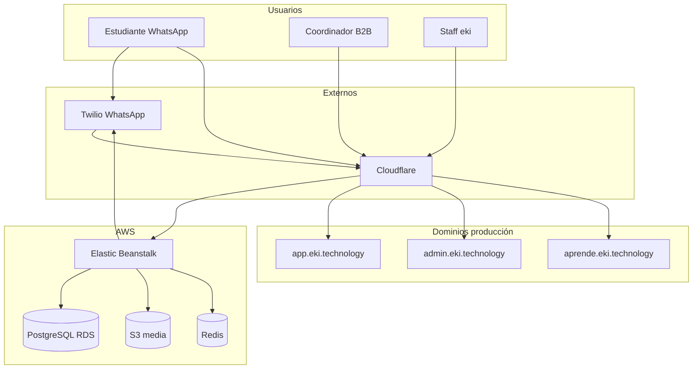

# Guía completa de la plataforma eki

Documento de referencia para el equipo de producto, operaciones, contenido y desarrollo. Explica **qué hace eki**, **cómo se conectan las piezas**, **cómo operar cada superficie** y **cómo configurar cursos** para WhatsApp y aula virtual.

**Última actualización:** junio 2026  
**Entorno producción:** AWS Elastic Beanstalk `eki-prod-final`  
**Repositorio:** monolito Django (`mvp_project/`)

**Documentos relacionados:**

| Documento | Para qué sirve |
|-----------|----------------|
| `docs/AUDITORIA_ARQUITECTURA_EKI.md` | Deuda técnica, archivos críticos, seguridad P0–P3 |
| `docs/CHECKLIST_PRE_DEPLOY.md` | Comandos y smoke tests antes de cada deploy |

---

## Tabla de contenidos

1. [Visión y propuesta de valor](#1-visión-y-propuesta-de-valor)
2. [Arquitectura general](#2-arquitectura-general)
3. [Superficies del producto](#3-superficies-del-producto)
4. [Modelo de datos del negocio](#4-modelo-de-datos-del-negocio)
5. [Contenido didáctico: curso, módulo, sección, paso](#5-contenido-didáctico-curso-módulo-sección-paso)
6. [Flujo WhatsApp del estudiante](#6-flujo-whatsapp-del-estudiante)
7. [Drip: liberación temporal de contenido](#7-drip-liberación-temporal-de-contenido)
8. [Campañas y comunicación masiva](#8-campañas-y-comunicación-masiva)
9. [Aula virtual (aprende)](#9-aula-virtual-aprende)
10. [Portal B2B (app)](#10-portal-b2b-app)
11. [Admin operaciones](#11-admin-operaciones)
12. [Gamificación](#12-gamificación)
13. [Certificados y verificación](#13-certificados-y-verificación)
14. [Empleabilidad y formularios externos](#14-empleabilidad-y-formularios-externos)
15. [Integraciones (Twilio, S3, IA)](#15-integraciones-twilio-s3-ia)
16. [Tareas en segundo plano (Celery)](#16-tareas-en-segundo-plano-celery)
17. [Infraestructura y despliegue](#17-infraestructura-y-despliegue)
18. [Guía operativa: publicar un curso de punta a punta](#18-guía-operativa-publicar-un-curso-de-punta-a-punta)
19. [Guía operativa: probar antes de producción](#19-guía-operativa-probar-antes-de-producción)
20. [Resolución de problemas frecuentes](#20-resolución-de-problemas-frecuentes)
21. [Glosario](#21-glosario)
22. [Historial de capacidades (junio 2026)](#22-historial-de-capacidades-junio-2026)

---

## 1. Visión y propuesta de valor

### 1.1 Qué es eki

eki es una **plataforma de formación profesional** diseñada para programas B2B en Colombia y Latinoamérica: cooperativas, cámaras de comercio, fondos de empleo, ONG y empresas que capacitan a poblaciones en territorio rural o urbano con **bajo ancho de banda** y **alto uso de WhatsApp**.

El diferenciador no es “otro LMS web”, sino un **motor conversacional** que:

- Entrega microlecciones por WhatsApp con multimedia optimizada.
- Controla el avance con la palabra **listo** (sin depender de apps móviles).
- Aplica **drip** (liberación programada) para cohortes y calendarios académicos.
- Ofrece **portal** a coordinadores y **aula virtual** como complemento de consulta.
- Emite **certificados** verificables y conecta con **empleabilidad** cuando el cliente lo contrata.

### 1.2 Usuarios del sistema

| Actor | Rol | Canal principal |
|-------|-----|-----------------|
| **Estudiante** | Persona en formación | WhatsApp + aula web |
| **Coordinador B2B** | Responsable del programa en la organización | Portal `app.eki.technology` |
| **Docente / facilitador** | Crea o revisa contenido | Admin eki + aula profesor |
| **Operaciones eki** | Staff interno | Admin `admin.eki.technology` |
| **Sistema** | Campañas, certificados, drip | Celery + webhooks |

### 1.3 Principio de diseño: un solo contenido, varios canales

Todo el material didáctico vive en **PostgreSQL** y **S3**. WhatsApp, el aula y las métricas del portal leen **los mismos modelos** (`Curso`, `Modulo`, `PasoModulo`, `ArchivoModulo`). No hay “copia paralela” del curso para web: si subes un video en admin, ese video puede llegar por WhatsApp y verse en el aula (si el módulo está liberado para ese estudiante).

```
Admin configura
    Curso
      └── Módulo
            ├── Sección (bloque por cada "listo" en WA)
            │     └── Paso / microcontenido (texto + media)
            ├── ArchivoModulo (PDF, video, imagen, audio)
            └── Campos legacy: contenido, video_url, archivo_pdf

                    ↓ misma fuente de verdad ↓

    WhatsApp          Aula virtual           Portal
 (entrega activa)   (consulta pasiva)    (métricas agregadas)
```

---

## 2. Arquitectura general

### 2.1 Stack tecnológico

| Capa | Tecnología |
|------|------------|
| Backend | Python 3.11, Django 4.x |
| Base de datos | PostgreSQL (RDS en prod; SQLite en local sin VPN) |
| Archivos | AWS S3 bucket `eki-produccion` |
| Cola async | Celery + Redis (en la misma instancia EB) |
| Hosting | AWS Elastic Beanstalk |
| CDN / TLS | Cloudflare |
| Mensajería | Twilio WhatsApp API (+ Meta Cloud API opcional) |
| IA | OpenAI / Google Gemini (tutor, PQRS, Nati comercial) |
| Admin UI | Django Admin + Jazzmin |

### 2.2 Aplicaciones Django

| App | Responsabilidad |
|-----|-----------------|
| **core** | Modelos centrales, webhooks WhatsApp, drip, campañas, certificados, RAG |
| **portal** | Portal B2B para clientes |
| **aprende** | Aula virtual estudiante/docente |
| **formulario** | GEI (encuestas de género e inclusión) |
| **integrations** | Fachada URL `/api/` hacia LXP |
| **learning** | Scaffold de migración futura (proxies) |
| **agents_edu / agents_commercial** | Agrupación admin de bots IA |

**Regla de dependencia:** `aprende` y `portal` importan de `core`, no al revés.

### 2.3 Diagrama de arquitectura



### 2.4 Enrutamiento HTTP principal

Archivo: `mvp_project/urls.py`

| Ruta | Destino |
|------|---------|
| `/health/` | Health check para EB |
| `/admin/` | Django Admin (Jazzmin) |
| `/portal/` | App portal B2B |
| `/aprende/` | Aula virtual |
| `/webhook/whatsapp/` | Webhook Twilio educativo |
| `/api/` | API LXP (integrations) |
| `/verificar-certificado/<codigo>/` | Verificación pública PDF |

**Redirección por subdominio** (`root_redirect`):

| Host | Redirige a |
|------|------------|
| `app.eki.technology` | `/portal/login/` |
| `admin.eki.technology` | `/admin/` |
| `aprende.eki.technology` o `aula.eki.technology` | `/aprende/` |

---

## 3. Superficies del producto

### 3.1 Admin operaciones (`admin.eki.technology`)

**Quién:** equipo eki con usuario Django `is_staff=True`.

**Para qué:**

- Crear organizaciones (`Cliente`) y sus cursos.
- Configurar módulos, microcontenidos, multimedia, drip.
- Gestionar estudiantes, grupos, campañas masivas.
- Enviar certificados, auditar conversaciones, ajustar gamificación.
- Hub del aula: `/admin/aula-web/`.

Es la **consola maestra**. Casi todo lo que el estudiante experimenta se configura aquí.

### 3.2 Portal B2B (`app.eki.technology`)

**Quién:** usuarios con `PortalUsuario` vinculado a un `Cliente` (no son staff Django).

**Roles típicos:** `admin`, `profesor`, `viewer`.

**Para qué:**

- Ver avance agregado de estudiantes.
- Exportar datos, revisar campañas, empleabilidad.
- Configurar branding (logo, subtítulo del programa).
- Algunos clientes gestionan PQRS o conversaciones.

El portal **no reemplaza** al admin eki: es la cara visible del cliente sobre sus propios datos.

### 3.3 Aula virtual (`aprende.eki.technology`)

**Quién:**

- **Estudiante:** cédula + teléfono WhatsApp (sin contraseña nueva).
- **Docente:** usuario del portal con rol profesor o admin de la organización.

**Para qué:**

- Consultar material ya liberado por drip/avance.
- Subir tareas y documentos propios.
- Ver perfil, puntos y biblioteca multimedia.
- El docente puede subir lecciones simplificadas (pruebas piloto).

La aula es **complementaria** a WhatsApp: no sustituye el flujo *listo*; es repaso y entrega formal.

### 3.4 WhatsApp (canal principal)

**Quién:** cualquier estudiante registrado con teléfono válido.

**Para qué:**

- Onboarding, lecciones, evaluaciones, certificados, PQRS, campañas.
- 100 % del journey pedagógico activo.

**Número de prueba interno:** `573026480629` (celular `3026480629`).

---

## 4. Modelo de datos del negocio

### 4.1 Cliente (organización B2B)

Modelo: `core.Cliente`

Representa la empresa u organización contratante. Campos relevantes:

- `nombre`, contacto, email, teléfono.
- `activo`, fechas de suscripción.
- `modo_gamificacion`: puntos, calificación 1–5 o desactivada.
- `drip_modulos_solo_estudiantes_listados`: si True, solo estudiantes en lista blanca ven módulos fuera de calendario general.
- `portal_productos`: qué módulos del portal están contratados (`cursos`, `gei`, `empleabilidad`, etc.).
- Branding: `logo_url`, `portal_subtitulo`.

Un estudiante (`Estudiante.cliente`) hereda configuración de drip y gamificación de su organización.

### 4.2 Estudiante

Modelo: `core.Estudiante`

Identidad única por **cédula** y **teléfono WhatsApp** (normalizado con prefijo `57`).

Campos demográficos: nombre, municipio, departamento, género, edad, ubicación detalle.

**Máquina de estados** (`estado_chat`):

| Estado | Significado |
|--------|-------------|
| `ESPERANDO_HABEAS_DATA` | Debe aceptar tratamiento de datos |
| `ESPERANDO_CEDULA` | Validación documento |
| `CONFIRMANDO_DATOS` | Revisa nombre/ubicación |
| `ESPERANDO_CORRECCION_DATOS` | Flujo de corrección activo |
| `ESPERANDO_SELECCION_CURSO` | Elige curso (solo no-B2B o casos especiales) |
| `ESPERANDO_RESPUESTA_MODULO` | Interactúa con lección actual |
| `ACTIVO` | Onboarding completo, curso en marcha |
| `curso_finalizado` | Terminó; interacción limitada |

**Perfil aula:** campo `foto_perfil` (imagen en S3), editable desde `/aprende/estudiante/perfil/`.

### 4.3 Curso

Modelo: `core.Curso`

- Pertenece a un `Cliente` (o `cliente=None` para curso “general” eki).
- `activo`, `orden`, `nombre`, `descripcion`, `emoji` (solo admin; no se muestra en aula académica).
- `visible_en_aula`: aparece en catálogo Platzi del aula.
- Configuración drip a nivel curso: días entre módulos, etc.
- Relación: `curso.modulos` ordenados por `numero`.

### 4.4 Progreso del estudiante

Modelo: `core.ProgresoEstudiante`

Un registro por par `(estudiante, curso)`:

- `modulo_actual`: en qué módulo está.
- `completado`: curso terminado.
- `paso_actual_modulo`: índice del siguiente microcontenido (si el módulo usa pasos).
- `fecha_ultimo_avance`: usada por drip de días entre módulos.
- `esperando_respuesta_evaluacion_paso`: bloqueado en evaluación de un paso.

Sin `ProgresoEstudiante`, el estudiante no está “inscrito” en el curso.

### 4.5 Campaña

Modelo: `core.Campana`

Mensaje masivo o de bienvenida hacia un segmento de estudiantes:

- `curso_destino`: curso que se asigna al responder (clave en B2B).
- `fecha_programada`, estado, plantilla Twilio.
- Logs en `EnvioLog`.

En flujo B2B moderno, la campaña **define el curso** sin menú 1-2-3.

### 4.6 Grupos de estudiantes

Modelo: `core.models_extras.GrupoEstudiantes`

Agrupa estudiantes para campañas, drip por lista, o reportes. Admin: `/admin/core/grupoestudiantes/` (atajo en índice admin).

---

## 5. Contenido didáctico: curso, módulo, sección, paso

Esta sección es **crítica** para entender qué ve el estudiante en WhatsApp y en el aula.

### 5.1 Módulo (`core.Modulo`)

Unidad didáctica numerada dentro del curso:

- `numero`: entero ≥ 0 (0 = bienvenida/intro).
- `titulo`, `descripcion`.
- `contenido`: texto largo del módulo completo (modo “clásico” sin microcontenidos).
- `video_url` / `video_archivo`: video principal del módulo.
- `archivo_pdf_url` o PDF subido: documento de apoyo.
- `habilitado_desde`: fecha drip del módulo.
- `facilitador_checkpoint`: si requiere intervención humana antes de avanzar.
- `modo_entrega`: cómo se entrega por WhatsApp (contenido único vs pasos).

**Regla práctica:** si configuras **secciones y pasos**, el campo `contenido` del módulo pasa a ser opcional (intro en aula). Si no hay pasos, WhatsApp envía `contenido` + archivos multimedia del módulo.

### 5.2 Sección (`core.SeccionModulo`)

Bloque organizativo dentro del módulo:

- `orden`: 1, 2, 3…
- `titulo`: referencia interna (en aula se muestra al estudiante).
- `activa`: permite despublicar sin borrar.

**En WhatsApp:** cada vez que el estudiante escribe **listo** y el módulo usa microcontenidos, se entrega **una sección completa** (todos sus pasos hasta la siguiente evaluación).

### 5.3 Paso / microcontenido (`core.PasoModulo`)

Granularidad mínima de entrega:

| Campo | Uso |
|-------|-----|
| `orden` | Secuencia dentro de la sección |
| `tipo` | `contenido`, `evaluacion_opciones`, `evaluacion_abierta`, `reto`, `entrega` |
| `contenido` | Texto que lee el estudiante |
| `media_url` | URL pública o S3 del adjunto |
| `eval_opcion_a/b/c/d` | Opciones de evaluación |
| `respuesta_correcta` | Letra A–D |
| `feedback_correcto/incorrecto` | Retroalimentación |
| `requiere_listo_para_avanzar` | Si necesita otro listo tras este paso |

**Subida de archivo en admin:** el formulario `media_file_upload` guarda en S3 y rellena `media_url` automáticamente (`core/admin/cursos.py`).

### 5.4 Archivo multimedia del módulo (`core.models_extras.ArchivoModulo`)

Adjuntos adicionales al nivel módulo (no dentro de un paso):

| Tipo | Uso típico |
|------|------------|
| `video` | Clip explicativo |
| `imagen` / `infografia` | Material visual |
| `pdf` | Guía descargable por WA; en aula solo visor |
| `audio` | Nota de voz / podcast corto |

Prioridad de URL para Twilio: `url_externa` validada o `archivo` en S3 con presigned URL (`get_url_para_envio()`).

### 5.5 Ejemplo pedagógico completo

**Curso:** “Buenas prácticas agrícolas” — 3 módulos.

**Módulo 1 — Introducción**

- Sección 1 “Contexto”
  - Paso 1 (contenido): texto de bienvenida + imagen en `media_url`.
  - Paso 2 (contenido): video YouTube en `media_url`.
- Sección 2 “Evaluación inicial”
  - Paso 3 (evaluación opciones): pregunta + opciones A–D.

El estudiante en WhatsApp:

1. Recibe sección 1 completa (pasos 1 y 2) tras primer **listo**.
2. Escribe **listo** otra vez → recibe paso 3 (evaluación).
3. Responde `A` → feedback y avance.

En el **aula** (si módulo 1 está liberado):

- Ve “Contexto” con textos y visores embebidos (sin descarga).
- Ve la evaluación como texto de referencia (la interacción evaluativa sigue siendo por WA).

---

## 6. Flujo WhatsApp del estudiante

### 6.1 Entrada técnica del mensaje

1. Twilio POST a `/webhook/whatsapp/`.
2. `core/views.py` → `_procesar_twilio_webhook`.
3. Se normaliza teléfono, se busca o crea `Estudiante`, se registra `WhatsappLog`.
4. Según `estado_chat`, se procesa o se deriva a detección de intent.

Archivos: `core/views.py`, `core/intent_detector.py`, `core/response_templates.py`.

### 6.2 Onboarding detallado

```
Mensaje entrante (hola)
    → ESPERANDO_HABEAS_DATA: política de datos + botón/aceptar
    → ESPERANDO_CEDULA: pide documento
    → CONFIRMANDO_DATOS: muestra resumen nombre/ubicación
    → ACTIVO: asignación de curso (campaña B2B o selección)
```

**Corrección de datos:** palabra clave `corregir datos` en cualquier momento → `core/correccion_datos.py`.

### 6.3 Palabra clave listo

`listo` es el **gatillo pedagógico** principal:

- Avanza microcontenidos dentro del módulo.
- Completa módulo y pasa al siguiente (si drip lo permite).
- En B2B reemplaza al menú numérico 1-2-3.

Implementación: intent `continuar_leccion` en `response_templates.py` + `module_steps.py`.

### 6.4 Módulo CON microcontenidos

`core/module_steps.py`:

1. Lee `progreso.paso_actual_modulo` (índice 1-based).
2. Agrupa pasos de la **siguiente sección** (`entregar_bloque_secciones_desde_paso`).
3. Construye mensajes con `[MULTI_MSG]` y `[MEDIA:url]` para Twilio.
4. Si el último paso es evaluación, cambia estado a espera de respuesta.

### 6.5 Módulo SIN microcontenidos

Se envía:

- Texto `modulo.contenido`.
- Primer archivo multimedia de `ArchivoModulo` + extras en mensajes siguientes.
- Video del módulo si está configurado.

### 6.6 Evaluaciones y gamificación

- **Opciones A–D:** se comparan con `respuesta_correcta`; feedback inmediato.
- **Pregunta abierta / reto:** puede disparar revisión o puntos manuales.
- Puntos o notas según `Cliente.modo_gamificacion` (`core/gamificacion_modo.py`).

### 6.7 Flujo B2B (sin menú 1-2-3)

`core/flujo_whatsapp_b2b.py`:

- Detecta `estudiante.cliente` activo.
- Si hay campaña con `curso_destino`, inscribe y avanza linealmente.
- Intercepta intents de menú legacy y redirige a mensajes de *listo*.
- Integrado en saludo global y `selector_curso.py`.

**Antes:** estudiante elegía curso con `1`, `2`, `3`.  
**Ahora (B2B):** el curso lo define la campaña; el estudiante solo avanza.

### 6.8 Otros intents frecuentes

| Palabra / intent | Acción |
|------------------|--------|
| `progreso` | Resumen de avance |
| `certificado` | Estado / envío certificado |
| `ayuda` | Menú de soporte |
| `pqrs` | Agente PQRS |
| Dígitos 1-3 | Solo sandbox / no-B2B legacy |

---

## 7. Drip: liberación temporal de contenido

### 7.1 Qué problema resuelve

En programas con cohortes, el coordinador no quiere que un estudiante consuma todo el curso en un día. El **drip** limita qué módulos están “abiertos” según:

- Calendario (fechas).
- Días de espera tras completar el módulo anterior.
- Listas explícitas de estudiantes habilitados.

### 7.2 Mecanismos

| Mecanismo | Modelo / campo | Comportamiento |
|-----------|----------------|----------------|
| Días entre módulos | `ConfiguracionDripCliente`, curso | Tras completar Mₙ, esperar N días para Mₙ₊₁ |
| Fecha por módulo | `Modulo.habilitado_desde` | No visible hasta esa fecha/hora |
| Override por cliente | `HabilitacionModuloDripCliente` | Fecha distinta por organización |
| Lista por estudiante | `HabilitacionModuloEstudiante` | Solo ciertos estudiantes ven el módulo |
| Flag global lista | `Cliente.drip_modulos_solo_estudiantes_listados` | Restringe a listados |

Código central: `core/drip_schedule.py`.

Funciones clave:

- `modulo_disponible_por_calendario(estudiante, modulo)` → True/False.
- `drip_bloquea_siguiente_modulo(progreso, modulo_completado)` → True si aún no puede abrir el siguiente.
- `max_modulo_alcanzado(progreso)` → mayor número de módulo alcanzado.

### 7.3 Mensaje al estudiante cuando drip bloquea

Si escribe `listo` demasiado pronto, recibe texto del estilo “tu siguiente módulo se desbloquea el [fecha]” (ver `mensaje_bloqueo_avance_siguiente_modulo`).

### 7.4 Drip en el aula virtual

`aprende/acceso_modulos.py` replica la lógica:

1. `modulo_disponible_por_calendario` — calendario y lista blanca.
2. `modulo.numero > max_modulo_alcanzado` — no mostrar futuros (sin lista explícita).
3. `_oculto_por_drip_entre_modulos` — si completó el anterior y drip bloquea, ocultar el siguiente.

**Consecuencia:** el estudiante en aula ve **exactamente** el mismo subconjunto de módulos que podría recibir por WhatsApp.

### 7.5 UI admin de drip

- Vista custom: drip por estudiante (`core/views_drip_estudiantes.py`).
- Inlines en módulo y cliente en Django admin.

### 7.6 Reenganche automático

Celery `reenganche_drip_content_diario` envía recordatorios a estudiantes con módulos recién liberados.

---

## 8. Campañas y comunicación masiva

### 8.1 Tipos

- **Campaña estándar** (`Campana`): mensaje + opcional `curso_destino`.
- **Campaña única** (`CampanaUnica`): flujos especiales one-shot.
- **Campaña B2B** (`CampanaB2B`): variantes corporativas.

### 8.2 Ciclo de vida

1. Operador crea campaña en admin, define segmento (grupo, filtros).
2. Programa `fecha_programada` o envía manual.
3. Celery `enviar_campanas_programadas` (cada 5 min) procesa pendientes.
4. `core/services.py` ejecuta envío vía Twilio; guarda `EnvioLog`.

### 8.3 Portal

Coordinadores ven campañas y métricas de envío en `portal/views.py` (si producto contratado).

### 8.4 Relación campaña → curso → aula

Cuando una campaña asigna `curso_destino`:

1. Se crea `ProgresoEstudiante`.
2. El estudiante empieza módulo 1 por WhatsApp.
3. Si el curso tiene `visible_en_aula=True`, también puede entrar a `/aprende/` y ver el mismo curso (módulos según drip).

---

## 9. Aula virtual (aprende)

### 9.1 URLs completas

| Ruta | Descripción |
|------|-------------|
| `/aprende/` | Landing: estudiante vs docente |
| `/aprende/estudiante/login/` | Login cédula + teléfono |
| `/aprende/estudiante/` | Mis cursos + catálogo |
| `/aprende/estudiante/inscribir/<id>/` | POST inscripción catálogo |
| `/aprende/estudiante/curso/<id>/` | Lista módulos y tareas |
| `/aprende/estudiante/modulo/<id>/` | Contenido didáctico |
| `/aprende/estudiante/tarea/<id>/` | Entrega de tarea |
| `/aprende/estudiante/biblioteca/` | Multimedia liberada |
| `/aprende/estudiante/perfil/` | Datos, foto, puntos, documentos |
| `/aprende/profesor/login/` | Login portal |
| `/aprende/profesor/` | Cursos de la organización |
| `/aprende/profesor/curso/<id>/` | Gestión módulos y tareas |
| `/aprende/profesor/modulo/<id>/` | Editar lección |
| `/admin/aula-web/` | Hub operaciones eki |

### 9.2 Autenticación estudiante

1. POST cédula (limpia) + teléfono.
2. `normalizar_telefono` + `variantes_telefono` comparan con `Estudiante.telefono`.
3. Sesión: `request.session['aprende_estudiante_id']`.
4. Middleware `aprende/middleware.py` expone `request.aprende_estudiante`.

**No hay contraseña:** la posesión del WhatsApp es el segundo factor.

### 9.3 Diseño visual (junio 2026)

- Tipografía: **Source Serif 4** (títulos) + **Source Sans 3** (UI).
- Color institucional: morado `#7D2181`, barra `#5a1860`.
- Estilo académico sobrio, sin emojis en listados.
- Plantilla base: `aprende/templates/aprende/base.html`.

### 9.4 Vista de módulo — qué se renderiza

Orden en pantalla (`estudiante_modulo.html`):

1. Aviso: material de consulta en línea, sin descarga.
2. Video principal del módulo (visor embebido).
3. Texto introductorio (`modulo.contenido`) — como “Introducción” si hay microcontenidos.
4. **Por cada sección:** título + pasos con texto y multimedia.
5. PDF del módulo (iframe, toolbar oculto).
6. Archivos `ArchivoModulo` (visores).
7. Formulario de entregas del estudiante (documentos propios).

Servicios:

- `aprende/contenido_modulo_service.py` — estructura secciones/pasos.
- `aprende/media_aula.py` — clasifica URL (YouTube, mp4, pdf…).
- `aprende/partials/media_viewer.html` — HTML sin `<a download>`.

### 9.5 Biblioteca

`aprende/biblioteca_service.py` agrega todo multimedia de módulos **visibles** según drip, agrupado por curso. Misma política de solo visualización.

### 9.6 Tareas estilo Moodle

Modelos: `aprende.TareaCurso`, `aprende.EntregaTarea`.

- Docente crea tarea vinculada a curso (opcionalmente a módulo).
- Estudiante sube archivo (máx. 25 MB).
- Docente califica 1–5 con comentario.

Las tareas respetan drip: si la tarea apunta a un módulo no liberado, no aparece (`tareas_visibles_aula`).

### 9.7 Perfil del estudiante

`aprende/perfil_service.py`:

- Edición: nombre, municipio, departamento, género, edad, foto.
- **No editable en aula:** cédula, teléfono (corregir por WhatsApp).
- Gamificación: puntos/nivel/racha o promedio según modo del cliente.
- Subida de documentos generales (`DocumentoEstudianteAula`).

### 9.8 Catálogo Platzi

`aprende/catalogo_service.py`:

- Cursos con `visible_en_aula=True` del mismo cliente o generales.
- Estudiante se inscribe → crea `ProgresoEstudiante`.
- No inscribe cursos de otra organización.

### 9.9 Docente en aula

Usa `PortalUsuario` de su organización:

- Solo ve cursos donde `curso.cliente == organización del usuario`.
- Puede crear módulos vía `lesson_service.py` (título, contenido, archivos).
- Para microcontenidos avanzados se recomienda **admin eki**.

### 9.10 Política de descarga de material

| Tipo | ¿Descargable en aula? |
|------|------------------------|
| Video/PDF/imagen del curso | **No** — solo visor embebido |
| Documento subido por el estudiante | Sí — es su entrega |
| Entrega de tarea | Sí — flujo académico formal |

**Limitación:** URLs S3 directas pueden copiarse manualmente; protección fuerte requiere proxy con URLs firmadas (roadmap).

---

## 10. Portal B2B (app)

### 10.1 Autenticación y sesión

- Usuario Django + modelo `PortalUsuario`.
- Sesión: `portal_usuario_id`.
- `SuscripcionMiddleware` bloquea acceso si `Cliente` tiene suscripción vencida.

### 10.2 Productos por cliente

`portal/capabilities.py` lee `Cliente.portal_productos`:

| Producto | Funcionalidad |
|----------|---------------|
| `cursos` | Métricas de avance, listados |
| `gei` | Encuestas género e inclusión |
| `nat` | Asistente comercial documentos |
| `empleabilidad` | Códigos geo, métricas de inserción |

### 10.3 Pantallas principales

- **Dashboard:** KPIs de estudiantes activos, avance, gamificación.
- **Estudiantes:** búsqueda, timeline, export Excel.
- **Cursos:** progreso por módulo, vista flujo (`curso_flujo_service.py`).
- **Campañas:** historial y detalle.
- **Conversaciones:** inbox WhatsApp simplificado.
- **Empleabilidad:** mapas y métricas (`portal/empleabilidad_metricas.py`).
- **Certificados:** estado de envíos.
- **Perfil organización:** branding (`portal/branding.py`).

### 10.4 Branding

El coordinador sube logo y subtítulo; el portal muestra identidad del cliente. Validación: `portal/branding.py` → `branding_portal_completo()`.

---

## 11. Admin operaciones

### 11.1 Package `core/admin/`

Tras refactor junio 2026, el monolito `core/admin.py` se dividió en:

| Archivo | Gestiona |
|---------|----------|
| `clientes.py` | Organizaciones, suscripción, drip global |
| `cursos.py` | Cursos, módulos, secciones, pasos, archivos |
| `estudiantes.py` | Estudiantes, acciones masivas, envíos |
| `campanas.py` | Campañas y logs |
| `certificados.py` | Plantillas PDF, envío masivo |
| `grupos.py` | Grupos, ArchivoModulo global |
| `gamificacion.py` | Perfiles, badges, ajustes |
| `commercial.py` | Bot Nati, RAG comercial |
| `sistema.py` | Configuración técnica |

### 11.2 Vistas admin custom (`core/urls/admin_urls.py`)

| URL | Función |
|-----|---------|
| `/admin/dashboard/` | Panel operativo |
| `/admin/drip-estudiantes/` | Drip por persona |
| `/admin/aula-web/` | Publicación aula |
| `/admin/envio-certificados/` | Cola certificados |
| `/admin/conversaciones/` | Inbox staff |

### 11.3 Jazzmin

Tema visual del admin en `mvp_project/settings.py` → `JAZZMIN_SETTINGS`, `custom_links` para atajos (grupos, aula).

### 11.4 Flujo recomendado para equipo de contenido

1. Crear/editar **Cliente** y verificar productos portal.
2. Crear **Curso** activo; marcar `visible_en_aula` si aplica.
3. Por cada **Módulo**: secciones → pasos → multimedia.
4. Probar con estudiante de prueba en WhatsApp.
5. Verificar en `aprende.eki.technology` con mismo estudiante.
6. Ajustar drip antes de abrir cohorte real.

---

## 12. Gamificación

### 12.1 Modos (`Cliente.modo_gamificacion`)

| Modo | Métrica principal | Uso |
|------|-------------------|-----|
| `puntos` | `PerfilGamificacion.puntos_totales` | Ranking por puntos |
| `calificacion` | Promedio ponderado 1–5 | Ranking por nota |
| `desactivado` | — | Sin UI de juego |

### 12.2 Eventos que suman puntos/nota

- Respuesta correcta en evaluación de paso.
- Completar módulo (según pesos `peso_gamificacion_reto`, etc.).
- Retos y preguntas abiertas calificadas.

Modelos: `core/gamificacion.py` (`PerfilGamificacion`, `Badge`, `EvaluacionNotaGamificacion`).

### 12.3 Dónde ve el estudiante su estado

- WhatsApp: mensajes de refuerzo ocasionales.
- **Aula → Mi perfil:** puntos, nivel, racha o promedio.

### 12.4 Ajuste manual

Admin gamificación permite corregir puntos y resetear rachas (soporte a coordinadores).

---

## 13. Certificados y verificación

### 13.1 Generación

- `core/certificado_service.py` — cursos virtuales WhatsApp.
- `core/certificado_presencial_service.py` — eventos presenciales.
- Plantillas en `PlantillaCertificado` con modo diseño configurable.

### 13.2 Envío

- Admin `/admin/envio-certificados/`.
- Twilio envía PDF o enlace según plantilla.
- Auditoría: `auditar_certificados_twilio` management command.

### 13.3 Verificación pública

URL: `/verificar-certificado/<codigo>/` — cualquier persona valida autenticidad.

### 13.4 Criterios de elegibilidad

Típicamente: curso completado + nota mínima si gamificación activa + módulos requeridos completados (`nota_minima_certificado` en cliente/curso).

---

## 14. Empleabilidad y formularios externos

### 14.1 Códigos de empleabilidad

Estudiante puede enviar código geo por WhatsApp (`esperando_codigo_empleabilidad`). Vincula ubicación laboral para métricas del portal.

### 14.2 Enlaces externos

`EnlaceFormularioExterno` — URLs a Google Forms u otras con validación de respuesta (`core/form_externo_service.py`).

### 14.3 Portal empleabilidad

`portal/templates/portal/empleabilidad.html` + `portal/empleabilidad_metricas.py`.

Documentación de campo: `docs/EMPLEABILIDAD_GEO_WHATSAPP_PORTAL.md` (si existe en repo).

---

## 15. Integraciones (Twilio, S3, IA)

### 15.1 Twilio WhatsApp

- Envío: `core/whatsapp_service.py`.
- Plantillas Content API para mensajes HSM aprobados.
- Media: URLs públicas o presigned S3 (evita error 63019).
- Variables de entorno: `TWILIO_ACCOUNT_SID`, `TWILIO_AUTH_TOKEN`, `TWILIO_WHATSAPP_FROM`.

### 15.2 AWS S3

- Bucket: `eki-produccion`, región `us-east-2`.
- `DEFAULT_FILE_STORAGE = storages.backends.s3boto3.S3Boto3Storage` en producción.
- Rutas típicas: `modulos/`, `videos/lecciones/`, `aprende/entregas/`, `estudiantes/avatars/`.

### 15.3 IA generativa

- Tutor IA en flujo de módulo (`core/nati.py`, contexto RAG).
- PQRS: `core/pqrs_agent.py`.
- Base conocimientos: señales en `signals_conocimientos` actualizan índice al guardar cursos.

### 15.4 API LXP

`core/api.py` — endpoints JSON para frontend Angular legacy; autenticación por token/teléfono. Ver auditoría para deuda de auth.

---

## 16. Tareas en segundo plano (Celery)

### 16.1 Procesos en EB

`Procfile`:

```
web: gunicorn ...
worker: celery -A mvp_project worker
beat: celery -A mvp_project beat
```

### 16.2 Tareas programadas

| Tarea | Frecuencia | Función |
|-------|------------|---------|
| `enviar_campanas_programadas` | 5 min | Campañas con fecha |
| `reenganche_drip_content_diario` | Diario | Recordatorios drip |
| `procesar_twilio_webhook_async` | Bajo demanda | Webhook no bloqueante |

### 16.3 Cuándo importa

Si el estudiante “no recibió campaña a la hora exacta”, revisar worker + beat en EB (no solo Gunicorn web).

---

## 17. Infraestructura y despliegue

### 17.1 Entornos

| Entorno | BD | Media |
|---------|-----|-------|
| Producción EB | RDS PostgreSQL | S3 |
| Local con VPN | RDS | S3 |
| Local sin VPN | SQLite desactualizado | S3 o local |

### 17.2 Deploy estándar

```powershell
cd ruta\eki_mvp
.\scripts\eb_precheck_main.ps1
.\scripts\eb_deploy_main.ps1
```

El script etiqueta versión `main-YYYYMMDD-HHMMSS`, sube zip a S3 EB, ejecuta hook de migraciones.

### 17.3 Migraciones recientes relevantes

| Migración | Cambio |
|-----------|--------|
| `core/0113_curso_visible_en_aula` | Flag catálogo aula |
| `core/0114_estudiante_foto_perfil` | Avatar estudiante |
| `aprende/0001` | Tareas aula |
| `aprende/0002` | DocumentoEstudianteAula |

### 17.4 Smoke tests post-deploy

```text
GET https://admin.eki.technology/health/        → 200
GET https://aprende.eki.technology/aprende/     → 200
GET https://app.eki.technology/portal/login/    → 200
```

### 17.5 Rollback

```powershell
eb deploy eki-prod-final --version <label-anterior>
```

Obtener label: `eb status eki-prod-final` o consola AWS EB.

### 17.6 Logs

```powershell
eb logs eki-prod-final
```

Buscar errores 500, fallos migración, Twilio 4xx/5xx.

---

## 18. Guía operativa: publicar un curso de punta a punta

### Paso 1 — Organización

1. Admin → Clientes → crear o editar `Cliente`.
2. Activar productos portal necesarios.
3. Configurar `modo_gamificacion` y drip global si aplica.

### Paso 2 — Curso

1. Admin → Cursos → Añadir.
2. Nombre, descripción, cliente, orden.
3. Marcar **Activo** y **Visible en aula** (si quieres catálogo web).
4. Guardar.

### Paso 3 — Módulos

Por cada módulo:

1. Número, título, descripción corta.
2. Si usas modo clásico: llenar `contenido` + video/PDF.
3. Si usas microcontenidos: dejar `contenido` como intro opcional.

### Paso 4 — Secciones y pasos

1. Inline **Secciones**: orden 1, 2, 3…
2. Inline **Microcontenidos**: asignar cada paso a una sección.
3. Completar texto y subir media (archivo o URL).
4. Para evaluaciones: opciones A–D + letra correcta + feedback.

### Paso 5 — Archivos multimedia extra

Inline **Archivos multimedia** en el módulo para PDFs/videos adicionales.

### Paso 6 — Drip

1. `habilitado_desde` en módulos 2, 3… según calendario académico.
2. O `ConfiguracionDripCliente` con días entre módulos.
3. Lista blanca si cohorte reducida.

### Paso 7 — Campaña de lanzamiento

1. Crear campaña con `curso_destino` = tu curso.
2. Segmento = grupo piloto.
3. Programar o enviar.

### Paso 8 — Validación

1. WhatsApp con teléfono de prueba: recibir módulo 1, responder listo, evaluar.
2. Aula: login mismo estudiante → ver módulo 1 con secciones y visores.
3. Portal: verificar que aparece progreso del piloto.

### Paso 9 — Producción

1. Ampliar grupo o abrir catálogo aula.
2. Monitorear `EnvioLog` y conversaciones primeras 48 h.

---

## 19. Guía operativa: probar antes de producción

### 19.1 Tests automáticos

```bash
python manage.py check
python manage.py test aprende.tests core.tests_flujo_whatsapp_b2b core.tests_admin_package -v 1
```

### 19.2 Estudiante de prueba

| Campo | Valor ejemplo |
|-------|---------------|
| Cédula | la del piloto real |
| Teléfono | `573026480629` |
| Cliente | organización de prueba |

### 19.3 Checklist manual aula

- [ ] Login estudiante OK
- [ ] Solo módulos liberados visibles
- [ ] Secciones y pasos se ven con multimedia embebida
- [ ] No hay botones “Descargar” en material del curso
- [ ] Biblioteca lista archivos de módulos abiertos
- [ ] Perfil muestra puntos (si gamificación activa)
- [ ] Subida documento y tarea funciona

### 19.4 Checklist manual WhatsApp

- [ ] Onboarding completo
- [ ] listo entrega sección esperada
- [ ] Evaluación registra respuesta
- [ ] Drip bloquea con mensaje de fecha
- [ ] B2B no muestra menú 1-2-3

---

## 20. Resolución de problemas frecuentes

### “El estudiante no ve el módulo en el aula”

1. ¿Tiene `ProgresoEstudiante` en ese curso?
2. ¿`modulo_disponible_por_calendario` — fecha futura?
3. ¿`max_modulo_alcanzado` — aún no alcanzó ese número?
4. ¿Drip entre módulos — completó anterior y espera días?
5. ¿Lista blanca — estudiante no está en `HabilitacionModuloEstudiante`?

### “WhatsApp no envía video/PDF”

1. URL pública accesible (Content-Type correcto).
2. Si es S3, verificar presigned URL en logs.
3. Twilio error 63019 = media download failed → revisar `ArchivoModulo.get_url_para_envio()`.

### “Login aula falla”

1. Cédula exacta (sin puntos).
2. Teléfono con o sin 57 — el sistema acepta variantes.
3. Estudiante `activo=True`.

### “500 en local”

1. SQLite desactualizado vs migraciones — correr `migrate` o conectar RDS.
2. Columnas nuevas (`modo_gamificacion`, `foto_perfil`) requieren migraciones 0103+.

### “Campaña no salió”

1. Celery beat corriendo en EB.
2. `fecha_programada` en pasado y estado pendiente.
3. Revisar `EnvioLog` por errores Twilio.

### “El coordinador no ve empleabilidad en portal”

1. Producto `empleabilidad` en `portal_productos`.
2. Usuario `PortalUsuario` activo y rol adecuado.

---

## 21. Glosario

| Término | Definición |
|---------|------------|
| **B2B** | Cliente organización; estudiantes con `cliente` asignado |
| **Drip** | Liberación progresiva de módulos en el tiempo |
| **Microcontenido / Paso** | Unidad mínima dentro de una sección (`PasoModulo`) |
| **Sección** | Bloque de pasos liberado con un *listo* |
| **listo** | Palabra clave de avance del estudiante |
| **curso_destino** | Curso asignado por una campaña |
| **Progreso** | Registro `ProgresoEstudiante` de avance en un curso |
| **ArchivoModulo** | Adjunto multimedia a nivel módulo |
| **Portal** | `app.eki.technology` para coordinadores |
| **Aula** | `aprende.eki.technology` para estudiantes/docentes |
| **GEI** | Módulo de encuestas de género e inclusión |
| **Nati** | Bot comercial (sandbox Twilio separado) |

---

## 22. Historial de capacidades (junio 2026)

| Capacidad | Descripción | Estado prod |
|-----------|-------------|-------------|
| Aula diseño académico | Tipografía serif, morado institucional | Desplegado |
| Drip en listado aula | Mismas reglas que WhatsApp | Desplegado |
| Perfil estudiante | Foto, datos, puntos | Desplegado |
| Documentos estudiante | Subida en módulo y perfil | Desplegado |
| Biblioteca multimedia | Por curso, solo visualización | Desplegado |
| Secciones en vista módulo | Microcontenidos admin → aula | Desplegado |
| Visores sin descarga | video/img/pdf/audio embed | Desplegado |
| WhatsApp B2B sin menú 1-2-3 | Campaña + listo | Desplegado |
| Admin package split | `core/admin/` modular | Desplegado |
| Tareas y calificación 1-5 | Flujo docente-estudiante | Desplegado |
| Catálogo Platzi | Inscripción self-service | Desplegado |
| Hub `/admin/aula-web/` | Operaciones aula | Desplegado |

---

## Apéndice A — Mapa de archivos por funcionalidad

| Funcionalidad | Archivos principales |
|---------------|---------------------|
| Webhook WA | `core/views.py`, `core/whatsapp_service.py` |
| Intents / respuestas | `core/intent_detector.py`, `core/response_templates.py` |
| Microcontenidos | `core/module_steps.py`, `core/admin/cursos.py` |
| Drip | `core/drip_schedule.py`, `aprende/acceso_modulos.py` |
| B2B flujo | `core/flujo_whatsapp_b2b.py`, `core/selector_curso.py` |
| Aula vistas | `aprende/views.py`, `aprende/urls.py` |
| Aula contenido | `aprende/contenido_modulo_service.py`, `media_viewer.html` |
| Portal | `portal/views.py`, `portal/capabilities.py` |
| Certificados | `core/certificado_service.py` |
| Deploy | `scripts/eb_deploy_main.ps1`, `Procfile` |

---

## Apéndice B — Contacto y escalamiento

| Nivel | Acción |
|-------|--------|
| L1 contenido | Revisar admin + esta guía sección 18 |
| L2 operaciones | Logs EB, Twilio, `EnvioLog`, drip admin |
| L3 desarrollo | `AUDITORIA_ARQUITECTURA_EKI.md`, tests, PR |

---

*Documento mantenido por el equipo eki. Versión extendida junio 2026. Para cambios técnicos de bajo nivel, seguridad y deuda, consultar `docs/AUDITORIA_ARQUITECTURA_EKI.md`.*
