# Mapa del proyecto eki — guía para dueño/desarrollador

**Clasificación:** referencia interna · arquitectura + operación  
**Fecha:** 18 agosto 2026  
**Audiencia:** fundador, PM técnico, desarrollador que perdió el hilo del monolito  
**Complementa:** `GUIA_PLATAFORMA_EKI.md`, `AUDITORIA_ARQUITECTURA_EKI.md`, `EKIA_INVESTIGACION_AGENTES.md`

> **Tesis en una frase:** eki es un **monolito Django** con **seis caras** (WhatsApp, Admin, Portal, Aprende, Studio, Certificados) sobre **los mismos modelos** en PostgreSQL. El canal principal del negocio es **WhatsApp educativo** (*listo* → módulos → drip). Nat/EkiA es **otra rama**, no el curso.

---

## Tabla de contenidos

1. [Las seis caras del producto](#1-las-seis-caras-del-producto)
2. [Stack e infraestructura](#2-stack-e-infraestructura)
3. [Árbol de datos](#3-árbol-de-datos)
4. [Bounded contexts (ramas del código)](#4-bounded-contexts-ramas-del-código)
5. [Call chain: WhatsApp educativo](#5-call-chain-whatsapp-educativo)
6. [Call chain: Nat / EkiA comercial](#6-call-chain-nat--ekia-comercial)
7. [Call chain: Portal B2B](#7-call-chain-portal-b2b)
8. [Call chain: Aprende (aula web)](#8-call-chain-aprende-aula-web)
9. [Module Builder](#9-module-builder)
10. [Mapa de agentes IA](#10-mapa-de-agentes-ia)
11. [Celery y tareas programadas](#11-celery-y-tareas-programadas)
12. [Deploy y entornos](#12-deploy-y-entornos)
13. [Cuando algo falla — dónde mirar](#13-cuando-algo-falla--dónde-mirar)
14. [Ejemplo real: curso Apiarios (id 35)](#14-ejemplo-real-curso-apiarios-id-35)
15. [Estado actual y deuda](#15-estado-actual-y-deuda)
16. [Documentos canon relacionados](#16-documentos-canon-relacionados)

---

## 1. Las seis caras del producto

Cada superficie es un **subdominio** → mismo servidor EB → rutas y permisos distintos.

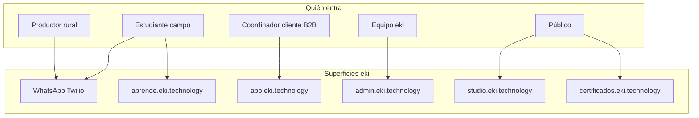

| Superficie | URL prod | App Django | Usuario | Para qué |
|------------|----------|------------|---------|----------|
| **WhatsApp** | webhooks en raíz | `core` | Estudiante / productor | Curso por chat, campañas, Nat, GEI |
| **Admin** | `admin.eki.technology` | `core/admin/` + Unfold | Staff eki | Cursos, módulos, campañas, auditoría |
| **Portal B2B** | `app.eki.technology` | `portal` | Coordinador cliente | Métricas, estudiantes, Nat, GEI, retención |
| **Aprende** | `aprende.eki.technology` | `aprende` | Estudiante / profesor | Aula web, tareas, ranking |
| **Studio** | `studio.eki.technology` | `studio` | Público / creador | Catálogo, carrito, Wompi |
| **Certificados** | `certificados.eki.technology` | `core` | Público | Verificar / descargar cert |

**Enrutamiento raíz:** `mvp_project/urls.py`  
**Redirect por host:** `core/host_isolation.py` + middleware `HostIsolationMiddleware`

---

## 2. Stack e infraestructura

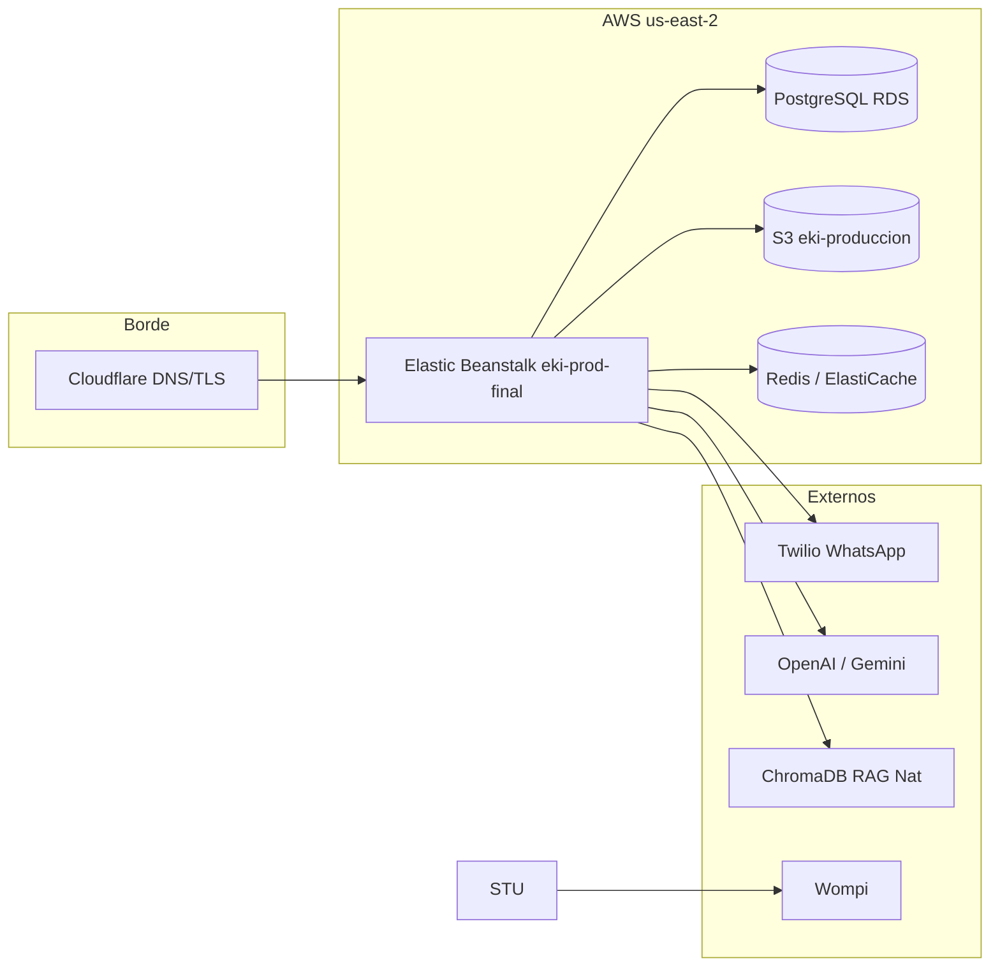

### Procesos en prod (`Procfile`)

| Proceso | Comando | Rol |
|---------|---------|-----|
| `web` | Gunicorn | Django HTTP |
| `worker` | Celery `-Q celery` | Campañas, webhooks, certs, drip |
| `worker_rag` | Celery `-Q rag_index` | Indexación PDFs Nat (pesado) |
| `beat` | Celery beat | Cron: drip 8am, campañas 5min, infra hourly |

### Integraciones clave

| Servicio | Variables / config | Uso |
|----------|-------------------|-----|
| Twilio | `TWILIO_*` | WhatsApp edu + Nat |
| S3 | `AWS_*`, bucket `eki-produccion` | Media pública para WA |
| OpenAI | `OPENAI_API_KEY` | Tutores, Nat, generación curso |
| Redis | `REDIS_URL` / `CELERY_BROKER_URL` | Colas Celery |
| Chroma | `CHROMA_DB_DIR` | Vectores RAG Nat |
| Wompi | `WOMPI_*` | Pagos Studio |

---

## 3. Árbol de datos

Casi todo vive en **`core/models.py`** (~3000+ líneas).

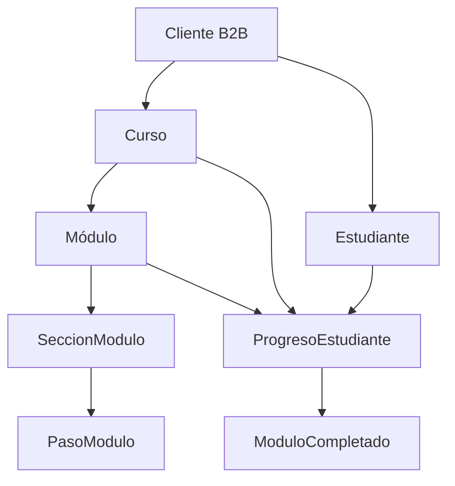

### Jerarquía de contenido WhatsApp

```
Cliente (tenant B2B)
 └── Curso
      ├── dias_espera_entre_modulos (drip)
      ├── usar_agentes_ia (Darío/Claudia)
      ├── modo_aula (whatsapp | clases)
      └── Módulo 1, 2, 3...
           ├── modo_entrega (auto | legacy | pasos)
           ├── Sección A (bloque — título no se envía por WA)
           │    ├── Paso 1 (texto y/o media)
           │    ├── Paso 2 (video/imagen)
           │    └── Paso 3 (evaluación A/B/C/D opcional)
           └── Sección B
                └── ...
```

### Contrato Module Builder (WhatsApp)

- **Un `*listo*` avanza un bloque de sección** (todos los pasos activos de esa sección, en batch).
- **Las secciones no pueden intercalarse** (sec A → sec B → sec A = roto).
- **`PasoModulo.media_wa_apto`**: si el video falla en Twilio (63021), revisar compresión/checklist.

### Modelos que más vas a tocar

| Modelo | Campos clave |
|--------|--------------|
| `Estudiante` | `telefono`, `cedula`, `estado_chat`, `estado_onboarding`, `contexto_temporal` |
| `ProgresoEstudiante` | `modulo_actual`, `paso_actual_modulo`, `completado`, flags eval |
| `Modulo` | `numero`, `modo_entrega`, `facilitador_checkpoint`, `habilitado_desde` |
| `PasoModulo` | `orden`, `seccion_id`, `contenido`, `media_url`, `media_wa_apto`, `es_evaluacion` |
| `WhatsappLog` | auditoría mensajes, `agente_usado`, `MessageSid` |

---

## 4. Bounded contexts (ramas del código)

Decisión CTO (mayo 2026): **no microservicios**; separación lógica en apps Django. **Migración a medias** — mucho sigue en `core/`.

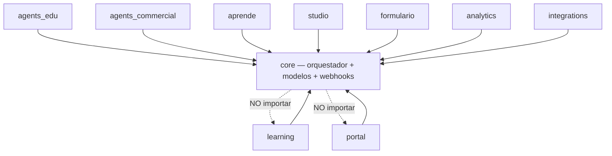

| App | Estado | Qué hay hoy |
|-----|--------|-------------|
| `core` | **Centro real** | models, views.py (~6k líneas), webhooks, drip, tasks, RAG, Nat |
| `learning` | Scaffold | Facade; lógica en `core/module_steps.py`, `core/drip_schedule.py` |
| `agents_edu` | Admin proxy | Runtime en `core/tutor_ia_modulo.py`, `core/agentes_ia.py` |
| `agents_commercial` | Admin proxy | Runtime en `core/nati.py`, `core/bot_comercial/` |
| `portal` | Maduro | Métricas, GEI, Nat ops, Centro de Éxito |
| `aprende` | Maduro | Aula web sobre modelos core |
| `studio` | Maduro | Catálogo + Wompi |
| `formulario` | Maduro | GEI por WhatsApp |
| `analytics` | Parcial | Exports + proxies |
| `integrations` | Fachada | API LXP/Angular → `core/api.py` |

**Registry:** `core/domains/registry.py`  
**Reglas import:** `docs/DOMAIN_ARCHITECTURE.md`

---

## 5. Call chain: WhatsApp educativo

Esta es la rama más crítica del producto.

### Diagrama de flujo

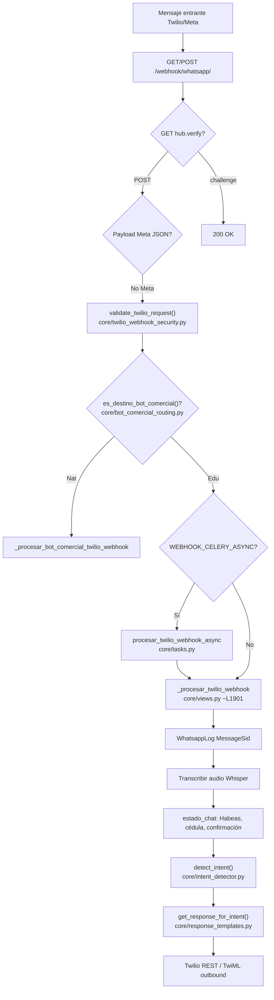

### Archivo por archivo (orden de ejecución)

| # | Archivo | Función | Qué hace |
|---|---------|---------|----------|
| 1 | `core/urls/webhook_urls.py` | URL map | `/webhook/whatsapp/` |
| 2 | `core/views.py` | `whatsapp_webhook` | Entrada HTTP, GET verify, POST dispatch |
| 3 | `core/twilio_webhook_security.py` | `validate_twilio_request` | Raw body + HMAC `compare_digest` |
| 4 | `core/bot_comercial_routing.py` | `es_destino_bot_comercial` | Si `To` = línea Nat → rama comercial |
| 5 | `core/views.py` | `_encolar_twilio_edu_si_async` | Encola Celery si flag ON |
| 6 | `core/tasks.py` | `procesar_twilio_webhook_async` | Worker ejecuta processor |
| 7 | `core/views.py` | `_procesar_twilio_webhook` | Pipeline edu completo |
| 8 | `core/intent_detector.py` | `detect_intent` | `listo` → `continuar_leccion` |
| 9 | `core/response_templates.py` | `get_response_for_intent` | Switch por intent (~L1122 `continuar_leccion`) |
| 10 | `core/module_steps.py` | `entregar_bloque_secciones_desde_paso` | Batch sección → envío |
| 11 | `core/drip_schedule.py` | `drip_bloquea_siguiente_modulo` | Gate temporal entre módulos |
| 12 | `core/helpers_examenes.py` | `debe_activar_checkpoint_reto_ia` | ¿Darío/Claudia post-módulo? |
| 13 | `core/tutor_ia_modulo.py` | `generar_respuesta_asistente` / reto | Checkpoint IA |
| 14 | `core/whatsapp_service.py` | envío Twilio | Texto, media, templates |

### Intent `continuar_leccion` (avance del curso)

```
get_response_for_intent(..., 'continuar_leccion')
  ├── ¿Varios cursos activos? → selector (core/selector_curso.py)
  ├── ¿modo_aula = clases? → redirect Aprende, no avanza WA
  ├── ¿Drip bloquea? → mensaje espera (drip_schedule.py)
  ├── ¿Esperando eval paso? → procesar_respuesta_evaluacion_paso
  ├── ¿Módulo usa pasos? → module_steps.entregar_bloque...
  ├── ¿Fin módulo + examen? → PreguntaModulo
  ├── ¿Checkpoint IA? → presentación Darío/Claudia
  └── ¿Curso completado? → certificado / cierre
```

### Onboarding previo al curso (misma rama webhook)

```
Estado desconocido → captura teléfono
  → Habeas / consentimiento
  → Cédula + confirmación nombre
  → Campaña / curso_destino → inscribir_estudiante_en_curso (inscripcion_curso.py)
  → Presentación agentes (Claudia + Darío) si usar_agentes_ia
  → Primer módulo
```

---

## 6. Call chain: Nat / EkiA comercial

**Rama separada.** Mismo servidor, otro contrato de producto.

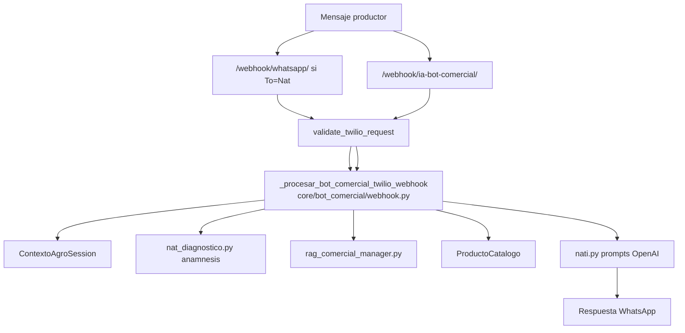

| # | Archivo | Rol |
|---|---------|-----|
| 1 | `core/bot_comercial_routing.py` | Detecta línea Nat por `Cliente.numero_whatsapp_nat` |
| 2 | `core/bot_comercial/webhook.py` | Orquestador Nat (~L724) |
| 3 | `core/nati.py` | Identidad, system prompts, saludo |
| 4 | `core/nat_diagnostico.py` | Protocolo preguntas diagnóstico |
| 5 | `core/rag_comercial_manager.py` | Recuperación biblioteca org |
| 6 | `core/knowledge_studio.py` | HITL candidatas conocimiento |
| 7 | `core/eventos_ia.py` | Telemetría / trazas |

**Nat NO interpreta `listo` como avance de curso.**  
**Portal cliente Nat:** `portal/views.py` → `/portal/nat/`, `/portal/biblioteca/`, `/portal/catalogo/`

Estrategia rename → **EkiA:** ver `docs/EKIA_INVESTIGACION_AGENTES.md`

---

## 7. Call chain: Portal B2B

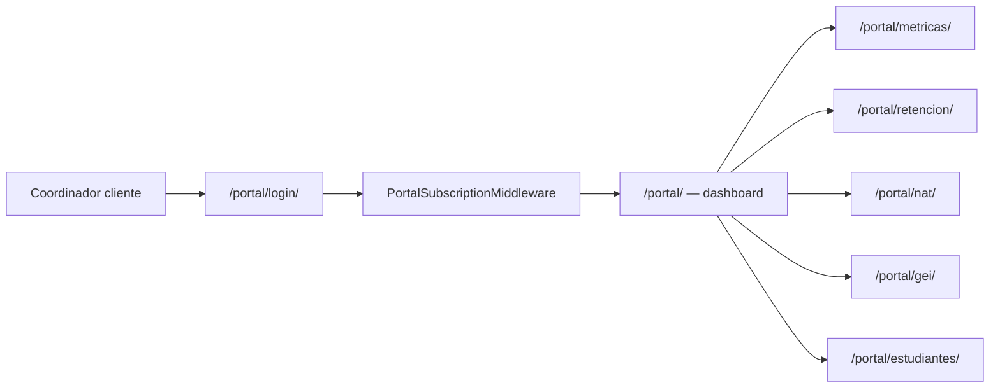

| # | Archivo | Rol |
|---|---------|-----|
| 1 | `portal/urls.py` | Rutas portal |
| 2 | `portal/views.py` | Vistas (login ~L103, dashboard ~L182) |
| 3 | `portal/models.py` | `PortalUsuario`, org linkage |
| 4 | `portal/retencion_service.py` | Centro de Éxito, embudo, riesgo |
| 5 | `core/domains/dashboard.py` | KPIs compartidos admin/portal |
| 6 | `core/metricas_empresa.py` | Agregaciones pesadas |
| 7 | `portal/agente_retencion.py` | Consultor IA retención (solo portal, no WA) |

**Auth:** sesión Django + `portal_login_required` decorator.  
**Tenancy:** `_portal_org(request)` filtra todo por `Cliente` del usuario portal.

---

## 8. Call chain: Aprende (aula web)

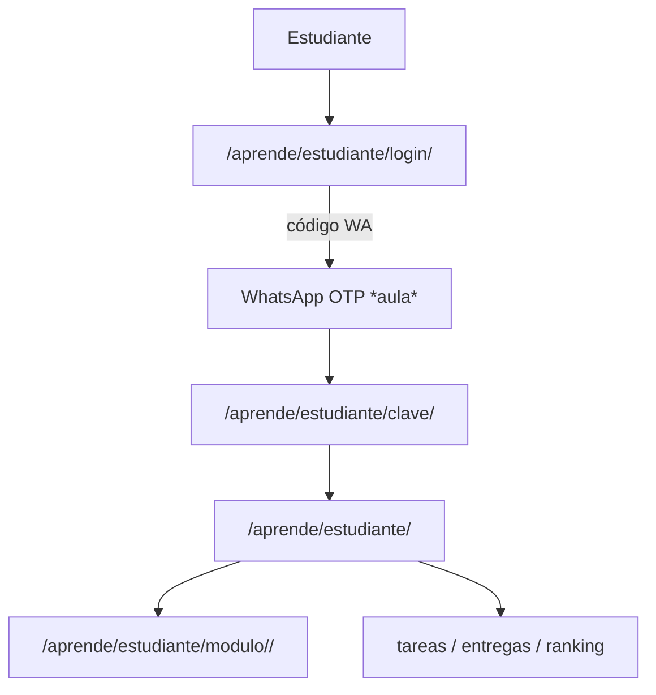

| # | Archivo | Rol |
|---|---------|-----|
| 1 | `aprende/urls.py` | Rutas aula |
| 2 | `aprende/views.py` | `estudiante_login` (~L128), home, módulos |
| 3 | `aprende/acceso_whatsapp.py` | Emisión/verificación OTP |
| 4 | `aprende/credencial_service.py` | Documento + clave |
| 5 | `aprende/lesson_service.py` | Lógica lección / archivos aula |
| 6 | `aprende/session_auth.py` | Sesión estudiante |
| 7 | `core/models.py` | `Curso`, `Modulo`, `ArchivoModulo` (reutilizados) |

**Studio → Aprende:** `studio/views.py` handoff con login correo.  
**modo_aula = clases:** avance principal en web; WA no avanza con *listo*.

---

## 9. Module Builder

Editor admin de estructura WA (secciones + micros). **No envía WhatsApp.**

| Pieza | Path |
|-------|------|
| Lógica | `core/module_builder.py` |
| Vista admin | `core/views_module_builder.py` |
| URL | `/admin/module-builder/<modulo_id>/` en `core/urls/admin_urls.py` |
| Validación intercalado | `core/module_structure.py` |
| Audit CLI | `python manage.py audit_module_builder` |
| Docs | `docs/MODULE_BUILDER_WA.md` |

**Flag:** `EKI_MODULE_BUILDER_BETA` o superuser `?builder=1`

Funciones clave: `reordenar_secciones`, `agregar_micro`, `diagnostico_estructura`, `arbol_modulo`

---

## 10. Mapa de agentes IA

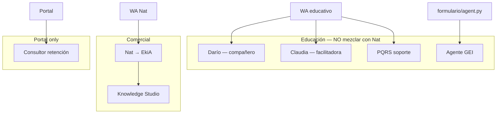

### Regla checkpoint Darío/Claudia

`core/helpers_examenes.py` → `debe_activar_checkpoint_reto_ia`:

- Módulo **3** siempre (si `usar_agentes_ia=True`)
- Último módulo si curso tiene **≥5** módulos
- Módulos 6, 9, 12… en cursos largos (>5)
- Override: `Modulo.facilitador_checkpoint`

Flujo post-checkpoint: `core/tutor_ia_modulo.py`

---

## 11. Celery y tareas programadas

Config: `mvp_project/celery.py` + `core/tasks.py`

| Tarea | Schedule | Propósito |
|-------|----------|-----------|
| `enviar_campanas_programadas` | 5 min | Campañas masivas WA |
| `reenganche_drip_content_diario` | 8:00 | Reenganche drip |
| `generar_reporte_actividad` | 1 h | Reportes |
| `limpiar_logs_antiguos` | 2:00 | Limpieza |
| `revisar_infra_advisor` | 1:15 | Alertas infra |
| `procesar_twilio_webhook_async` | bajo demanda | Webhook edu async |
| `indexar_biblioteca_nat_por_id` | cola `rag_index` | RAG Nat |

---

## 12. Deploy y entornos

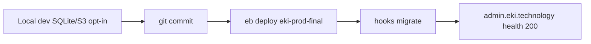

| Entorno | DB | Media | Celery |
|---------|-----|-------|--------|
| Local | SQLite default | `media/` local | `CELERY_TASK_ALWAYS_EAGER` |
| Prod EB | PostgreSQL RDS | S3 público | Redis + 2 workers |

**Último deploy relevante:** `d8cdc6d7` (16 ago 2026) — tests QA, migraciones metadata, doc EkiA.

**Importante:** cambios **solo en BD** (reorden Apiarios) **no** requieren deploy. Cambios de **código** sí.

Checklist: `docs/CHECKLIST_PRE_DEPLOY.md`

---

## 13. Cuando algo falla — dónde mirar

| Síntoma | Primer archivo |
|---------|----------------|
| No avanza con *listo* | `core/response_templates.py` → `continuar_leccion` |
| Orden raro / secciones mezcladas | `core/module_structure.py`, Module Builder |
| Video WA 63021 | `PasoModulo.media_wa_apto`, compresión admin |
| Drip bloquea | `core/drip_schedule.py` |
| Nat alucina | `core/nati.py`, `rag_comercial_manager.py` |
| Portal lento | `portal/retencion_service.py`, `core/metricas_empresa.py` |
| Aprende login | `aprende/acceso_whatsapp.py` |
| Deploy rojo | logs EB, migraciones pendientes |

---

## 14. Ejemplo real: curso Apiarios (id 35)

Datos verificados en **prod** (18 ago 2026). Cliente: **AGROSAVIA** (id 22).

### Configuración del curso

| Campo | Valor |
|-------|-------|
| Nombre | Identificación y Toma de Muestras en Apiarios |
| Drip | **0 días** (sin espera entre módulos) |
| Agentes IA | **Sí** — Claudia (tutor), Darío (asistente) |
| Modo aula | `modulos` (WhatsApp principal) |
| Módulos | **4** (ids 178–181) |
| Estructura | **OK** — módulo 178 reordenado 16 ago |

### Mapa de módulos

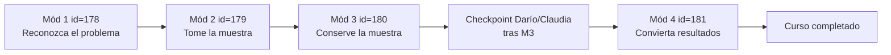

> Apiarios tiene 4 módulos → checkpoint IA solo en **M3** (regla `numero_modulo == 3`). M4 no dispara otro checkpoint (último módulo requiere ≥5 módulos).

### Módulo 1 (id 178) — lo que ve el estudiante

**Sección 79 — Reconozca el problema antes de actuar**

| Orden | Paso | Tipo | Qué recibe |
|-------|------|------|------------|
| 1 | 224 | MEDIA | Video (antes de entrar al apiario) |
| 2 | 223 | TXT | Bienvenida Módulo 1 + CTA *listo* |

→ Estudiante escribe **listo** →

**Sección 80 — Señales**

| Orden | Paso | Tipo | Qué recibe |
|-------|------|------|------------|
| 3 | 227 | MEDIA | Video señales 1 |
| 4 | 226 | MEDIA | Video señales 2 |
| 5 | 225 | TXT | Pregunta reflexiva + CTA *listo* |

→ **listo** → fin contenido M1 → mini-examen `PreguntaModulo` (si configurado) → M2

### Módulos 2–4 (resumen)

| Mód | id | Secciones | Pasos | Patrón |
|-----|-----|-----------|-------|--------|
| 2 | 179 | 2 | 5 | TXT bienvenida + MEDIA + TXT + MEDIA + MEDIA |
| 3 | 180 | 2 | 5 | Igual estructura |
| 4 | 181 | 2 | 5 | Igual estructura |

### Recorrido completo del estudiante (WhatsApp)

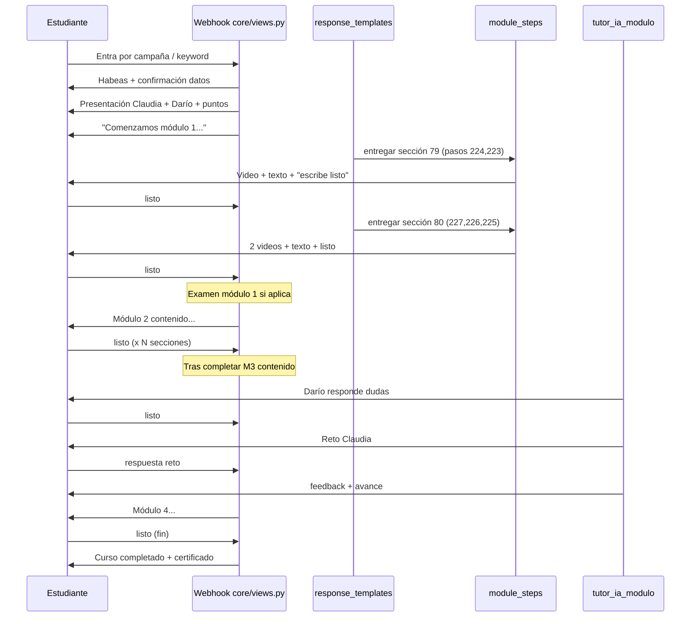

### Punteros en BD durante el recorrido

```
ProgresoEstudiante (estudiante + curso 35)
  modulo_actual     → Modulo 178, luego 179, 180, 181
  paso_actual_modulo → índice 1-based dentro de pasos activos
  completado        → False hasta fin M4

Tras cada listo exitoso:
  module_steps actualiza paso_actual_modulo
  Si agotó secciones del módulo → examen → ModuloCompletado
  Si modulo_actual.numero == 3 y fin módulo → checkpoint IA (estado_onboarding)
```

### Cómo auditar Apiarios en prod

```bash
# Estructura (sin enviar WA)
python manage.py audit_module_builder --curso-id=35

# Script local de referencia
scripts/_qa_mod1_structure.py
```

---

## 15. Estado actual y deuda

| Tema | Estado (18 ago 2026) |
|------|----------------------|
| Apiarios m178 intercalado | **Arreglado prod** |
| Module Builder audit global | **0 intercalados** |
| Tests QA drip/Portal/Studio | **Verdes**, deployados |
| Videos sin `media_wa_apto` | **~63 desconocidos** — validar antes de confiar en WA |
| Rename Nat → EkiA UI | **Solo documentado** |
| Migración `learning/` / `agents_*` | **En progreso** — runtime en `core` |
| `core/views.py` tamaño | **Deuda** — candidato a extracción por dominio |
| Redis/Chroma durable | **Deuda infra** — ver `RUNBOOK_REDIS_CHROMA.md` |

---

## 16. Documentos canon relacionados

| Documento | Cuándo leerlo |
|-----------|---------------|
| `GUIA_PLATAFORMA_EKI.md` | Operación día a día |
| `EKI_PRODUCTO_PROFUNDO.md` | Por qué existe cada módulo |
| `AUDITORIA_ARQUITECTURA_EKI.md` | Deuda técnica P0–P3 |
| `NAT_GUIA_COMPLETA.md` | Nat comercial profundo |
| `EKIA_INVESTIGACION_AGENTES.md` | Futuro EkiA / agentes |
| `VISION_TECNOLOGICA_EKI_2026_2035.md` | Norte estratégico |
| `MODULE_BUILDER_WA.md` | Contrato editor módulos |
| `CHECKLIST_PRE_DEPLOY.md` | Antes de cada deploy |
| `ROUTE_MAP_BY_DOMAIN.md` | Inventario URLs |
| `DOMAIN_ARCHITECTURE.md` | Reglas bounded contexts |

---

*Documento vivo. Actualizar cuando cambien superficies, deploy mayor o migración de dominios.*
