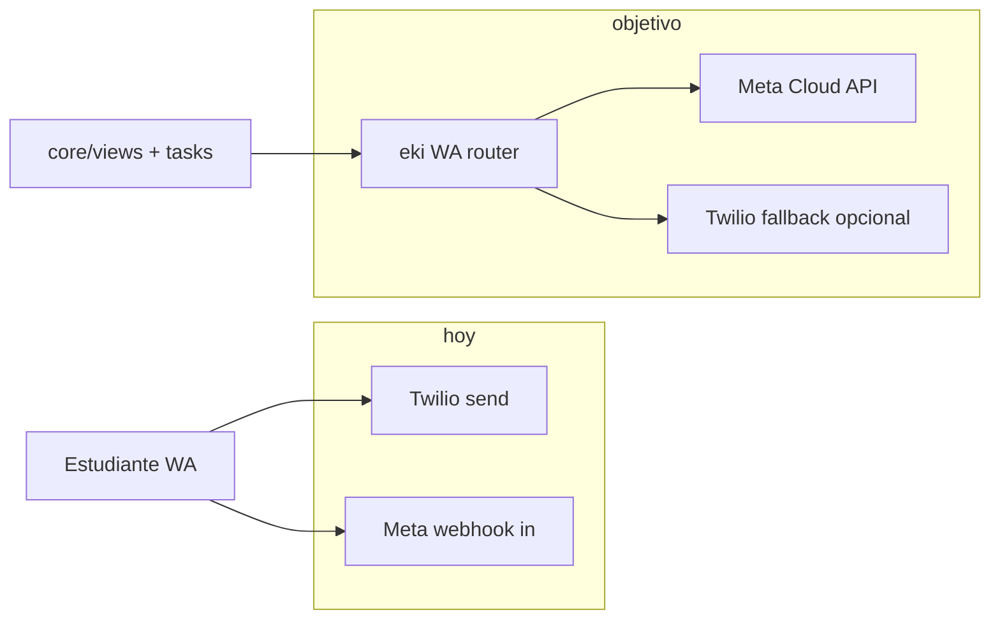

# Meta WhatsApp — notas de migración (eki)

Documento de referencia **sin compromiso de deploy**. Estado a agosto 2026.

## Situación hoy

| Capa | Proveedor | Notas |
|------|-----------|-------|
| Envío outbound (~95%) | **Twilio** | Content API, plantillas aprobadas, media vía URL pública S3 |
| Webhook inbound (parcial) | **Meta Cloud API** | `_procesar_meta_webhook` en `core/views.py` — recibe mensajes; no reemplaza todo el motor |
| Admin / ops | eki | WhatsappLog, conversaciones, triage 63019/63021 |

eki opera en **modo híbrido**: Twilio sigue siendo el camino principal de envío; Meta entra por recepción y pruebas puntuales.

## Por qué migrar (beneficios reales)

1. **Costo por conversación** — Meta suele ser más barato a escala que Twilio markup + Content SID.
2. **Media nativa** — upload directo a Graph API; menos fricción que URL pública + validación Twilio (63019/63021).
3. **Multi-WABA** — varias líneas / marcas bajo una integración Meta Business.
4. **Control plantillas** — gestión en Business Manager; alineado con clientes B2B que ya viven en Meta.
5. **Soberanía operativa** — menos dependencia de un intermediario para el 100% del tráfico WA curso.

## Qué NO cambia de un día para otro

- Flujo pedagógico (módulos, drip, publicación WA, certificados).
- Admin Unfold, conversaciones staff, AuditLog certificados.
- Portal B2B, Aprende, Nat (salvo que compartan la misma línea WA).

## Estimación honesta de esfuerzo

| Fase | Alcance | Tiempo orientativo |
|------|---------|-------------------|
| **Quick win inbound** | Meta webhook estable, dedupe, logging unificado con WhatsappLog | **4–6 semanas** |
| **Outbound piloto** | 1 curso / 1 WABA, plantillas Meta, envío texto + media | **+6–8 semanas** |
| **Paridad Twilio** | Campañas, drip, certificados WA, retries, métricas, fallback | **+8–12 semanas** |
| **Total paridad producción** | Multi-org, QA regresión completa, runbook | **~3–4 meses** calendario |

Factores que alargan: plantillas Meta en revisión, migración de números, pruebas con Agrosavia/Capital Humano sin cortar cohortes activas.

## Arquitectura objetivo (alto nivel)

## Decisiones pendientes (CTO)

1. **Router por org/curso** — flag `proveedor_wa` en Cliente o Campana vs cutover global.
2. **Plantillas** — duplicar en Meta vs migrar SID Twilio 1:1 (no siempre posible).
3. **Media** — bucket S3 + Graph upload vs URL directa Meta.
4. **Webhook único** — un endpoint con HMAC Meta (`hmac.compare_digest`) + deprecar paths Twilio gradualmente.
5. **Observabilidad** — mismo WhatsappLog con campo `proveedor`; alertas 63019 solo Twilio.

## Riesgos

| Riesgo | Mitigación |
|--------|------------|
| Regresión en cohortes live | Piloto org sandbox; feature flag por campaña |
| Plantillas rechazadas | Buffer 2 sem; copy pedagógico pre-aprobado |
| Doble envío inbound/outbound | Idempotency key + message_id en WhatsappLog |
| Costo dev >> ahorro año 1 | Quick win solo inbound; outbound cuando volumen justifique |

## Próximo paso recomendado (sin deploy producto)

1. Inventario: % mensajes Twilio vs Meta últimos 30 días (WhatsappLog).
2. Spec router mínimo: `send_whatsapp(estudiante, payload)` → backend configurable.
3. QA checklist espejo de `eki-qa`: media, drip, certificado, sin 63019 en piloto Meta.

---

*Relacionado: `docs/FLUJO_OPS_PUBLICACION_WA.md`, `docs/EKI_UNFOLD_ADMIN.md`, skill `eki-growth` (Nat/campañas).*
