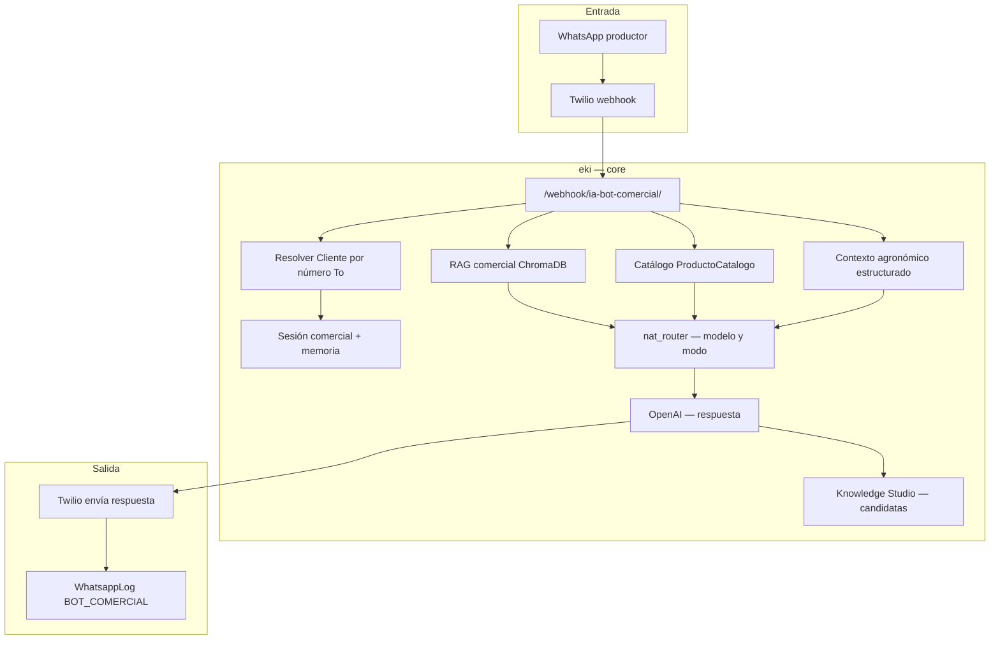

# Nat AI Knowledge Platform — Guía completa

Documento de referencia para operación, producto e integraciones. **Nat** es el **Agrónomo IA** de eki (no un chatbot genérico): combina biblioteca de conocimiento, RAG, diagnóstico agronómico y WhatsApp comercial.

---

## 0. Nat AI Knowledge Platform (evolución 2026)

| Capa | Qué es | Dónde |
|------|--------|-------|
| **Biblioteca de conocimiento** | Manuales, protocolos, FAQ, artículos, enlaces — indexados en Chroma | Portal `/portal/biblioteca/` |
| **Documentos RAG legacy** | `DocumentoRAGComercial` (sigue funcionando) | Admin + redirect portal |
| **Conector Agrosavia Nivel 1** | Búsqueda en vivo en `repository.agrosavia.co` si RAG local es débil | `core/agrosavia_connector.py` |
| **Modo diagnóstico** | Preguntas secuenciales (cultivo, ubicación, problema, tiempo, fertilización, foto) antes del LLM | `core/nat_diagnostico.py` |
| **Portal solo-Nat** | Organización con `portal_productos=nat`: menú mínimo (Biblioteca + Perfil) | `portal/capabilities.py` |

**Modelo:** `BibliotecaConocimiento` (`core/migrations/0116_biblioteca_conocimiento_nat.py`).

**Servicios:** `core/biblioteca_nat_service.py` — crea ítems, slug `bib_{id}_{slug}`, indexa vía `rag_comercial_manager`.

**WhatsApp:** el webhook comercial no cambia de URL; diagnóstico y Agrosavia se activan dentro de `_procesar_bot_comercial_twilio_webhook`.

**Variable:** `BOT_COMERCIAL_AGROSAVIA_ENABLED` (default `True`).

---

## 1. Qué es Nat y para qué sirve

| Aspecto | Detalle |
|---------|---------|
| **Nombre** | Nat (configurable por cliente: `Cliente.nombre_bot`) |
| **Canal** | WhatsApp comercial vía Twilio |
| **Usuario** | Productor o cliente final de una organización B2B (cooperativa, distribuidor, etc.) |
| **Objetivo** | Asesoría agrícola + recomendación de productos del **catálogo de la organización** |
| **No hace** | No avanza módulos de curso; no sustituye el flujo educativo salvo que el productor use solo la línea comercial |

**En una frase:** Nat es la agrónoma virtual por WhatsApp que combina conversación libre, documentos técnicos indexados (RAG), catálogo de productos y — opcionalmente — validación humana del conocimiento (HITL).

---

## 2. Arquitectura general



---

## 3. Flujo de un mensaje (paso a paso)

### 3.1 Entrada

1. El productor escribe al **número WhatsApp comercial** de la organización (`Cliente.numero_whatsapp_nat`) o al número global configurado en EB (`BOT_COMERCIAL_WHATSAPP_NUMBER`).
2. Twilio llama al webhook **`POST /webhook/ia-bot-comercial/`** (`core/views_webhooks.py` → `_procesar_bot_comercial_twilio_webhook` en `core/views.py`).
3. Se normaliza teléfono (Colombia: 10 dígitos → prefijo `57`).
4. Se ignoran duplicados por `MessageSid` ya registrado en `WhatsappLog` con agente `BOT_COMERCIAL`.
5. **Audio:** se transcribe con OpenAI Whisper si llega `MediaContentType` de audio.
6. **Imagen:** se envía a modelo visión (`BOT_COMERCIAL_VISION_MODEL`) para diagnóstico preliminar de cultivo.

### 3.2 Identidad del cliente B2B

- `resolver_cliente_desde_numero_whatsapp(msg_to)` busca `Cliente` activo cuyo `numero_whatsapp_nat` coincide con el `To` del webhook.
- Si no hay match, fallback a `BOT_COMERCIAL_CLIENTE_ID` (variable de entorno).
- Eso define: nombre del bot, `system_prompt_extra`, catálogo de productos y scope RAG.

### 3.3 Sesión y memoria

- Modelo **`SesionComercial`**: agrupa la conversación por teléfono + cliente, expira en horas (`BOT_COMERCIAL_SESSION_HOURS`, default 4).
- Memoria reciente desde **`WhatsappLog`**: últimos N turnos (`BOT_COMERCIAL_MEMORY_TURNOS`, default 12) hasta `BOT_COMERCIAL_MEMORY_MAX_CHARS` caracteres.
- Evita que Nat “olvide” cultivo o problema mencionado hace pocos mensajes.

### 3.4 Contexto agronómico estructurado

- Módulo **`core/contexto_agro.py`**: extrae de cada mensaje campos como cultivo, etapa, problema/plaga, clima, región/municipio (regex + heurísticas).
- Se persiste en la sesión y se inyecta al prompt como bloque **“CONTEXTO AGRONÓMICO DEL PRODUCTOR”**.
- Capability flag: `nati_structured_context` (por cliente).

### 3.5 Atajos sin LLM

| Mensaje | Respuesta |
|---------|-----------|
| Saludo (`hola`, `buenas`, …) | `armar_saludo_inicial()` |
| `listo`, `menu`, `continuar` | `armar_saludo_menu()` — **no** continúa curso educativo; reorienta a consulta comercial |

> **Importante:** En la línea **educativa** (cursos), *listo* avanza el módulo. En la línea **Nat comercial**, *listo* solo muestra menú de asesoría.

### 3.6 Recuperación de conocimiento (RAG + catálogo)

Orden de enriquecimiento del contexto antes de llamar al LLM:

1. **Precios en Postgres** — si la consulta parece catálogo (`core/catalogo_precios.py`), busca en `ProductoCatalogo` y formatea bloque de precios.
2. **RAG comercial (ChromaDB)** — `rag_comercial_manager.obtener_contexto_varios_clientes()`:
   - Scopes: IDs de cliente de la sesión + `BOT_COMERCIAL_CLIENTE_ID` + **`0` (documentos generales)**.
   - Canal virtual: `comercial_{canal}` (default `comercial_bot_comercial`).
   - Top-K chunks semánticos por pregunta; umbral de similitud `BOT_COMERCIAL_RAG_MIN_SIMILARITY` (default 0.52).
3. **Fallback lectura directa de archivos** — si Chroma no devuelve nada: lee PDF/DOCX/XLSX de `DocumentoRAGComercial` indexados (`BOT_COMERCIAL_RAG_FILE_FALLBACK`).
4. **Catálogo en system prompt** — `obtener_contexto_productos()` incluye productos activos del cliente en el system prompt con reglas estrictas anti-alucinación de precios/links.

### 3.7 Routing de modelo (`core/nat_router.py`)

`decidir_routing_nat()` elige:

| Decisión | Opciones |
|----------|----------|
| **Modelo** | `BOT_COMERCIAL_OPENAI_MODEL` (default gpt-5-mini) vs `BOT_COMERCIAL_MODEL_TECNICO` (gpt-5) |
| **Modo** | `conversacion`, `tecnico`, `catalogo`, `ambiguo` |
| **Web complementaria** | Si RAG débil/ausente y consulta técnica → `buscar_en_web_colombia()` |

Escala a modelo premium cuando hay RAG fuerte, consulta densa, visión, o catálogo con documentos.

### 3.8 Generación de respuesta

- Función **`_bot_comercial_respuesta_catalogo()`** en `core/views.py`.
- System prompt: **`armar_system_prompt()`** en `core/nati.py` — identidad agrónoma, reglas anti-alucinación, catálogo, instrucciones extra del cliente.
- User prompt incluye: contexto RAG, web, diagnóstico imagen, historial, contexto agro, instrucción de modo.
- Respuesta enviada con **`enviar_whatsapp_twilio()`** desde el número comercial (`From` = línea que recibió el mensaje).

### 3.9 HITL — Knowledge Studio

- Consultas técnicas/ambiguas generan **`ConversacionRAGCandidata`** (`core/knowledge_studio.py`).
- Revisor agrónomo en **`/admin/knowledge-studio/`** aprueba/rechaza.
- Al publicar: se indexa texto validado en RAG comercial como documento virtual `hitl_{id}_...`.
- Capability: `hitl_rag_publish`.

### 3.10 Observabilidad

- **`WhatsappLog`**: INCOMING/OUTGOING, `agente_usado='BOT_COMERCIAL'`.
- **`core/eventos_ia`**: trace_id, eventos webhook, RAG query, mensaje enviado (si capability `eventos_ia`).
- Admin **`/admin/bot-comercial/`**: métricas 7 días, documentos RAG, endpoint webhook.

---

## 4. Modelos de datos principales

| Modelo | Rol |
|--------|-----|
| `Cliente` | Organización B2B: `numero_whatsapp_nat`, `nombre_bot`, `system_prompt_extra`, módulo portal `nat` |
| `SesionComercial` | Sesión WhatsApp + historial + contexto agro persistido |
| `DocumentoRAGComercial` | PDF/DOCX/TXT/XLSX subidos → indexados en Chroma (por cliente o general id=0) |
| `ProductoCatalogo` | SKU comercial: nombre, dosis, precio, URL, problema que resuelve |
| `ConversacionRAGCandidata` | Cola HITL pregunta/respuesta para validación |
| `WhatsappLog` | Auditoría de mensajes |

**Tipos de documento RAG:** producto, precio, informe_tecnico, faq, politica, promo, general.

**Formatos indexables hoy:** `.pdf`, `.docx`, `.txt`, `.xlsx`, `.xlsm`.

---

## 5. Dónde se opera Nat

### 5.1 Admin Django

| Ruta | Función |
|------|---------|
| `/admin/bot-comercial/` | Panel operativo Nat |
| Admin → **Documentos RAG Comercial** (`core/admin/commercial.py`) | Subida masiva, re-indexar |
| Admin → **Producto catálogo** | Productos recomendables |
| Admin → **Sesiones comerciales** | Ver conversaciones activas |
| `/admin/knowledge-studio/` | Cola HITL |

### 5.2 Portal B2B

Requiere `portal_productos` incluya `nat`:

| Ruta | Función |
|------|---------|
| `/portal/nat/` (o sección Agente Nat) | Sesiones, catálogo, documentos, escalamientos |
| Subida de documentos | `portal/nat_documentos.py` → crea `DocumentoRAGComercial` |

### 5.3 Webhook producción

```
POST https://<dominio-eki>/webhook/ia-bot-comercial/
```

Configurar en Twilio Console para el número comercial de cada cliente (o número central).

---

## 6. Variables de entorno clave (Elastic Beanstalk)

| Variable | Default | Uso |
|----------|---------|-----|
| `BOT_COMERCIAL_WHATSAPP_NUMBER` | — | Número global comercial (dígitos) |
| `BOT_COMERCIAL_CLIENTE_ID` | 0 | Cliente fallback + documentos generales |
| `BOT_COMERCIAL_RAG_CANAL` | bot_comercial | Scope RAG |
| `BOT_COMERCIAL_OPENAI_MODEL` | gpt-5-mini | Chat estándar |
| `BOT_COMERCIAL_MODEL_TECNICO` | gpt-5 | Consultas complejas / RAG denso |
| `BOT_COMERCIAL_RAG_MIN_SIMILARITY` | 0.52 | Umbral chunks RAG |
| `BOT_COMERCIAL_RAG_TOP_K` | 9 | Chunks por consulta |
| `BOT_COMERCIAL_RAG_MAX_CHARS` | 2500 | Tamaño contexto RAG en prompt |
| `BOT_COMERCIAL_RAG_FILE_FALLBACK` | true | Leer archivos si Chroma falla |
| `BOT_COMERCIAL_WEB_FALLBACK_ENABLED` | true | Búsqueda web complementaria |
| `BOT_COMERCIAL_MEMORY_TURNOS` | 12 | Memoria conversacional |
| `OPENAI_API_KEY` | — | Obligatoria para Nat con IA |

---

## 7. Reglas de comportamiento (producto)

1. **Prioridad de verdad:** documentos RAG oficiales de la organización > catálogo Postgres > web complementaria.
2. **No inventar:** dosis, precios, nombres de producto fuera del contexto.
3. **Tono:** formal (*usted*), agrónoma de campo, vocabulario rural colombiano.
4. **Comercial:** solo recomienda productos del `ProductoCatalogo` del cliente activo.
5. **No mencionar** RAG, embeddings ni sistemas internos al productor.

---

## 8. Diferencias Nat vs tutor del curso vs GEI

| | **Nat comercial** | **Tutor curso** | **GEI** |
|---|-------------------|-----------------|---------|
| Línea WhatsApp | Comercial (`numero_whatsapp_nat`) | Educativa (campana/curso) | Educativa |
| Interacción | Chat libre | Avance por módulos / *listo* | Formulario secuencial |
| RAG | Documentos comerciales + catálogo | Contenido del curso | Sin RAG libre |
| Objetivo | Venta + asesoría | Aprendizaje | Recolección datos finca |

---

## 9. Investigación: [Biblioteca Digital Agropecuaria — Agrosavia](https://repository.agrosavia.co/)

### 9.1 Qué es

Repositorio institucional de **AGROSAVIA** (DSpace **9.1**), con **~26.656 publicaciones** (cartillas, manuales, libros, multimedia, etc.) sobre agricultura colombiana. Los contenidos se consultan en línea **según derechos de autor** (texto del sitio).

### 9.2 ¿Se puede acceder técnicamente? **Sí**

El repositorio expone **API REST pública** (estándar DSpace 7+):

| Recurso | URL base |
|---------|----------|
| Raíz API | `https://repository.agrosavia.co/server/api` |
| Búsqueda | `GET /server/api/discover/search/objects?query={término}&size=N&dsoType=Item` |
| Detalle ítem | `GET /server/api/core/items/{uuid}` |
| Bundles / archivos | `GET /server/api/core/items/{uuid}/bundles` → bitstreams → descarga |

**Prueba realizada:** búsqueda `query=cacao` devuelve ítems con metadatos completos (título, abstract, cultivo, licencia, handle DOI).

Metadatos útiles para Nat:

- `dc.title`, `dc.description.abstract`
- `dc.subject.agrovoc`, `dc.description.productionsystems`
- `dc.type.local` (Cartilla, Manual, Multimedia, …)
- `dc.rights` → en muestra: **Creative Commons BY-NC-ND 4.0**
- `dc.rights.accessrights` → `openAccess` en muchos ítems
- `dc.format.mimetype` → `application/pdf`, `video/mp4`, etc.

**OAI-PMH:** endpoint `/oai/request` existe; en prueba `ListMetadataFormats` respondió error 500 — no depender solo de OAI hasta validar con Agrosavia.

### 9.3 ¿Se pueden descargar todos los archivos?

| Enfoque | Viabilidad | Notas |
|---------|------------|-------|
| **Búsqueda bajo demanda** (solo cuando el productor pregunta) | ✅ Alta | 1–5 ítems por consulta; bajo costo; sin espejo completo |
| **Harvest paginado** (recorrer los ~26k ítems) | ⚠️ Media | API permite paginación; requiere job nocturno, almacenamiento S3, respeto rate limits |
| **Espejo completo offline** | ⚠️ Media-baja | Volumen grande (PDFs + videos); mantenimiento de sincronización |
| **Scraping HTML sin API** | ❌ No recomendado | Frágil; peor que API oficial |

**Formatos vs Nat hoy:**

- **PDF / DOCX:** indexables directo en `DocumentoRAGComercial`.
- **Videos MP4:** Nat no indexa video hoy → haría falta transcripción (Whisper) + texto a RAG, o usar solo abstract.
- **Solo metadata (título + abstract):** indexable como chunks cortos; útil pero menos profundo que el PDF completo.

### 9.4 Consideraciones legales (críticas)

1. El sitio indica uso **de acuerdo a derechos de autor** — no asumir descarga masiva libre para recomercialización.
2. Licencia observada en ítems: **[CC BY-NC-ND 4.0](http://creativecommons.org/licenses/by-nc-nd/4.0/)**:
   - **Atribución** obligatoria (citar Agrosavia).
   - **No comercial (NC):** uso comercial de Nat que monetiza productos del cliente puede requerir revisión legal.
   - **No derivados (ND):** embeddings / resúmenes generados pueden interpretarse como obra derivada — **consultar jurídico** antes de indexar masivamente para un bot comercial.
3. **Recomendación:** acuerdo formal con AGROSAVIA (MOU, API key, permiso de reutilización en asistente IA) antes de producción a escala.

### 9.5 Estrategias recomendadas (sin implementar aún)

#### Opción A — **RAG en vivo (recomendada para piloto)**

```
Pregunta productor → Nat extrae cultivo/tema
→ GET discover/search/objects?query=...
→ Top 3 ítems: abstract + enlace handle
→ Si PDF abierto: descargar, extraer texto, inyectar en prompt (sin guardar permanente)
→ Respuesta cita: "Según AGROSAVIA (cartilla X, año Y)..."
```

- **Pros:** sin espejo de 26k archivos; siempre actualizado; bajo riesgo de storage.
- **Contras:** latencia +2–5 s; depende de disponibilidad Agrosavia.

#### Opción B — **Corpus curado e indexado en eki**

1. Definir whitelist: solo **Cartillas** y **Manuales** de cultivos relevantes (café, cacao, fríjol, …).
2. Job `management command` descarga PDFs vía API → S3 → `DocumentoRAGComercial` cliente_id=0, tipo `informe_tecnico`.
3. Re-indexar Chroma como hoy con documentos comerciales.

- **Pros:** respuestas rápidas; funciona offline de Agrosavia.
- **Contras:** mantenimiento; legal; volumen storage.

#### Opción C — **Capa híbrida**

- Index local: ~200–500 documentos curados por equipo agronómico eki.
- Live search Agrosavia cuando RAG local similitud < umbral.
- Web fallback actual ya menciona Agrosavia en query (`buscar_en_web_colombia`).

#### Opción D — **Partnership institucional**

- AGROSAVIA ya indexa en Google Académico, AGRIS, Red Colombiana — posible canal formal para feed bulk o Solr expuesto.
- Ideal para escala nacional con respaldo institucional.

### 9.6 Esfuerzo estimado (orden de magnitud)

| Fase | Entregable | Esfuerzo |
|------|------------|----------|
| Piloto A | Conector búsqueda API + citas en respuesta Nat | 1–2 semanas dev |
| Legal | Memo uso CC BY-NC-ND en asistente comercial | Jurídico + AGROSAVIA |
| Corpus B | Harvest 500 PDFs + indexación | 2–3 semanas dev + ops |
| Producción | Sync incremental semanal + monitoreo | Continuo |

### 9.7 Qué **no** hacer

- Descargar masivamente sin permiso y entrenar modelos propios con el corpus completo.
- Presentar contenido Agrosavia como propio de la cooperativa cliente sin atribución.
- Asumir que *openAccess* implica uso comercial ilimitado en un bot de ventas.

---

## 10. Archivos de código de referencia

| Archivo | Responsabilidad |
|---------|-----------------|
| `core/views.py` | `_procesar_bot_comercial_twilio_webhook`, `_bot_comercial_respuesta_catalogo` |
| `core/views_webhooks.py` | Entrada HTTP webhook |
| `core/nati.py` | Prompts, saludos, catálogo en system prompt, búsqueda web |
| `core/nat_router.py` | Routing modelo/modo/web |
| `core/rag_comercial_manager.py` | Chroma comercial multitenant |
| `core/rag_eki_multitenant.py` | Backend vectorial |
| `core/biblioteca_nat_service.py` | CRUD biblioteca → RAG |
| `core/agrosavia_connector.py` | Búsqueda live AGROSAVIA |
| `core/nat_diagnostico.py` | Modo diagnóstico multi-pregunta |
| `core/models.py` | `BibliotecaConocimiento`, `DocumentoRAGComercial`, … |
| `portal/views.py` | `portal_biblioteca`, `portal_biblioteca_crear`, `portal_biblioteca_editar` |
| `portal/capabilities.py` | `portal_solo_nat`, `portal_home_url` |
| `portal/templates/portal/biblioteca.html` | UI biblioteca B2B |
| `mvp_project/settings.py` | Variables `BOT_COMERCIAL_*` |

---

## 11. Checklist operativo — poner Nat en marcha

1. Crear **Cliente** con `numero_whatsapp_nat` y módulo portal `nat`.
2. Configurar Twilio: webhook → `/webhook/ia-bot-comercial/`.
3. Variables EB: `OPENAI_API_KEY`, `BOT_COMERCIAL_WHATSAPP_NUMBER`, `BOT_COMERCIAL_CLIENTE_ID`.
4. Subir **DocumentoRAGComercial** (fichas técnicas, listas precio) → acción re-indexar.
5. Cargar **ProductoCatalogo** (nombre, dosis, precio, URL).
6. Probar: saludo → consulta técnica → consulta precio → foto plaga.
7. Revisar **Knowledge Studio** semanalmente si HITL está activo.

---

## 12. Roadmap sugerido (Agrosavia + Nat)

1. **Legal:** carta a AGROSAVIA / revisión CC BY-NC-ND para asistente IA.
2. **Piloto técnico:** búsqueda API en 3 cultivos (café, cacao, fríjol) + citas en respuesta.
3. **Corpus curado:** 100 cartillas indexadas en RAG general (cliente_id=0).
4. **Producto:** toggle en admin “Usar biblioteca Agrosavia” por organización.
5. **Métricas:** log de consultas Agrosavia vs RAG propio vs web.

---

*Documento generado para eki MVP — julio 2026. Repositorio Agrosavia: [https://repository.agrosavia.co/](https://repository.agrosavia.co/)*
