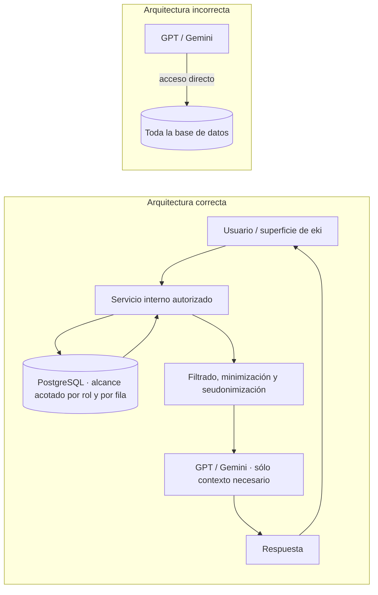
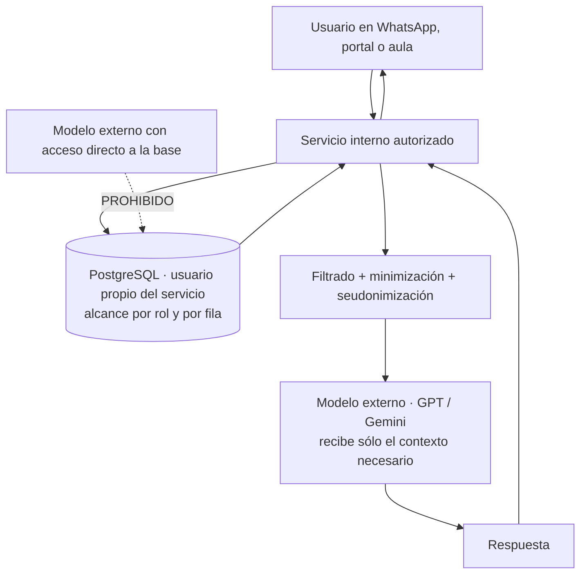

# Visión Tecnológica de eki (2026–2035)

**Documento oficial de arquitectura y estrategia de ingeniería**
**Clasificación:** referencia tecnológica interna · uso de ingeniería, arquitectura, dirección e inversionistas técnicos
**Autoría conceptual:** Oficina del CTO de eki
**Fecha de emisión:** julio 2026
**Horizonte:** 2026–2035
**Versión:** 3.0 (reorganización en seis bloques y veintiocho capítulos; incorpora aportes de arquitectura de datos y mínimo privilegio de Andrés Eki, 30 de julio de 2026, sobre la versión 2.0 de julio de 2026)
**Fuente de verdad del estado actual:** `docs/GUIA_PLATAFORMA_EKI.md`, `docs/EKI_PRODUCTO_PROFUNDO.md`, `docs/DOMAIN_ARCHITECTURE.md`, `docs/AUDITORIA_ARQUITECTURA_EKI.md`, `docs/ROADMAP_OBSERVABILIDAD.md`, `docs/UMBRAL_S3_RDS.md`, `docs/EMPLEABILIDAD_GEO_WHATSAPP_PORTAL.md`, `docs/EKI_UNFOLD_ADMIN.md`

> **Nota de estilo obligatoria:** el nombre de la compañía y de la plataforma se escribe siempre en minúsculas: **eki**. Esta convención aplica a todo el documento, incluidos títulos, tablas y diagramas.

> **Nota de versión 3.0.** Esta emisión reorganiza el documento en seis bloques temáticos y veintiocho capítulos para separar con nitidez el norte estratégico, la arquitectura objetivo, la plataforma de inteligencia territorial, el gobierno y la operación, la ejecución y el control estratégico. Además incorpora los aportes de arquitectura de datos y de **mínimo privilegio** de Andrés Eki del 30 de julio de 2026, que quedan elevados a regla de arquitectura en el capítulo 4, a criterio de diseño de la plataforma de datos en el capítulo 11, a exigencia de configuración de infraestructura en el capítulo 17 y a capítulo propio de seguridad, privacidad y soberanía en el capítulo 18. Ninguna capacidad descrita en la versión 2.0 se retira: se reordena, se profundiza y se somete a un marco de acceso mínimo explícito.

---

## Tabla de contenidos

**Bloque I — Norte estratégico**

1. [Propósito y alcance del documento](#capítulo-1-propósito-y-alcance-del-documento)
2. [Estado actual y activos tecnológicos](#capítulo-2-estado-actual-y-activos-tecnológicos)
3. [Visión tecnológica 2035](#capítulo-3-visión-tecnológica-2035)
4. [Tesis estratégica y principios rectores](#capítulo-4-tesis-estratégica-y-principios-rectores)

**Bloque II — Arquitectura objetivo**

5. [Evolución por etapas](#capítulo-5-evolución-por-etapas)
6. [Arquitectura objetivo 2035](#capítulo-6-arquitectura-objetivo-2035)
7. [Plano de experiencia](#capítulo-7-plano-de-experiencia)
8. [Plano de inteligencia](#capítulo-8-plano-de-inteligencia)
9. [Arquitectura de transición](#capítulo-9-arquitectura-de-transición)

**Bloque III — Plataforma de inteligencia territorial**

10. [Sistema de eventos](#capítulo-10-sistema-de-eventos)
11. [Plataforma de datos](#capítulo-11-plataforma-de-datos)
12. [Grafo de conocimiento](#capítulo-12-grafo-de-conocimiento)
13. [Inteligencia artificial](#capítulo-13-inteligencia-artificial)
14. [Alertas e índice territorial](#capítulo-14-alertas-e-índice-territorial)
15. [Gemelo Digital Rural](#capítulo-15-gemelo-digital-rural)
16. [APIs de inteligencia](#capítulo-16-apis-de-inteligencia)

**Bloque IV — Gobierno y operación**

17. [Infraestructura cloud](#capítulo-17-infraestructura-cloud)
18. [Seguridad, privacidad y soberanía de datos](#capítulo-18-seguridad-privacidad-y-soberanía-de-datos)
19. [Gobernanza tecnológica y de modelos](#capítulo-19-gobernanza-tecnológica-y-de-modelos)
20. [Organización del equipo técnico](#capítulo-20-organización-del-equipo-técnico)

**Bloque V — Ejecución**

21. [MVP tecnológico](#capítulo-21-mvp-tecnológico)
22. [Roadmap de 24 meses](#capítulo-22-roadmap-de-24-meses)
23. [Roadmap 2026–2035](#capítulo-23-roadmap-20262035)
24. [Costos y capacidades requeridas](#capítulo-24-costos-y-capacidades-requeridas)

**Bloque VI — Control estratégico**

25. [KPIs tecnológicos](#capítulo-25-kpis-tecnológicos)
26. [Riesgos técnicos](#capítulo-26-riesgos-técnicos)
27. [Decisiones arquitectónicas vigentes](#capítulo-27-decisiones-arquitectónicas-vigentes)
28. [Recomendaciones del CTO](#capítulo-28-recomendaciones-del-cto)

**Apéndices**

- [Apéndice A — Glosario de visión](#apéndice-a--glosario-de-visión)
- [Apéndice B — Relación con documentos vigentes](#apéndice-b--relación-con-documentos-vigentes)
- [Apéndice C — Nota sobre el término "IQ Rural"](#apéndice-c--nota-sobre-el-término-iq-rural)
- [Apéndice D — Contrato preliminar del esquema canónico de evento](#apéndice-d--contrato-preliminar-del-esquema-canónico-de-evento)

---

# Bloque I — Norte estratégico

## Capítulo 1. Propósito y alcance del documento

Este documento establece la visión tecnológica oficial de **eki** para la década 2026–2035. No es un plan comercial, no es un pitch de inversión y no es un roadmap simplificado de producto. Es una carta de arquitectura: un instrumento de gobierno técnico que explica hacia dónde debe evolucionar la plataforma, por qué ciertas decisiones de ingeniería son correctas aunque no sean las más rápidas a corto plazo, y cómo el equipo debe preservar la continuidad operativa mientras construye capacidades de inteligencia territorial a escala latinoamericana. Está escrito para tres audiencias simultáneas que rara vez leen el mismo texto: la ingeniería que debe implementarlo, la dirección que debe financiarlo y los aliados o inversionistas técnicos que necesitan verificar que la ambición declarada tiene un sustrato real de sistemas en producción.

eki ya existe como plataforma funcional y operativa. Corre un monolito Django sobre AWS Elastic Beanstalk en el entorno `eki-prod-final`, con PostgreSQL gestionado en RDS, multimedia y artefactos en el bucket S3 `eki-produccion`, colas asíncronas con Celery y Redis, Cloudflare como borde de TLS y DNS, y Twilio como proveedor de la API de WhatsApp que constituye el canal pedagógico principal. Las superficies web vivas son `admin.eki.technology` para operaciones internas, `app.eki.technology` para el portal B2B de coordinadores, `aprende.eki.technology` para el aula virtual del estudiante, `studio.eki.technology` para el catálogo, la inscripción y el checkout de pagos, y `certificados.eki.technology` para la verificación pública de diplomas. Esa base no se descartará. La tesis central de este documento, repetida deliberadamente en cada capítulo porque es la que más presión recibirá en los próximos años, es que **eki no se reescribe desde cero: eki evoluciona**. Toda capacidad futura —Event Engine, Data Lake, Knowledge Graph, modelos propios, Gemelo Digital Rural, APIs de inteligencia, IQ Rural— debe nacer como capa que se apoya sobre lo que ya funciona en campo, no como un sistema paralelo que compita por atención, presupuesto y confianza con el producto vivo que hoy factura y forma personas.

El propósito estratégico de la década no es únicamente "mejorar un LMS por WhatsApp". Es transformar a eki en **infraestructura de inteligencia territorial para la Latinoamérica rural**, manteniendo el aprendizaje como el canal primario y legítimo de relación con las personas, y convirtiendo cada interacción pedagógica, comercial, climática, de empleabilidad o de recolección estructurada —como las fichas GEI de finca— en señal territorial acumulable. El caso que mejor ilustra el destino es sanitario y comunitario: cuando varios usuarios de un mismo municipio o de una misma vereda reportan, en una ventana temporal corta, síntomas compatibles con una infección diarreica, eki no debería tratar esos mensajes como tickets de soporte aislados perdidos en un historial de conversaciones. Debería reconocer el patrón, correlacionarlo con territorio, densidad de reportes, historial reciente y fuentes complementarias como clima o campañas activas, elevar una **alerta territorial** en tiempo casi real y ofrecer contexto accionable a las cooperativas, gobiernos locales, ONG y operadores de programa habilitados —todo esto sin romper la confianza de las personas ni la soberanía de los datos, y sin convertir la plataforma en un aparato de vigilancia individual.

La soberanía de datos y de modelos es el segundo eje del documento. eki utilizará modelos fundacionales externos mientras eso sea racional desde el punto de vista económico y de calidad, porque hoy sería absurdo intentar competir con laboratorios que invierten miles de millones en preentrenamiento. Pero la hoja de ruta de inteligencia artificial apunta con claridad a **modelos especializados y, en dominios críticos, modelos propios entrenados con datos de eki**, de modo que el conocimiento acumulado sobre territorios rurales latinoamericanos —el lenguaje real de los productores, las plagas que efectivamente aparecen, los patrones de abandono de un curso por WhatsApp en 3G, la relación entre clima y consulta comercial— no dependa de forma permanente de proveedores externos para las capacidades que definen la ventaja competitiva de la compañía. Esa autonomía no se improvisa el día que un proveedor cambie sus precios: exige recolección masiva y consentida, gobernanza de datos, anonimización, calidad de etiquetado, infraestructura de entrenamiento y una cultura de ingeniería que trate los datos como activo estratégico y no como subproducto de logs que se rotan cada treinta días.

Hay un tercer eje, menos visible pero igualmente decisivo: la **restricción del canal**. eki opera en lugares donde la conectividad es intermitente, donde el video de veinticinco megabytes falla, donde Twilio devuelve errores 63019 y 63021 con regularidad, donde la ventana de veinticuatro horas de WhatsApp Business condiciona el diseño de la autenticación del aula, y donde el usuario no va a instalar una aplicación nativa. Esa restricción no es un obstáculo transitorio que desaparecerá con la llegada de mejor red: es el terreno de juego donde eki construyó su ventaja. Cualquier arquitectura futura que solo funcione asumiendo banda ancha, sesiones largas y clientes ricos habrá abandonado el mercado que la compañía sabe servir. Por eso este documento insiste en que la inteligencia territorial debe consumirse desde un mensaje de texto tanto como desde un tablero web: si el resultado de un modelo no cabe en una frase que un coordinador pueda reenviar por WhatsApp, ese modelo todavía no es un producto de eki.

Este documento guiará decisiones de arquitectura durante la próxima década porque fija principios, etapas, costos, riesgos y métricas verificables. Cuando aparezcan las tentaciones previsibles —la reescritura total del monolito "para dejarlo limpio", la migración prematura a microservicios porque el mercado laboral lo premia, la construcción de un data warehouse antes de tener eventos confiables, la persecución de features de inteligencia artificial desconectadas del núcleo conversacional— el equipo deberá volver a estas páginas y justificar la desviación por escrito. La continuidad tecnológica, la evolución controlada y la inteligencia territorial rural con soberanía progresiva son las tres constantes que unifican los veintiocho capítulos siguientes. Todo lo demás es negociable.

## Capítulo 2. Estado actual y activos tecnológicos

Para proyectar el futuro con rigor hay que describir el presente sin romanticismo y sin menosprecio. eki es, en julio de 2026, un **monolito operativo Django** desplegado en el entorno Elastic Beanstalk `eki-prod-final` en la región `us-east-2`, con Cloudflare al frente como capa de TLS, DNS y protección de borde. El producto en producción no es un prototipo de laboratorio ni una demo de aceleradora: tiene organizaciones B2B reales que pagan, estudiantes que avanzan por WhatsApp escribiendo *listo*, coordinadores que abren el portal cada mañana para ver quién está en riesgo, multimedia real en S3 que se entrega a teléfonos con señal precaria, certificados verificables públicamente con hash SHA-256, y procesos Celery que ejecutan campañas cada cinco minutos, reenganche por liberación de drip a las 08:00 y reenganche de inactivos a las 09:00.

El stack vigente es deliberadamente convencional, y eso es una virtud a la escala actual. Python y Django en el backend; PostgreSQL en RDS como sistema de registro transaccional, hoy sobre una clase `db.t4g.micro` con veinte gigabytes de disco, autoescalado configurado hasta mil gigabytes, un uso real cercano a 1,7 GB y una CPU promedio del tres al cuatro por ciento; S3 (`eki-produccion`) para multimedia de módulos, certificados generados, entregas de tareas del aula y avatares de estudiantes, con un consumo aproximado de 1,7 a 1,8 GB; Celery con Redis —hoy Redis local en la misma caja de Elastic Beanstalk, no ElastiCache— para trabajo asíncrono; Twilio WhatsApp API como canal pedagógico principal, con Meta Cloud API como alternativa contemplada; proveedores de IA generativa (OpenAI y Google Gemini) para el tutor educativo, el agente comercial Nat, el agente PQRS, el formulario secuencial de GEI y el consultor de retención del portal; Chroma como store vectorial en `/var/app/chroma_data`; WhiteNoise para estáticos; y Django Admin sobre **django-unfold** —ya migrado desde el tema Jazzmin, con su criterio de navegación documentado en `docs/EKI_UNFOLD_ADMIN.md`— como consola maestra de operaciones. Las aplicaciones Django ya dibujan bounded contexts lógicos: `core` concentra identidad, webhook de WhatsApp, drip, campañas, certificados, gamificación y telemetría; `portal` es el B2B; `aprende` es el aula; `studio` es el catálogo, la inscripción y el checkout con Wompi; `formulario` implementa GEI; `integrations` es la fachada de la API LXP; y `learning`, `agents_edu`, `agents_commercial` y `analytics` existen como scaffolds y agrupaciones de administración según la decisión de arquitectura de dominios de mayo de 2026, que fue explícita: **no microservicios todavía**, separación lógica en apps Django con regla de imports unidireccional donde `core` no importa de las capas superiores.

La propuesta de valor actual es formación profesional B2B para poblaciones con bajo ancho de banda y alto uso de WhatsApp, principalmente en Colombia y con vocación latinoamericana: cooperativas, cámaras de comercio, fondos de empleados, ONG, gobiernos locales y empresas que capacitan a población rural o periurbana. El diferenciador nunca fue "otro LMS web con mejor CSS", sino un **motor conversacional pedagógico**: microlecciones entregadas por WhatsApp con multimedia optimizada, control de avance mediante la palabra *listo*, drip que libera contenido por calendario, por días entre módulos, por override de organización o por lista blanca de estudiantes, evaluaciones de opción múltiple A–D que desde julio de 2026 **no son saltables** con *listo* —una decisión de producto que protege el peso del certificado ante quien lo paga—, recuperación de media con reintentos automáticos ante errores Twilio 63019, 63021 y 63005 más la frase de campo *reenvía video* que reenvía el material sin avanzar el progreso, y emisión de certificados en PNG para WhatsApp con PDF derivado y hash SHA-256 para verificación pública. Sobre ese mismo núcleo de datos viven módulos opcionales que se activan por organización mediante el campo `portal_productos` del modelo `Cliente`: **GEI**, que recolecta variables de finca por WhatsApp en un formulario secuencial y produce un balance de emisiones exportable; **Nat**, el agente comercial y agronómico que asesora productores con RAG sobre biblioteca del cliente, catálogo de productos, extracción de contexto agronómico y probabilidad de precipitación consultada a Open-Meteo por municipio; y **empleabilidad**, que geolocaliza aliados laborales, calcula distancias con la fórmula de Haversine dentro de un radio configurable de ochocientos metros por defecto, y valida visitas físicas con códigos secretos en puerta.

El modelo de datos de negocio ya contiene, sin haberlo planeado como tal, las semillas de la inteligencia territorial que este documento propone industrializar. `Estudiante` guarda municipio, departamento, género, edad y detalle de ubicación, además de una máquina de estados de conversación que va desde `ESPERANDO_HABEAS_DATA` hasta `ACTIVO`. `Cliente` representa la organización con su configuración de drip, gamificación, branding y productos contratados. `ProgresoEstudiante` mantiene un registro por par estudiante-curso con módulo actual, paso actual y fecha de último avance. La telemetría de aprendizaje `EstudianteEventoAprendizaje`, desplegada con la migración `0122`, registra eventos tipados: contenido enviado, *listo* recibido, evaluación respondida, módulo iniciado, módulo completado, recordatorio enviado, recordatorio respondido, media entregada y media fallida. `EventoIA` registra decisiones de agentes con trazas replayables desde `/admin/ai-ops/replay/<uuid>/`. `ContextoAgroSession` persiste municipio, vereda, región, latitud, longitud, cultivo, etapa y problema de cada sesión comercial de Nat. `FichaGEI` captura variables productivas de la finca. `MisionEmpleabilidad` guarda latitud, longitud, distancia en metros y un embudo de estados que va de descubierto a vinculado. En otras palabras: **eki ya produce señales espaciales, temporales y semánticas todos los días**. Lo que aún no tiene es una capa unificada de eventos, un lago de datos gobernado, un grafo de conocimiento y un motor de alertas territoriales que conviertan esas señales dispersas en inteligencia comparable entre municipios.

Las fortalezas del estado actual merecen enunciarse con precisión porque son el capital que se está invirtiendo. La primera es la continuidad operativa: un solo despliegue sirve WhatsApp, portal, aula, Studio, admin y certificados, lo que para un equipo pequeño significa una velocidad que ningún esquema de microservicios habría permitido. La segunda es la unicidad del contenido: WhatsApp, el aula y las métricas del portal leen los mismos modelos `Curso`, `Modulo`, `SeccionModulo`, `PasoModulo` y `ArchivoModulo`, sin copias paralelas que divergan. La tercera es la resiliencia real de la entrega de media, aprendida a golpes en campo y materializada en `MediaPaqueteEntrega` con estados pendiente, enviado, fallido y recuperado. La cuarta es el aislamiento correcto por subdominio, con cookies de sesión por host y no por dominio raíz, lo que evita que una sesión de Studio se convierta en sesión de admin. La quinta es que la telemetría ya está en producción, es decir que el punto de partida del Event Engine no es una hoja en blanco sino un flujo de eventos vivo. La sexta, menos técnica pero decisiva, es el **Centro de Éxito**: un panel de retención que responde tres preguntas de coordinador —quién está en riesgo, por qué abandona, qué hacer hoy— con score de riesgo 0–100, semáforo con umbrales en 35 y 65, mapa de abandono por módulo y por paso cuando hay telemetría, embudo vivo, curva de retención de día 1 a día 30, cohortes mensuales, WhatsApp Health, comparación contra el promedio anonimizado de la plataforma, consultor conversacional y reenganche automático por inactividad que efectivamente envía mensajes reales.

Las limitaciones son igual de claras y no conviene disimularlas, porque cada capítulo posterior existe para resolver una de ellas. El monolito concentra deuda en pocos archivos muy grandes, con `core/views.py` en el orden de las 6.300 líneas actuando como god object que mezcla webhooks, dashboards, lógica de IA y máquina de estados, `core/models.py` alrededor de 3.300 líneas, `core/response_templates.py` cerca de 1.800 líneas donde el copy conversacional convive con reglas de negocio, y más de ciento diez migraciones acumuladas en `core`. La migración a `learning/` está apenas iniciada: las tablas siguen viviendo en `core` y los proxies no son todavía bounded contexts reales. Redis sigue local en la caja de Elastic Beanstalk, lo que significa que un reemplazo de instancia puede costar mensajes en cola. La predicción de retención es heurística explícita y honesta, no un modelo entrenado. No existe Data Lake, no existe Knowledge Graph y no existe un identificador territorial canónico normalizado del lado del dato, aunque el municipio se capture como texto. La dependencia de LLM externos es total para todo lo que requiere lenguaje. La API LXP legada arrastra deuda de autenticación documentada como hallazgo de severidad alta, con endpoints por teléfono sin autenticación obligatoria y una clave de integración que si queda vacía abre la puerta. La validación de firma de Twilio en el webhook está identificada como pendiente de severidad media-alta. Y el entorno local sin VPN usa SQLite desactualizado, lo que lo vuelve un espejo infiel de producción. Los capítulos 5, 9, 17, 18 y 19 explican cómo cerrar cada uno de esos frentes sin detener el producto ni un solo día.

## Capítulo 3. Visión tecnológica 2035

La visión de largo plazo es que eki deje de percibirse únicamente como plataforma de aprendizaje y pase a operar como **sistema nervioso digital del territorio rural latinoamericano**, donde el aprendizaje sigue siendo el contrato social de entrada —la razón legítima, consentida y valiosa por la que una persona conversa con la plataforma— pero el valor compuesto es inteligencia accionable sobre personas, organizaciones, municipios y dinámicas productivas. Esta no es una pirueta narrativa para levantar capital: es la consecuencia lógica de haber construido un canal de confianza en lugares donde ningún otro sistema digital logra presencia sostenida. Cuando una plataforma conversa cada semana con miles de productores en veredas donde no llega ni la encuesta oficial ni la aplicación bancaria, esa plataforma tiene una responsabilidad y una oportunidad que trascienden la entrega de microlecciones.

La forma más útil de expresar la visión es como una secuencia de preguntas que eki debe poder responder con evidencia en cada momento de la década. En 2026, eki responde: "¿cómo formamos a escala donde solo hay WhatsApp y 3G, y cómo demostramos que la formación efectivamente ocurrió?". La respuesta ya está en producción: microcontenidos, *listo*, drip, evaluaciones no saltables, certificados con hash, Centro de Éxito. En 2030, eki debe responder además: "¿qué está ocurriendo en este municipio esta semana, y qué intervención tiene la mayor probabilidad de mejorar el resultado?". Eso exige eventos canónicos, agregados territoriales, detección de patrones y modelos predictivos. En 2035, eki debe responder: "¿cómo se comporta el gemelo digital de esta región bajo escenarios de clima, mercado, salud comunitaria, empleabilidad y adopción de prácticas, y qué políticas o programas deberían activarse, con qué costo y con qué probabilidad de éxito?". Eso exige el Gemelo Digital Rural, simulación acotada y APIs de inteligencia consumibles por terceros bajo contrato.

El puente entre esas preguntas es la **recolección de datos a gran escala con propósito explícito**. Cada curso completado, cada ficha GEI diligenciada, cada sesión de Nat, cada PQRS escalado, cada misión de empleabilidad validada con código en puerta y cada evento de telemetría alimentan un activo común que hoy se está desperdiciando parcialmente. El patrón canónico de la inteligencia territorial de eki tiene cuatro pasos y conviene memorizarlo porque estructura buena parte del documento: **señal individual → correlación espacio-temporal → alerta con score y explicación → acción trazable con retroalimentación**. Aplicado al caso sanitario: un estudiante menciona diarrea en un módulo de agua segura o en un PQRS; un clasificador etiqueta el mensaje como reporte de salud comunitaria y emite un evento anonimizado con identificador territorial; el motor de correlación detecta que hay tres o más reportes compatibles en el mismo municipio en una ventana de setenta y dos horas y que la densidad supera el umbral histórico; se genera una alerta `salud.cluster.diarrea` con score, ventana, número de reportes agregados y recomendación de comunicación; la organización habilitada recibe la alerta, actúa —por ejemplo activando un módulo de agua segura o notificando a la secretaría de salud— y el resultado de esa acción vuelve al sistema como retroalimentación que ajusta umbrales y mejora el modelo. Nótese que en ningún punto de esa cadena se publica la identidad de una persona enferma, y que el valor no proviene de un chatbot más elocuente sino de arquitectura de datos, política de privacidad y diseño de producto trabajando juntos.

Para nombrar el indicador sintético por unidad territorial, este documento adopta el término **IQ Rural**, entendido como *Índice de Inteligencia y Calidad Territorial Rural de eki*. Es imprescindible ser inequívoco: **no es un cociente intelectual de personas y no mide capacidades cognitivas individuales**. Es un índice compuesto, gobernado, versionado y auditable que resume la salud relativa de un municipio o unidad territorial en dimensiones que eki puede observar con ética y consentimiento: adopción formativa, retención y persistencia, completitud de prácticas estructuradas como GEI, presión de alertas sanitarias o agropecuarias, acceso efectivo a oportunidades de empleabilidad, calidad de la señal conversacional —que en la práctica también mide calidad de conectividad—, brechas demográficas de participación y densidad de capital humano certificado. El IQ Rural será la moneda analítica que permita comparar territorios, priorizar intervenciones, diseñar programas y demostrar impacto ante financiadores sin exponer datos personales crudos. Su definición matemática vivirá en un anexo versionado independiente, y cambiar los pesos de sus dimensiones será un cambio de versión mayor sujeto a comité, no un commit de un viernes por la tarde.

La transformación no elimina el producto actual: lo eleva y lo hace más defendible. WhatsApp seguirá siendo el canal de campo porque es donde está la gente. El portal seguirá siendo la cabina del coordinador, y el Centro de Éxito seguirá respondiendo las tres preguntas de retención, solo que con predicción entrenada en lugar de heurística y con una capa municipal encima. El aula y Studio seguirán formando, evaluando y certificando. Admin seguirá siendo la consola maestra, con la adición de taxonomías, modelos y salud del plano de inteligencia. Lo nuevo es que esas superficies pasan a ser **interfaces de un sistema de inteligencia** cuyo centro de gravedad son eventos, datos territoriales y modelos que, con el tiempo, eki controla directamente. Un observador externo en 2035 debería poder decir: "eki es la empresa que enseña por WhatsApp y que, gracias a eso, entiende el territorio rural latinoamericano mejor que nadie, con datos que le pertenecen a las comunidades y a los programas que las sirven".

Hay una dimensión de la visión que es política además de técnica, y conviene declararla. La inteligencia territorial rural en Latinoamérica hoy se produce mayoritariamente con censos costosos y de baja frecuencia, encuestas muestrales con sesgo urbano, o plataformas de terceros del hemisferio norte cuyos modelos no hablan el español rural ni conocen las plagas locales. eki tiene la oportunidad de producir inteligencia de **alta frecuencia, alta granularidad y consentida**, generada por las propias comunidades a cambio de un servicio que valoran. Eso solo es sostenible si la compañía se comporta como custodio y no como extractor: agregación por defecto, mínimos de k-anonimato, opt-out contractual por organización, y la disciplina de no monetizar nunca datos individuales. La soberanía de datos no es solo una ventaja competitiva frente a proveedores externos; es la condición de licencia social para operar durante una década.

## Capítulo 4. Tesis estratégica y principios rectores

Toda decisión de ingeniería entre 2026 y 2035 deberá poder justificarse frente a los diez principios siguientes. No son eslóganes de pared: son filtros de diseño que se invocan en revisión de código, en diseño de sistemas y en discusión de presupuesto. Cuando una propuesta viole un principio, la propuesta no queda automáticamente descartada, pero la desviación debe registrarse por escrito con su razón y su fecha de revisión.

**Primer principio: evolución sin reescritura.** eki tiene clientes, datos históricos, cohortes activas y operación en producción. Reescribir el monolito "porque quedaría limpio" destruiría velocidad, introduciría riesgo en el único canal que genera ingresos y consumiría el año de ingeniería que debería invertirse en capacidades nuevas. Se acepta deuda controlada y se reduce por extracción gradual de bounded contexts —`learning`, `agents_edu`, `agents_commercial`, `analytics`— con la regla de imports unidireccional ya establecida, no por big-bang. La consecuencia práctica es dura y liberadora a la vez: es preferible un `core/views.py` grande pero probado y observable que un rediseño elegante que rompa la entrega de un módulo a doscientos productores en cohorte activa. El refactor legítimo es el que se hace por extracción, con tests que existían antes del cambio, y que se puede detener a mitad de camino sin dejar el sistema inconsistente.

**Segundo principio: un solo contenido, varios canales.** Ya está vigente y debe preservarse con celo. PostgreSQL y S3 son la fuente de verdad didáctica; WhatsApp, aula y portal no mantienen copias divergentes del curso; el drip se calcula con la misma lógica en `core/drip_schedule.py` y en `aprende/acceso_modulos.py` para que el estudiante vea en el aula exactamente el subconjunto de módulos que podría recibir por WhatsApp. Cualquier capa futura de inteligencia debe leer hechos canónicos y no inventar silos paralelos de contenido. Cuando la tentación aparezca —"hagamos una tabla propia de progreso para el modelo de retención porque es más fácil"— la respuesta correcta es materializar features derivadas en la zona de features del lake, nunca duplicar el hecho original.

**Tercer principio: eventos como verdad operativa.** Lo que ocurre en el sistema —un *listo*, una media fallida, una ficha GEI completada, una alerta municipal, un certificado emitido, un reenganche enviado— debe modelarse como evento inmutable con identidad, tiempo de ocurrencia, tiempo de ingesta, actor, organización, territorio y correlaciones. La telemetría `EstudianteEventoAprendizaje` y el registro `EventoIA` son el embrión biológico de esta idea; el sistema de eventos del capítulo 10 es su madurez. El corolario cultural es que el código nuevo emite eventos por defecto, y que las decisiones de negocio se implementan como funciones auditables que devuelven una decisión con su regla aplicada —el patrón `evaluar_checkpoint_reto_ia()` con `CheckpointDecision.regla_aplicada` es el modelo a imitar— y no como booleanos opacos que nadie puede explicar tres meses después.

**Cuarto principio: soberanía progresiva de datos e inteligencia artificial.** Usar OpenAI o Gemini hoy es pragmático y correcto. Depender de ellos indefinidamente para las capacidades críticas de territorio, clasificación de alertas y salud comunitaria no lo es, por razones de costo, de continuidad, de privacidad y de calidad en español rural. La arquitectura debe permitir en todo momento sustituir proveedores detrás de una interfaz estable, entrenar modelos propios con datasets documentados, y mantener los datos sensibles dentro del perímetro que eki y sus contratos controlan. La palabra clave es *progresiva*: no hay un día de independencia, hay una curva de reducción de dependencia medida como porcentaje de inferencias críticas servidas por modelos controlados por eki.

**Quinto principio: privacidad y ética territorial por diseño.** Generar alertas epidemiológicas o agropecuarias a partir de conversaciones exige minimización de datos, agregación por defecto, consentimiento explícito —el flujo de habeas data ya existe en el onboarding y es el cimiento legal—, limitación de propósito y controles de acceso por organización y por jurisdicción. La inteligencia territorial no justifica la vigilancia individual, y ningún tablero de eki debe permitir que un tercero identifique a la persona que reportó un síntoma. Los umbrales mínimos de k-anonimato en agregados pequeños no son una cortesía: son un requisito de arquitectura que se implementa en la capa de consulta, no en la disciplina del analista.

**Sexto principio: diseñado para 3G y WhatsApp primero.** Cualquier arquitectura "moderna" que ignore fallos de media, la ventana de veinticuatro horas de Meta y Twilio, la política de peso de archivos —del orden de veinticinco megabytes para video, diez para audio, cinco para imagen— o la realidad de que la persona escribe desde un teléfono compartido con batería al doce por ciento está mal diseñada para eki. La resiliencia de entrega es parte de la inteligencia del sistema y no un detalle de operaciones. Este principio tiene una consecuencia poco intuitiva sobre la IA: los modelos de eki deben optimizarse para mensajes cortos, contexto acumulado en base de datos y respuestas que quepan en una pantalla pequeña, no para ventanas de contexto gigantescas que impresionan en un benchmark.

**Séptimo principio: separación lógica antes que microservicios.** La decisión de mayo de 2026 se reafirma explícitamente en este documento: bounded contexts en apps Django con imports unidireccionales primero; extracción a servicios independientes solo cuando exista una razón medible de escala, de autonomía de equipo o de radio de impacto de fallos. Un microservicio que se despliega con el mismo pipeline, lo mantiene la misma persona y consulta la misma base de datos no es un microservicio: es un monolito distribuido con latencia añadida. El criterio de graduación se define en el capítulo 6 y se revisa anualmente.

**Octavo principio: observabilidad como requisito de producto.** Sin trazas, métricas de entrega de media, salud de colas Celery, lag del Event Engine y auditoría de alertas, la inteligencia territorial no es operable ni defendible. El roadmap de observabilidad existente —dashboards por dominio, `EventoIA`, replay de conversación, Knowledge Studio con revisión humana— se convierte en cimiento y no en lujo. Una capacidad de inteligencia sin instrumentación no se despliega: no porque falte disciplina, sino porque literalmente no se puede saber si funciona.

**Noveno principio: compatibilidad hacia atrás de contratos.** Las APIs, los webhooks y los esquemas de eventos versionan; no rompen cohortes activas ni integraciones de clientes. Una cohorte de estudiantes que empezó un curso bajo un esquema de drip debe poder terminarlo bajo ese esquema. Los eventos históricos no se migran destructivamente: se reinterpretan con lógica de versión. El capítulo 9 detalla la arquitectura de transición que hace posible este principio sin congelar la evolución.

**Décimo principio: IQ Rural como producto de datos, no como adorno de tablero.** Todo índice publicado debe tener definición versionada, inputs auditables, ventanas temporales explícitas, cobertura declarada y un dueño responsable de su calidad. Si no se puede explicar en dos frases por qué el IQ de un municipio bajó tres puntos este mes, el índice no está listo para sustentar una decisión pública ni un reporte a financiador. Este principio es el más fácil de violar porque un número en una tarjeta morada siempre se ve convincente; por eso está escrito al final, donde se recuerda.

**Undécimo principio: mínimo privilegio y separación de identidad, conocimiento e inteligencia.** Este principio se incorpora en la versión 3.0 del documento a partir de los aportes de arquitectura de datos de Andrés Eki y es, por su alcance, el más transversal de todos: no gobierna una capa concreta sino la relación entre todas ellas. Su enunciado canónico, que debe citarse literalmente en revisiones de diseño y en auditorías internas, es el siguiente:

> **Cada componente de la plataforma accede únicamente a los datos estrictamente necesarios para cumplir su función. La identidad, el conocimiento y la inteligencia se gobiernan como capas independientes, minimizando la exposición de información y fortaleciendo la seguridad, la privacidad y la soberanía de los datos.**

La consecuencia inmediata es que **ningún modelo externo, ningún agente y ningún servicio recibe acceso amplio a la base de datos**. La tentación contraria es real y aparecerá con fuerza a medida que los agentes ganen capacidad: conectar directamente un modelo de lenguaje a PostgreSQL parece un atajo elegante que resuelve de un golpe el problema del contexto. Es exactamente lo que eki no hará. La arquitectura correcta interpone siempre un servicio interno autorizado que decide qué se puede leer, filtra, minimiza y sólo entonces entrega al modelo el contexto imprescindible para responder.



En texto plano, para que la regla se pueda citar sin depender del renderizado del diagrama:

```text
CORRECTO:
  superficie → servicio interno autorizado → filtra y minimiza
             → GPT/Gemini recibe sólo el contexto necesario
             → respuesta regresa al usuario

INCORRECTO:
  GPT/Gemini → acceso directo a toda la base de datos
```

El principio se materializa en una **matriz de permisos por servicio** que es contrato de arquitectura y no recomendación. Todo servicio, agente o job nuevo debe declarar su fila en esta matriz antes de recibir credenciales, y la columna de lo que **no** puede leer es tan vinculante como la de lo que sí:

| Servicio | Puede leer | No puede leer |
|----------|------------|---------------|
| **Tutor IA** | Cursos, progreso del estudiante, historial de aprendizaje | Facturación, contratos, información financiera |
| **Agente Técnico** (Nat y agronomía) | Cultivos, clima, plagas, recomendaciones técnicas | Nómina, datos de otros clientes |
| **CRM** | Empresas, contactos, oportunidades comerciales | Conversaciones privadas de estudiantes |
| **Facturación** | Pagos, facturas, estado de cuenta | Contenido pedagógico, conversaciones |
| **Analítica** | Datos anonimizados y agregados | Nombres, teléfonos, documentos de identidad |
| **Administrador** | Todo | Reservado a un grupo muy reducido, con auditoría de cada acceso |

La lectura correcta de esa tabla no es "hay datos secretos". Es que **la función define el alcance**: un tutor que no factura no tiene ninguna razón legítima para leer una factura, y un agente agronómico que aconseja sobre una plaga no tiene ninguna razón legítima para conocer el salario de nadie. Cuando un componente necesita un dato que su fila no contempla, la respuesta correcta no es ampliar su permiso sino preguntarse si el dato debería llegarle ya agregado, ya seudonimizado o a través de otro servicio que sí lo posee legítimamente. Ampliar permisos "temporalmente para depurar" es la vía por la que casi todas las plataformas terminan con credenciales de administrador incrustadas en jobs que nadie recuerda haber escrito.

El segundo componente del principio es la **separación entre identidad y conocimiento**. La identidad de una persona —nombre, teléfono, cédula, dirección, empresa— vive en un almacén de identidad con acceso restringido y auditado. El conocimiento sobre esa persona —qué cursos toma, cómo avanza, qué cultivo maneja, qué problema consultó— vive en un almacén de conocimiento donde la persona es únicamente un identificador interno estable, del estilo `user_id = 45893`. Los dos almacenes se enlazan por ese identificador y sólo un servicio autorizado puede resolver la correspondencia. La consecuencia operativa es tajante: **los modelos externos nunca ven el nombre, el teléfono, la cédula, la dirección ni la empresa de nadie**; ven un identificador opaco y un contexto acotado, y eso basta para que respondan bien. El capítulo 18 desarrolla en detalle esta separación, la configuración mínima de PostgreSQL que la sostiene y las capas de acceso que la implementan; el capítulo 11 la traduce en diseño de la plataforma de datos y el capítulo 17 en configuración concreta de infraestructura.

---

# Bloque II — Arquitectura objetivo

## Capítulo 5. Evolución por etapas

La evolución se organiza en cuatro arcos que se solapan deliberadamente, no en saltos discretos que apaguen el sistema anterior. Un arco no termina cuando empieza el siguiente: termina cuando sus capacidades son aburridamente estables y ya nadie las discute en la reunión de arquitectura.

**Arco A, 2026–2027: endurecimiento del monolito y construcción del nervio de eventos.** El objetivo de este arco no es construir inteligencia, es construir el suelo firme sobre el cual la inteligencia pueda pararse sin hundirse. Se cierran los gaps de seguridad ya identificados: validación firme de firma de Twilio en todos los entrypoints de webhook, autenticación obligatoria y rate limiting en la API LXP —o su deprecación explícita si el consumidor Angular legado ya no lo justifica—, límites de tasa en los logins del aula y del portal, y revisión de `ALLOWED_HOSTS` y `CSRF_TRUSTED_ORIGINS` como parte del precheck de despliegue. Se ordena el pipeline de intents del webhook extrayendo handlers desde `core/views.py` hacia un paquete `core/views/` con módulos por responsabilidad, y se mueve la lógica de negocio de `core/response_templates.py` hacia servicios por intent, dejando el copy conversacional separado de las reglas. Se unifica la entrega de media detrás de una única fachada que ya está insinuada en `core/media_entrega.py`, `core/media_recuperacion.py` y `core/twilio_media.py`. Se eleva Redis a ElastiCache cuando los umbrales documentados lo indiquen —y de forma obligatoria el mismo día que Elastic Beanstalk pase a dos instancias—. Y, lo más importante del arco, se formaliza el bus de eventos interno a partir de `EstudianteEventoAprendizaje` y `EventoIA`, con un esquema canónico, un patrón de outbox transaccional en PostgreSQL, consumidores idempotentes y un primer destino analítico: una zona raw en S3 con particiones temporales y catálogo. En paralelo se tipifican las señales territoriales: normalización del municipio contra el catálogo DIVIPOLA en Colombia, geocodificación de veredas reutilizando lo que Nat ya hace con Open-Meteo, y una taxonomía versión cero de reportes con familias de salud, plaga, clima, empleo, práctica agrícola y otros.

**Arco B, 2027–2029: plataforma de datos e inteligencia aplicada.** Con el nervio construido, nace el Event Engine como columna vertebral real, con transporte durable, replay, cola de mensajes muertos y contratos de esquema verificados en tiempo de publicación. El Data Lake gobierna sus zonas raw, curated, features y serving con linaje y retención por clase de dato. El Knowledge Graph conecta persona seudonimizada, organización, territorio, curso, evento y alerta, permitiendo preguntas relacionales que hoy requieren consultas SQL heroicas. Los primeros modelos predictivos reemplazan las heurísticas del Centro de Éxito, primero en modo sombra comparándose contra la heurística vigente y solo después como valor por defecto apagable con feature flag. Aparecen las alertas territoriales versión uno con umbrales calibrados y clustering espacio-temporal, y el IQ Rural versión uno por municipio en Colombia, con expansión piloto a uno o dos países vecinos para validar que el catálogo territorial es realmente pluggable y no una abstracción imaginaria. Este arco es donde el discurso de inteligencia territorial deja de ser promesa y empieza a producir decisiones verificables de coordinador.

**Arco C, 2029–2032: gemelo digital y APIs de inteligencia.** El Gemelo Digital Rural representa unidades territoriales con estado, capas y escenarios acotados de simulación. Las APIs de inteligencia industrializan lo que antes vivía atrapado en plantillas HTML del portal, exponiéndose primero hacia adentro —del plano de experiencia al plano de inteligencia— y luego, bajo contrato y con design partners, hacia cooperativas, ministerios y aliados. La inteligencia artificial de eki opera con modelos especializados afinados sobre corpus propio y pipelines de entrenamiento controlados; los LLM externos pasan a ser fallback para generación de lenguaje general o para tareas no sensibles. En este arco también se toma la primera decisión seria de extracción de servicios: si el cómputo de features y el serving de modelos compiten por recursos con la latencia del webhook conversacional, se separan, con la justificación medida en percentiles de latencia y no en preferencia estética.

**Arco D, 2032–2035: infraestructura de inteligencia territorial LATAM.** eki opera como plataforma multi-país con soberanía de datos por jurisdicción, modelos propios en los dominios críticos, IQ Rural comparable entre regiones y un ecosistema de consumidores de inteligencia que incluye programas públicos, financiadores y operadores privados. El monolito original puede existir todavía —y probablemente exista— como plano de experiencia que sirve WhatsApp, portal, aula y Studio, mientras el plano de inteligencia escala de forma independiente. Es fundamental entender que esto es evolución y no divorcio: los dos planos comparten identidad territorial, contratos de eventos y gobierno único de datos. La compañía que en 2035 tenga dos organizaciones técnicas que no se hablan habrá fracasado en ejecutar esta visión aunque haya construido todos los componentes.

En los cuatro arcos rige la misma regla de admisión, y conviene enunciarla como criterio operativo: **cada capacidad nueva debe demostrar valor sobre datos reales de producción y debe degradar con gracia cuando falle**. Si el motor de alertas cae, el curso por WhatsApp continúa. Si el modelo de retención se degrada, el Centro de Éxito vuelve a la heurística documentada. Si el lake se atrasa, el portal sigue mostrando métricas transaccionales. Si el proveedor de LLM devuelve error, Nat responde con reglas y catálogo en lugar de callarse. Esa propiedad —la inteligencia como capa aditiva y no como dependencia crítica del canal— es lo que permite construir ambición sin apostar la operación.

### Capacidades que cada arco habilita

Las capacidades no son features aisladas: son cambios en lo que el negocio puede prometer con honestidad. Esta sección —que en la versión 2.0 del documento era un capítulo aparte— traduce cada arco tecnológico en una nueva frase que el equipo comercial puede decir sin exagerar y que la ingeniería puede sostener bajo auditoría. La distinción importa porque una de las formas más comunes de destruir credibilidad en una empresa de tecnología es vender la capacidad del arco siguiente con la infraestructura del arco anterior.

En el **Arco A**, eki adquiere **confiabilidad operativa medible** y **señales territoriales tipificadas**. La confiabilidad medible significa que la compañía puede afirmar, con números y no con anécdotas, qué porcentaje de la multimedia llegó efectivamente a los teléfonos tras los reintentos automáticos, cuál es el percentil noventa y cinco de procesamiento del webhook, cuánto tarda una campaña en drenar la cola y cuántos estudiantes recibieron su reenganche a las 09:00. Esto tiene valor comercial directo: en licitaciones con fondos y gobiernos, la pregunta "¿cómo sé que el contenido llegó?" es descalificatoria si no tiene respuesta instrumentada. Las señales tipificadas significan que el municipio deja de ser un texto libre escrito por el estudiante durante el onboarding y pasa a ser un identificador canónico resuelto contra un catálogo oficial, lo que habilita el primer nivel de reportes municipales reales. En este arco, el negocio puede vender programas con evidencia de entrega verificable en 3G y con desagregación territorial básica, no solo con promedios nacionales que ocultan que un municipio entero se quedó sin recibir nada.

En el **Arco B**, eki adquiere **detección temprana** y **comparabilidad territorial**. La detección temprana cubre tres frentes distintos que comparten maquinaria: abandono individual predicho con modelo entrenado en telemetría propia en lugar de heurística de días de inactividad; clusters de reportes en un territorio y una ventana temporal, que es el corazón del caso sanitario y agropecuario; y anomalías de práctica productiva detectables en las fichas GEI, como saltos implausibles en consumo de fertilizante que sugieren error de captura o cambio real de manejo. La comparabilidad territorial llega con el IQ Rural, que permite poner dos municipios lado a lado con la misma definición, la misma ventana y la misma cobertura declarada. Aquí el negocio puede ofrecer a un fondo o a una gobernación algo que hoy no existe en el mercado con esta frecuencia: un tablero de "dónde intervenir esta semana" con trazabilidad ética y explicación de factores. Es también el arco donde aparece por primera vez un ingreso que no depende del número de cupos de curso vendidos.

En el **Arco C**, eki adquiere **simulación y recomendación de intervención** y **producto de plataforma**. La recomendación de intervención responde preguntas del tipo: dado el estado de este municipio, ¿conviene activar el módulo de agua segura, lanzar una campaña de reenganche, movilizar aliados de empleabilidad o priorizar la visita de un facilitador humano? La simulación acotada permite estimar el efecto probable de cada opción antes de gastar el presupuesto del programa. El producto de plataforma son las APIs de inteligencia, que convierten a eki en proveedor de capacidades y no solo de pantallas. En este arco el negocio deja de vender exclusivamente formación y empieza a vender **inteligencia como servicio**, manteniendo la formación como el motor de adopción que genera los datos y sostiene la licencia social. Este es el punto de inflexión del modelo económico de la década.

En el **Arco D**, eki adquiere **autonomía de modelo** y **escala multi-país con soberanía por jurisdicción**. La autonomía de modelo significa que las inferencias que definen el producto —clasificación de reportes territoriales, scoring de alertas, cálculo de IQ Rural, comprensión de lenguaje rural de campo— se sirven desde modelos que eki entrenó, versiona, evalúa y puede desplegar en la infraestructura que su contrato exija. La escala multi-país con soberanía significa que un ministerio puede exigir residencia de datos en su jurisdicción y eki puede cumplirlo sin reescribir el producto, porque el catálogo territorial es pluggable y el aislamiento de workloads está resuelto desde el arco anterior. El negocio puede entonces argumentar soberanía ante estados y organismos multilaterales, y puede licenciar inteligencia territorial agregada sin ceder nunca el control del activo de datos ni exponer individuos.

Conviene cerrar el capítulo con el ejemplo concreto que atraviesa todo el documento, porque muestra el salto de capacidad en un caso único. **Hoy**, si tres estudiantes mencionan diarrea en tres conversaciones distintas, esos mensajes quedan en `WhatsappLog`, posiblemente en un ticket de PQRS, en texto libre, sin taxonomía, sin territorio canónico y sin correlación entre ellos; la información existe pero es inaccesible en la práctica, y ningún coordinador la verá nunca. **Mañana**, con taxonomía versionada, geocodificación, Event Engine y motor de correlación, esos tres reportes en el mismo municipio dentro de setenta y dos horas generan una alerta `salud.cluster.diarrea` con score de confianza, ventana temporal, conteo agregado por encima del mínimo de k-anonimato y recomendación de comunicación hacia la organización habilitada, quedando registrada en auditoría junto con quién la consultó y qué hizo con ella. La diferencia entre esos dos escenarios no es un chatbot más inteligente ni un modelo más grande: es arquitectura de datos, política de privacidad y diseño de producto operando de manera coordinada. Ese es exactamente el tipo de capacidad que este documento existe para construir.

## Capítulo 6. Arquitectura objetivo 2035

La arquitectura objetivo de 2035 se describe con precisión como **dos planos acoplados por contratos explícitos**, no como una nube de recuadros. Esta separación conceptual es la decisión arquitectónica más importante del documento porque determina dónde vive cada responsabilidad durante los próximos nueve años y qué se puede cambiar sin coordinar con todo el mundo.

El **plano de experiencia** —*experience plane*— conserva, perfecciona y extiende lo que hoy es el monolito de producto: orquestación del webhook de WhatsApp, motor de microcontenidos y drip, portal B2B con Centro de Éxito, aula virtual con tareas y ranking, Studio con catálogo y checkout, admin de operaciones, emisión y verificación de certificados, GEI, Nat y empleabilidad. Su métrica de diseño dominante es la **latencia percibida en conversación**: cuando un estudiante escribe *listo*, el sistema debe responder rápido y de forma confiable, incluso si todo el plano de inteligencia está caído. Puede seguir siendo predominantemente Django durante muchos años, factorizado internamente en paquetes con fronteras nítidas y quizá, hacia el final del horizonte, con dos o tres servicios extraídos por razones de aislamiento. No hay ningún requisito de la visión que obligue a abandonar Django, y hay muchas razones —velocidad de equipo pequeño, madurez del ORM contra inyección SQL, ecosistema de admin— para conservarlo.

El **plano de inteligencia** —*intelligence plane*— concentra el Event Engine, la ingesta al Data Lake, el feature store, el Knowledge Graph, los servicios de alerta territorial, el cálculo y versionado del IQ Rural, el entrenamiento y serving de modelos, y el Gemelo Digital Rural. Su métrica de diseño dominante es distinta y a veces opuesta: **completitud, trazabilidad y reproducibilidad**, con tolerancia a latencias de minutos u horas según el caso de uso. Un pipeline de features puede tardar veinte minutos sin que nadie sufra; un webhook que tarde veinte segundos pierde al estudiante. Confundir esas dos métricas en un mismo componente es la causa más frecuente de arquitecturas que fallan en ambos frentes, y por eso los planos se separan aunque compartan cuenta de AWS durante años.

Entre ambos planos operan tres contratos que deben mantenerse estables y versionados. El **contrato de eventos** establece que todo hecho relevante del plano de experiencia se publica como evento con esquema conocido, y que el plano de inteligencia nunca lee directamente tablas internas del monolito para lógica productiva —puede hacerlo en exploración analítica, no en producción—. El **contrato de identidad y territorio** establece que toda entidad espacial se resuelve a un identificador territorial canónico —municipio DIVIPOLA en Colombia y equivalentes oficiales en cada país— y que toda persona se seudonimiza antes de cruzar hacia agregados o datasets de entrenamiento. El **contrato de resultados de inteligencia** establece que el plano de experiencia consume scores, alertas e índices a través de APIs internas versionadas con degradación definida, de modo que el portal no reimplemente nunca su propio cálculo de riesgo —el anti-patrón de "cada superficie calcula su propia verdad" es una de las formas más caras de deuda en plataformas de datos—.

La infraestructura cloud objetivo mantiene AWS como proveedor primario por continuidad y por competencia acumulada del equipo. S3 cumple el doble rol de almacenamiento de media del producto y de lake analítico, con prefijos y políticas de ciclo de vida claramente separados para no mezclar artefactos operativos con datos de entrenamiento. PostgreSQL en RDS permanece como sistema de registro transaccional durante todo el horizonte: el lake no lo reemplaza, lo complementa, y cualquier propuesta de "mover todo a un warehouse" debe explicar cómo se sirve una conversación de WhatsApp en menos de un segundo. Para streaming durable se adopta un servicio gestionado —Kinesis, MSK o equivalente— cuando el volumen y el fan-out de consumidores lo justifiquen, entendiendo que Redis y Celery **no** son un bus de eventos durable y que confundirlos es un error que se paga con pérdida silenciosa de datos el día que se recicle una instancia. El cómputo de features combina batch nocturno y streaming para las alertas de ventana corta. El serving de modelos usa un servicio gestionado o contenedores propios según el modelo, con la condición de que el plano de experiencia consuma siempre una API estable y no un SDK acoplado a un proveedor. La capa vectorial evoluciona desde el Chroma actual en disco local de la instancia hacia un vector store gobernado con respaldo, versionado de índices y capacidad de reindexación reproducible.

Para el aislamiento, la recomendación es progresiva y económica. En el corto plazo, separación por VPC, roles IAM de mínimo privilegio y prefijos S3 distintos entre datos operativos, datos analíticos y datos de entrenamiento. En el mediano plazo, cuentas AWS separadas al menos para los workloads de machine learning y para cualquier ambiente que maneje datos con exigencias contractuales especiales. En el largo plazo, si algún cliente soberano lo exige, un despliegue por jurisdicción con el mismo código y catálogos territoriales distintos. Nada de esto se construye en 2026: se dejan las costuras —*seams*— para que en 2031 sea configuración y no reescritura.

El criterio de graduación hacia servicios independientes merece quedar escrito para evitar debates interminables. Un componente se extrae del monolito cuando cumple al menos dos de estas cuatro condiciones: su perfil de carga es incompatible con el del webhook conversacional y lo degrada de forma medible; su ciclo de despliegue necesita independencia porque bloquea o es bloqueado por el producto; su radio de impacto de fallo debe aislarse porque un error suyo no puede tumbar el canal pedagógico; o su propiedad pertenece claramente a un equipo distinto con autonomía real. Bajo este criterio, los candidatos naturales de extracción hacia el final del horizonte son el cómputo de features y el serving de modelos, el motor de alertas, y eventualmente la generación de certificados en volumen. Bajo este criterio, el webhook de WhatsApp y el portal probablemente nunca se extraigan, y eso está bien.

El diagrama mental válido para 2035 es una cadena que atraviesa ambos planos sin romper la experiencia: Twilio y Cloudflare llegan al plano de experiencia; el plano de experiencia responde al estudiante y **emite eventos**; el Event Engine los transporta con garantías; el lake, el grafo y los modelos los consumen; de ahí salen alertas, IQ Rural y estado del gemelo; y esos resultados vuelven al portal, al WhatsApp del coordinador y a las APIs de partners. El estudiante sigue escribiendo *listo*. Detrás, eki piensa en territorio.

## Capítulo 7. Plano de experiencia

El plano de experiencia es todo aquello que una persona real —estudiante, coordinador, operador interno, comprador— ve, toca y espera. Es el lugar donde eki cumple su promesa y también el lugar donde la pierde: un módulo que no llega, una sesión que expira, un certificado que no se descarga o un panel que tarda quince segundos son fallas que ninguna capacidad de inteligencia compensa. Por eso este capítulo lo trata como un plano con identidad propia, con métrica dominante propia —**latencia percibida y confiabilidad de entrega**— y con una regla de supervivencia que no admite excepción: **el plano de experiencia debe seguir funcionando aunque todo el plano de inteligencia esté caído**. Si el motor de alertas se apaga, el curso continúa. Si el lake se atrasa, el portal muestra métricas transaccionales. Si el servicio de scoring no responde, el Centro de Éxito vuelve a la heurística documentada. La inteligencia es aditiva; el canal es existencial.

**WhatsApp es la superficie primaria y la más exigente.** Es donde ocurre el aprendizaje real: microlecciones entregadas por sección, avance con la palabra *listo*, evaluaciones de opción múltiple A–D que no se saltan, drip que libera contenido según calendario, días entre módulos, override de organización o lista blanca, recuperación de media ante errores Twilio 63019, 63021 y 63005, y la frase de campo *reenvía video* que reenvía el material sin mover el progreso. Sobre esa misma línea conversacional viven el tutor educativo, el agente de PQRS, el formulario secuencial de GEI y —en línea separada, identificada por el número destino del webhook— Nat, el agente comercial y agronómico. El diseño de esta superficie está condicionado por restricciones que no son negociables: la ventana de veinticuatro horas de Meta y Twilio, los límites de peso de archivo, la conectividad intermitente y el teléfono compartido con batería baja. Todo lo que se construya aquí debe responder rápido, escribir poco en el camino síncrono y delegar lo pesado a Celery, tal como ya insinúan `procesar_twilio_webhook_async` y la bandera `WEBHOOK_CELERY_ASYNC`.

**El portal B2B es la cabina del coordinador.** Su corazón es el Centro de Éxito, que responde tres preguntas —quién está en riesgo, por qué abandona, qué hacer hoy— con score 0–100, semáforo con umbrales en 35 y 65, mapa de abandono por módulo y por paso, embudo vivo, curva de retención de día 1 a día 30, cohortes mensuales, WhatsApp Health, comparación contra el promedio anonimizado de la plataforma, consultor conversacional y reenganche automático que efectivamente envía mensajes. El portal es también la superficie donde la tenencia B2B se juega: cada organización ve exclusivamente sus datos, y ese aislamiento se verifica con tests y no con confianza. A medida que el plano de inteligencia madure, el portal dejará de calcular su propia verdad y pasará a consumir APIs internas de riesgo, alertas e índice territorial, sin que el coordinador perciba otra cosa que mejores respuestas.

**El aula `aprende` es la superficie de estudio prolongado.** Complementa a WhatsApp cuando la persona tiene un momento de mejor conectividad: repaso de módulos ya liberados, tareas con entrega de archivos a S3, ranking y gamificación, avatar y perfil. Su regla estructural es la coherencia con el canal: el aula muestra exactamente el subconjunto de módulos que el estudiante podría recibir por WhatsApp, porque el drip se calcula con la misma lógica en `core/drip_schedule.py` y en `aprende/acceso_modulos.py`. Cualquier divergencia entre lo que el aula muestra y lo que WhatsApp entrega es un defecto de primera categoría, no una diferencia de producto.

**Studio es la superficie comercial de autoservicio**: catálogo público de cursos, inscripción y checkout con Wompi. Es la puerta de entrada de quien llega sin organización detrás, y su diseño debe optimizar la conversión sin comprometer el aislamiento de sesión: las cookies son por host y no por dominio raíz, de modo que una sesión de Studio nunca se convierte en una sesión de admin. **Los certificados** cierran el ciclo con emisión en PNG para WhatsApp, PDF derivado y hash SHA-256 verificable públicamente en `certificados.eki.technology`; son la prueba que sostiene el valor del programa ante quien lo paga y, en el horizonte de este documento, se convierten además en nodos de capital humano territorial agregado.

**El admin es la consola maestra de operaciones**, hoy sobre **django-unfold** —la migración desde el tema Jazzmin ya se ejecutó y el criterio de navegación y usabilidad vive en `docs/EKI_UNFOLD_ADMIN.md`—. Desde allí se gobierna el contenido, los clientes y sus productos contratados mediante `Cliente.portal_productos`, las campañas, los certificados, la telemetría y AI Ops con su replay de trazas, y los paneles de infraestructura que traducen métricas en veredictos operativos. El admin es la superficie que más crecerá con el plano de inteligencia: taxonomías de reporte, versiones de definición de índice, cola de revisión de alertas y salud de los pipelines aterrizarán aquí antes de llegar a cualquier cliente, porque la calibración interna precede siempre a la exposición externa.

Cinco reglas atraviesan todas estas superficies y conviene enunciarlas juntas porque son el contrato del plano. Primera: **un solo contenido, varios canales**; PostgreSQL y S3 son la fuente de verdad didáctica y ninguna superficie mantiene copias divergentes. Segunda: **toda superficie emite eventos** con el esquema canónico del capítulo 10, y ninguna escribe directamente en agregados analíticos. Tercera: **toda superficie consume inteligencia por API versionada** y nunca reimplementa el cálculo de un score o de un índice. Cuarta: **toda superficie degrada con gracia**, con un comportamiento por defecto documentado para cuando el plano de inteligencia no responda. Quinta: **toda superficie respeta el mínimo privilegio del capítulo 4**; el hecho de que una pantalla pueda mostrar un dato no significa que el servicio que la sirve deba tener acceso a todo el conjunto de datos del que ese dato proviene.

## Capítulo 8. Plano de inteligencia

El plano de inteligencia es el conjunto de sistemas que convierten la actividad diaria de eki en conocimiento territorial utilizable. No tiene usuarios directos: sus clientes son las superficies del capítulo 7 y, más adelante, los sistemas de terceros que consuman las APIs del capítulo 16. Su métrica dominante no es la latencia sino la **completitud, la trazabilidad y la reproducibilidad**, y esa diferencia de métrica es la razón por la que se le trata como plano separado. Un pipeline de features puede tardar veinte minutos sin que nadie sufra; un webhook que tarda veinte segundos pierde al estudiante. Los componentes que optimizan objetivos opuestos no deben compartir ni cola, ni conexión de base de datos, ni presupuesto de atención de la persona de guardia.

El plano se compone de cinco capas que se construyen en orden y que los capítulos 10 a 16 desarrollan en detalle. La primera es el **sistema de eventos**: la fachada de publicación, el outbox transaccional, el transporte con garantías, el replay, la cola de mensajes muertos y el catálogo de familias de evento. Es la capa que convierte actividad dispersa en historia causal consultable, y sin ella todo lo demás es reconstrucción arqueológica sobre tablas transaccionales que cambian. La segunda es la **plataforma de datos**: las zonas raw, curated, features y serving del lake, con catálogo, linaje, retención por clase de dato y contratos de esquema verificados en la publicación. La tercera es el **grafo de conocimiento**, que proyecta las relaciones entre persona seudonimizada, organización, territorio, curso, evento y alerta, y que es la pieza que hace baratas las preguntas sobre caminos. La cuarta son los **modelos**: clasificadores que estructuran texto libre, predictores de retención y de completitud, y más adelante modelos especializados y propios en los dominios que definen la ventaja competitiva. La quinta son los **productos de inteligencia**: las alertas territoriales, el índice IQ Rural y el Gemelo Digital Rural, que son la forma en que el plano se vuelve visible y accionable.

Entre planos operan tres contratos que ya quedaron fijados en el capítulo 6 y que aquí se leen desde el lado del consumidor. El **contrato de eventos** obliga al plano de inteligencia a alimentarse de eventos publicados y le prohíbe leer tablas internas del monolito para lógica productiva; puede hacerlo en exploración analítica puntual, jamás en un pipeline que alguien vaya a depender. El **contrato de identidad y territorio** obliga a que toda entidad espacial se resuelva a un identificador canónico y a que toda persona se seudonimice antes de cruzar hacia agregados, features o datasets de entrenamiento; el capítulo 18 explica por qué esta frontera es también la frontera de privacidad de la compañía. El **contrato de resultados** obliga a que todo score, alerta o índice se entregue por API versionada con degradación declarada, de modo que el plano de experiencia nunca tenga que adivinar qué hacer cuando la inteligencia no responde.

Hay una asimetría deliberada en la dirección de los permisos que conviene declarar en este capítulo porque suele descubrirse tarde. El plano de inteligencia **lee mucho y escribe casi nada**. Sus escrituras legítimas son las de sus propios pipelines de materialización —zonas del lake, tablas de features, agregados de serving, proyecciones del grafo— y nunca las tablas operativas del producto. Un pipeline analítico con permiso de escritura sobre `Estudiante` o sobre `ProgresoEstudiante` es un incidente esperando su fecha, porque tarde o temprano un backfill mal parametrizado reescribirá el progreso de una cohorte activa. En términos de la matriz de permisos del capítulo 4, el plano de inteligencia opera con la fila de **Analítica**: datos anonimizados, agregados y seudonimizados, sin nombres, sin teléfonos y sin documentos de identidad.

La forma en que este plano crece también está prescrita. Nace **dentro** de la infraestructura actual —outbox en PostgreSQL, worker de Celery, zona raw en S3, agregados batch— porque esa es la manera más barata de demostrar valor sin abrir un frente operativo nuevo. Madura hacia servicios y componentes gestionados a medida que el volumen, el número de consumidores y las exigencias de latencia lo justifiquen, y se construye preferentemente sobre contenedores para que el equipo adquiera competencia en el modelo de despliegue del futuro sin arriesgar la operación del presente, según la decisión de infraestructura del capítulo 17. Su graduación hacia servicios independientes sigue el criterio del capítulo 6: se extrae lo que degrade de forma medible la latencia conversacional, lo que necesite ciclo de despliegue propio, lo que deba aislar su radio de fallo o lo que pertenezca claramente a otro equipo. Bajo ese criterio, el cómputo de features, el serving de modelos y el motor de alertas son los candidatos naturales; el webhook y el portal probablemente nunca lo sean.

Finalmente, el plano de inteligencia tiene una obligación que el plano de experiencia no tiene: **explicarse**. Un módulo entregado no necesita justificación; una alerta territorial, un score de riesgo o un índice municipal sí. Todo resultado que salga de este plano debe poder acompañarse de su versión de definición, su ventana temporal, su cobertura declarada, las dimensiones que más contribuyeron al valor y la fecha del dato más reciente que lo alimentó. Esa obligación de explicabilidad no es un adorno de tablero: es lo que permite que un coordinador confíe en el número, que un financiador lo acepte como evidencia y que el equipo pueda depurar el sistema cuando el número esté mal. Un plano de inteligencia que produce cifras que nadie puede explicar no es un activo: es un pasivo con buena presentación.

## Capítulo 9. Arquitectura de transición

La transición de la arquitectura actual a la arquitectura objetivo es, en esencia, **un problema de coexistencia prolongada**. Durante años habrá dos formas de hacer la misma cosa —el cálculo local de riesgo y el servicio de scoring, la métrica leída de PostgreSQL y el agregado del lake, el clasificador de reglas y el modelo entrenado— y la calidad de la ingeniería se medirá por cuán ordenada sea esa convivencia y cuán decidido sea el retiro de lo viejo cuando lo nuevo demuestre superioridad.

El patrón recomendado es el **strangler fig suave**, aplicado con cuatro pasos disciplinados. Primero, se identifica la costura: un punto del sistema donde la responsabilidad puede desviarse sin cambiar el comportamiento observable, como la emisión de un evento, la lectura de un score o la resolución de un territorio. Segundo, se implementa la ruta nueva en paralelo, sin retirar la vieja, con una bandera que decide cuál se usa. Tercero, se compara: durante semanas, ambas rutas producen resultados y se miden las diferencias, investigando cada discrepancia hasta entenderla, porque una discrepancia inexplicada suele revelar un supuesto equivocado sobre el dominio. Cuarto, se corta el tráfico hacia la ruta nueva y —esto es la parte que casi siempre se omite— **se elimina la ruta vieja cuando la nueva sea aburridamente estable**. Un sistema con veinte rutas dobles a medio migrar es peor que el sistema original, y el momento de la eliminación debe planificarse con la misma seriedad que el de la construcción.

Las decisiones estructurales de la transición conviene fijarlas ahora para no discutirlas cada trimestre. **PostgreSQL sigue siendo la fuente de verdad transaccional durante todo el horizonte previsible**, y el lake se alimenta desde eventos y outbox, jamás mediante el apagado o la sustitución de la base operativa. El **portal puede seguir renderizando HTML del lado del servidor** —no hay ningún requisito de esta visión que obligue a una reescritura en un framework de frontend— mientras consume internamente APIs nuevas; convertir el portal en una aplicación de una sola página es una decisión de producto independiente que debe justificarse por experiencia de usuario y no por arquitectura de datos. Los **agentes de IA se envuelven en interfaces estables por capacidad**, de modo que cambiar de modelo o de proveedor no requiera tocar el flujo de WhatsApp. Las **migraciones de Django siguen siendo el mecanismo de evolución del esquema** del plano de experiencia, con más de ciento diez migraciones acumuladas como prueba de que el mecanismo funciona. Y los **contratos de eventos versionan en paralelo** con reglas de compatibilidad: se pueden agregar campos opcionales sin cambiar versión, y cualquier cambio incompatible crea una versión nueva que coexiste con la anterior hasta que todos los consumidores migren.

Un punto merece énfasis particular porque es donde más equipos se equivocan: **no se hacen migraciones destructivas de telemetría histórica**. Cuando la taxonomía cambie o cuando un tipo de evento se redefina, la respuesta correcta no es reescribir los eventos pasados para que se parezcan a los nuevos, sino conservarlos con su versión original y aplicar lógica de reinterpretación en el momento de la lectura. La razón es doble: la historia es la única evidencia de lo que realmente ocurrió, y cualquier reescritura destruye la posibilidad de auditar una decisión que se tomó con la información de entonces. Un lake cuya historia se reescribe pierde exactamente la propiedad por la que se construyó.

Finalmente, la transición tiene una dimensión comercial que la hace mucho más manejable de lo que parece. El patrón de activación por organización que ya existe en `Cliente.portal_productos` —con el que hoy se habilitan `cursos`, `gei`, `nat` y `empleabilidad`— se extiende naturalmente a las capacidades nuevas: `intelligence_alerts`, `iq_rural`, `territory_twin`. Esto significa que cada capacidad puede desplegarse a producción apagada, activarse para una organización piloto, evaluarse con retroalimentación real y apagarse sin desplegar código si algo sale mal. La transición se vuelve así **granular, comercial y reversible al mismo tiempo**, lo que es exactamente lo que una compañía con clientes activos necesita para poder ser ambiciosa sin ser temeraria.

---

# Bloque III — Plataforma de inteligencia territorial

## Capítulo 10. Sistema de eventos

El Event Engine es la columna vertebral de todo el plano de inteligencia porque cumple una función que ninguna otra pieza puede sustituir: **convierte actividad dispersa en historia causal consultable**. Sin él, cada consumidor analítico tendría que reconstruir por su cuenta qué pasó, leyendo tablas transaccionales con esquemas que cambian, adivinando el orden de los hechos y produciendo cifras que no coinciden entre pantallas. Con él, existe una sola versión de la historia, inmutable, replayable y auditable.

Hoy existen gérmenes reales y funcionando, y ese es un punto de partida mucho mejor que una hoja en blanco. `EstudianteEventoAprendizaje`, introducido con la migración `0122` y ya desplegado, registra `contenido_enviado`, `listo_recibido`, `evaluacion_respondida`, `modulo_iniciado`, `modulo_completado`, `recordatorio_enviado`, `recordatorio_respondido`, `media_entregada` y `media_fallida`, escribiéndose desde `core/telemetria.registrar_evento()` y desde señales en `core/signals_telemetria.py`. `EventoIA` registra `webhook_recibido`, `intent_detectado`, `checkpoint_evaluado`, `ia_agent_triggered`, `rag_query_executed`, `mensaje_enviado` y `modulo_completado`, con listado filtrable y replay de traza en las rutas de AI Ops del admin. Los callbacks de estado de Twilio alimentan `MediaPaqueteEntrega` con su ciclo pendiente, enviado, fallido y recuperado. Las campañas dejan rastro en `EnvioLog`. El salto que propone este capítulo no es inventar eventos: es **unificar semántica, transporte, retención y consumidores** de lo que ya se emite, y extender la cobertura a las familias que faltan.

Arquitectónicamente, el Event Engine define un esquema canónico obligatorio para todo evento, cuyo contrato preliminar se detalla en el Apéndice D. Los campos mínimos son: `event_id` como identificador único e idempotente; `event_type` con nomenclatura jerárquica de tres niveles del estilo `familia.entidad.accion`; `schema_version` para permitir evolución sin ruptura; `occurred_at` como momento real del hecho en la zona horaria del actor; `ingested_at` como momento de recepción, porque en 3G la diferencia entre ambos puede ser de horas y esa diferencia es en sí misma una señal de conectividad; `actor` con tipo e identificador seudonimizado; `org_id` correspondiente al `Cliente`; `territory_id` canónico; `session_or_trace_id` para reconstruir conversaciones completas; `payload` versionado y validado contra esquema; `pii_class` que declara la sensibilidad del contenido y determina políticas de retención y acceso; y `correlation_ids` para enlazar eventos causalmente relacionados. La regla de oro para los productores es tajante: el plano de experiencia **publica** eventos y nunca escribe directamente en agregados analíticos de terceros, porque el día que dos productores escriban el mismo agregado con lógicas distintas se pierde la confianza en los números y recuperarla cuesta meses.

Los tipos de evento se agrupan en familias que reflejan el producto real de eki y no una taxonomía genérica de libro. La familia **aprendizaje** cubre entrega de contenido, *listo*, evaluación, inicio y cierre de módulo, y finalización de curso. La familia **media** cubre envío, entrega confirmada, fallo con código Twilio, reintento automático y recuperación manual solicitada por el productor. La familia **identidad y onboarding** cubre habeas data aceptado, cédula validada, corrección de datos y cambios de estado de chat. La familia **certificado** cubre elegibilidad alcanzada, emisión, envío por WhatsApp, verificación pública consultada y anulación. La familia **formulario y GEI** cubre inicio de sesión de recolección, paso respondido, ficha completada y balance calculado. La familia **comercial y Nat** cubre sesión iniciada, contexto agronómico extraído, consulta RAG ejecutada, recomendación de catálogo emitida, consulta climática resuelta y escalamiento a revisión humana. La familia **empleabilidad** cubre ubicación compartida, misión descubierta, código validado y avance en el embudo hacia vinculación. La familia **retención** cubre score calculado, recordatorio enviado, reenganche disparado y respuesta a reenganche. La familia **clima** cubre consultas y resultados de Open-Meteo con su territorio y su ventana. La familia **sistema** cubre despliegues, degradaciones, fallos de proveedor y activaciones de kill switch. Y la familia crítica para la visión, la que hoy no existe, es **reporte territorial**: señales de salud comunitaria, plaga, escasez, precio anómalo, barrera de empleo o riesgo ambiental, producidas por un clasificador que etiqueta un mensaje o un paso de formulario y que emite el evento ya anonimizado hacia el flujo de alertas. Esa familia es la que habilita el caso de la infección diarreica y todos sus análogos.

El transporte debe empezar humilde y madurar con evidencia. La primera implementación correcta es un **outbox transaccional en PostgreSQL**: el mismo `COMMIT` que persiste el hecho de negocio escribe el evento en una tabla de salida, y un worker de Celery lo publica hacia los consumidores. Esto garantiza que no existan eventos sin hecho ni hechos sin evento, resuelve el problema clásico de la doble escritura, y es perfectamente compatible con el monolito actual sin infraestructura nueva. Cuando el volumen, el número de consumidores o la exigencia de latencia lo justifiquen, el outbox se convierte en productor hacia un stream gestionado, sin que los emisores del producto cambien una línea de código —porque publican contra una fachada, no contra un broker—. Antes de que cualquier decisión externa dependa de este sistema son obligatorios tres elementos: **replay** para reconstruir el estado de un consumidor desde cero, **cola de mensajes muertos** con inspección y reproceso manual, e **idempotencia verificada** en cada consumidor, porque en sistemas distribuidos la entrega duplicada no es una anomalía sino la norma.

Los consumidores iniciales son el Centro de Éxito —que hoy ya usa telemetría de forma parcial para su mapa por paso y su detección de recordatorios ignorados—, el ingestor del lake, el motor de alertas territoriales, el actualizador del Knowledge Graph, los pipelines de features y la observabilidad operativa. Cada consumidor declara qué familias consume, con qué latencia máxima tolerable y qué hace cuando se atrasa. Un consumidor sin contrato de degradación es un incidente esperando su fecha.

Finalmente, una aclaración que evita un error conceptual frecuente: **el Event Engine no sustituye la base transaccional**. Si el webhook necesita responder rápido a Twilio, escribe lo mínimo necesario en PostgreSQL, emite el evento y devuelve; el procesamiento pesado ocurre después, de forma asíncrona. Ese patrón ya está intuido en `procesar_twilio_webhook_async` y en la bandera `WEBHOOK_CELERY_ASYNC`, lo que demuestra que el instinto arquitectónico correcto ya existe en el equipo. El Event Engine solo lo formaliza, lo hace universal y lo vuelve confiable.

## Capítulo 11. Plataforma de datos

El Data Lake de eki existe para resolver un problema que hoy todavía es pequeño y que en dos años sería asfixiante: que la recolección de datos a gran escala **no ahogue a PostgreSQL** y no se disperse en hojas de cálculo exportadas a laptops. Hoy el portal ofrece exports a Excel como producto legítimo para el coordinador, y eso debe conservarse porque tiene valor de uso real; lo que no puede continuar es que esos exports sean, de hecho, el almacén analítico de la compañía. Un archivo descargado es una foto sin linaje, sin versión y sin control de acceso; una plataforma de inteligencia territorial no puede construirse sobre fotos.

La organización del lake se hace en cuatro zonas con propósitos y permisos distintos. La zona **raw** conserva los eventos y los extractos casi tal como llegaron, incluyendo payloads con información personal bajo cifrado en reposo y acceso mínimo, particionados por fecha y por familia de evento para que las consultas no escaneen el universo. Su valor es la fidelidad: si mañana se descubre que un clasificador estaba mal calibrado, la única forma de recalcular la historia es tener los datos originales. La zona **curated** normaliza dimensiones y aplica seudonimización: estudiante con identificador estable pero no reversible sin autorización, organización, curso, módulo, municipio canónico, catálogos taxonómicos y calendarios. Es la zona donde un analista trabaja por defecto, y está diseñada para que el trabajo analítico normal nunca requiera tocar datos identificables. La zona **features** materializa variables listas para consumo de modelos y de índices: días desde el último avance, tasa de media fallida por estudiante y por municipio, densidad de reportes por territorio y ventana, velocidad de avance relativa a la cohorte, completitud de fichas GEI, embeddings de conversaciones comerciales cuando el permiso lo autoriza. La zona **serving** contiene los agregados listos para responder consultas de producto con latencia adecuada: IQ Rural por municipio y por periodo, alertas activas, estado del gemelo.

La gobernanza es lo que separa un lake de un pantano, y por eso se define antes de cargar el primer archivo. Se requiere un **catálogo de datos** que registre cada tabla con su dueño, su esquema, su frecuencia y su clasificación de sensibilidad; **linaje** que permita responder qué job produjo qué tabla a partir de qué fuente y con qué versión de código; **retención por clase de dato**, con reglas distintas para eventos operativos, datos personales y agregados publicados; **separación de ambientes** para que un experimento no escriba en serving; y **contratos de esquema** verificados en la publicación, no descubiertos por un dashboard roto un lunes por la mañana. La experiencia acumulada de la industria en este punto es unánime y vale la pena internalizarla: los lagos no fracasan por falta de tecnología, fracasan por falta de contratos.

La explotación evoluciona en tres etapas. Al inicio, consultas SQL analíticas sobre los datos en S3 mediante un motor serverless, notebooks controlados con acceso a la zona curated, y pipelines batch nocturnos que materializan features y agregados: es suficiente para el IQ Rural, para los reportes municipales y para entrenar los primeros modelos de retención. En una segunda etapa, cuando las alertas territoriales exijan ventanas de horas y no de días, se añade cómputo de features en streaming para el subconjunto de señales que lo requiere; es importante notar que esto no obliga a convertir todo el lake en tiempo real, sino solo el camino crítico de las familias de reporte territorial. En una tercera etapa, cuando existan modelos propios en producción, el lake alimenta también el ciclo de entrenamiento con datasets versionados y reproducibles, de modo que cualquier modelo desplegado pueda rastrearse hasta el conjunto exacto de datos con el que se entrenó.

El caso epidemiológico y comunitario impone un requisito específico que conviene explicitar porque suele subestimarse en diseños de lake: **las ventanas cortas**. Un reporte mensual es inútil para una alerta de infección diarreica. La arquitectura debe permitir agregados calientes con ventanas de horas para las familias de reporte territorial, lo que en la práctica significa que el lake convive con un almacén de series temporales o con tablas de agregados incrementales en PostgreSQL o en un caché durable. La elección concreta se toma con datos de volumen real, pero la decisión de diseño se toma ahora: **el lake es la memoria, no el reflejo instantáneo**; las alertas de ventana corta necesitan un camino propio y más directo, alimentado por el mismo Event Engine.

La dimensión de soberanía en el lake es la más delicada y la más importante para la reputación de la compañía a diez años. Las copias destinadas a entrenamiento de modelos se construyen como **datasets documentados** con ficha de procedencia: qué organizaciones aportaron datos, bajo qué cláusula contractual, con qué fecha de corte, con qué transformaciones de anonimización y con qué exclusiones. Las organizaciones que no autorizan el uso de sus datos para modelos propios quedan excluidas por construcción del pipeline, no por buena voluntad del ingeniero de turno. Los datos de menores de edad, de salud y de ubicación fina reciben tratamiento reforzado. Y ningún dataset de entrenamiento sale del perímetro de cuentas controladas por eki. Este conjunto de reglas tiene un costo real en velocidad de desarrollo, y ese costo es exactamente el precio de poder decirle a un ministerio, en 2032, que los datos de sus comunidades nunca alimentaron un modelo de un tercero. eki puede ser una compañía intensiva en datos sin ser una compañía oportunista con los datos, y esa distinción es una decisión de arquitectura tanto como de valores.

Hay una precisión sobre el papel de PostgreSQL que la versión 3.0 incorpora de manera explícita, porque de ella depende que la plataforma de datos crezca sin poner en riesgo la operación. **PostgreSQL es y seguirá siendo la fuente transaccional de eki**: allí vive el registro autoritativo de estudiantes, organizaciones, cursos, progreso, pagos y conversaciones, y allí se sirve la latencia de la conversación por WhatsApp. El lake **no lo reemplaza y no lo compite**: es el almacén analítico y de entrenamiento, alimentado por eventos y por el outbox, gobernado por zonas, con linaje y con retención propia. Cualquier propuesta de "mover todo a un warehouse" debe explicar antes cómo se responde un *listo* en menos de un segundo, y cualquier propuesta de "hacer analítica directamente sobre la base transaccional" debe explicar cómo se evita que un reporte pesado degrade el canal pedagógico en la hora de mayor actividad. La separación de responsabilidades entre ambos almacenes es una decisión estructural, no una preferencia de herramienta.

De esa separación se derivan tres reglas de acceso que enlazan este capítulo con el principio de mínimo privilegio del capítulo 4 y con el marco de seguridad del capítulo 18. La primera: **el trabajo analítico no se conecta a la base transaccional con credenciales de aplicación ni de administrador**, sino con un usuario propio de sólo lectura sobre vistas seudonimizadas, o directamente contra el lake, que es el destino previsto. La segunda: **la seudonimización ocurre en la frontera de entrada al lake**, no más adelante; la zona curated ya trabaja con identificadores estables no reversibles sin autorización, de modo que el analista trabaje por defecto sin acceso a identidad. La tercera: **el aislamiento por organización y por fila viaja con el dato**; los agregados y las features conservan su `org_id` y su territorio, y las consultas que cruzan organizaciones sólo son legítimas cuando producen agregados que respetan los mínimos de k-anonimato. Estas tres reglas convierten la plataforma de datos en el lugar donde la privacidad se implementa por construcción, y no en el lugar donde se pierde por conveniencia.

## Capítulo 12. Grafo de conocimiento

El Knowledge Graph existe para modelar las relaciones que las tablas planas oscurecen. Un modelo relacional bien normalizado responde con eficiencia preguntas sobre entidades y sus atributos; se vuelve incómodo cuando la pregunta es sobre **caminos**: qué conecta a este municipio con esta plaga a través de qué cursos y qué organizaciones, o qué aliados de empleabilidad están a distancia caminable de jóvenes que declararon una barrera específica y que además completaron un módulo de habilidades. Esas preguntas son el material del que están hechas las recomendaciones de intervención, y son extraordinariamente costosas de expresar en SQL sobre un esquema pensado para servir conversaciones.

Los nodos principales del grafo se derivan directamente del modelo de negocio ya existente, lo que hace de este componente una de las piezas más baratas de construir en relación con su valor. Persona seudonimizada, derivada de `Estudiante`. Organización, derivada de `Cliente`. Programa y Curso, derivados de `Curso`. Módulo, Sección y Paso, derivados de `Modulo`, `SeccionModulo` y `PasoModulo`. Certificado, derivado de los modelos de certificación con su hash SHA-256 como atributo de integridad. Territorio, con jerarquía país, departamento, municipio y vereda, construido sobre catálogo oficial. Activo productivo, derivado de las fichas GEI de finca. Aliado de empleabilidad, derivado de `AliadoEmpleabilidad` con sus coordenadas y sus cupos. Producto comercial, derivado de `ProductoCatalogo` y `ProductoComercial`. Documento de conocimiento, derivado de `DocumentoRAG` y de la biblioteca comercial del portal, con su procedencia de revisión humana registrada en Knowledge Studio. Alerta territorial. Campaña. Grupo o cohorte, derivado de `GrupoEstudiantes`.

Las aristas son donde reside el valor analítico: `inscrito_en`, `avanza_en`, `completó`, `reside_en`, `pertenece_a_organizacion`, `emitido_para`, `reporta_señal_en`, `recomendado_en_sesion_nat`, `correlacionado_con_alerta`, `tiene_iq_en_periodo`, `validó_mision_cerca_de`, `deriva_de_documento`, `pertenece_a_cohorte`. Cada arista lleva atributos temporales, porque en un grafo territorial la vigencia es tan importante como la existencia: un estudiante residía en un municipio en una fecha, un aliado tenía cupos en una ventana, una alerta estuvo activa durante un intervalo. Un grafo sin tiempo produce conclusiones falsas con una confianza peligrosa.

El valor aparece con nitidez en preguntas que hoy son prácticamente inaccesibles y que mañana deberían responderse en segundos. ¿Qué módulos de salud comunitaria se cursaron en municipios que tuvieron alerta sanitaria activa, y hubo diferencia de retención entre quienes los cursaron antes y después de la alerta? ¿Qué organizaciones tienen alta completitud de fichas GEI pero baja retención formativa, lo que sugiere que están usando eki como instrumento de reporte y no como programa de formación? ¿Qué aliados de empleabilidad están geográficamente cerca de jóvenes cuya barrera declarada es transporte, y por lo tanto deberían priorizarse en la próxima activación de radar? ¿Qué documentos de la biblioteca comercial se citan con más frecuencia en sesiones de Nat que terminan en escalamiento humano, lo que indicaría que ese conocimiento está mal redactado o incompleto? Cada una de esas preguntas se traduce directamente en una decisión operativa o comercial concreta.

La implementación debe ser pragmática y resistir la tentación de adoptar tecnología de grafo antes de necesitarla. La primera versión se construye con tablas de relaciones en PostgreSQL, materializadas desde eventos y desde snapshots de la zona curated del lake, con vistas que expongan los caminos más consultados. Esto cubre traversals de dos o tres saltos, que son la enorme mayoría de los casos reales, y no introduce ninguna pieza operativa nueva. Se adopta un store de grafo gestionado únicamente cuando aparezcan consultas de profundidad genuina, cuando el número de aristas haga insostenible el enfoque relacional, o cuando se necesiten algoritmos de grafo —centralidad, detección de comunidades, propagación— que no valga la pena reimplementar. El grafo, en cualquier caso, **no reemplaza el OLTP**: es una proyección derivada, siempre reconstruible desde eventos, y por lo tanto desechable sin pérdida de información. Esta propiedad es la que lo hace seguro de operar.

Hay una conexión estructural entre el grafo y el Gemelo Digital Rural que conviene enunciar antes del capítulo siguiente: **el gemelo no es un mapa, es un grafo con estado**. Un mapa muestra puntos; un gemelo debe responder qué está conectado con qué, cómo se propagaría un cambio y qué actores intervienen en un camino de intervención. Por eso el grafo se construye antes del gemelo y no en paralelo, y por eso invertir en calidad de aristas es invertir en la capacidad de simulación futura.

Finalmente, el grafo es el lugar natural donde el conocimiento humano curado se integra con los datos observados. Knowledge Studio ya implementa un ciclo de revisión humana en el que las conversaciones de Nat generan candidatas —`ConversacionRAGCandidata` con estados pendiente, aprobada, rechazada y publicada— que un operador valida antes de indexarlas en el RAG comercial. Ese ciclo, que hoy sirve para mejorar respuestas comerciales, es exactamente el mecanismo que en el futuro alimentará el grafo con conocimiento verificado: cada pieza aprobada se convierte en nodo de conocimiento con procedencia, revisor y fecha. La lección de diseño es importante y va contra la moda: **el conocimiento territorial de eki no se destila solo de un modelo, se construye con humanos en el bucle** y el sistema debe honrar esa contribución registrándola como dato de primera clase.

## Capítulo 13. Inteligencia artificial

La inteligencia artificial de eki hoy es **asistiva y explícitamente multi-agente**, y esa arquitectura de agentes separados es una decisión de producto acertada que debe preservarse. Existen el tutor educativo que acompaña al estudiante dentro del flujo del módulo con RAG sobre `DocumentoRAG`; **Nat**, el agente comercial y agronómico que opera en una línea de WhatsApp distinta, identificada por el número destino del webhook, con RAG sobre la biblioteca del cliente, catálogo de productos, extracción de contexto agronómico en `ContextoAgroSession`, plan B de orientación técnica cuando la organización no tiene catálogo cargado, y consulta climática a Open-Meteo que inyecta un bloque de clima verificado en el prompt antes de responder; el agente de PQRS, que atiende quejas y solicitudes con contexto del curso pero sin secuestrar el turno pedagógico ni avanzar el progreso; el agente secuencial de formularios GEI, que hace preguntas una por una sin RAG porque su tarea es recolección estructurada y no conversación abierta; y el consultor de retención del portal, que responde preguntas del coordinador sobre el JSON analítico del Centro de Éxito usando un LLM si hay clave configurada y reglas determinísticas si no la hay. Esa diversidad es una fortaleza de producto —cada agente tiene un contrato claro y no compite con los otros— y simultáneamente un riesgo de gobernanza si no se unifican evaluación, trazabilidad y políticas.

El roadmap de inteligencia artificial se estructura en cinco capas que se construyen en orden, porque cada una es prerrequisito de la siguiente.

**Capa 0 — Gobernanza y evaluación (inmediata, 2026).** Antes de agregar un solo modelo nuevo hay que poder medir los que ya existen. Esto significa: trazas completas de cada interacción de agente en `EventoIA` con capacidad de replay, prompts versionados en repositorio y no incrustados como literales dispersos, un conjunto de pruebas de regresión conversacional que verifique que un cambio de prompt no rompe el flujo de *listo* ni la protección de las evaluaciones A–D, límites explícitos de uso de herramientas por agente, separación estricta de identidades —Nat no es el tutor, el consultor de retención no es Nat, y el documento de plataforma ya insiste en esta distinción porque confundirlas genera errores de producto—, y un registro de costos por agente para saber dónde se está gastando el presupuesto de tokens. Sin la capa 0, todo lo demás es fe.

**Capa 1 — Clasificación y estructuración (2026–2027).** Aquí ocurre el aporte más importante de la IA a la visión territorial, y paradójicamente es la capa menos glamorosa. Se construyen clasificadores —al inicio reglas más LLM asistido, luego modelos pequeños entrenados— que convierten texto libre en **eventos tipados**: etiquetar un mensaje como reporte de salud comunitaria, plaga, escasez o barrera de empleo; tipificar las barreras declaradas en las preguntas abiertas de cierre de curso según la taxonomía de formación, capital, red de contactos, discriminación, información, transporte, salud y cuidado; clasificar la calidad de una entrega de media; extraer cultivo, etapa fenológica y problema de una consulta a Nat con mayor precisión que el NLU basado en reglas actual. La salida de esta capa no es prosa: son eventos estructurados con confianza declarada. Este es el punto exacto donde el caso de la infección diarreica se vuelve técnicamente posible.

**Capa 2 — Predicción (2027–2029).** Se reemplazan gradualmente las heurísticas por modelos entrenados con telemetría propia. El primer objetivo natural es el score de riesgo del Centro de Éxito, que hoy combina señales sensatas —días sin actividad, módulo no abierto, porcentaje completado frente al promedio del grupo, recordatorios sin respuesta en setenta y dos horas, edad y pausa— en una fórmula heurística documentada. Un modelo entrenado sobre miles de trayectorias reales debería superarla, y la manera correcta de saberlo es ejecutarlo en modo sombra durante semanas, comparando ambos contra el resultado observado. Otros objetivos: probabilidad de completitud de una ficha GEI iniciada, predicción de demanda comercial por territorio y temporada para Nat, probabilidad de que un reporte individual forme parte de un cluster real, y estimación del efecto de un reenganche según hora del día y perfil del estudiante, aprovechando que WhatsApp Health ya observa horas y días favoritos.

**Capa 3 — Especialización (2029–2032).** Con datasets propios suficientemente grandes y documentados, se afinan modelos mediante *fine-tuning* o adaptadores sobre corpus de eki: lenguaje agronómico colombiano y latinoamericano, pedagogía conversacional por WhatsApp, español rural con sus modismos y su ortografía real, terminología de programas y financiadores. El RAG sigue siendo pieza central y no se abandona: para precios, protocolos sanitarios y contenidos de curso, la generación debe estar anclada en documentos verificables porque **eki no puede permitirse alucinar un precio de insumo ni un protocolo de salud**. La combinación correcta es modelo especializado para comprender y estructurar, más recuperación gobernada para afirmar hechos.

**Capa 4 — Modelos propios y soberanía (2032–2035).** Para los dominios que definen la ventaja competitiva —clasificación de reportes territoriales, scoring de alertas, cálculo y explicación del IQ Rural, recomendación de intervención y comprensión de lenguaje de campo— eki entrena y sirve modelos bajo su control operativo y contractual. Los LLM generales externos permanecen para generación de lenguaje no sensible, para tareas donde la calidad general aún supere claramente a lo propio, y como respaldo ante fallo. El objetivo explícito **no es la vanidad de tener un modelo fundacional gigante**, que sería una asignación de capital irracional para una compañía del tamaño de eki; el objetivo es el **control del ciclo completo datos → modelo → decisión** en aquello que la compañía vende como propio. Un clasificador de reportes territoriales de trescientos millones de parámetros entrenado con datos que nadie más tiene es un activo estratégico mucho más valioso que el acceso a un modelo de billones de parámetros que cualquier competidor puede comprar con una tarjeta de crédito.

Atravesando las cinco capas hay un principio rector que debe imponerse en cada decisión de modelo: **la mejor IA de eki es la que funciona en conversaciones cortas por WhatsApp, con contexto territorial y sin filtrar secretos**. Un modelo brillante que no cabe en el flujo de *listo*, que necesita cinco segundos de latencia o que requiere un contexto de cien mil tokens para funcionar, es irrelevante para este producto por definición. Y hay un riesgo de seguridad específico que la capa 0 debe atender desde el primer día: la **inyección de prompt**. Los agentes de eki reciben texto escrito por usuarios que pueden intentar manipularlos para que revelen instrucciones, inventen precios o emitan afirmaciones sanitarias. La mitigación actual —prompts de sistema, anclaje en RAG, tratamiento del catálogo como fuente privilegiada, prohibición de poner credenciales en el prompt— es razonable pero no es completa, y a medida que los agentes ganen capacidad de acción sobre el sistema, cada nueva herramienta expuesta debe pasar por revisión de seguridad explícita. Un agente que puede leer es un riesgo de confidencialidad; un agente que puede escribir es un riesgo de integridad; un agente que puede enviar mensajes masivos es un riesgo reputacional. La regla es que ninguna capacidad de escritura o de envío se otorga a un agente sin límites de tasa, registro de auditoría y kill switch.

## Capítulo 14. Alertas e índice territorial

Las alertas territoriales y el índice IQ Rural son los dos productos donde el plano de inteligencia se vuelve decisión. Todo lo anterior —eventos, lake, grafo, clasificadores— existe para que estas dos salidas sean posibles y creíbles. Se tratan en un mismo capítulo porque comparten insumos, gobierno y límites éticos, y porque se equilibran mutuamente: la alerta es la señal de urgencia con ventana corta, el índice es la fotografía estructural con ventana larga. Un sistema con alertas y sin índice produce reacción sin contexto; un sistema con índice y sin alertas produce contexto sin oportunidad.

**El patrón canónico de la alerta tiene cuatro pasos** y ya quedó enunciado en el capítulo 3: señal individual → correlación espacio-temporal → alerta con score y explicación → acción trazable con retroalimentación. Cada paso tiene un dueño técnico distinto. La señal individual la produce el clasificador de la capa 1 del capítulo 13, que convierte un mensaje o un paso de formulario en un evento tipado de la familia `reporte territorial`, ya anonimizado y con confianza declarada. La correlación la ejecuta el motor de alertas sobre agregados de ventana corta alimentados directamente por el sistema de eventos, no por el lake, porque el lake es memoria y no reflejo instantáneo. La alerta la emite el motor con su score, su ventana, su conteo agregado por encima del mínimo de k-anonimato y su explicación de factores. La acción la ejecuta una organización habilitada y vuelve al sistema como retroalimentación estructurada que ajusta umbrales y mejora el modelo.

La **anatomía de una alerta** debe ser estable desde la primera versión porque es un contrato con actores externos. Toda alerta lleva: familia y subtipo dentro de la taxonomía versionada —por ejemplo `salud.cluster.diarrea` o `plaga.cluster.roya`—; territorio canónico con su nivel jerárquico; ventana temporal explícita; conteo agregado de reportes que la sustentan; score de confianza con su descomposición; versión del clasificador y del motor que la produjeron; recomendación de comunicación; y estado dentro de un ciclo de vida que va de detectada a validada, comunicada, accionada y cerrada. Una alerta sin ciclo de vida es una notificación; una alerta con ciclo de vida es un instrumento de programa que se puede auditar meses después.

La **evolución del scoring** ocurre en tres versiones. La versión cero detecta por umbrales de densidad por territorio y ventana, con mínimos de k-anonimato y salida exclusivamente interna: es deliberadamente conservadora y su propósito no es acertar mucho sino permitir que el equipo aprenda cómo se ve una señal real en campo. La versión uno integra densidad, velocidad de acumulación, base histórica del territorio, reputación de la señal, confianza del clasificador y correlación con fuentes complementarias como clima o campañas activas, y produce un score explicable factor por factor. La versión dos incorpora modelos entrenados sobre alertas históricas con resultado observado, es decir sobre la retroalimentación acumulada, que es el único insumo que permite distinguir un patrón real de una coincidencia estacional.

La **superficie de abuso** de este mecanismo es real y se diseña contra ella desde el inicio, no después del primer incidente. Un actor con incentivo para atraer recursos a su territorio puede coordinar reportes falsos; un actor con incentivo para ocultar un problema puede intentar diluir la señal. Las mitigaciones son reputación de señal por actor y por organización, límites de tasa por actor y por ventana, ponderación diferenciada que privilegia los datos estructurados de formulario sobre el chat libre, exigencia de correlación multi-fuente para las alertas de mayor impacto, y detección de patrones de coordinación anómala. A esto se suma el riesgo inverso, más sutil: los **ataques de inferencia sobre agregados pequeños**, en los que un consumidor legítimo deduce quién reportó qué a partir de cifras publicadas en territorios de baja densidad. La defensa es arquitectónica y se implementa en la capa de consulta según el capítulo 18: por debajo del mínimo de cobertura, el sistema responde "cobertura insuficiente para publicar" y no un número con asterisco.

**El IQ Rural** —*Índice de Inteligencia y Calidad Territorial Rural de eki*— es la otra salida. Conviene repetir aquí, y no sólo en el Apéndice C, que **no es un cociente intelectual de personas y no mide capacidades cognitivas individuales**: su sujeto es el territorio y el sistema de programas que operan en él. Es un índice compuesto, gobernado, versionado y auditable que resume la salud relativa de un municipio o unidad territorial en dimensiones que eki puede observar con ética y consentimiento: adopción formativa, retención y persistencia, completitud de prácticas estructuradas como las fichas GEI, presión de alertas sanitarias o agropecuarias, acceso efectivo a oportunidades de empleabilidad, calidad de la señal conversacional —que en la práctica también mide calidad de conectividad—, brechas demográficas de participación y densidad de capital humano certificado.

Su construcción sigue la misma lógica de maduración progresiva. La versión cero usa pocas dimensiones y máxima explicabilidad —actividad formativa, retención, salud de entrega de media y densidad de señales— y se publica primero en admin para calibración interna contra el conocimiento de campo del equipo de operaciones. La versión uno incorpora el resto de dimensiones, pasa por revisión de comité, declara cobertura y se acompaña siempre de la contribución de cada dimensión al valor final. Las reglas de gobierno son tres y no admiten atajos: cambiar los pesos o añadir una dimensión es un **cambio de versión mayor** sujeto a comité; toda publicación declara la versión de definición con la que fue calculada, de modo que dos cifras nunca se comparen entre versiones sin advertencia; y ningún valor se publica para un territorio cuya cobertura observada esté por debajo del mínimo de k-anonimato. Si no se puede explicar en dos frases por qué el índice de un municipio bajó tres puntos este mes, el índice no está listo para sustentar una decisión pública ni un reporte a financiador.

La **entrega** de ambos productos respeta la restricción de canal que define a eki. Una alerta útil llega a quien debe actuar y no espera en un tablero a que alguien lo abra: se entrega por webhook saliente hacia los sistemas del cliente, por correo, por el portal y —cuando corresponda— por un mensaje de WhatsApp al coordinador, con la síntesis que quepa en una pantalla pequeña. El índice se consulta en el portal y en el gemelo del capítulo 15, se expone por API según el capítulo 16 y se resume en una frase reenviable. El criterio de diseño es el mismo de siempre: si el resultado de un modelo no cabe en una frase que un coordinador pueda reenviar por WhatsApp, ese modelo todavía no es un producto de eki.

El **límite ético** cierra el capítulo y es innegociable. eki detecta **patrones poblacionales** en poblaciones que ya interactúan con la plataforma bajo consentimiento de programa, y traslada esos patrones a los actores que tienen la competencia legal y sanitaria para actuar. No diagnostica personas, no publica identidades, no permite que un tercero infiera quién reportó un síntoma y no monetiza datos individuales. Además, todo acceso a datos territoriales queda registrado en auditoría, incluyendo quién consultó qué territorio y cuándo, porque la trazabilidad del consumo también es protección. Por eso la secuencia de habilitación empieza por las familias de menor sensibilidad legal —plagas, barreras de empleo, clima adverso— y reserva la salud comunitaria para cuando el marco de consentimiento, el contrato y la relación con el actor sanitario competente estén cerrados por escrito. La capacidad técnica llegará antes que el permiso; la disciplina consiste en esperar el permiso.

## Capítulo 15. Gemelo Digital Rural

El Gemelo Digital Rural es la representación computable de un territorio y de las comunidades que eki puede observar legítimamente. Es importante declarar de entrada lo que **no** es, porque el término "gemelo digital" arrastra expectativas de la industria manufacturera que aquí serían engañosas: no pretende simular cada persona, no pretende reproducir la física de un cultivo con precisión de modelo agronómico, y no pretende sustituir el conocimiento local de los facilitadores y las comunidades. Pretende mantener un **estado agregado, dinámico, versionado y explicable** de unidades territoriales —el municipio como unidad primaria, la vereda cuando exista densidad suficiente de observación para que un agregado sea estadísticamente decente y anónimo— compuesto por capas superpuestas.

Las capas del gemelo se corresponden con lo que eki ya observa o podrá observar en el horizonte del documento. La capa **demográfica formativa** describe quiénes participan: volumen de estudiantes activos, distribución de edad y género, cobertura respecto a población estimada, y brechas de participación. La capa de **progreso educativo** describe qué tan bien avanza la formación: retención de día uno a día treinta, módulos con mayor abandono, tiempo medio entre módulos, tasa de certificación y calidad de evaluación. La capa **productiva** integra las señales de GEI y de Nat: completitud de fichas de finca, balance de emisiones agregado, cultivos predominantes, problemas fitosanitarios consultados, demanda comercial expresada. La capa de **empleabilidad** integra aliados activos, misiones descubiertas y validadas, embudo hasta vinculación y oportunidades georreferenciadas por los propios jóvenes. La capa **climática** integra las consultas y resultados de Open-Meteo, que además de informar producen una serie temporal de exposición a probabilidad de precipitación por territorio. La capa de **alertas** contiene las señales territoriales activas con su score y su historia. Y sobre todas ellas se calcula el **IQ Rural**, que no es una capa más sino la síntesis gobernada de las anteriores.

La visión de uso es concreta y debe guiar el diseño de la interfaz. Un coordinador de programa o un analista territorial abre el gemelo de un municipio y no ve simplemente un mapa con puntos, que es lo que hoy ofrece `/portal/cobertura/` con Leaflet y OpenStreetMap. Ve la trayectoria del IQ Rural en los últimos doce periodos con la explicación de qué dimensión lo movió; las alertas de las últimas setenta y dos horas con su conteo agregado; los módulos donde su cohorte se está cayendo, heredado del mapa de abandono del Centro de Éxito; la cobertura de aliados de empleabilidad frente a la distribución real de los jóvenes; la completitud de las fichas GEI si contrató el módulo; y un panel de escenarios que responde qué pasaría si se activa una campaña de reenganche, si se libera antes un módulo específico o si se moviliza un facilitador humano a una vereda. Para un gobierno o un fondo, el gemelo es evidencia auditable de intervención oportuna y de uso responsable de recursos, lo que en el ciclo de financiación de programas sociales es tan valioso como el resultado mismo.

Arquitectónicamente, el gemelo es un **servicio de lectura** sobre agregados de la zona curated y serving del lake, más el grafo, más los scores de los modelos. Nunca escribe sobre el estado del producto: su única escritura es la de sus propios pipelines de materialización. Esta restricción es deliberada y protege la integridad del sistema, porque un gemelo con capacidad de escritura sobre el plano de experiencia sería una fuente de efectos secundarios imposible de auditar. Las simulaciones empiezan simples y honestas: modelos de escenario sobre retención y sobre propagación de alertas, con incertidumbre declarada y con la advertencia explícita de que son estimaciones. Maduran hacia modelos más ricos únicamente cuando existan suficientes intervenciones históricas con resultado observado para validarlos, porque un simulador que nunca se contrastó contra la realidad es un generador de confianza injustificada. La visualización puede vivir en el portal y en el admin reutilizando patrones ya existentes; la verdad vive en los datos y en las definiciones versionadas.

El límite ético del gemelo debe escribirse en el documento fundacional y no descubrirse en una crisis. **El gemelo agrega; no es una ficha de vigilancia de productores.** Los accesos siguen el modelo de tenencia B2B ya implementado —cada organización ve sus datos— más la capa territorial agregada que respeta mínimos de k-anonimato para que ningún consumidor pueda inferir la identidad de un individuo a partir de un agregado pequeño. Cuando un municipio tenga tan pocos participantes que cualquier agregado sea identificable, el sistema debe negarse a publicar la cifra: la respuesta correcta es "cobertura insuficiente para publicar", no un número con asterisco. Además, todo acceso a datos territoriales queda registrado en auditoría, incluyendo quién consultó qué territorio y cuándo, porque la trazabilidad del consumo es parte de la protección.

La relación del gemelo con el caso sanitario cierra el capítulo y define el nivel de ambición aceptable. El gemelo muestra la capa `salud.cluster` sobre el municipio, su evolución temporal, la superposición con los módulos de agua segura o salud comunitaria que estén activos, y la recomendación de comunicación. Lo que **no** hace, y no debe hacer nunca, es diagnosticar personas. eki **detecta patrones poblacionales en poblaciones que ya interactúan con la plataforma bajo consentimiento de programa**, y traslada esos patrones a los actores que tienen la competencia legal y sanitaria para actuar. La distinción entre detección poblacional y diagnóstico individual no es un matiz jurídico: es la línea que separa una herramienta de salud pública comunitaria de un dispositivo de vigilancia, y eki debe estar del lado correcto de esa línea por diseño y no por buena intención.

## Capítulo 16. APIs de inteligencia

Las APIs de inteligencia industrializan capacidades que hoy están atrapadas en plantillas HTML del portal o en jobs internos que solo un desarrollador puede invocar. Su función estratégica es doble: hacia adentro, garantizar que exista **una sola fuente de verdad computada** para riesgo, alertas e índices, evitando el anti-patrón de que cada superficie calcule su propia versión; hacia afuera, convertir la inteligencia territorial en producto consumible por sistemas de terceros bajo contrato, lo que es la condición para que el modelo de ingresos del Arco C exista.

La estrategia de construcción es inequívoca: **primero APIs internas, después APIs partner**. Las internas conectan el plano de experiencia con el plano de inteligencia y su primer cliente es el propio portal. Cuando el Centro de Éxito deje de calcular riesgo con código local y empiece a consumir un endpoint de scoring, el sistema habrá ganado dos propiedades valiosas: el modelo se puede cambiar sin desplegar el portal, y el mismo score se puede exponer en admin, en el aula, en un reporte y eventualmente en una API externa sin divergencia. Solo cuando las internas estén estables, versionadas y observadas se abre la conversación con design partners externos, empezando por una o dos organizaciones aliadas dispuestas a integrarse y a tolerar la iteración.

Las capacidades candidatas, expresadas como contratos, dan una idea concreta del producto: consulta de alertas por territorio y ventana temporal; obtención del IQ Rural de un territorio con su desagregación por dimensión y su versión de definición; lectura del estado del gemelo de un territorio; scoring de riesgo de un estudiante o de una organización con identificadores seudonimizados; clasificación de un reporte de texto libre hacia la taxonomía territorial; búsqueda semántica sobre conocimiento con política de acceso aplicada; y webhooks salientes que notifican alertas hacia los sistemas del cliente en lugar de exigirle que haga polling. Este último punto es más importante de lo que parece: una alerta sanitaria útil llega a quien debe actuar, no espera en un tablero a que alguien lo abra.

El diseño técnico obligatorio de estas APIs incluye versionado explícito en la ruta, idempotencia en las operaciones de escritura, esquemas JSON estrictos validados en ambos extremos, privacidad por defecto —la respuesta natural es un agregado y el acceso a granularidad fina es la excepción autorizada—, cuotas y límites de tasa por consumidor, y auditoría de quién consultó qué territorio y cuándo. La **API LXP legada explícitamente no es el modelo a seguir**: la auditoría de arquitectura ya registra que expone endpoints por teléfono sin autenticación obligatoria y que una clave de integración vacía abre el acceso, hallazgos de severidad alta que deben resolverse endureciéndola o deprecándola. Ese contraste es pedagógicamente útil para el equipo: la diferencia entre la API LXP y las APIs de inteligencia debe ser la diferencia entre un endpoint que creció por necesidad y un contrato diseñado como producto.

Hay una consecuencia organizacional de estas APIs que conviene anticipar. Exponer inteligencia a terceros crea obligaciones de estabilidad, de soporte y de comunicación de cambios que un equipo pequeño puede subestimar. Por eso la recomendación es que las APIs partner no se abran hasta que exista alguien responsable de su ciclo de vida —el rol de *partner engineering* del capítulo 20— y hasta que la política de deprecación esté escrita. Una API pública mal gestionada es una deuda perpetua; una API pública bien gestionada es un foso competitivo.

---

# Bloque IV — Gobierno y operación

## Capítulo 17. Infraestructura cloud

La infraestructura actual es deliberadamente simple y —esto merece decirse sin falsa modestia— **correcta para la escala de hoy**. Elastic Beanstalk `eki-prod-final` con una sola instancia, RDS `db.t4g.micro` con veinte gigabytes de disco y autoescalado hasta mil, uso real cercano a 1,7 GB y CPU promedio del tres al cuatro por ciento, S3 con menos de dos gigabytes, Redis local en la caja, Cloudflare al frente, y un panel propio en `/admin/infra/` que traduce métricas en veredictos operativos con tipos de acción explícitos como `NO_HACER_NADA`, `CAMBIAR_INSTANCIA`, `ELASTICACHE`, `SOLO_DISCO`, `MULTI_AZ`, `READ_REPLICA`, `LIFECYCLE`, `CLOUDFRONT`, `EFS` o `ESCALAR_A_2_INSTANCIAS`. Ese panel y los umbrales documentados deben seguir gobernando el "cuándo subir", porque la disciplina de no gastar antes de tiempo es la que financia la construcción del plano de inteligencia.

La evolución recomendada avanza por **umbrales de dolor medidos**, nunca por moda tecnológica ni por ansiedad de escala. El orden es el siguiente y tiene una lógica de dependencias, no de preferencia. Primero, observabilidad y backups probados: antes de agrandar cualquier cosa hay que poder ver el sistema y poder recuperarlo, incluyendo una prueba de restauración de RDS ejecutada al menos una vez al año, porque un backup que nunca se restauró es una hipótesis y no una garantía. Segundo, ElastiCache, obligatorio el mismo día que Elastic Beanstalk pase a dos instancias y recomendable antes si las colas de Celery contienen trabajo que no puede perderse —campañas programadas, generación de certificados, reenganches—. Tercero, clase superior de RDS —`db.t4g.small` y siguientes— cuando el pico sostenido de CPU supere el sesenta o setenta por ciento, aparezcan timeouts o el número de conexiones se vuelva un límite; y solo disco cuando el volumen se llene sin presión de CPU. Cuarto, separación de los procesos `worker` y `beat` de la caja web, porque hoy comparten instancia con Gunicorn y una campaña masiva puede competir con la latencia del webhook. Quinto, lake en S3 con políticas de ciclo de vida y transición a clases de almacenamiento frío para datos raw antiguos, más CloudFront si aparecen descargas concurrentes masivas de media. Sexto, límites de aislamiento —VPC y luego cuentas— para los workloads de machine learning, antes de que existan datasets de entrenamiento grandes y no después. Séptimo, streaming durable y cómputo de features gestionado. Octavo, Multi-AZ y read replicas. Noveno, multi-región, y solo si existe un requisito real de residencia de datos o un objetivo de recuperación de desastres vendido en contrato.

Cada decisión de esa lista tiene una justificación económica y de riesgo que debe explicitarse en el momento de tomarla. Multi-AZ en RDS duplica aproximadamente el costo de la base a cambio de disponibilidad ante fallo de zona: se compra cuando hay un acuerdo de nivel de servicio vendido que lo exija, no porque suene profesional. Las réplicas de lectura se introducen cuando el tráfico analítico —reportes del portal, cálculo de IQ Rural, exports masivos— empiece a competir con la carga transaccional del primario; hasta entonces, la solución correcta es mover ese trabajo al lake y prohibir reportes pesados dentro del ciclo de petición HTTP del portal, que es hoy uno de los riesgos silenciosos más caros. El almacenamiento compartido tipo EFS para índices vectoriales se evalúa contra la alternativa de un servicio gestionado y contra la de simplemente poder reindexar de forma reproducible: si reindexar toma diez minutos y es automático, tal vez no haga falta disco compartido nunca. ElastiCache en clase `cache.t4g.micro` cuesta del orden de diez a doce dólares mensuales, una cifra que hace irrelevante cualquier discusión el día que la fiabilidad de la cola importe.

Hay una decisión de infraestructura con implicaciones estratégicas que conviene anticipar: **el destino de Elastic Beanstalk**. EB ha servido bien porque abstrae capacidad operativa que el equipo no tenía. A medida que el plano de inteligencia crezca y aparezcan más procesos con perfiles distintos, la presión hacia contenedores orquestados —ECS o EKS— aumentará. La recomendación del CTO es no migrar por anticipado: mantener EB para el plano de experiencia mientras funcione, y construir el plano de inteligencia directamente sobre contenedores y servicios gestionados. Así la compañía adquiere competencia en el modelo nuevo con workloads que no ponen en riesgo la operación, y la eventual migración del plano de experiencia —si alguna vez se justifica— se hace con un equipo que ya sabe hacerlo. Este es un ejemplo concreto del principio de evolución sin reescritura aplicado a infraestructura y no a código.

La disciplina que este capítulo pide es explícita y va contra el instinto de todo equipo técnico ambicioso: **no se construye un centro de datos lógico en 2026 para resolver problemas de 2032**. Lo que sí se construye en 2026 son las costuras que permitirán que 2032 sea configuración: interfaces estables entre planos, esquemas de eventos versionados, layouts de bucket pensados para particionar por fecha y por familia, roles IAM de mínimo privilegio desde el primer día, y una convención de identificadores territoriales que no cambie. Las costuras son baratas hoy y carísimas de retrofitear después. La capacidad no usada, en cambio, es caro hoy e inútil después.

### Endurecimiento de PostgreSQL: configuración mínima exigible

La versión 3.0 incorpora, a partir de los aportes de arquitectura de datos de Andrés Eki, una lista de configuración de PostgreSQL que deja de ser recomendación y pasa a ser **línea base obligatoria de infraestructura**. Se enuncia aquí en términos operativos de AWS —el capítulo 18 la desarrolla en su dimensión de seguridad, privacidad y soberanía— y se verifica en la revisión trimestral de infraestructura y en el precheck de despliegue.

| # | Control | Implementación en AWS | Verificación |
|---|---------|------------------------|--------------|
| 1 | Cifrado en reposo | RDS con cifrado activo en volumen, logs, backups automáticos, snapshots y réplicas, con clave gestionada en KMS | Ningún snapshot ni réplica sin cifrar en el inventario |
| 2 | Cifrado en tránsito | TLS/SSL obligatorio en todos los clientes; evaluar `rds.force_ssl` en el grupo de parámetros | Rechazo efectivo de una conexión sin TLS en prueba |
| 3 | Sin exposición pública | Instancia en subred privada, sin IP pública, grupos de seguridad por origen específico; acceso operativo por bastión o túnel con registro | Escaneo externo sin puerto de base de datos alcanzable |
| 4 | Usuario por servicio | Credenciales distintas para aplicación web, workers, pipelines analíticos y agentes; el usuario administrador nunca se usa en runtime | Inventario de usuarios con dueño y propósito declarado |
| 5 | Mínimo privilegio | Permisos por esquema y por tabla; lectura por defecto, escritura sólo donde la función lo exija | Revisión semestral de permisos efectivos por usuario |
| 6 | Aislamiento por organización y por fila | Filtro de tenencia reforzado en la capa de datos —políticas de fila o vistas por organización— además del filtro de aplicación | Suite de tests de aislamiento en integración continua |
| 7 | Seudonimización hacia modelos | Ningún prompt externo contiene nombre, teléfono, cédula, dirección ni empresa; sólo identificador interno y contexto mínimo | Revisión de prompts en el arnés de evaluación de agentes |

Dos consecuencias operativas conviene anticipar. La primera es que la creación de usuarios por servicio debe ir acompañada de gestión de secretos: credenciales rotables, almacenadas fuera del repositorio y distribuidas por variables de entorno o por un gestor de secretos, con procedimiento de rotación probado y no sólo documentado. La segunda es que este endurecimiento se ejecuta **antes** de que existan pipelines analíticos grandes y agentes con más capacidad, no después: retrofitear separación de credenciales sobre una plataforma que ya tiene veinte procesos conectados con el mismo usuario es un proyecto costoso y arriesgado, mientras que hacerlo hoy, con la operación actual, es trabajo de días. Es el mismo argumento de las costuras baratas aplicado a la capa de datos.

## Capítulo 18. Seguridad, privacidad y soberanía de datos

Este capítulo se incorpora en la versión 3.0 del documento y recoge de manera integral los aportes de arquitectura de datos y mínimo privilegio de Andrés Eki del 30 de julio de 2026. Su tesis es que en una plataforma que aspira a producir inteligencia territorial, **la seguridad, la privacidad y la soberanía no son políticas escritas sobre la arquitectura: son la arquitectura**. Una política que depende de que cada ingeniero recuerde no consultar una tabla es una aspiración; un permiso de base de datos que hace imposible esa consulta es un control. eki debe operar con controles, no con aspiraciones, porque la confianza de una comunidad rural que cuenta lo que le pasa se pierde una sola vez.

### 18.1 La regla que gobierna todas las demás

> **Cada componente de la plataforma accede únicamente a los datos estrictamente necesarios para cumplir su función. La identidad, el conocimiento y la inteligencia se gobiernan como capas independientes, minimizando la exposición de información y fortaleciendo la seguridad, la privacidad y la soberanía de los datos.**

Esta regla, elevada a undécimo principio de arquitectura en el capítulo 4, se aplica sin excepciones a servicios internos, agentes de inteligencia artificial, jobs de Celery, pipelines analíticos, integraciones de terceros y personas. Su verificación es concreta y auditable: para cualquier componente en producción debe poder responderse, en menos de un minuto y consultando la configuración y no la memoria de alguien, con qué usuario de base de datos se conecta, qué puede leer, qué puede escribir y qué le está explícitamente prohibido.

### 18.2 Configuración mínima de PostgreSQL para eki

PostgreSQL es el sistema de registro transaccional de la compañía y concentra, por definición, los datos más sensibles: identidad de estudiantes, conversaciones, progreso, contratos, pagos. La siguiente configuración es el **mínimo exigible**, no un objetivo deseable, y su cumplimiento se verifica en el precheck de despliegue y en la revisión trimestral de infraestructura.

1. **Cifrado en reposo en RDS**, cubriendo almacenamiento, logs, backups, réplicas y snapshots. El cifrado parcial no existe como categoría: un snapshot sin cifrar anula el cifrado del volumen que lo originó, y una réplica sin cifrar es una copia completa de la base en claro.
2. **Conexiones cifradas con TLS/SSL** en todos los clientes —aplicación, workers, herramientas de operación, pipelines analíticos—, evaluando la activación de `rds.force_ssl` para que el rechazo de conexiones no cifradas ocurra del lado del servidor y no dependa de la configuración de cada cliente.
3. **Base de datos en subred privada, sin exposición pública.** Ninguna instancia de PostgreSQL de eki debe ser alcanzable desde internet. El acceso operativo se hace por bastión o por túnel autenticado, con registro de sesión, y los grupos de seguridad se definen por origen específico y no por rangos amplios.
4. **Un usuario de base de datos distinto por servicio.** El usuario administrador **nunca** se usa para el runtime de la aplicación. Aplicación web, workers de Celery, pipelines analíticos, agentes y herramientas de reporte se conectan con identidades separadas, lo que además convierte los logs de conexión en información útil: cuando algo consulta de más, se sabe quién.
5. **Permisos de mínimo privilegio por usuario.** El tutor de inteligencia artificial no debe poder leer facturación, cédulas ni el historial completo de la plataforma. Los permisos se otorgan por esquema y por tabla, con lectura por defecto y escritura sólo donde la función lo exija, y se revisan cuando cambia el alcance del servicio.
6. **Seguridad por organización y por fila.** El aislamiento de tenencia no puede depender exclusivamente de que cada consulta del código recuerde filtrar por `Cliente`. Se refuerza en la capa de datos —políticas de seguridad a nivel de fila donde aplique, vistas por organización, y tests de aislamiento en integración continua— de modo que un error de programación no se convierta en una fuga entre clientes.
7. **Seudonimización antes de enviar contexto a modelos externos.** Ningún prompt que salga hacia un proveedor externo contiene nombre, teléfono, cédula, dirección ni identificación de la empresa. Sale un identificador interno opaco y el contexto mínimo necesario para la tarea.

El capítulo 17 traduce esta lista a decisiones concretas de infraestructura AWS y a su orden de ejecución; aquí queda fijada como exigencia de arquitectura, con la consecuencia de que un componente que no la cumpla no se despliega.

### 18.3 La arquitectura correcta: el modelo nunca toca la base

El error más costoso que eki podría cometer en la próxima década es conectar un modelo de lenguaje directamente a su base de datos. Sería una decisión defendible en velocidad y catastrófica en todo lo demás: pérdida de control sobre qué se lee, imposibilidad de auditar qué salió, exposición de información personal en prompts, dependencia de que el proveedor externo se comporte como se espera, y ruptura de la promesa de soberanía frente a clientes institucionales. La arquitectura correcta interpone siempre un servicio interno autorizado que decide, filtra y minimiza.



```text
CORRECTO
  Servicio interno autorizado
      → filtra y minimiza
      → GPT/Gemini recibe sólo el contexto necesario
      → la respuesta regresa al usuario

INCORRECTO
  GPT/Gemini → acceso directo a toda la base de datos
```

La regla operativa que se deriva es simple de enunciar y debe ser difícil de violar: **el modelo recibe texto preparado, no credenciales**. Si en el futuro se adoptan agentes con capacidad de consulta —el patrón de *tool use* sobre datos—, la herramienta expuesta no es "ejecuta SQL", sino una función de dominio con parámetros acotados, alcance verificado y registro de auditoría, servida por un componente de eki que aplica la matriz de permisos del capítulo 4.

### 18.4 Separar identidad de conocimiento

La segunda mitad del principio es la separación entre **quién es la persona** y **qué sabemos de su actividad**. Son dos almacenes lógicos distintos, con permisos distintos, unidos por un identificador interno estable.

```text
ALMACÉN DE IDENTIDAD                 ALMACÉN DE CONOCIMIENTO
(acceso restringido y auditado)      (acceso amplio dentro del alcance de cada servicio)

user_id = 45893                ←→    user_id = 45893
nombre, teléfono, cédula,            cursos inscritos, progreso, historial de aprendizaje,
dirección, empresa, contrato         cultivo, municipio, historial de consultas técnicas
```

Los modelos externos, los pipelines analíticos, los datasets de entrenamiento y los agregados territoriales trabajan siempre sobre el lado derecho. El lado izquierdo lo resuelve un único servicio autorizado, cuando la función lo exige —por ejemplo para enviar un mensaje de WhatsApp o para emitir un certificado— y cada resolución queda registrada. La consecuencia práctica, y conviene decirla sin rodeos porque es la frase que tranquiliza a un cliente institucional: **un proveedor externo de modelos nunca ve el nombre, el teléfono, la cédula, la dirección ni la empresa de un estudiante de eki**.

### 18.5 Capas de acceso

El acceso se organiza en capas concéntricas, de la más restringida a la más abierta. Cada componente se ubica en la capa mínima que le permite cumplir su función, y el movimiento entre capas es siempre una decisión explícita con dueño y fecha.

```text
┌──────────────────────────────────────────────────────────────┐
│ CAPA 1 · IDENTIDAD                                           │
│ nombre, teléfono, cédula, dirección, empresa, contrato       │
│ acceso: servicio de identidad + administración auditada      │
├──────────────────────────────────────────────────────────────┤
│ CAPA 2 · CONOCIMIENTO EDUCATIVO                              │
│ cursos, progreso, evaluaciones, historial de aprendizaje     │
│ acceso: tutor IA, aula, portal (dentro de su organización)   │
├──────────────────────────────────────────────────────────────┤
│ CAPA 3 · CONOCIMIENTO AGRONÓMICO Y PRODUCTIVO                │
│ cultivo, etapa, plagas, clima, fichas de finca, consultas    │
│ acceso: agente técnico, servicios agronómicos                │
├──────────────────────────────────────────────────────────────┤
│ CAPA 4 · AGREGADOS TERRITORIALES                             │
│ conteos por municipio, alertas, IQ Rural, gemelo             │
│ acceso: analítica, APIs de inteligencia, clientes habilitados│
│ regla: k-anonimato obligatorio; sin identificadores          │
└──────────────────────────────────────────────────────────────┘
```

Traducido a operación de base de datos, cada fila de la matriz de permisos del capítulo 4 corresponde a un usuario propio con un alcance verificable:

| Servicio | Usuario de base de datos | Alcance de lectura | Prohibido explícitamente |
|----------|--------------------------|--------------------|--------------------------|
| Tutor IA | `eki_tutor` | Cursos, módulos, progreso, historial de aprendizaje del estudiante en sesión | Facturación, contratos, datos financieros, identidad completa |
| Agente Técnico (Nat) | `eki_agro` | Cultivos, clima, plagas, catálogo, recomendaciones, contexto agronómico | Nómina, datos de otros clientes, identidad completa |
| CRM y comercial | `eki_crm` | Empresas, contactos, oportunidades | Conversaciones privadas de estudiantes, contenido de tutoría |
| Facturación | `eki_billing` | Pagos, facturas, estado de cuenta | Contenido pedagógico, conversaciones |
| Analítica y plano de inteligencia | `eki_analytics` | Vistas seudonimizadas y agregadas | Nombres, teléfonos, documentos de identidad |
| Administración | `eki_admin` | Todo, con auditoría de cada acceso | Reservado a un grupo muy reducido |

#### Ejemplo de campo: el agente técnico en una finca de palma en Tumaco

El ejemplo hace concreta la regla mejor que cualquier definición. Un productor de palma en Tumaco escribe a eki porque tiene un problema fitosanitario. Para responder bien, el **Agente Técnico necesita**: el identificador interno del usuario, el cultivo que maneja, el municipio, el historial de enfermedades y consultas previas de esa finca, y los cursos que la persona ha tomado sobre manejo del cultivo. Con eso puede dar una recomendación útil, anclada en la biblioteca del cliente y en el contexto climático del municipio.

Para responder bien, el **Agente Técnico no necesita —y por tanto no debe poder leer—**: si el productor pagó o no su matrícula, cuál es el contrato de la empresa con Cargill, cuál es su número de cédula, ni cuánto gana. Ninguno de esos datos mejora la recomendación agronómica en un solo punto porcentual, y todos ellos aumentan el daño potencial de una fuga, de una inyección de prompt exitosa o de un error de programación. Esa asimetría —mucho riesgo, cero valor— es la definición operativa de un dato que no corresponde.

### 18.6 Proteger los activos de inteligencia más allá de PostgreSQL

Concentrar la conversación de seguridad en la base de datos sería un error de alcance, porque los activos que más definen la ventaja competitiva de eki en 2035 no viven en PostgreSQL. Viven en repositorios, en artefactos y en documentos, y hoy suelen tratarse con menos rigor del que merecen. La lista de activos a proteger explícitamente incluye:

- Las **taxonomías** de reporte territorial y sus definiciones operativas.
- Los **modelos entrenados**, sus pesos, sus adaptadores y sus métricas de evaluación.
- Las **instrucciones y prompts de los agentes**, que son producto y no configuración accesoria.
- Los **algoritmos de scoring** de riesgo, de alerta y de reputación de señal.
- La **definición del índice territorial** con sus dimensiones, pesos y ventanas.
- Las **relaciones del grafo de conocimiento**, que son el resultado acumulado de años de observación.
- Los **datasets curados** y sus fichas de procedencia y permisos.
- Los **aprendizajes derivados**: calibraciones, umbrales, correlaciones validadas en campo.

Los controles correspondientes son cuatro y se aplican en conjunto: **repositorios privados** con revisión obligatoria para todo lo que sea código, prompt o definición; **almacenamiento cifrado** con acceso por rol para artefactos, pesos de modelo y datasets; **controles contractuales** con proveedores, aliados y personal, que definan qué puede salir, con qué propósito y por cuánto tiempo; y **permisos internos** que reconozcan que no todo el equipo necesita acceso a todo. A esto se suma una decisión de arquitectura ya presente en el roadmap y que este capítulo reafirma: **PostgreSQL permanece como fuente transaccional, mientras que los datos analíticos y de entrenamiento viven separados y gobernados** en las zonas del lake descritas en el capítulo 11, con linaje, retención por clase de dato y exclusión por construcción de las organizaciones que no autorizaron el uso de sus datos.

### 18.7 Perímetro vigente, brechas conocidas y soberanía

Los controles que hoy protegen la plataforma se conservan y se refuerzan: el ORM de Django parametrizando consultas como defensa principal contra inyección SQL, el escapado por defecto de plantillas contra XSS con vigilancia sobre cualquier uso de `|safe` con entrada de usuario, CSRF activo en formularios de portal y admin, aislamiento por host con cookies por subdominio, y secretos exclusivamente en variables de entorno y no en el repositorio. Las brechas conocidas y priorizadas también se enuncian sin disimulo porque su cierre es prerrequisito de todo lo demás: validación firme de firma de Twilio en todos los entrypoints de webhook; endurecimiento o deprecación de la API LXP legada, que expone endpoints por teléfono sin autenticación obligatoria y cuya clave de integración vacía abre el acceso; límites de tasa en los logins del aula y del portal; y revisión de `ALLOWED_HOSTS` y `CSRF_TRUSTED_ORIGINS` en el precheck de despliegue. El capítulo 19 define quién responde por cada uno de estos controles y con qué cadencia se verifica; el capítulo 22 los sitúa en el calendario.

La **soberanía** cierra el capítulo porque es la consecuencia natural de todo lo anterior. Una plataforma que separa identidad de conocimiento, que minimiza lo que entrega a terceros, que mantiene sus activos de inteligencia bajo control contractual y técnico, y que puede demostrar con configuración —y no con promesas— quién accede a qué, está en condiciones de aceptar exigencias de residencia de datos por jurisdicción sin bifurcar el producto y de sostener ante un ministerio que los datos de sus comunidades nunca alimentaron el modelo de un tercero. Ese es el estándar al que eki se compromete: soberanía verificable, no declarada.

## Capítulo 19. Gobernanza tecnológica y de modelos

Sin gobernanza, una visión de década se diluye en una sucesión de features heroicas que nadie puede mantener. eki adoptará estándares de ingeniería proporcionales a su tamaño actual, endureciéndolos a medida que la escala y la sensibilidad de los datos crezcan. El criterio para agregar proceso es simple y debe respetarse: se añade control cuando el costo esperado de no tenerlo supera la fricción que introduce, y cada control debe tener un dueño y una forma de verificarse automáticamente cuando sea posible.

**Gobernanza de código.** Revisión obligatoria en las rutas críticas: webhook de WhatsApp, emisión y verificación de certificados, aislamiento de tenencia en el portal, entrega de media, y —cuando existan— motor de alertas y cálculo de IQ Rural. Tests automatizados en los flujos P0 que la compañía no puede permitirse romper: la protección de las evaluaciones A–D contra el avance con *listo*, la lógica de drip en sus cinco mecanismos, el reenvío de media sin avance de progreso, la emisión y verificación de certificados con su hash, y el aislamiento de datos entre organizaciones. Ejecución de `python manage.py check --deploy` en cada release, ya integrada en el precheck de despliegue. La regla de arquitectura de que la lógica nueva vive en servicios y las vistas solo orquestan, que es lo que evita que `core/views.py` vuelva a crecer. Y documentación viva con roles claros: la Guía de Plataforma es el manual operativo y prevalece sobre el estado presente, el documento de producto profundo explica el por qué de cada módulo, la auditoría de arquitectura registra la deuda, y este documento fija el norte estratégico.

**Gobernanza de datos.** Clasificación de información personal por nivel de sensibilidad, con políticas de retención diferenciadas y acceso por rol verificado en la capa de consulta. Registro de consentimiento, apoyado en el flujo de habeas data que ya existe en el onboarding de WhatsApp y que debe extenderse conceptualmente para cubrir los nuevos usos analíticos y de entrenamiento cuando corresponda. Un **comité de cambio para taxonomías de alerta y para la definición del IQ Rural**: modificar los pesos del índice o añadir una categoría de reporte sanitario no es un commit de rutina, es un cambio de producto con consecuencias externas que exige versión, nota de cambio y comunicación a los consumidores. Y un principio de calidad: cada tabla de la zona curated y cada índice publicado tiene un dueño humano responsable de responder por su exactitud.

**Gobernanza de seguridad.** El marco completo de seguridad, privacidad y soberanía —mínimo privilegio, configuración mínima de PostgreSQL, separación de identidad y conocimiento, y protección de los activos de inteligencia— vive en el capítulo 18; esta sección fija quién responde por él y con qué cadencia se verifica. Se conservan y refuerzan los controles que hoy protegen la plataforma: el ORM de Django parametrizando consultas, que es la defensa principal contra inyección SQL y la razón por la que un intento de inyección en el login del aula se trata como texto y no como código; el escapado por defecto de plantillas contra XSS, con vigilancia en revisión sobre cualquier uso de `|safe` con entrada de usuario; CSRF activo en formularios de portal y admin; aislamiento por host con cookies por subdominio; y secretos exclusivamente en variables de entorno de Elastic Beanstalk, nunca en el repositorio. Se cierran los gaps que el propio CTO ya priorizó: rate limiting explícito en los logins del aula y del portal y en los webhooks, validación firme de firma de Twilio en todos los entrypoints, pentest externo anual con remediación, y hardening o deprecación de la API LXP. Y se reconoce que las alertas territoriales **añaden superficie de ataque nueva**: reportes falsos coordinados para provocar alertas espurias, y ataques de inferencia sobre agregados pequeños para desanonimizar individuos. Las mitigaciones son reputación de señal por actor, límites por actor y por ventana, correlación multi-fuente que privilegie los datos estructurados sobre el chat libre, y mínimos estrictos de k-anonimato.

**Gobernanza de observabilidad.** Se extiende lo que ya existe en AI Ops y en los dashboards de admin hacia objetivos de nivel de servicio medibles: disponibilidad y percentil noventa y cinco del webhook, tasa de éxito de media tras reintentos, profundidad y edad de las colas de Celery, lag del Event Engine por consumidor, tiempo desde el hecho hasta la detección de una alerta, y frescura de cada tabla publicada. Un objetivo sin alerta configurada no es un objetivo, es una aspiración.

**Gobernanza de modelos.** Datasets versionados con ficha de procedencia y permisos. Evaluación offline con conjuntos de prueba estables antes de cualquier despliegue. **Modo sombra obligatorio** antes de que un modelo afecte una decisión que toque a una persona —un reenganche, una alerta externa, una recomendación de intervención—. Métricas de deriva monitoreadas en producción. Y kill switch documentado y probado: la regla cultural es que **nadie despliega inteligencia que no pueda apagarse en un minuto sin desplegar código**, lo que en la práctica significa feature flags de servidor y no constantes en el repositorio. Esta regla ha demostrado su valor en el patrón ya vigente de `Cliente.portal_productos`, que permite activar GEI, Nat o empleabilidad por organización, y que debe extenderse a las capacidades de inteligencia.

## Capítulo 20. Organización del equipo técnico

La organización técnica debe crecer siguiendo la forma de los planos arquitectónicos y de las capacidades que la compañía se compromete a sostener, no siguiendo un organigrama copiado de una empresa diez veces más grande. La trampa clásica en esta etapa es contratar por título y no por capacidad faltante, y el resultado predecible es un equipo de datos sin datos que gobernar y un equipo de plataforma sin plataforma que operar.

**2026–2027: equipo compacto con sombreros explícitos.** El corazón sigue siendo un equipo full-stack Django y WhatsApp con propiedad clara de los incidentes P0 de campo, porque esos incidentes son existenciales: si la media no llega o el webhook falla, no hay visión que importe. Sobre ese núcleo se añaden roles como *sombreros* —responsabilidades nombradas, con dueño identificado, aunque no sean personas dedicadas a tiempo completo—: Plataforma e Infraestructura, responsable de umbrales AWS, despliegues, backups y observabilidad; Data y Analytics Engineering, responsable del Event Engine, del lake y de la calidad de los agregados; y Applied Machine Learning, posiblemente a media jornada o con un socio externo, responsable de los primeros clasificadores y de la evaluación. El error a evitar en esta etapa es contratar un científico de datos antes de tener eventos confiables: pasaría seis meses limpiando datos en notebooks, un trabajo que corresponde a ingeniería de datos y que produciría frustración mutua.

**2028–2030: squads por plano.** Cuando el plano de inteligencia tenga volumen propio, se formalizan tres equipos con misiones distinguibles. **Experience** posee WhatsApp, portal, aula, Studio, admin y certificados, y su métrica es latencia, confiabilidad de entrega y satisfacción de coordinadores y estudiantes. **Intelligence** posee eventos, lake, grafo, alertas, IQ Rural, gemelo y modelos, y su métrica es frescura, precisión, cobertura y tiempo de detección. **Trust** posee seguridad, privacidad, cumplimiento y evaluación de modelos, y su métrica es ausencia de incidentes, hallazgos cerrados y auditorías superadas. Por encima, una oficina de arquitectura —el CTO office— mantiene el mapa de dominios, la regla de imports unidireccional, el registro de decisiones arquitectónicas y el poder de vetar violaciones de los principios del capítulo 4. Ese poder de veto debe ser real y ejercerse pocas veces; un principio que nunca detuvo nada no es un principio.

**2031–2035: especialización y ecosistema.** Aparecen las funciones que solo tienen sentido a escala: **MLOps** dedicado al ciclo de entrenamiento, despliegue, monitoreo de deriva y costo de inferencia; **territorial data stewardship**, un rol poco común pero crítico en esta compañía, responsable de los catálogos territoriales oficiales de cada país, de las taxonomías de reporte y de la definición versionada del IQ Rural; y **partner engineering**, responsable del ciclo de vida de las APIs externas y del soporte a integradores. Se debe evitar de forma explícita la trampa de crear un "equipo de IA" separado del producto: los modelos existen para mejorar *listo*, Nat, GEI, retención y alertas, no para producir demostraciones. Cualquier estructura que permita a un equipo de modelos declararse exitoso sin que un coordinador o un estudiante note la diferencia está mal diseñada.

Atravesando todas las etapas hay elementos culturales que importan más que la estructura. El primero es que **la continuidad del producto en producción es un deber ético y no solo un compromiso comercial**: al otro lado del webhook hay personas cuyo acceso a formación depende de que el sistema funcione, y en muchos casos no tienen alternativa. El segundo es la disciplina de feature flags, que convierte cada despliegue en algo reversible y cada capacidad nueva en algo apagable. El tercero es la escritura de runbooks: la documentación operativa que ya existe para Redis, Chroma, despliegue, rollback y resolución de problemas frecuentes es un activo real y debe extenderse a cada componente nuevo del plano de inteligencia antes de que ese componente entre en producción, no después del primer incidente. El cuarto es que la documentación debe sobrevivir a la rotación de personas: este documento, la Guía de Plataforma, la auditoría y los runbooks existen precisamente para que el conocimiento de eki no viva exclusivamente en la memoria de quienes estaban presentes cuando se tomó cada decisión.

---

# Bloque V — Ejecución

## Capítulo 21. MVP tecnológico

El MVP de inteligencia territorial **no es el gemelo completo**, y confundirlos sería el error de alcance más costoso de la década. El MVP es la cadena mínima verificable de extremo a extremo: **señal tipada → evento canónico → agregado territorial → alerta interna → explicación auditable**. Si esa cadena funciona con datos reales, todo lo demás es incremento; si no funciona, todo lo demás es decoración. Los trimestres siguientes describen los entregables con su criterio de éxito medible, porque un entregable sin criterio de aceptación es una intención.

**Trimestre 1 — Cimientos de datos.** Entregables: esquema canónico de evento aprobado, outbox transaccional operando, lake raw recibiendo eventos, resolución de municipio canónico en producción, y gaps de seguridad P0 cerrados. Criterio de éxito: el cien por ciento de los eventos de aprendizaje nuevos llevan `territory_id` cuando el estudiante tiene municipio resoluble; el lag de ingesta al lake se mantiene por debajo de quince minutos en el percentil noventa y cinco; el webhook rechaza peticiones sin firma válida; y existe un reporte de cobertura territorial con el porcentaje de estudiantes históricos resueltos.

**Trimestre 2 — Señal y alerta interna.** Entregables: taxonomía de reportes versionada, clasificador operando en modo sombra, panel interno de señales por municipio, motor de alertas con umbrales y k-anonimato, y runbook ético aprobado. Criterio de éxito: precisión y exhaustividad del clasificador por encima de los mínimos acordados en un conjunto etiquetado a mano —los umbrales se fijan al inicio del trimestre y no después de ver los resultados—; cero filtraciones de información personal en cualquier vista agregada, verificado por revisión adversarial; y al menos una alerta interna validada manualmente que corresponda a un hecho real confirmado en campo.

**Trimestre 3 — Índice y producto.** Entregables: IQ Rural versión cero calculado y publicado para organizaciones piloto, API interna de índice y alertas, feature store con catálogo y linaje. Criterio de éxito: los coordinadores piloto entienden, sin explicación adicional de ingeniería, por qué el índice de su municipio subió o bajó; existe correlación cualitativa entre el índice y la percepción de campo en al menos un número acordado de municipios; y el portal consume el índice por API y no por cálculo local.

**Trimestre 4 — Predicción y relaciones.** Entregables: modelo de retención en modo sombra con informe comparativo, Knowledge Graph versión cero con las relaciones núcleo, y ficha documentada de datasets para entrenamiento. Criterio de éxito: el modelo iguala o supera la heurística en la métrica acordada sobre datos que no vio en entrenamiento; el grafo responde en tiempo aceptable al menos cinco preguntas relacionales predefinidas de valor operativo; y cada dataset tiene procedencia, permisos y exclusiones documentadas.

Los trimestres del segundo año repiten el mismo ciclo de maduración aplicado a capacidades más ambiciosas, siempre respetando la secuencia **sombra → piloto controlado → valor por defecto apagable → valor por defecto estable**. Nunca se salta directamente a autonomía total, y nunca se activa por defecto algo que no haya vivido al menos un ciclo completo en piloto con retroalimentación humana registrada. Esta cadencia parece lenta vista desde una presentación y resulta ser la más rápida en la práctica, porque evita el costo enorme de retirar del mercado una capacidad que se activó antes de tiempo y produjo una alerta falsa ante un actor institucional.

## Capítulo 22. Roadmap de 24 meses

Los próximos veinticuatro meses son los que convierten esta visión en trabajo secuenciable, y por eso se describen mes a mes. Antes de leer el detalle conviene fijar tres reglas de interpretación. Primera: las fechas exactas cederán siempre ante incidentes P0 de campo, porque la operación tiene prioridad absoluta sobre la construcción; lo que **no** puede alterarse sin decisión explícita del CTO es el orden de dependencias, porque construir alertas antes de tener eventos confiables, o IQ Rural antes de tener territorio canónico, produce trabajo que habrá que rehacer. Segunda: cada mes debe cerrar con algo demostrable sobre datos reales de producción o en modo sombra, no con una presentación; el criterio de cierre es que alguien externo al equipo pueda verlo funcionando. Tercera: el trabajo de mantenimiento, soporte a clientes y contenido no aparece en esta lista pero consume capacidad real, por lo que la planificación debe asumir que aproximadamente la mitad del tiempo del equipo está comprometida antes de empezar.

**Mes 1 — Inventario de señales y cierre de gaps de seguridad P0.** Se levanta el inventario exhaustivo de las señales territoriales que la plataforma ya produce: municipio y departamento en `Estudiante`, municipio, vereda, latitud y longitud en `ContextoAgroSession`, coordenadas en `MisionEmpleabilidad` y `AliadoEmpleabilidad`, variables de finca en `FichaGEI`, y las nueve familias de eventos de `EstudianteEventoAprendizaje`. En paralelo, y con prioridad de bloqueo, se implementa la validación de firma de Twilio en todos los entrypoints de webhook y se añade rate limiting básico en los logins del aula y del portal. Entregable verificable: documento de inventario con conteos reales de cobertura por campo, y un webhook que rechaza peticiones no firmadas en producción.

**Mes 2 — Territorio canónico.** Se incorpora el catálogo DIVIPOLA de Colombia como tabla de referencia y se construye el servicio de resolución que convierte el texto libre que hoy escriben los estudiantes —con sus abreviaturas, tildes ausentes y errores de digitación— en un identificador municipal canónico, con nivel de confianza y con marca de no resuelto cuando no haya coincidencia aceptable. Se ejecuta la resolución retroactiva sobre la base histórica y se mide el porcentaje de cobertura alcanzado. Entregable: `territory_id` poblado para el histórico resoluble, con reporte de los casos ambiguos para revisión operativa.

**Mes 3 — Diseño y aprobación del esquema canónico de evento.** Se especifica el contrato del Apéndice D, se define la nomenclatura jerárquica de tipos, se acuerdan las clases de información personal y sus retenciones, y se implementa la fachada de publicación que los productores usarán. Se documenta la política de idempotencia y la convención de correlación de trazas. Entregable: esquema versionado en repositorio, validador ejecutable, y fachada con pruebas unitarias.

**Mes 4 — Outbox transaccional e ingesta raw.** Se implementa la tabla de outbox y el worker de publicación en Celery, se instrumentan como productores los puntos de telemetría que ya existen —de modo que el primer flujo de eventos canónicos no requiera código de negocio nuevo— y se construye el consumidor que escribe a la zona raw de S3 con particiones por fecha y familia. Entregable: lake versión cero recibiendo eventos reales, con medición de lag de ingesta.

**Mes 5 — Taxonomía versión cero de reportes territoriales.** Se define, con revisión de producto y de asesoría legal, la taxonomía inicial de familias de reporte: salud comunitaria, plaga y sanidad vegetal, clima adverso, barrera de empleo, escasez o precio anómalo, y otros. Se decide deliberadamente **empezar por las familias de menor sensibilidad legal** —plagas y barreras de empleo— dejando salud comunitaria para cuando el marco de consentimiento y el acuerdo con los actores sanitarios estén cerrados. Entregable: taxonomía versionada con definiciones operativas y ejemplos etiquetados a mano.

**Mes 6 — Clasificador versión cero en modo sombra.** Se implementa el clasificador de reportes combinando reglas de palabras clave y llamada a LLM con salida estructurada obligatoria, se ejecuta sobre el flujo real sin producir ningún efecto visible, y se compara contra un conjunto etiquetado manualmente para obtener precisión y exhaustividad de referencia. En paralelo se ordena el pipeline de intents del webhook extrayendo los primeros handlers de `core/views.py` hacia el paquete `core/views/`. Entregable: métricas de clasificación sobre datos reales y primer módulo extraído con tests.

**Mes 7 — Panel interno de señales por municipio.** Se construye, en admin y no en portal de cliente, una vista que muestra los reportes clasificados agregados por municipio y ventana temporal, con conteos, series y capacidad de inspección para el equipo de operaciones. Es el primer momento en que la inteligencia territorial se vuelve visible dentro de la compañía. Se refuerzan también los tests de aislamiento de tenencia, porque la nueva capa agregada cruza organizaciones y ese cruce debe estar demostradamente controlado. Entregable: panel funcional con datos reales y suite de tests de tenencia ampliada.

**Mes 8 — Motor de alertas versión cero y marco ético.** Se implementa la detección por umbrales de densidad por municipio y ventana, con mínimos de k-anonimato y con salida exclusivamente interna. Se escribe el runbook ético y operativo: qué se hace cuando se dispara una alerta, quién la valida, a quién se comunica, cómo se registra la acción y cómo se cierra. Se selecciona una organización piloto voluntaria para la familia de plagas. Entregable: alertas internas funcionando con revisión humana obligatoria y runbook aprobado.

**Mes 9 — Feature store versión cero.** Se materializan en la zona curated y features las primeras variables reutilizables: días desde el último avance, tasa de media fallida por estudiante y por municipio, velocidad relativa a la cohorte, densidad de reportes por territorio y ventana, completitud GEI. Se establece el linaje de cada tabla y su frecuencia de refresco. Entregable: catálogo de features con dueño, definición y frescura medida.

**Mes 10 — IQ Rural versión cero.** Se implementa el índice con pocas dimensiones y máxima explicabilidad: actividad formativa, retención, salud de entrega de media y densidad de señales. Se publica primero en admin para calibración interna y para contraste con el conocimiento de campo del equipo de operaciones. Cada valor debe venir acompañado de la contribución de cada dimensión, porque un índice sin descomposición no es utilizable en conversación con un cliente. Entregable: IQ Rural versión cero calculado para los municipios con cobertura suficiente, con explicación de factores.

**Mes 11 — Predicción de retención en modo sombra.** Se entrena el primer modelo de riesgo de abandono con la telemetría acumulada, se ejecuta en paralelo a la heurística vigente del Centro de Éxito y se comparan ambos contra el resultado observado durante varias semanas. No se cambia nada de lo que ve el coordinador. Se documenta el dataset con su ficha de procedencia y permisos. Entregable: informe comparativo modelo contra heurística con métrica acordada de antemano.

**Mes 12 — Knowledge Graph versión cero y APIs internas.** Se materializan las tablas de relaciones que conectan territorio, organización, curso, evento y alerta, y se exponen las primeras APIs internas de IQ Rural y de consulta de alertas, que el panel de admin empieza a consumir en lugar de calcular localmente. Se cierra el año con una revisión de costos AWS y una decisión informada sobre ElastiCache y sobre la separación de worker y beat de la caja web. Entregable: grafo consultable, dos APIs internas versionadas y revisión FinOps del primer año.

**Mes 13 — Alertas versión uno con scoring.** El motor pasa de umbrales simples a un score que integra densidad, velocidad de acumulación, base histórica del territorio, reputación de la señal y confianza del clasificador. Se implementa anti-fraude básico: límites por actor, detección de reportes coordinados sospechosos y ponderación menor para el chat libre frente a los datos estructurados de formulario. Entregable: alertas con score explicable y controles anti-abuso activos.

**Mes 14 — Piloto externo de alertas y salud comunitaria condicionada.** La organización piloto empieza a recibir alertas reales de la familia habilitada, con revisión humana antes del envío y con retroalimentación estructurada sobre utilidad y falsos positivos. Si —y solo si— el marco legal y contractual está cerrado, se habilita la familia de salud comunitaria con controles reforzados y con la participación del actor sanitario competente. Entregable: alertas externas con registro de acción y tasa de falsos positivos medida.

**Mes 15 — Gemelo Digital Rural versión cero.** Se construye la vista de estado municipal que integra las capas ya disponibles: demografía formativa, progreso, alertas activas, IQ Rural y cobertura de aliados. Es lectura pura sobre agregados, sin simulación. Se implementa el arnés de evaluación de agentes de IA con pruebas de regresión conversacional. Entregable: gemelo versión cero navegable para municipios piloto y suite de evaluación de agentes en integración continua.

**Mes 16 — Especialización inicial de clasificación.** Se entrena el primer modelo propio pequeño para clasificación de reportes usando los datos etiquetados acumulados durante nueve meses de operación del clasificador híbrido, y se compara contra la solución basada en LLM externo en precisión, latencia y costo por inferencia. Es el primer paso medible de soberanía. Entregable: informe de sustitución con recomendación de adopción o de continuidad.

**Mes 17 — Consolidación del portal sobre APIs internas.** Se eliminan los cálculos duplicados que hoy existen entre admin y portal para riesgo y métricas, dejando una sola implementación detrás de API. Se aprovecha para reducir la carga analítica que hoy ocurre dentro del ciclo de petición HTTP, moviéndola a agregados precalculados. Entregable: portal y admin consumiendo la misma fuente de verdad computada, con mejora medible de latencia de las páginas más pesadas.

**Mes 18 — Catálogo territorial pluggable y diseño multi-país.** Se abstrae la resolución territorial para que el catálogo de cada país sea configuración y no código, se documenta el proceso de incorporación de un nuevo país y se ejecuta un piloto de resolución con el catálogo de un segundo país. Entregable: segundo catálogo territorial cargado y resolviendo, con pruebas.

**Mes 19 — APIs partner privadas.** Se abre la primera API externa a un design partner, con autenticación fuerte, cuotas, auditoría de consulta y política de deprecación escrita. Se implementan los webhooks salientes de alerta. Entregable: integración funcionando con un partner real y contrato técnico firmado.

**Mes 20 — Modelo de retención en producción con kill switch.** Tras varios meses de sombra con resultados favorables, el modelo pasa a ser el valor por defecto del Centro de Éxito, con la heurística disponible como respaldo inmediato mediante feature flag y con monitoreo de deriva. Entregable: modelo activo, panel de deriva y procedimiento de reversión probado.

**Mes 21 — Madurez del lake.** Se optimizan particiones y formatos, se implementa linaje completo, se aplican políticas de ciclo de vida a los datos raw antiguos y se formaliza el proceso de creación de datasets de entrenamiento con ficha de permisos. Entregable: reducción medible de costo y tiempo de consulta, y catálogo de datasets con procedencia.

**Mes 22 — Simulación what-if versión cero.** El gemelo incorpora los primeros escenarios: efecto estimado de una campaña de reenganche, de la liberación anticipada de un módulo o de la movilización de un facilitador, con incertidumbre declarada y con validación contra intervenciones históricas donde existan. Entregable: escenarios disponibles para municipios piloto con documentación de sus supuestos.

**Mes 23 — Objetivos de nivel de servicio y playbooks.** Se formalizan los SLO del plano de inteligencia: frescura de agregados, lag por consumidor de eventos, tiempo desde hecho hasta detección de alerta, disponibilidad de las APIs. Se escriben y se ensayan los playbooks de respuesta a alerta, incluyendo el ensayo de un falso positivo. Entregable: SLO con alertas configuradas y playbooks probados en simulación.

**Mes 24 — IQ Rural versión uno auditado y decisión de arco.** Se publica la definición versión uno del índice con revisión de comité, cobertura declarada y explicación por dimensión, y se emite el informe del CTO sobre qué está listo y qué no lo está para entrar al Arco C. Se toma la decisión explícita, con números, de cuánto invertir en entrenamiento propio ampliado. Entregable: definición auditada del IQ Rural, informe de cierre de veinticuatro meses y decisión de inversión documentada.

## Capítulo 23. Roadmap 2026–2035

El roadmap anual existe para conversar con dirección, con el consejo y con financiadores en un horizonte que el detalle mensual no alcanza. Cada año se describe por la **capacidad que la compañía gana**, no por la lista de componentes que construye, porque un componente sin capacidad asociada es gasto y no inversión.

**2026 — Suelo firme.** El monolito se endurece: seguridad de webhooks cerrada, API legada endurecida o deprecada, extracción iniciada de `core/views.py`, observabilidad ampliada, umbrales de infraestructura respetados. Nace el nervio de eventos con esquema canónico, outbox y lake raw. Se resuelve el territorio canónico y se define la taxonomía de reportes. El clasificador y las alertas operan en modo sombra e interno. La continuidad del producto es total: ningún cliente percibe otra cosa que un sistema más confiable. El indicador de éxito del año es que el equipo pueda afirmar, con datos, qué pasó con cada mensaje y con cada archivo enviado.

**2027 — Primera inteligencia útil.** El Event Engine se vuelve la vía normal por la que fluyen los hechos del sistema. Las alertas territoriales llegan a organizaciones piloto con revisión humana y retroalimentación. El IQ Rural versión cero y uno se calcula para los municipios con cobertura suficiente en Colombia. La predicción de retención supera a la heurística y entra en producción con respaldo. El grafo versión cero responde las primeras preguntas relacionales. Se establecen las bases de soberanía de datasets. El indicador de éxito es que exista al menos una decisión de programa documentada que se tomó gracias a una alerta o a un índice de eki.

**2028 — Plano de inteligencia reconocible.** Las APIs internas son estables y el portal ya no calcula su propia verdad. El gemelo versión cero y uno está disponible para clientes seleccionados. La expansión territorial dentro de Colombia se acelera y el segundo país entra en piloto real. Aparecen los primeros adaptadores especializados en dominio agronómico y pedagógico. El indicador de éxito es que la inteligencia territorial ya aparezca como línea en la propuesta comercial y no solo como diferenciador narrativo.

**2029 — Producto de plataforma.** Las APIs partner operan con varios integradores. Los modelos de alerta alcanzan madurez con tasas de falso positivo aceptables para uso externo. Se reduce de forma material la dependencia de LLM externos en la clasificación crítica. El multi-país deja de ser piloto. El indicador de éxito es que exista ingreso atribuible a inteligencia y no solo a cupos de formación.

**2030 — Referencia regional.** eki es reconocida como referencia de inteligencia territorial rural en los mercados donde opera. El IQ Rural es comparable entre regiones y se usa en decisiones de asignación de recursos por parte de terceros. Al menos un dominio crítico se sirve con entrenamiento propio en producción. El indicador de éxito es la citación externa: que un documento de política pública o de financiador use datos de eki como fuente.

**2031–2032 — Escenarios y ecosistema.** El gemelo incorpora simulación validada. El ecosistema de consumidores de inteligencia crece. Los workloads de machine learning operan en aislamiento propio. Se ejecuta la primera extracción selectiva de servicios del plano de inteligencia, justificada con métricas de latencia y de radio de fallo. El indicador de éxito es que el plano de experiencia y el de inteligencia puedan desplegarse de forma independiente sin coordinación humana.

**2033–2034 — Soberanía multi-jurisdicción.** Se cumplen exigencias de residencia de datos por país sin bifurcar el producto. Se optimiza el costo de inferencia propia hasta hacerlo competitivo frente a la alternativa externa. Se firman alianzas de datos agregados con entidades públicas bajo contrato, siempre sobre agregados y nunca sobre individuos. El indicador de éxito es que un requisito soberano se atienda como configuración y no como proyecto.

**2035 — Arquitectura objetivo estabilizada.** Plano de experiencia y plano de inteligencia coexisten con contratos maduros; los modelos propios cubren lo crítico; alertas, IQ Rural y gemelo son productos de plataforma con clientes y con obligaciones de nivel de servicio. Y —esto es la parte que más orgullo debería dar— nada de eso se logró abandonando el canal WhatsApp ni reescribiendo el monolito en vano. El estudiante de 2035 en una vereda sin datos móviles sigue escribiendo *listo* y sigue recibiendo su módulo.

## Capítulo 24. Costos y capacidades requeridas

Las cifras de este capítulo son **órdenes de magnitud para planificación**, no cotizaciones ni compromisos presupuestales. Deben revisarse en un ejercicio de FinOps trimestral que compare lo proyectado contra lo real y que ajuste la ruta. El propósito no es predecir el gasto exacto de 2031, que es imposible, sino dejar claro qué componentes dominan el costo en cada etapa y qué decisiones lo mueven, para que nadie confunda una inversión estructural con una fuga.

**Situación actual.** El costo cloud de la plataforma es deliberadamente bajo y no es el problema de la compañía: Elastic Beanstalk con una instancia, RDS `db.t4g.micro` con veinte gigabytes, S3 con menos de dos gigabytes, Redis local sin costo separado, Cloudflare en su plan correspondiente. La estructura de costo real está dominada por dos partidas variables: **la mensajería de Twilio**, que escala con el número de mensajes y de archivos multimedia entregados, y por lo tanto crece linealmente con estudiantes activos y con la intensidad pedagógica del curso; y **los tokens de LLM** de los cinco agentes en operación. La conclusión operativa es incómoda pero clarificadora: optimizar la infraestructura AWS en esta etapa es un ejercicio de rendimientos marginales, mientras que optimizar el número de mensajes por lección o el uso de tokens por conversación tiene impacto directo en el margen. Por eso el panel de infraestructura recomienda correctamente `NO_HACER_NADA` en la mayoría de los componentes.

**Horizonte de veinticuatro meses, Arco A hacia B temprano.** Se añaden costos identificables: ElastiCache en clase micro del orden de diez a doce dólares mensuales, posible escalón de clase en RDS, almacenamiento del lake que empieza siendo trivial en gigabytes pero cuyo costo real está en el **escaneo analítico** —consultar mal un lake mal particionado puede costar más que almacenarlo—, observabilidad y retención de logs, y cómputo de los pipelines batch. El incremento mensual de cloud es moderado, del orden de cientos a pocos miles de dólares según el volumen de eventos y la política de retención de la zona raw. La retención es la palanca de costo más importante y más ignorada: guardar eventos crudos con información personal durante cinco años es simultáneamente caro y un pasivo de privacidad, mientras que guardar agregados indefinidamente y datos crudos por una ventana acotada es barato y defendible. El costo variable dominante sigue siendo Twilio más tokens, y el primer retorno económico de la soberanía de IA aparece precisamente aquí: sustituir un clasificador basado en LLM externo que procesa cada mensaje por un modelo pequeño propio puede reducir el costo por inferencia en uno o dos órdenes de magnitud, lo que a volumen alto financia el esfuerzo de entrenamiento.

**Arco B pleno.** Con ingeniería de datos estable, posible streaming, cómputo de features y experimentación de modelos, la inversión anual combinada crece de forma significativa. Aquí aparece la verdad que todo plan de plataforma de datos debe enfrentar: **el gasto en talento supera con holgura el gasto en cloud**. Un ingeniero de datos y un ingeniero de machine learning cuestan más que toda la infraestructura de la compañía, y por eso la decisión de contratar es la decisión de arquitectura más caras del arco. La consecuencia práctica es que se debe preferir siempre lo gestionado sobre lo autoadministrado mientras el equipo sea pequeño: pagar por un servicio que evita medio tiempo de una persona es una ganancia neta obvia, aunque en una hoja de cálculo de cloud parezca lo contrario.

**Arcos C y D.** Entrenamiento y serving propio, cuentas de aislamiento, cumplimiento normativo multi-jurisdicción y soporte de APIs partner constituyen el costo de operar una plataforma de inteligencia. El entrenamiento de modelos especializados de tamaño moderado —no fundacionales— es hoy accesible: se mide en miles y no en millones de dólares por ciclo, especialmente usando adaptadores en lugar de entrenamiento completo. El costo persistente es el **serving**, porque se paga por cada inferencia y para siempre; de ahí que la optimización de tamaño de modelo y de estrategia de caché sea una actividad económica y no solo técnica. El cumplimiento normativo tiene un costo fijo que suele subestimarse: auditorías, asesoría legal por jurisdicción y trabajo de ingeniería para satisfacer requisitos de residencia.

La regla de decisión del CTO para todo el horizonte es una sola y debe aplicarse sin excepciones: **cada dólar de infraestructura de inteligencia debe atarse a un objetivo de nivel de servicio o a un ingreso identificable, nunca a la narrativa**. Un componente que no tiene ni SLO ni cliente no se financia, por elegante que sea. Y su contrapartida: cuando una capacidad demuestre que sostiene un ingreso o un compromiso contractual, se financia adecuadamente y no se mantiene con recursos prestados, porque una capacidad crítica subfinanciada es una promesa incumplida esperando su fecha.

---

# Bloque VI — Control estratégico

## Capítulo 25. KPIs tecnológicos

Los indicadores de este capítulo miden la evolución de la plataforma y de sus capacidades, no la vanidad del catálogo de cursos. Están agrupados por familia y cada familia responde a una pregunta que alguien con responsabilidad debe poder contestar cualquier lunes por la mañana. Un indicador sin dueño y sin frecuencia de revisión no pertenece a esta lista.

**Operación y confiabilidad —¿el sistema cumple con el campo?** Disponibilidad del webhook de WhatsApp; percentil noventa y cinco del tiempo de procesamiento de un mensaje entrante; tasa de éxito de entrega de multimedia tras los reintentos automáticos, desagregada por tipo de archivo y por peso, que es el indicador que traduce directamente la experiencia en 3G; conteo y edad de los mensajes en cola de Celery; tasa de fallos por código Twilio con su serie temporal; presupuesto de error de despliegues, entendido como número de despliegues que requirieron rollback sobre el total; y tiempo medio de recuperación ante incidente. Estos indicadores son los más importantes de toda la lista porque son los únicos que un estudiante percibe.

**Datos y eventos —¿la memoria del sistema es confiable?** Porcentaje de eventos emitidos con `territory_id` canónico cuando el actor tiene territorio resoluble; lag de ingesta al lake en percentil noventa y cinco; porcentaje de eventos que pasan validación de esquema en la publicación; cobertura de la taxonomía sobre los mensajes elegibles de clasificación; frescura de cada tabla publicada frente a su compromiso; número de tablas con linaje completo y dueño asignado; y tamaño y costo de escaneo del lake por consulta, que es el indicador que evita la sorpresa de facturación.

**Inteligencia —¿los modelos hacen lo que dicen hacer?** Precisión y exhaustividad de la clasificación de reportes, medidas sobre conjunto etiquetado independiente y no sobre el de entrenamiento; tiempo desde el hecho hasta la detección de un cluster; tasa de falsos positivos de alertas medida con retroalimentación humana; *lift* del modelo de retención frente a la heurística vigente en la métrica acordada; porcentaje de decisiones automatizadas que aún operan en modo sombra, que es un indicador de madurez y no de retraso; y deriva de las distribuciones de entrada de cada modelo en producción.

**Soberanía —¿avanza la independencia?** Porcentaje de inferencias críticas servidas por modelos controlados por eki; costo por inferencia comparado entre alternativa propia y externa; porcentaje de datasets de entrenamiento con ficha de procedencia y permisos completa; y número de capacidades con degradación probada ante caída del proveedor externo.

**Producto territorial —¿la inteligencia se usa?** Número de municipios con IQ Rural calculado y con cobertura suficiente para publicar; número de organizaciones piloto activas en alertas; **alertas accionadas con retroalimentación registrada**, que es el indicador más honesto de todos porque una alerta que nadie usó no generó valor por más precisa que fuera; y en el largo plazo, correlación entre intervenciones ejecutadas y evolución posterior del IQ Rural, con toda la cautela metodológica que una afirmación causal exige.

**Experiencia y negocio —¿el motor sigue girando?** Retención de día uno a día treinta por cohorte; tasa de certificación; tiempo medio entre módulos; porcentaje de estudiantes que responden a un reenganche; y satisfacción operativa de los coordinadores respecto al Centro de Éxito y a las nuevas capacidades territoriales, medida con instrumento simple y frecuente en lugar de una encuesta anual que nadie lee.

## Capítulo 26. Riesgos técnicos

Un documento de visión que solo describa el camino deseado es propaganda. Este capítulo enumera los riesgos que pueden descarrilar la década, con su mecanismo de daño y su mitigación concreta. Se ordenan por probabilidad multiplicada por impacto según el juicio actual del CTO, y esa ordenación debe revisarse anualmente porque los riesgos se mueven.

**Reescritura prematura.** Es el riesgo más probable porque su tentación es interna y constante: cada nuevo ingeniero que abre `core/views.py` con sus más de seis mil líneas propondrá reescribirlo, y cada propuesta será técnicamente razonable en aislamiento. El mecanismo de daño es la pérdida de un año de capacidad de construcción y la introducción de regresiones en el único canal que genera ingresos. Mitigación: el primer principio de arquitectura como norma escrita; métricas de progreso de extracción por bounded context en lugar de metas de reescritura; y la exigencia de que todo refactor sea incremental, reversible y acompañado de tests que existían antes del cambio.

**Ahogo del sistema transaccional.** Reportes analíticos pesados ejecutándose dentro del ciclo de petición del portal sobre la misma base de datos que sirve el webhook. El mecanismo de daño es sutil y peligroso: no se cae el sistema, se degrada la latencia de la conversación justo cuando más estudiantes están activos, y el diagnóstico es difícil porque cada componente parece funcionar. Mitigación: prohibición explícita de agregaciones costosas en el camino de petición, materialización de agregados en el lake o en tablas precalculadas, réplicas de lectura cuando el umbral lo indique, y monitoreo de consultas lentas con alerta.

**Falsas alertas territoriales.** Una alerta sanitaria errónea comunicada a una institución produce daño reputacional que puede costar la relación con un sector completo, y daño ético real si moviliza recursos que se necesitaban en otro lugar. Mitigación en capas: umbrales conservadores al inicio, mínimos de k-anonimato, modo sombra prolongado, revisión humana obligatoria en las primeras versiones, kill switch por familia de alerta, y una política de comunicación que declare siempre la confianza y la naturaleza poblacional —nunca diagnóstica— de la señal.

**Abuso de la señal y datos envenenados.** Actores con incentivo para provocar alertas —por ejemplo para atraer recursos a un territorio— podrían coordinar reportes falsos. El mecanismo de daño es la contaminación del activo de datos, que además degrada los modelos entrenados con él. Mitigación: reputación de señal por actor y por organización, límites de tasa por actor y por ventana, ponderación diferenciada que privilegie los datos estructurados de formulario sobre el chat libre, correlación multi-fuente exigida para las alertas de mayor impacto, y detección de patrones de coordinación anómala.

**Dependencia de proveedores de LLM.** Cambios de precio, de política de uso, de disponibilidad regional o de comportamiento del modelo pueden alterar de un día para otro el costo y la calidad de cinco agentes en producción. Mitigación: interfaces de abstracción por capacidad y no por proveedor, clasificadores propios en las tareas de alto volumen, caché de respuestas donde sea semánticamente válido, degradación documentada a reglas —que Nat ya practica con su plan B y el consultor de retención con su modo determinístico—, y medición continua del porcentaje de inferencias críticas que dependen de terceros.

**Privacidad y regulación multi-país.** El marco legal de datos personales, de datos de salud y de datos de menores varía por jurisdicción y está endureciéndose en toda la región. El mecanismo de daño incluye sanciones, pérdida de contratos públicos y, sobre todo, pérdida de licencia social. Mitigación: minimización desde el diseño, consentimiento explícito y granular, residencia de datos cuando se exija, asesoría legal involucrada en la definición de taxonomías sensibles antes de implementarlas, y la disciplina de no recolectar aquello que no se sabe justificar.

**Concentración de conocimiento y rotación de talento.** En un equipo pequeño, la salida de una persona puede llevarse el entendimiento completo de un subsistema crítico. Mitigación: documentación como entregable de primera clase —este documento, la Guía de Plataforma, la auditoría, los runbooks—, revisión cruzada obligatoria en rutas críticas, y la práctica de que quien construye un componente escribe su runbook antes de considerarlo terminado.

**Twilio y Meta como cuello de botella de campo.** El canal depende de proveedores cuyas políticas de plantillas, ventanas de veinticuatro horas y códigos de error condicionan el producto. Ya se sufrió y se resolvió parcialmente con la arquitectura de reintentos y recuperación de media. El riesgo residual es un cambio de política que rompa un flujo pedagógico. Mitigación: la resiliencia de entrega existente, abstracción de la capa de mensajería para permitir un segundo proveedor, y el principio de no atar la inteligencia a la interfaz de un vendedor.

**Complejidad accidental del grafo y del gemelo.** Ambos componentes tienen una capacidad casi ilimitada de absorber esfuerzo modelando entidades que nadie consulta. Mitigación: empezar por agregados municipales y por las cinco preguntas relacionales de mayor valor operativo; cada nodo o arista nueva debe justificarse con una consulta real que alguien va a ejecutar; y revisión periódica que elimine lo que no se usa.

**Riesgo de expectativa desalineada.** Es el riesgo menos técnico y uno de los más letales: que dirección, inversionistas o clientes entiendan que el gemelo digital y el IQ Rural ya existen cuando apenas hay eventos, o que el equipo entienda que la visión es opcional. Mitigación: este documento con su distinción explícita de arcos y su capítulo de MVP; comunicación disciplinada que use siempre el número de versión de cada capacidad; y la prohibición de demostrar con datos sintéticos aquello que se presenta como capacidad de producción.

## Capítulo 27. Decisiones arquitectónicas vigentes

Este capítulo cumple dos funciones de control estratégico que conviene leer juntas: fija qué decisiones de arquitectura están tomadas y cuándo corresponde reevaluarlas, y muestra componente por componente qué es hoy cada pieza de eki y en qué se convierte en la arquitectura objetivo. Lo primero evita que el equipo vuelva a discutir cada trimestre lo ya resuelto; lo segundo demuestra que **nada esencial se descarta** y que cada pieza gana un propósito adicional al que ya cumple.

### Matriz de decisiones arquitectónicas vigentes

Las decisiones siguientes están tomadas y no deben reabrirse sin evidencia nueva. La columna de revisión indica cuándo corresponde reevaluarlas.

| Decisión | Estado | Justificación resumida | Revisión |
|----------|--------|------------------------|----------|
| No microservicios; bounded contexts en apps Django con imports unidireccionales | Vigente desde mayo 2026, reafirmada | Equipo pequeño, un solo despliegue, blast radius controlado; los criterios de graduación están en el capítulo 6 | Anual |
| PostgreSQL como fuente de verdad transaccional durante todo el horizonte | Vigente | Latencia conversacional y madurez del ORM; el lake complementa, no reemplaza (capítulo 11) | 2030 |
| Django y renderizado en servidor para el portal | Vigente | Ninguna capacidad de la visión requiere SPA; sería costo sin retorno arquitectónico | Solo por razones de experiencia de usuario |
| Admin sobre django-unfold como consola maestra de operaciones | Vigente | Migración desde Jazzmin ejecutada; criterio de navegación y usabilidad en `docs/EKI_UNFOLD_ADMIN.md` | Anual |
| AWS como proveedor primario | Vigente | Continuidad y competencia acumulada del equipo | 2030 o requisito soberano |
| Elastic Beanstalk para el plano de experiencia; contenedores para el plano de inteligencia | Recomendada | Adquirir competencia en el modelo nuevo sin arriesgar la operación | 2029 |
| Outbox en PostgreSQL antes de stream gestionado | Recomendada | Resuelve doble escritura sin infraestructura nueva; migra sin tocar productores | Al superar umbral de volumen o de consumidores |
| Tablas relacionales antes de base de grafo | Recomendada | La mayoría de traversals reales son de dos o tres saltos | Al aparecer consultas de profundidad genuina |
| Empezar alertas por familias de baja sensibilidad legal | Recomendada | Construir maquinaria y disciplina antes de habilitar salud comunitaria | Al cerrar marco legal y acuerdo sanitario |
| Feature flags por organización para toda capacidad de inteligencia | Vigente | Extiende el patrón probado de `portal_productos`; hace la transición reversible | Permanente |
| Agregación por defecto y k-anonimato en la capa de consulta | Vigente | Requisito de arquitectura, no de disciplina del analista | Permanente |
| **Mínimo privilegio por servicio y separación de identidad, conocimiento e inteligencia** | **Vigente desde julio 2026 (aporte de Andrés Eki)** | Un usuario de base de datos por servicio, permisos acotados, seudonimización antes de modelos externos; desarrollado en los capítulos 4, 11, 17 y 18 | Permanente, con revisión semestral de permisos efectivos |
| **Ningún modelo externo con acceso directo a la base de datos** | **Vigente desde julio 2026 (aporte de Andrés Eki)** | El contexto se entrega filtrado y minimizado por un servicio interno autorizado; las herramientas de agente son funciones de dominio acotadas, nunca SQL libre | Permanente |

### Estado actual frente a arquitectura objetivo

El recorrido siguiente toma pieza por pieza la plataforma y describe lo que cada una es hoy y en qué se convierte en la arquitectura objetivo, para que la comparación entre presente y destino pueda hacerse sin ambigüedad.

El **WhatsApp pedagógico** hoy entrega microcontenidos por sección con la palabra *listo*, evalúa con opciones A–D no saltables, recupera media ante errores 63019 y 63021, y respeta el drip. Mañana hace exactamente lo mismo desde el punto de vista del estudiante —y esto es un requisito, no una casualidad— pero además emite señales territoriales tipificadas y consume resultados de inteligencia para personalizar el momento y el contenido del refuerzo. La experiencia de campo no se complica; se enriquece por debajo.

El **drip** hoy regula el calendario académico mediante cinco mecanismos: días entre módulos, fecha por módulo, override por organización, lista blanca por estudiante y bandera global de restricción a listados. Mañana esos mecanismos siguen intactos y se les suma una dimensión territorial: la posibilidad de alinear la liberación de contenido con la realidad del territorio, como activar un módulo de agua segura en municipios con alerta sanitaria activa o adelantar un módulo de manejo de plaga en la región donde la plaga está apareciendo. El drip pasa de ser un calendario a ser un instrumento de intervención.

El **Centro de Éxito** hoy muestra riesgo individual con heurística explicable, mapa de abandono por módulo y por paso, embudo vivo, curva de retención, cohortes, WhatsApp Health y comparación contra el promedio de la plataforma, más reenganche automático real. Mañana combina riesgo individual predicho por modelo entrenado con una capa municipal de IQ Rural y de alertas, de modo que el coordinador entienda no solo que esta persona está en riesgo, sino que todo este municipio lo está y por qué. La pregunta "¿qué hacer hoy?" pasa de tener una respuesta individual a tener una respuesta territorial.

**GEI** hoy captura variables de finca por WhatsApp mediante un formulario secuencial y produce un balance de emisiones con export a Excel. Mañana esa misma ficha alimenta las features del gemelo productivo, permite detectar anomalías de captura o de manejo, y contribuye a la dimensión de prácticas del IQ Rural. El coordinador sigue recibiendo su Excel; el territorio gana una serie de datos productivos que hoy no existe en ninguna base pública con esta granularidad.

**Nat** hoy asesora productores con RAG sobre la biblioteca del cliente, recomienda catálogo cuando existe, aplica su plan B de orientación técnica cuando no, extrae contexto agronómico y consulta Open-Meteo para inyectar probabilidad de precipitación verificada. Mañana además aporta eventos agronómicos y de demanda territorial —qué se pregunta, dónde, en qué etapa del cultivo, con qué problema— y consume inteligencia territorial para anticipar en lugar de solo responder. Nat pasa de agrónoma de bolsillo a sensor y a canal de intervención.

La **empleabilidad geolocalizada** hoy valida misiones por proximidad con códigos secretos en puerta, calcula distancias con Haversine dentro de un radio configurable y mantiene un embudo hasta vinculación. Mañana enriquece el grafo de oportunidades del municipio, incorpora las oportunidades georreferenciadas por los propios jóvenes, y alimenta la dimensión de acceso a oportunidades del IQ Rural. La métrica que hoy se reporta manualmente a un financiador pasa a ser un dato de plataforma.

Los **certificados** hoy prueban el aprendizaje individual con PNG, PDF y hash SHA-256 verificable públicamente. Mañana son además nodos de capital humano territorial: la densidad de personas certificadas en una competencia específica dentro de un municipio es información valiosa para programas, para empleadores y para política pública, y eki puede publicarla agregada sin exponer a nadie.

**Celery** hoy envía campañas cada cinco minutos, reenganches de drip a las 08:00 y reenganches de inactivos a las 09:00. Mañana además publica eventos del outbox, materializa features, refresca agregados y dispara playbooks de alerta. **S3** hoy guarda multimedia, certificados y entregas; mañana es también el lake por zonas. **Admin** hoy opera contenido, clientes, campañas y certificados; mañana opera además taxonomías, versiones de índice, salud del plano de inteligencia y cola de revisión de alertas. La **API LXP** hoy es deuda legada con hallazgos de seguridad; mañana las APIs de inteligencia son producto con contrato. Los **LLM externos** hoy son el motor de toda capacidad de lenguaje; mañana son periferia controlada y sustituible.

Nada de lo esencial se tira. Todo lo esencial se **reconecta** a un propósito mayor: inteligencia territorial rural con soberanía progresiva, construida sobre un canal de confianza que ya existe y que se ganó mensaje por mensaje.

## Capítulo 28. Recomendaciones del CTO

La década de eki se gana en el campo, no en el diagrama. La plataforma actual ya resolvió el problema más duro de este mercado: **lograr que la gente aprenda, avance y se certifique donde solo hay WhatsApp y 3G**, con una operación que sobrevive a la media que falla, a la ventana de veinticuatro horas y al teléfono compartido. Esa victoria no es un antecedente menor: es el derecho de admisión para construir inteligencia territorial, porque es lo que produjo el canal de confianza y los datos. Quien abandone el canal de campo por fascinación con demostraciones de inteligencia artificial habrá perdido el negocio antes de haber construido la visión. Esta es la advertencia principal del documento y la que debe releerse cuando llegue el próximo ciclo de entusiasmo tecnológico.

**Prioridad uno: convertir la telemetría y los datos territoriales existentes en un sistema de eventos confiable y un lake gobernado.** Este es el trabajo menos vistoso del plan y el único absolutamente insustituible. Sin eventos con esquema, sin territorio canónico y sin zonas con linaje, no hay IQ Rural serio, no hay alertas éticas, no hay modelos propios y no hay APIs de inteligencia: hay presentaciones. Si en los próximos veinticuatro meses el equipo solo lograra ejecutar esta prioridad, la compañía estaría en una posición estratégicamente sólida. Si lograra todo lo demás sin esta, estaría construyendo sobre arena.

**Prioridad dos: la taxonomía y el marco ético-legal de las señales sensibles.** El clustering espacio-temporal es un problema técnico resuelto que cualquier equipo competente puede implementar en semanas. El daño de una alerta sanitaria mal gobernada —comunicada al actor equivocado, sin confianza declarada, con agregados que permiten identificar a una persona, o sin base de consentimiento— no se revierte con un parche. Por eso la recomendación es contraintuitiva y firme: **empezar por las familias de señal menos sensibles** —plagas, barreras de empleo, clima— construir toda la maquinaria y toda la disciplina operativa con ellas, y habilitar salud comunitaria únicamente cuando el marco legal, el consentimiento y la relación con el actor sanitario competente estén cerrados por escrito. La capacidad técnica llegará antes que el permiso; la disciplina consiste en esperar el permiso.

**Prioridad tres: no reescribir.** Extraer, emitir, versionar, medir y apagar con banderas. El monolito Django es una ventaja competitiva mientras el equipo sea pequeño y el producto deba moverse al ritmo de cohortes reales que empiezan y terminan cada mes. La deuda concentrada en pocos archivos grandes es real y debe reducirse, pero se reduce por extracción con tests, no por refundación. Y cada vez que alguien proponga microservicios, la pregunta que zanja la discusión es: ¿qué condición del criterio de graduación del capítulo 6 se cumple, y con qué número se demuestra?

**Prioridad cuatro: soberanía progresiva de la inteligencia artificial.** Medir la dependencia como porcentaje de inferencias críticas servidas por terceros; construir primero los clasificadores propios en las tareas de alto volumen, donde el retorno económico es inmediato y el riesgo técnico es bajo; reservar los modelos fundacionales externos para lo que genuinamente requiere lenguaje general; y entrenar exclusivamente con datasets que eki tenga derecho documentado a usar. La soberanía no es una declaración de independencia con fecha: es una curva descendente de dependencia que se reporta cada trimestre.

**Prioridad cinco: nombrar, definir y cuidar el IQ Rural como producto de datos versionado.** Ese índice, junto con las alertas accionables y el gemelo municipal, es lo que permitirá a eki hablar con el mismo rigor ante una cooperativa en una vereda y ante un ministerio o un fondo regional. Su definición debe ser pública para sus consumidores, su cobertura declarada, su descomposición explicable y su cambio de pesos un evento gobernado. Y su nombre debe comunicarse con cuidado: el Apéndice C explica por qué **IQ Rural no es un coeficiente intelectual de personas** y qué alternativas usar en comunicación con comunidades.

Hay una sexta recomendación que no es técnica y que sostiene a las cinco anteriores: **construir la confianza como si fuera infraestructura**. eki opera en territorios donde las instituciones han prometido y no cumplido durante décadas, y donde la disposición de una persona a contar lo que le pasa depende de que el sistema no la traicione. Agregación por defecto, mínimos de k-anonimato aplicados en código y no en política, opt-out contractual respetado por construcción del pipeline, y la decisión —permanente y no negociable— de no monetizar nunca datos individuales. Esa postura tiene un costo comercial de corto plazo cada vez que un cliente pida más granularidad de la que corresponde, y es simultáneamente el único cimiento sobre el que se puede construir una década de inteligencia territorial.

Si eki ejecuta con disciplina estos principios, en 2035 no será recordada únicamente como la empresa que envió cursos por WhatsApp. Será la infraestructura que permitió a la Latinoamérica rural **verse a sí misma a tiempo** —y actuar— sin entregar sus datos ni su destino a terceros. El aprendizaje habrá sido el camino; la inteligencia territorial soberana, el destino.

---

# Apéndices

## Apéndice A — Glosario de visión

| Término | Significado en eki |
|---------|-------------------|
| **Experience plane** (plano de experiencia) | Superficies de producto y su orquestación: WhatsApp, portal, aula, Studio, admin, certificados. Métrica dominante: latencia conversacional y confiabilidad de entrega |
| **Intelligence plane** (plano de inteligencia) | Eventos, lake, grafo, features, modelos, alertas, IQ Rural, gemelo. Métrica dominante: completitud, trazabilidad y reproducibilidad |
| **IQ Rural** | Índice compuesto, versionado y gobernado de inteligencia y calidad territorial rural observable por eki. **No** es un coeficiente intelectual de personas (ver Apéndice C) |
| **Event Engine** | Sistema canónico de emisión, transporte, retención, replay y consumo de eventos inmutables |
| **Outbox transaccional** | Patrón donde el mismo commit que persiste un hecho escribe su evento, eliminando la doble escritura |
| **Data Lake** | Almacén analítico en S3 organizado en zonas raw, curated, features y serving, con catálogo y linaje |
| **Feature store** | Conjunto de variables materializadas y versionadas para consumo de modelos e índices |
| **Knowledge Graph** | Proyección de relaciones entre persona seudonimizada, organización, territorio, curso, evento y alerta, reconstruible desde eventos |
| **Gemelo Digital Rural** | Estado agregado, dinámico y explicable de una unidad territorial con las capas observables por eki, más escenarios acotados |
| **Territory id** | Identificador territorial canónico resuelto contra catálogo oficial (DIVIPOLA en Colombia y equivalentes por país) |
| **Alerta territorial** | Señal poblacional derivada de correlación espacio-temporal de reportes, con score, ventana, conteo agregado y explicación |
| **Modo sombra** | Ejecución de una capacidad nueva en paralelo a la vigente, sin efecto visible, para comparar resultados antes de activarla |
| **Kill switch** | Mecanismo de desactivación inmediata de una capacidad sin desplegar código |
| **Soberanía de IA** | Capacidad de entrenar, versionar y servir los modelos críticos sin dependencia exclusiva de terceros |
| **Seam** (costura) | Interfaz que permite sustituir una implementación sin reescritura total del sistema |
| **k-anonimato** | Requisito de que ningún agregado publicado pueda referirse a menos de k individuos, para impedir reidentificación |
| **Strangler fig** | Patrón de migración por coexistencia y corte gradual, con eliminación posterior de la ruta antigua |
| **Bounded context** | Frontera lógica de dominio; en eki se implementa como app Django con imports unidireccionales, no como microservicio |

## Apéndice B — Relación con documentos vigentes

Este documento se inserta en un cuerpo documental existente y no lo reemplaza. La regla de precedencia debe respetarse para evitar contradicciones operativas.

| Documento | Rol | Precedencia |
|-----------|-----|-------------|
| `docs/GUIA_PLATAFORMA_EKI.md` | Manual operativo y de producto del estado actual | **Prevalece** sobre este documento en todo lo relativo al presente: cómo opera hoy una superficie, qué hace un flujo, cómo se configura un curso |
| `docs/EKI_PRODUCTO_PROFUNDO.md` | Comprensión módulo por módulo: por qué existe, qué pasa si falla, cómo probarlo, cómo refactorizarlo, cómo defenderlo | Prevalece en la justificación de diseño de cada módulo existente |
| `docs/DOMAIN_ARCHITECTURE.md` | Mapa de bounded contexts y regla de imports | Prevalece en la definición vigente de fronteras de dominio; este documento la reafirma y proyecta |
| `docs/AUDITORIA_ARQUITECTURA_EKI.md` | Registro de deuda técnica, archivos críticos y hallazgos de seguridad P0–P3 | Prevalece como inventario de deuda; este documento define el orden de su pago |
| `docs/ROADMAP_OBSERVABILIDAD.md` | Estado del sistema de eventos IA, contexto agronómico y Knowledge Studio | Prevalece sobre el estado de esas partes; es el punto de partida del capítulo 10 |
| `docs/UMBRAL_S3_RDS.md` y runbooks de infraestructura | Umbrales medidos y acciones recomendadas por componente | **Prevalecen** sobre cualquier recomendación de escalamiento de este documento |
| `docs/EMPLEABILIDAD_GEO_WHATSAPP_PORTAL.md` | Diseño del módulo de empleabilidad geolocalizada y sus métricas de programa | Prevalece en el diseño de ese módulo; este documento lo integra al grafo y al IQ Rural |
| `docs/CHECKLIST_PRE_DEPLOY.md` | Procedimiento obligatorio antes de cada despliegue | Prevalece siempre; ninguna capacidad de este documento se despliega sin cumplirlo |

En caso de conflicto sobre **el estado presente** de la plataforma, prevalece la Guía de Plataforma. En caso de conflicto sobre la **dirección futura de arquitectura**, prevalece este documento hasta nueva emisión de la Oficina del CTO. En caso de conflicto sobre **cuándo escalar infraestructura**, prevalecen los documentos de umbrales y el panel de infraestructura, porque están respaldados por medición real.

## Apéndice C — Nota sobre el término "IQ Rural"

Se eligió **IQ Rural** por memorabilidad ejecutiva y por su función semántica de *índice*. La decisión conlleva un riesgo de comunicación que debe gestionarse activamente, y este apéndice existe para que nadie en la compañía lo olvide.

**IQ Rural no mide la inteligencia de las personas.** No es un coeficiente intelectual, no evalúa capacidades cognitivas individuales, no clasifica poblaciones por aptitud y no debe usarse nunca en una frase que pueda interpretarse de esa manera. Es un índice territorial compuesto que resume dimensiones observables del funcionamiento de un municipio en relación con la formación, la retención, la adopción de prácticas, la presión de alertas, el acceso a oportunidades y la calidad de la señal conversacional. Su sujeto es el territorio y el sistema de programas que operan en él, no el habitante.

Para comunicación técnica extensa se recomienda el nombre expandido **Índice de Inteligencia y Calidad Territorial Rural (eIQ-R)**, que explicita el sujeto territorial. Para comunicación con comunidades, con facilitadores y con medios se recomienda evitar por completo la sigla y usar **"índice territorial eki"** o el nombre que producto y asesoría legal acuerden, precisamente porque en contextos donde la desconfianza institucional es alta una sigla ambigua puede leerse como un juicio sobre las personas. La responsabilidad de esta distinción recae en el rol de *territorial data stewardship* descrito en el capítulo 20.

La definición matemática del índice —dimensiones, pesos, ventanas temporales, umbrales mínimos de cobertura y reglas de no publicación— vivirá en un anexo versionado independiente de este documento. Las reglas de gobierno de ese anexo son tres: cambiar los pesos o añadir una dimensión constituye un **cambio de versión mayor** sujeto a comité; toda publicación del índice debe declarar la versión de definición con la que fue calculado, de modo que dos cifras nunca se comparen entre versiones sin advertencia; y ningún valor se publica para un territorio cuya cobertura observada esté por debajo del mínimo de k-anonimato, caso en el que la respuesta correcta es declarar cobertura insuficiente y no emitir número.

## Apéndice D — Contrato preliminar del esquema canónico de evento

Este apéndice fija la propuesta inicial del contrato descrito en el capítulo 10. Es preliminar: su versión aprobada vivirá en el repositorio con validador ejecutable, y este texto sirve como referencia de diseño y de intención.

| Campo | Tipo | Obligatorio | Propósito |
|-------|------|-------------|-----------|
| `event_id` | UUID | Sí | Identidad única; base de la idempotencia en consumidores |
| `event_type` | string `familia.entidad.accion` | Sí | Enrutamiento y semántica; jerárquico para permitir suscripción por familia |
| `schema_version` | entero | Sí | Evolución sin ruptura; los consumidores deben tolerar versiones nuevas |
| `occurred_at` | timestamp con zona | Sí | Momento real del hecho según el actor |
| `ingested_at` | timestamp con zona | Sí | Momento de recepción; su diferencia con `occurred_at` es señal de conectividad |
| `actor_type` | enum: estudiante, coordinador, staff, sistema, agente | Sí | Atribución de la acción |
| `actor_ref` | identificador seudonimizado | Sí | Permite series por actor sin exponer identidad |
| `org_id` | referencia a `Cliente` | Sí | Tenencia y control de acceso |
| `territory_id` | código canónico | Cuando exista | Agregación territorial; nulo explícito cuando no se pudo resolver |
| `territory_confidence` | decimal 0–1 | Cuando haya territorio | Calidad de la resolución; permite excluir señales débiles de agregados |
| `session_or_trace_id` | UUID | Recomendado | Reconstrucción de conversaciones y replay |
| `correlation_ids` | lista | Opcional | Enlaces causales entre eventos (por ejemplo media fallida ↔ recuperación) |
| `pii_class` | enum: ninguna, baja, media, alta, especial | Sí | Determina retención, cifrado y permisos de acceso |
| `payload` | objeto validado por esquema de `event_type` | Sí | Datos específicos del hecho |
| `producer` | string con módulo y versión de código | Sí | Linaje y depuración |

Reglas de compatibilidad: se permite añadir campos opcionales al `payload` sin cambiar `schema_version`; cualquier eliminación, cambio de tipo o cambio de significado exige versión nueva que coexista con la anterior hasta que todos los consumidores declaren migración. Reglas de retención: los eventos con `pii_class` alta o especial tienen ventana acotada en la zona raw y se conservan indefinidamente solo en forma agregada o seudonimizada. Reglas de emisión: ningún productor del plano de experiencia escribe en agregados analíticos de terceros; publica y sigue con su trabajo.

---

*Documento emitido como Visión Tecnológica oficial de eki para el periodo 2026–2035, versión 3.0. Incorpora los aportes de arquitectura de datos y de mínimo privilegio de Andrés Eki (30 de julio de 2026). Mantener bajo control de cambios de arquitectura de la Oficina del CTO. Toda revisión debe registrar fecha, autor y motivo. Escribir siempre **eki** en minúsculas.*
